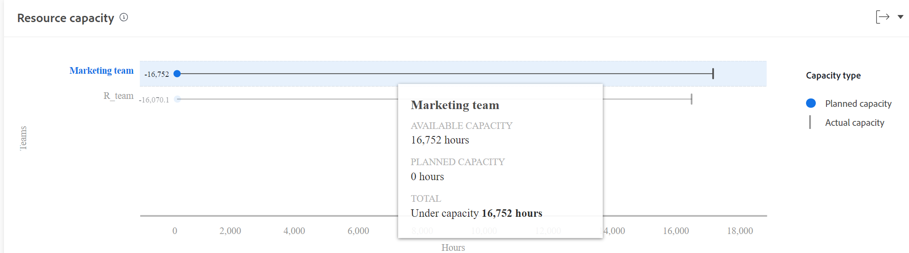
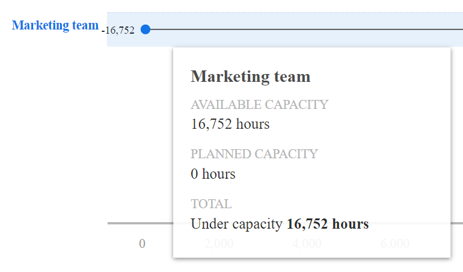

# Visa resurskapaciteten i Förbättrad analys

Resurskapaciteten visas om ett team är över, under eller på kapaciteten.

## Åtkomstkrav

Du måste ha följande:

<table style="table-layout:auto"> 
 <col> 
 <col> 
 <tbody> 
  <tr> 
   <td role="rowheader"><a href="https://www.workfront.com/plans" target="_blank">Adobe Workfront</a>*</td> 
   <td> 
Företag eller högre
 </td> 
  </tr> 
  <tr> 
   <td role="rowheader"><a href="../administration-and-setup/add-users/access-levels-and-object-permissions/wf-licenses.md" class="MCXref xref">Översikt över Adobe Workfront-licenser</a>*</td> 
   <td> 
Granska eller högre
 </td> 
  </tr> 
  <tr> 
   <td role="rowheader">Konfigurationer på åtkomstnivå*</td> 
   <td> 
Visa åtkomst till projekt
 
Obs! Om du fortfarande inte har åtkomst frågar du Workfront-administratören om de anger ytterligare begränsningar för din åtkomstnivå. Information om hur en Workfront-administratör kan ändra åtkomstnivån finns i <a href="../administration-and-setup/add-users/configure-and-grant-access/create-modify-access-levels.md" class="MCXref xref">Skapa eller ändra anpassade åtkomstnivåer</a>.
 </td> 
  </tr> 
  <tr> 
   <td role="rowheader">Objektbehörigheter</td> 
   <td> 
Visa
 
Mer information om hur du begär ytterligare åtkomst finns i <a href="../workfront-basics/grant-and-request-access-to-objects/request-access.md" class="MCXref xref">Begär åtkomst till objekt </a>.
 </td> 
  </tr> 
 </tbody> 
</table>

&#42;Kontakta Workfront-administratören om du vill veta vilken plan, licenstyp eller åtkomst du har.

## Förutsättningar

Information om krav för att använda Förbättrad analys finns i avsnittet Krav i [Förbättrad analys - översikt](../enhanced-analytics/enhanced-analytics-overview.md).

## Förstå resurskapaciteten visualisering

Resurskapaciteten visas om ett team är över, under eller på kapaciteten. Denna beräkning bygger på följande:

* **Tillgänglig kapacitet**: Det totala antalet timmar som ett hemteam har tillgängligt för att arbeta under den filtrerade tidsperioden

  >[!NOTE]
  >
  >Om du tittar på en framtida tidsperiod beräknas den tillgängliga kapaciteten baserat på teamets kapacitet för de senaste 7 dagarna. Därför beaktas inte schemalagd PTO.

* **Planerad kapacitet**: Det totala antalet planerade arbetstimmar som förväntas av hemteamet under den filtrerade tidsperioden

Den här jämförelsen av ett hemteams planerade timmar och faktiska schemalagda timmar kan hjälpa dig att avgöra om du inte tilldelar tillräckligt med arbete till hemteamet eller om de kan drabbas av problem på grund av en hög arbetsbelastning.

I Resurskapaciteten visas följande information:

* **Planerad kapacitet**: Den blå cirkeln motsvarar det antal timmar som hemteamet har tilldelats.

  

* **Faktisk kapacitet**: Den lodräta linjen står i linje med hemteamets namn och visar antalet tillgängliga timmar för hemteamet.

  

* **Överkapacitet**: När den vågräta linjen och den blå cirkeln visas till höger om den lodräta linjen tilldelades arbetsteamet mer arbete än vad de kan slutföra under det tillgängliga antalet timmar. Detta innebär att teamet kan vara överkapacitetskassan under den filtrerade tidsperioden. Det antal timmar som teamet behöver slutföra visas till höger om den blå cirkeln.

  

* **Under kapacitet**: När den vågräta linjen och den blå cirkeln visas till vänster om den lodräta linjen har hemteamet fler tillgängliga timmar än det antal planerade arbetstimmar de tilldelats. Detta innebär att teamet kan vara under kapacitet för den filtrerade tidsperioden. Det ytterligare antalet tillgängliga timmar för hemteamet att slutföra arbetet visas till vänster om den blå cirkeln.

  

När du hovrar över en rad visas det exakta antalet timmar för planerad kapacitet och tillgänglig kapacitet samt antalet timmar som hemteamet är över eller under kapacitet.

Om du ser den här informationen blir det lättare att avgöra:

* Om hemteamet var övertilldelat eller undertilldelat.
* Det största projektet var att hemteamet fokuserade på.
* Vilka hemteam som finns tillgängliga för jobbet.

Om du vill veta hur du får de bästa data för den här visualiseringen kan du läsa [Förbättrad analys - översikt](../enhanced-analytics/enhanced-analytics-overview.md).

## Visa resurskapaciteten som visualisering

1. Klicka på ikonen Huvudmeny väljer **Analyser**.
1. I den vänstra panelen väljer du **Folk**.

   

1. (Valfritt) Om du vill använda ett annat datumintervall väljer du nya start- och slutdatum från datumintervallfiltret.

   

   Mer information om hur du använder datumintervallfiltret finns i [Använda filter i Förbättrad analys](../enhanced-analytics/use-enhanced-analytics-filters.md).

1. (Villkorligt) Om du inte har ställt in teamfiltret lägger du till teamfiltret och väljer varje team som du vill se data för.

   Mer information om hur du lägger till filter i Förbättrad analys finns i [Använda filter i Förbättrad analys](../enhanced-analytics/use-enhanced-analytics-filters.md).

   När du har lagt till filter visas data för upp till 50 projekt och filtren förblir aktiva även när du lämnar sidan eller loggar ut från Workfront.

1. (Valfritt) Om du vill zooma in ett datumintervall markerar du en punkt i visualiseringen för början av datumintervallet och drar till slutet av datumintervallet.

   Alla andra visualiseringar uppdateras till samma datumintervall och ett tidsramsfilter skapas.

   

1. Håll muspekaren över teamlinjen för att se hur många timmar som fortfarande är tillgängliga för schemaläggning, hur många timmar hemteamet ska klara sig och det totala antalet arbetade timmar som är märkta som över, under eller som kapacitet.

   

1. (Valfritt) Om du vill exportera visualiseringsdata klickar du på **Ikonen Exportera**  i det övre högra hörnet av visualiseringen väljer du exportformat:

   * **Diagram (PNG)**
   * **Datatabell (XSLX)**

1. Klicka på ett hemteamnamn om du vill se mer information i teamkapacitetvisualiseringen.

   Mer information om teamkapacitetvisualisering finns i [Visa teamkapacitetvisualisering i Förbättrad analys](../enhanced-analytics/team-capacity-overview.md).

