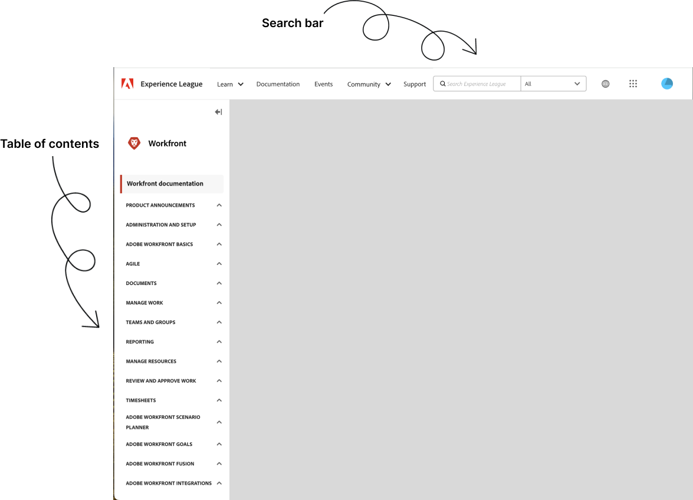

# Dokumentation för [!DNL Workfront]

Välkommen till Adobe Workfront hemsida för produkt och teknisk dokumentation. Använd följande länkar, hjälpartiklar och andra resurser från Adobe Workfront för att lära dig hur du implementerar och använder Adobe Workfront effektivt i din organisation.

## Nyheter

>[!BEGINTABS]

>[!TAB Senaste versionen]

* [Andra utgåvan, kvartal 2026, översikt](/help/quicksilver/product-announcements/product-releases/26-q2-release-activity/26-q2-release-overview.md)
* [Adobe Workfront Planning - lanseringsaktivitet](/help/quicksilver/product-announcements/product-releases/planning-release-activity/planning-release-activity-26-q2.md)
* [Versionsaktivitet för Adobe Workfront Fusion](/help/quicksilver/product-announcements/product-releases/planning-release-activity/planning-release-activity-article-index.md)

>[!TAB 2026-utgåvor]

* [Andra utgåvan, kvartal 2026, översikt](/help/quicksilver/product-announcements/product-releases/26-q2-release-activity/26-q2-release-overview.md)
* [Första utgåvan, kvartal 2026, översikt](/help/quicksilver/product-announcements/product-releases/26-q1-release-activity/26-q1-release-overview.md)
* [Adobe Workfront Planning - lanseringsaktivitet](/help/quicksilver/product-announcements/product-releases/planning-release-activity/planning-release-activity-26-q1.md)

>[!TAB 2025-utgåvor]

* [Fjärde kvartersversionen 2025 - översikt](/help/quicksilver/product-announcements/product-releases/25-q4-release-activity/25-q4-release-overview.md)
* [Översikt över utgåvan för tredje kvartalet 2025](/help/quicksilver/product-announcements/product-releases/25-q3-release-activity/25-q3-release-overview.md)
* [Andra utgåvan, kvartal 2025, översikt](/help/quicksilver/product-announcements/product-releases/25-q2-release-activity/25-q2-release-overview.md)
* [Första utgåvan, kvartal 2025, översikt](/help/quicksilver/product-announcements/product-releases/25-q1-release-activity/25-q1-release-overview.md)
* [Adobe Workfront Planning - lanseringsaktivitet](/help/quicksilver/product-announcements/product-releases/planning-release-activity/planning-release-activity-26-q1.md)
* [Versionsaktivitet för Adobe Workfront Fusion](/help/quicksilver/product-announcements/product-releases/planning-release-activity/planning-release-activity-article-index.md)

<!--

>[!TAB 2024 releases]

* [First Quarter 2024 release overview](/help/quicksilver/product-announcements/product-releases/24-q1-release-activity/24-q1-release-overview.md)
* [Second Quarter 2024 release overview](/help/quicksilver/product-announcements/product-releases/24-q2-release-activity/24-q2-release-overview.md)
* [Third Quarter 2024 release overview](/help/quicksilver/product-announcements/product-releases/24-q3-release-activity/24-q3-release-overview.md)
* [Fourth Quarter 2024 release overview](/help/quicksilver/product-announcements/product-releases/24-q4-release-activity/24-q4-release-overview.md)
* [Adobe Workfront Fusion release activity](https://experienceleague.adobe.com/sv/docs/workfront-fusion/using/fusion-release-activity/fusion-release-activity)
* [Adobe Workfront Planning Fourth Quarter 2025 release activity](/help/quicksilver/product-announcements/product-releases/planning-release-activity/planning-release-activity-24-q4.md)

-->

>[!TAB Betas]

* [Beta](/help/quicksilver/product-announcements/betas/betas.md)

>[!TAB Kända fel]

* [Kända fel](https://experienceleague.adobe.com/sv/docs/workfront-known-issues/issues/overview)
* [Underhållsuppdateringar](https://experienceleague.adobe.com/sv/docs/workfront-known-issues/releases/current-updates)

>[!ENDTABS]

## Utforska dokumentation

<table>

<tr>
    <td style="text-align: center;">
<b>Administratörer</b>
</td>
    <td colspan="2" style="text-align: center;">
<b>Användare</b>
</td>
    <td style="text-align: center;">
<b>Utvecklare</b>
</td>
  </tr>
  <tr>
    <td>
    <ul>
    <li><a href="/help/quicksilver/administration-and-setup/get-started-wf-administration/get-started-with-wf-administration.md">Kom igång med Workfront Administration</a></li>
    <li><a href="https://experienceleague.adobe.com/sv/docs/workfront-fusion/using/get-started-with-fusion/get-started-fusion-toc">Kom igång med Workfront Fusion</li>
    <li><a href="/help/quicksilver/app-builder/install-apps-on-exchange.md">Hämta och installera program från Adobe Exchange</a></li>
    </ul>
 </td>
    <td>
        <ul>
        <li><a href="/help/quicksilver/workfront-basics/workfront-basics.md">Grundläggande om Adobe Workfront: artikelindex</a></li>
        <li><a href="/help/quicksilver/manage-work/manage-work.md">Kom igång med att hantera arbetet</a></li>
        <li><a href="/help/quicksilver/reports-and-dashboards/reports-and-dashboards-overview.md">Kom igång med rapporter och kontrollpaneler</a></li>
        <li><a href="/help/quicksilver/reports-and-dashboards/reports/text-mode/text-mode-resources.md">Kom igång med textläge</a></li>
        </ul>
    </td>
    <td><ul>
        <li><a href="/help/quicksilver/agile/agile-overview.md">Kom igång med Agile</a></li>
        <li><a href="/help/quicksilver/documents/documents-overview.md">Kom igång med dokument</a></li>
        <li><a href="/help/quicksilver/resource-mgmt/workload-balancer/workload-balancer.md">Kom igång med arbetsbelastningsutjämnaren</a></li>
        <li><a href="/help/quicksilver/resource-mgmt/workload-balancer/overview-workload-balancer.md">Kom igång med granskning och godkännande</a></li>
        </ul></td>
    <td><ul>
        <li><a href="/help/quicksilver/wf-api/general/api-basics.md">Grunderna i API</a></li>
        <li><a href="https://developer.adobe.com/workfront/api-explorer/">API Explorer</a></li>
        <li><a href="/help/quicksilver/workfront-integrations-and-apps/workfront-integrations.md">Workfront Integrations</a></li>
        <li><a href="/help/quicksilver/app-builder/app-builder.md">Skapa anpassade program för Workfront med Adobe App Builder</a></li>
        </ul></td>
  </tr>
</table>

## Tips för att hitta innehåll i Experience League

Att söka i dokumentation kan vara mer effektivt med några strategiska strategier. Här är några tips som hjälper dig att hitta det du behöver effektivt:

### Använda fältet Innehållsförteckning och Sök

* **Innehållsförteckning**: Börja med innehållsförteckningen för att få en översikt över tillgängliga ämnen och begränsa dig till specifika ämnen genom de expanderande avsnitten.
* **Sökfältet**: Använd sökfältet för att hitta dokumentation. Ange specifika termer för ditt problem eller ämne. I stället för allmänna termer som&quot;projekthantering&quot; ska du använda&quot;tidslinjeinställning för projekt&quot; eller&quot;aktivitetssamband&quot;.

### Utforska utbildningsavsnitten

* **Utbildningsmaterial**: Navigera till [Workfront utbildningssida](https://experienceleague.adobe.com/sv/browse/workfront) för ett bibliotek med utbildningsvideor och artiklar som är utformade för att hjälpa dig förstå Workfront funktioner och inställningar bättre. Du kan även få tillgång till betalt utbildningsmaterial på [learning.adobe.com](https://learning.adobe.com/).
* **Kurser**: Hitta [strukturerade kurser](https://experienceleague.adobe.com/home?lang=sv-SE&Solution=Workfront#courses) som vägleder dig genom att använda olika Workfront-funktioner i en logisk sekvens.

### Hitta svar i communityforum

* **Ställ frågor**: Om dokumentationen inte svarar på din fråga kan du prova att publicera i [Workfront Community-forumen](https://experienceleaguecommunities.adobe.com/t5/workfront/ct-p/workfront?profile.language=sv) där andra användare och experter kan erbjuda hjälp.
