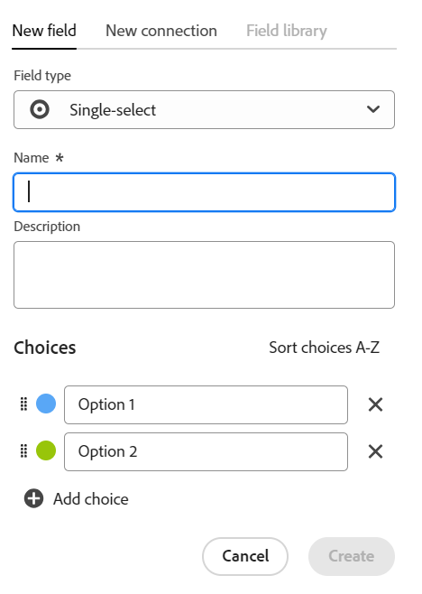
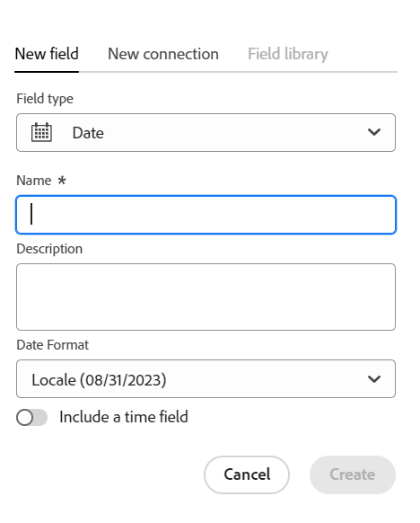
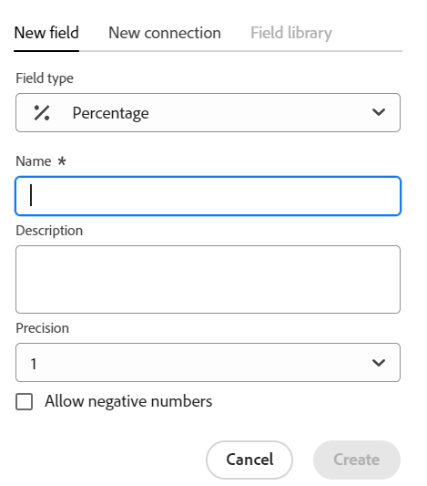

<!--udpate the metadata with real information when making this avilable in TOC and in the left nav-->

<!--Should the structure of this article be like this one: https://experienceleague.adobe.com/docs/workfront/using/administration-and-setup/customize/custom-forms/custom-form-builder/use-the-custom-form-builder/add-a-custom-field-to-a-custom-form.html?lang=en ??-->

<!--will they add a way to create fields elsewhere than in a table?! - how will that change the structure of this article? -->

# Skapa fält

>[!IMPORTANT]
>
>För närvarande ingår Adobe Maestro i ett betaprogram som är öppet för ett begränsat antal kunder.
>
>Kontakta din kontorepresentant om du vill ha mer information om hur du går med i betaprogrammet för Maestro.
>
>Mer information finns i [Adobe Maestro - översikt](../maestro-overview.md).

I Adobe Maestro kan du skapa anpassade fält för driftsposttyper eller taxonomier. Du kan sedan associera fälten med Maestro-poster för att förbättra postinformationen.

Du måste skapa posttyper innan du kan skapa fält som ska kopplas till dem. Mer information finns i [Skapa posttyper](../architecture-and-fields/create-record-types.md).

## Åtkomstkrav

Du måste ha följande åtkomst för att kunna utföra stegen i den här artikeln:

<table style="table-layout:auto">
 <col>
 <tbody>
<td>
   
 Adobe product
 </td>
   <td>
   
 Adobe Workfront
 </td>
  </tr>  
 <td role="rowheader">
Adobe Workfront-avtal
</td>
   <td>

Din organisation måste vara registrerad i det betaprogram som Adobe Maestro stängt. Kontakta din kontorepresentant om du vill veta mer om det nya erbjudandet. 

   </td>
  </tr>
  <tr>
   <td role="rowheader">
Adobe Workfront
</td>
   <td>

Alla

   </td>
  </tr>
  <tr>
   <td role="rowheader">
Adobe Workfront-licens
</td>
   <td>
   
Alla
 
  </td>
  </tr>

<tr>
   <td role="rowheader">Åtkomstnivå</td>
   <td> 
Alla
  
</td>
  </tr>
<tr>
   <td role="rowheader">Layoutmall</td>
   <td> 
Systemadministratören måste lägga till Maestro-området i layoutmallen. Mer information finns i <a href="../access/grant-access.md">Ge åtkomst till Adobe Maestro</a>. 
  
</td>
  </tr>
 </tbody>
</table>

<!--Maybe enable this at GA - but Maestro is not supposed to have Access controls in the Workfront Access Level: 
>[!NOTE]
>
>If you don't have access, ask your Workfront administrator if they set additional restrictions in your access level. For information on how a Workfront administrator can change your access level, see [Create or modify custom access levels](../administration-and-setup/add-users/configure-and-grant-access/create-modify-access-levels.md). -->

<!-- Notes to add for the table: for the "Workfront plans" row: the above is only for closed beta; when going to GA - activate the following plans:    

Current plan: Prime and Ultimate

Legacy plan: Enterprise
-->

<!-- Notes for the table: for the "Workfront access" row: 
For more information, see <a href="../../administration-and-setup/add-users/access-levels-and-object-permissions/wf-licenses.md" class="MCXref xref">Adobe Workfront licenses overview</a>.
-->

## Att tänka på när det gäller Maestro-fält

* Du kan bara skapa fält från tabellvyn för en posttypsida. Fält visas som kolumner i tabellvyn.

  Mer information om hur du hanterar tabellkolumner (eller postfält) finns i [Hantera tabellvyn](../views/manage-the-table-view.md).

  Mer information om hur du hanterar fält finns i följande artiklar:

   * [Redigera fält](../architecture-and-fields/edit-fields.md)
   * [Ta bort fält](./delete-fields.md)

* De fält som är associerade med en posttyp är tillgängliga för att associeras med alla poster av den typen. <!--will this change and will the fields be available for other record types, too?! Also, the next bullet might need to change too if this one changes -->

* Fält som är associerade med en posttyp kan inte läggas till i en annan posttyp. <!-- this will change when they open the Field library tab when creating a field-->

* Du kan skapa fält manuellt eller automatiskt på följande sätt:

   * Manuellt:

      * Genom att lägga till kolumner i tabellvyn på en posttypssida. Kolumnerna i tabellen är de fält som är associerade med posttypen. De är samma fält som visas på en posts informationssida.

        Du kan inte skapa fält från detaljsidan för en post.

        I den här artikeln beskrivs hur du skapar fält manuellt.

      * Genom att länka posttyper tillsammans. Du kan skapa länkade postfält när du lägger till en ny anslutning mellan två Maestro-posttyper eller en posttyp och en objekttyp från andra program.

        <!--* Importing record types with fields using a CSV or an Excel file. - this is not available yet-->

        Mer information om hur du ansluter Maestro-posttyper finns i [Koppla posttyper](../architecture-and-fields/connect-record-types.md).

      * Genom att importera posttyper med en Excel- eller CSV-fil. Mer information finns i [Skapa posttyper](../architecture-and-fields/create-record-types.md).

   * Automatiskt:

      * Som standard varje gång du skapar en posttyp.

        Följande är standardfält som skapas som standard för varje ny operativ posttyp:

         * Namn
         * Beskrivning
         * Startdatum
         * Slutdatum
         * Status. Standardvärdena för poststatus är:
            * Utveckling
            * Planerad
            * Aktiv
            * Slutförd
            * Parkerad

           Du kan lägga till fler värden eller byta namn på de befintliga.

        Följande standardfält skapas som standard för varje ny taxonomiposttyp:

         * Namn <!--will more be added? If not, consider rephrasing this bullet-->

      * När du skapar en arbetsyta från en mall. I Maestro skapas fält för driftsposttyper och taxonomier när du skapar en arbetsyta från en mall. Mer information finns i [Skapa arbetsytor](../architecture-and-fields/create-workspaces.md).

* Du kan visa och uppdatera inställningarna för de fält som du eller någon annan användare har skapat. <!--this will change with access/ permissions-->

* Du kan ha upp till 500 fält för en posttyp.

* Fältnamn kan innehålla upp till 250 tecken.

* När du tar bort en operativ posttyp, taxonomi eller arbetsyta tas även alla fält som är kopplade till dem och fältets värden bort och kan inte återställas. <!-- this might change with a possible recycle bin solution?!-->

## Skapa fält från grunden {#create-fields-from-scratch}

<!--in a table (not sure if this can be done elsewhere?!-->

1. Klicka på **Huvudmeny** icon  i Workfront övre högra hörn, <!---or the **Main menu** icon   in the upper-left corner, if available--> klicka sedan på **Maestro** .

   Den senast använda arbetsytan bör öppnas som standard.

1. (Valfritt) Expandera den nedåtriktade pilen till höger om namnet på en befintlig arbetsyta, markera arbetsytan vars posttyper du vill skapa fält för och klicka sedan på posttypen.

   Alla befintliga poster som är associerade med posttypen visas i tabellvyns rader.

   >[!TIP]
   >
   >    Om inga poster visas kanske du inte har några poster än, eller så kanske du har ett filter som begränsar det som visas på skärmen.

   Alla befintliga fält som är associerade med posttypen visas i kolumnerna i tabellvyn. <!--caveat this for when we can hide the fields; mention that they can be hidden if they are not visible by default-->

1. Klicka på **+** i tabellvyns övre högra hörn för att lägga till nya fält.
1. I **Nytt fält** väljer du bland följande fälttyper:

   * [Enkelradig text](#single-line-text)
   * [Stycke](#paragraph)
   * [Flera val](#multi-select)
   * [Enkelval](#single-select)
   * [Datum](#date)
   * [Nummer](#number)
   * [Procent](#percentage)
   * [Valuta](#currency)
   * [Kryssruta](#checkbox)
   * [Folk](#people)

   >[!IMPORTANT]
   >
   >    Du kan inte ändra fälttypen när du har sparat den.

1. Fortsätt med att lägga till varje fält enligt beskrivningen i avsnitten nedan.

### Enkelradig text {#single-line-text}

Enkelradiga textfält fångar begränsad alfanumerisk information. Du kan till exempel samla information om ägare, intressenter, team eller organisationsenheter i ett textfält med en rad. Innehållet i ett textfält med en rad kan innehålla upp till 250 tecken. <!-- asked Lilit if we can change this to "Single-line" since this can have numbers and text.-->

1. Börja skapa ett fält enligt beskrivningen i avsnittet [Skapa fält från grunden](#create-fields-from-scratch) i den här artikeln väljer du **Enkelradig text** fälttyp.

   

1. Lägg till följande information i **Nytt fält** tab:
   * **Namn**: Namnet på fälttypen så som den kommer att visas i en tabell eller på postens detaljsida. <!--ensure they updated this; and update the screen shot: it used to be "Label"-->
   * **Beskrivning**: Ytterligare information om fältet. Beskrivningen av ett fält visas när du hovrar över fältets kolumnrubrik i en tabell.
1. Klicka **Skapa**.

   Det nya enradiga fältet läggs till som en kolumn till posttypen och dess värden kan kopplas till poster. Fältet visas även på detaljsidan för en post.

### Stycke {#paragraph}

Styckefält hämtar ytterligare alfanumerisk information om en post, som liknar fältet Beskrivning.

>[!TIP]
>
>* Innehållet i ett styckefält kan innehålla upp till 1 000 tecken.
>
>* Du kan använda RTF-formatering för att förbättra innehållet i styckefält när de visas i tabellvyn eller på detaljsidan för en post.

1. Börja skapa ett fält enligt beskrivningen i avsnittet [Skapa fält från grunden](#create-fields-from-scratch) i den här artikeln väljer du **Stycke** fälttyp.

   

1. Lägg till följande information i **Nytt fält** tab:
   * **Namn**: Namnet på fälttypen så som den kommer att visas i en tabell eller på postens detaljsida. <!--ensure they updated this; and update the screen shot: it used to be "Label"-->
   * **Beskrivning**: Ytterligare information om fältet. Beskrivningen av ett fält visas när du hovrar över fältets kolumn i en tabell.
1. Klicka **Skapa**.

   Det nya styckefältet läggs till som en kolumn till posttypen och dess värden kan kopplas till poster. Fältet visas även på detaljsidan för en post.

### Flera val {#multi-select}

Du kan använda ett flervalsfält för att hämta ytterligare information i valfritt format genom att välja mer än ett alternativ i en listruta.

1. Börja skapa ett fält enligt beskrivningen i avsnittet [Skapa fält från grunden](#create-fields-from-scratch) i den här artikeln väljer du **Flera val** fälttyp.

   

1. Lägg till följande information i **Nytt fält** tab:
   * **Namn**: Namnet på fälttypen så som den kommer att visas i en tabell eller på postens detaljsida. <!--ensure they updated this; and update the screen shot: it used to be "Label"-->
   * **Beskrivning**: Ytterligare information om fältet. Beskrivningen av ett fält visas när du hovrar över fältets kolumn i en tabell.
   * **Val**: De alternativ som är tillgängliga att välja på den nedrullningsbara menyn när fältet har sparats. Du kan ha både siffror och bokstäver för namnet på varje val.
1. Klicka **Lägg till alternativ** för att lägga till så många alternativ som behövs. Det finns ingen gräns för hur många alternativ du kan lägga till i ett flervalsfält.
1. (Valfritt) Dra och släpp varje alternativ manuellt i önskad ordning, eller välj
   **Sorteringsalternativ A-Z** om du vill att valen ska visas automatiskt i alfabetisk ordning. <!--Add this if they added this functionality: You cannot edit this option after you save the field.-->
1. Klicka på **x** till höger om ett val för att ta bort det.
1. Klicka på färgrutan till vänster om ett alternativ för att utöka färgväljaren och anpassa färgen för varje alternativ.
1. Klicka **Skapa**.

   Det nya flervalsfältet läggs till som en kolumn till posttypen och dess värden kan kopplas till poster. Fältet visas även på detaljsidan för en post.

### Enkelval {#single-select}

Med envalsfält hämtas ytterligare information i valfritt format genom att du väljer ett alternativ i en nedrullningsbar meny.

1. Börja skapa ett fält enligt beskrivningen i avsnittet [Skapa fält från grunden](#create-fields-from-scratch) i den här artikeln väljer du **Enkelval** fälttyp.

   

1. Lägg till följande information i **Nytt fält** tab:
   * **Namn**: Namnet på fälttypen så som den kommer att visas i en tabell eller på postens detaljsida. <!--ensure they updated this; and update the screen shot: it used to be "Label"-->
   * **Beskrivning**: Ytterligare information om fältet. Beskrivningen av ett fält visas när du hovrar över fältets kolumn i en tabell.
   * **Val**: De alternativ som är tillgängliga att välja på den nedrullningsbara menyn när fältet har sparats. Du kan ha både siffror och bokstäver för namnet på varje val.

1. Klicka **Lägg till alternativ** för att lägga till så många alternativ som behövs. Det finns ingen gräns för hur många alternativ du kan lägga till i ett envalsfält.
1. (Valfritt) Dra och släpp varje alternativ manuellt i önskad ordning, eller välj **Sorteringsalternativ A-Z** om du vill att valen ska visas automatiskt i alfabetisk ordning. <!--Add this if they added this functionality: You cannot edit this option after you save the field.-->
1. Klicka på **x** till höger om ett val för att ta bort det.
1. Klicka på färgrutan till vänster om ett alternativ för att utöka färgväljaren och anpassa färgen för varje alternativ.
1. Klicka **Skapa**.

   Det nya envalsfältet läggs till som en kolumn till posttypen och dess värden kan kopplas till poster. Fältet visas även på detaljsidan för en post.

### Datum {#date}

Du kan använda ett datumfält för att samla in ytterligare information i datum- och tidsformat.

1. Börja skapa ett fält enligt beskrivningen i avsnittet [Skapa fält från grunden](#create-fields-from-scratch) i den här artikeln väljer du **Datum** fälttyp.

   

1. Lägg till följande information i **Nytt fält** tab:
   * **Namn**: Namnet på fälttypen så som den kommer att visas i en tabell eller på postens detaljsida. <!--ensure they updated this; and update the screen shot: it used to be "Label"-->
   * **Beskrivning**: Ytterligare information om fältet. Beskrivningen av ett fält visas när du hovrar över fältets kolumn i en tabell.
   * **Datumformat**: Den typ av datumformat som du vill visa i det här fältet.

     Välj bland följande format:
      * **Språk**: Matchar språkområdet i webbläsaren.
      * **Standard**: 05/16/2023
      * **Lång**: 16 maj 2023
      * **europeisk**: 16/05/2023
      * **ISO**: 2023-05-16
   * **Inkludera ett tidsfält**: Välj det här alternativet om du vill inkludera en tidsstämpel. Detta är som standard omarkerat.

     Välj bland följande alternativ:

      * **24 timmar**: Till exempel: 18:00
      * **12 timmar**: Exempel: 6:00 PM

1. Klicka **Skapa**.

   Det nya datumfältet läggs till som en kolumn till posttypen och dess värden kan kopplas till poster. Fältet visas även på detaljsidan för en post.

### Nummer {#number}

Nummerfälttyper samlar in information i talformat.

1. Börja skapa ett fält enligt beskrivningen i avsnittet [Skapa fält från grunden](#create-fields-from-scratch) i den här artikeln väljer du **Nummer** fälttyp.

   
1. Lägg till följande information i **Nytt fält** tab:

   * **Namn**: Namnet på fälttypen så som den kommer att visas i en tabell eller på postens detaljsida.
   * **Beskrivning**: Ytterligare information om fältet. Beskrivningen av ett fält visas när du hovrar över fältets kolumn i en tabell.
   * **Precision**: Antalet decimaler som du vill registrera för fältet. Du kan visa upp till 6 decimaler.
   * **Tillåt negativa tal**: Välj det här alternativet om du vill tillåta negativa tal i fältet. Det här alternativet är som standard avmarkerat.

   >[!NOTE]
   >
   >    Om du väljer Tillåt negativa tal och negativa värden lagras på posterna som fältet är kopplat till, kan du inte längre avmarkera inställningen i framtiden.

1. Klicka **Skapa**.

   Det nya nummerfältet läggs till som en kolumn till posttypen och dess värden kan kopplas till poster. Fältet visas även på detaljsidan för en post.

### Procent {#percentage}

Procentfälttyper samlar in information i talformat följt av ett procenttecken.

1. Börja skapa ett fält enligt beskrivningen i avsnittet [Skapa fält från grunden](#create-fields-from-scratch) i den här artikeln väljer du **Procent** fälttyp.

   

1. Lägg till följande information i **Nytt fält** tab:
   * **Namn**: Namnet på fälttypen så som den kommer att visas i en tabell eller på postens detaljsida.
   * **Beskrivning**: Ytterligare information om fältet. Beskrivningen av ett fält visas när du hovrar över fältets kolumn i en tabell.
   * **Precision**: Antalet decimaler som du vill registrera för fältet. Du kan visa upp till 6 decimaler.
   * **Tillåt negativa tal**: Välj det här alternativet om du vill tillåta negativa procentvärden i det här fältet. Det här alternativet är som standard avmarkerat.

   >[!NOTE]
   >
   >    Om du väljer Tillåt negativa tal och negativa värden lagras på posterna som fältet är kopplat till, kan du inte längre avmarkera inställningen i framtiden.

1. Klicka **Skapa**.

   Det nya procentfältet läggs till som en kolumn till posttypen och dess värden kan kopplas till poster. Fältet visas även på detaljsidan för en post.

### Valuta {#currency}

Valutafälttyper samlar in information i ett talformat som föregås av en valutasymbol.

1. Börja skapa ett fält enligt beskrivningen i avsnittet [Skapa fält från grunden](#create-fields-from-scratch) i den här artikeln väljer du **Valuta** fälttyp.

   

1. Lägg till följande information i **Nytt fält** tab:
   * **Namn**: Namnet på fälttypen så som den kommer att visas i en tabell eller på postens detaljsida. <!--ensure they updated this; and update the screen shot: it used to be "Label"-->
   * **Beskrivning**: Ytterligare information om fältet. Beskrivningen av ett fält visas när du hovrar över fältets kolumn i en tabell.
   * **Valuta**: Den typ av valuta som du vill visa i det här fältet. Detta är en lista över valutor enligt ISO (International Organization of Standardization).
   * **Precision**: Antalet decimaler som du vill registrera för fältet. Du kan visa upp till 6 decimaler.
   * **Tillåt negativa tal**: Välj det här alternativet om du vill tillåta negativa valutavärden i det här fältet. Det här alternativet är som standard avmarkerat.

   >[!NOTE]
   >
   >    Om du väljer Tillåt negativa tal och negativa värden lagras på posterna som fältet är kopplat till, kan du inte längre avmarkera inställningen i framtiden.

1. Klicka **Skapa**.

   Det nya valutafältet läggs till som en kolumn till posttypen och dess värden kan kopplas till poster. Fältet visas även på detaljsidan för en post.

### Kryssruta

Du kan använda fälttypen Kryssruta för att lägga till en kryssruta till en post. Du kan använda det här fältet för att ange ett specifikt attribut eller en specifik status för den aktuella posten. Du kan till exempel använda den som en flagga för att spåra slutförande, godkännande eller andra binära attribut för varje post.

1. Börja skapa ett fält enligt beskrivningen i avsnittet [Skapa fält från grunden](#create-fields-from-scratch) i den här artikeln väljer du **Kryssruta** fälttyp.

   

1. Lägg till följande information i **Nytt fält** tab:
   * **Namn**: Namnet på fälttypen så som den kommer att visas i en tabell eller på postens detaljsida. <!--ensure they updated this; and update the screen shot: it used to be "Label"-->
   * **Beskrivning**: Ytterligare information om fältet. Beskrivningen av ett fält visas när du hovrar över fältets kolumn i en tabell.
1. Klicka **Skapa**.

   Det nya kryssrutefältet läggs till som en kolumn till posttypen och dess värden kan kopplas till poster. Fältet visas även på detaljsidan för en post.

### Folk

Du kan använda fälttypen Personer för att lägga till en användare <!--, job role, or team--> till en post. Det här är ett typsnittsfält och du kan bara lägga till användare<!--, roles, or teams--> som redan finns i Workfront.

1. Börja skapa ett fält enligt beskrivningen i avsnittet [Skapa fält från grunden](#create-fields-from-scratch) i den här artikeln väljer du **Folk** fälttyp.

   

1. Lägg till följande information i **Nytt fält** tab:
   * **Namn**: Namnet på fälttypen så som den kommer att visas i en tabell eller på postens detaljsida.
   * **Beskrivning**: Ytterligare information om fältet. Beskrivningen av ett fält visas när du hovrar över fältets kolumn i en tabell.
   * **Tillåt flera värden**: Välj det här alternativet om du vill tillåta användare att lägga till fler än en användare i det här fältet. Det här alternativet är som standard avmarkerat.

   >[!NOTE]
   >
   >    Om du väljer Tillåt flera värden och flera användare lagras på de poster som fältet är kopplat till, kan du inte längre avmarkera inställningen när du redigerar det här fältet.
1. Klicka **Skapa**.

   Det nya fältet av typen Personer läggs till som en kolumn till posttypen och dess värden kan kopplas till poster. Fältet visas även på detaljsidan för en post.

## Skapa fält genom att länka posttyper tillsammans

Du kan skapa länkade postfält när du lägger till en ny anslutning mellan två Maestro-posttyper eller en posttyp och en objekttyp från andra program.

Mer information om hur du ansluter Maestro-posttyper finns i [Koppla posttyper](../architecture-and-fields/connect-record-types.md).

## Skapa fält genom att importera posttyper med en Excel- och CSV-fil

Mer information finns i [Skapa posttyper](../architecture-and-fields/create-record-types.md).

## Skapa fält genom att skapa en posttyp

När du skapar en posttyp skapas även flera fält som är kopplade till den nya posttypen som standard. Mer information finns i [Skapa posttyper](../architecture-and-fields/create-record-types.md).

## Skapa fält genom att skapa en arbetsyta från en mall

I Maestro skapas fält för driftsposttyper och taxonomier när du skapar en arbetsyta från en mall.

Mer information finns i [Skapa arbetsytor](../architecture-and-fields/create-workspaces.md).
