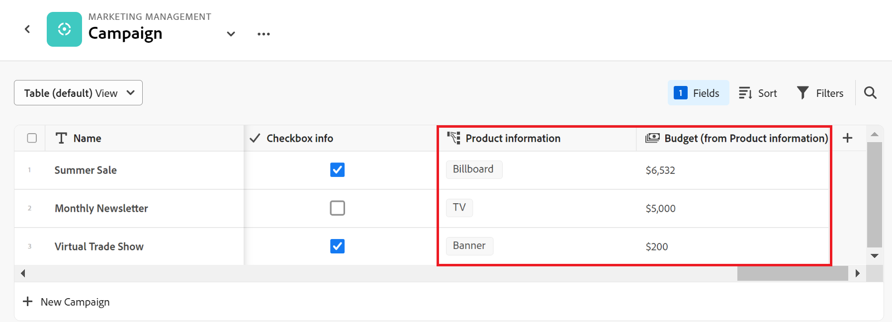

# Exempel på att ansluta posttyper och poster

>[!IMPORTANT]
>
>För närvarande ingår Adobe Maestro i ett betaprogram som är öppet för ett begränsat antal kunder.
>
>Kontakta din kontorepresentant om du vill ha mer information om hur du går med i betaprogrammet för Maestro.
>
>Mer information finns i [Adobe Maestro - översikt](../maestro-overview.md).

I den här artikeln beskrivs ett exempel på följande:

* Så här skapar du en anslutning mellan två Maestro-posttyper och två Maestro-poster.

* Så här skapar du en anslutning mellan en Adobe Maestro-posttyp och en Workfront-projektobjekttyp, samt en anslutning mellan en Maestro-post och ett projekt.

Mer information finns i följande artiklar:

* [Koppla posttyper](../architecture-and-fields/connect-record-types.md)
* [Koppla poster](../records/connect-records.md)

## Koppla samman två Maestro-posttyper och poster (exempel)

Du har till exempel posttypen Campaign som ursprunglig posttyp.

Du har också en annan posttyp som heter Produkt, som har ett valutafält som heter Budget.

Du vill skapa ett fält på posttypen för Campaign där du kan visa värdena i fältet Budget för posttypen Produkt.

Så här gör du:

1. Öppna registervyn för Campaign-posttypen.
1. Klicka på **+** i tabellvyns övre högra hörn för att lägga till ett nytt fält och klicka sedan på **Ny anslutning**.
1. Lägg till följande information, till exempel:

   * **Posttyp**: Produkt <!--did they change the casing here?-->
   * **Namn**: Produktinformation. Det här är namnet på det länkade postfältet.
   * **Beskrivning**: Det här är de produkter som jag vill att mina kampanjer ska vara kopplade till.
   * **Tillåt flera poster**: Om du låter det här alternativet vara markerat kan användarna välja flera poster när det länkade posttypsfältet (produktinformation) visas på de ursprungliga posterna (kampanjer). I vårt fall kan de välja flera produkter som ska kopplas till en kampanj.
   * **Välj sökfält**: Om du låter det här alternativet vara markerat visas **Lägg till sökfält** öppnas nästa ruta så att du kan länka produktfält till posttypen Campaign. Du kan hoppa över det här steget och lägga till produktfält senare.

   

1. (Villkorligt) Om du markerade **Välj alternativ för sökfält** i föregående steg, från listan med fält som är kopplade till **Produkt** posttyp, klicka på **+** ikonen för **Budget** fält och klicka sedan på **Lägg till fält**. Detta skapar ett fält med namnet **Budget (från produktinformation)**, vilket är namnet på det länkade fältet. All information för produktbudgeten visas i det här fältet för kampanjposterna.

   

   >[!TIP]
   >
   >    Om du vill visa budgeten för alla valda produkter som ett totalt tal väljer du **SUM** i listrutan till höger om fältnamnet. När användare väljer flera produkter i **Produktinformation** länkat postfält, **Budget (från produktinformation)** läggs alla deras budgetvärden samman och summan visas. <!-- check the shot below - added a bug with a couple of UI changes here-->
   >
   > Om du väljer **Ingen**, i stället för **SUM** visas de enskilda budgetarna åtskilda med kommatecken.

   Detta genererar följande fält:

   * I registervyn Campaign och på sidan Details (Detaljer) för en kampanj:

      * **Produktinformation** (det länkade postfältet): Detta visar namnen på Produkterna.
      * **Budget (från produktinformation)** (det länkade fältet): Här visas budgetarna för de produkter som valts i fältet Produktinformation.

   * I vyn Produktpostregister och på sidan Detaljer för en produkt:

      * **Campaign**: Detta anger att produktposttypen är länkad från posttypen Campaign.

     

   >[!TIP]
   >
   >    Länkade postfält föregås av relationsikonen .

1. Fylla i **Produktinformation** fält, från **Campaign** posttypstabellvy, skapa en kampanj genom att lägga till en ny rad i posttypssidans tabell för Campaign.
1. Klicka på **+** -ikonen i  **Produktinformation** den nya kampanjens kolumn. The **Koppla objekt** visas. Namnet på den posttyp som du länkar till (Produkt) visas i rutans övre vänstra hörn.

   

1. Välj de produktposter som du vill ansluta till kampanjposterna och klicka sedan på **Koppla objekt**.

   Följande kolumner är ifyllda i posttyptabellen för Campaign:
   * The **Produktinformation** fylls i för Campaign-posten med de valda produkterna.
   * **Budgeten (från produktinformation)** fylls i med budgetvärdet för varje vald produkt, eller med summan av alla budgetar för de valda produkterna.

   

   >[!TIP]
   >
   >Om du inte väljer en aggregator för de flera värdena visas alla värden avgränsade med kommatecken.

1. Fylla i **Campaign** fält från **Produkt** i tabellvyn, upprepa steg 5-7 med början från tabellvyn för produktposttyper och välj kampanjinformation. Detta uppdaterar även produktinformationsfältet i posttypssidans register för Campaign. <!--ensure the step numbers remain correct-->

## Koppla samman en Maestro-posttyp med en Workfront-projektobjekttyp och en post med enskilda projekt

Du har till exempel posttypen Campaign som ursprunglig posttyp.

Du har också projekt i Workfront med ett fält som kallas&quot;Planerade intäkter&quot;.

Du vill skapa ett anslutningsfält för posttypen Campaign där du kan visa värdena i fältet Planerad intäkt i projektet i Workfront för vissa kampanjer.

Så här gör du:

1. Gå till en arbetsyta där du vill koppla posttypen Campaign till Workfront-projekt.
1. Öppna tabellvyn för Campaign-posttypen på den valda arbetsytan.
1. Klicka på **+** i tabellvyns övre högra hörn för att lägga till ett nytt fält och klicka sedan på **Ny anslutning**.
1. Lägg till följande information, till exempel:

   * **Posttyp**: Workfront Project (från Workfront underavdelning) <!--did they change the casing here for the field label and did they take "Workfront" out of the name of the object?-->
   * **Namn**: Projektinformation. Detta är namnet på det länkade objektfältet.
   * **Beskrivning**: Detta är de projekt som jag vill att mina kampanjer ska vara kopplade till.
   * 
      * **Tillåt flera poster**: Om du låter det här alternativet vara markerat kan användare markera flera objekt när fältet för den länkade objekttypen (projektinformation) visas på de ursprungliga posterna (kampanjer).
   * **Välj sökfält**: Om du låter det här alternativet vara markerat visas **Lägg till sökfält** öppnas nästa ruta så att du kan länka projektfält till posttypen Campaign. Du kan hoppa över det här steget och lägga till projektfält senare.

   

1. (Villkorligt) Om du markerade **Välj alternativ för sökfält** i föregående steg, från listan med fält som är kopplade till **Projekt** objekttyp, klicka på **+** ikonen för **Planerad intäkt** fält och klicka sedan på **Lägg till fält**. Detta skapar ett fält med namnet **Planerad intäkt (från projektinformation)**, vilket är namnet på det länkade fältet. All information från fältet Projektomsättning visas i det här fältet för kampanjposterna.

   >[!TIP]
   >
   >    Om du vill visa planerad intäkt för alla valda projekt som ett totalt tal väljer du **SUM** i listrutan till höger om fältnamnet. När användare väljer flera projekt i **Projektinformation** länkat objektfält, **Planerad intäkt (från produktinformation)** läggs alla deras värden ihop och summan visas. <!-- check the shot below - added a bug with a couple of UI changes here-->
   >
   > Om du väljer **Ingen**, i stället för **SUM**, visas de enskilda planerade intäkterna med kommatecken.

   

   Detta genererar följande fält:

   * I registervyn Campaign och på sidan Details (Detaljer) för en kampanj:

      * **Projektinformation** (det länkade objektfältet): Detta visar projektens namn.
      * **Planerad intäkt (från projektinformation)** (det länkade fältet): Detta visar de planerade intäkterna för de projekt som valts i fältet Projektinformation.

   >[!TIP]
   >
   >    Länkade objektfält föregås av relationsikonen .

1. Fylla i **Projektinformation** fält, från **Campaign** posttyptabellvy, skapa en kampanj genom att lägga till en ny rad i tabellen.
1. Klicka på **+** -ikonen i  **Projektinformation** den nya kampanjens kolumn. The **Koppla objekt** visas. Namnet på den objekttyp som du länkar till (Workfront Project) visas i rutans övre vänstra hörn.

   

1. Välj det eller de projekt som du vill ansluta till Campaign-posterna och klicka sedan på **Koppla objekt**.

   Följande har lagts till på den valda arbetsytan:

   * I registret Kampanjposttyp:
      * The **Projektinformation** fylls i för Campaign-posten med de valda projekten.
      * The **Planerad intäkt (från produktinformation)** fylls i med budgetvärdet för varje vald produkt. Det här är ett skrivskyddat fält.

   

   >[!TIP]
   >
   >Om du inte väljer en aggregator för de flera värdena och du markerar flera objekt i det objektlänkade fältet, visas alla värden avgränsade med kommatecken.

   * En skrivskyddad Workfront Project-posttyp för den arbetsyta du har valt.

1. Klicka på den bakåtriktade pilen till vänster om postens namn i sidhuvudet för att gå till arbetsytan som du uppdaterar.
1. Öppna **Workfront Project** posttypskort för att öppna posttypssidan.

   Observera följande för posttypsidan för Workfront Project:

   * Det här är en skrivskyddad Maestro-posttyp som du inte kan ta bort eller uppdatera.
   * De projekt som du har valt att ansluta till kampanjer visas som separata poster på posttypsidan för Workfront Project. Projektposterna är också skrivskyddade och informationen uppdateras automatiskt när projekten uppdateras i Workfront. Du måste lägga till fler projekt från den anslutna Maestro-posten för att kunna visa dem i posttypen Workfront Project.
   * Fältet för Campaign-länkad post fylls i med namnen på de kampanjer som är kopplade till projekt från sidan för Campaign-posttyp.

1. (Valfritt) Klicka på **Mer** icon  till höger om posttypnamnet för Workfront Project och klicka på **Byt namn** för att byta namn på posttypen.

   >[!TIP]
   >
   >Du kan byta namn på en posttyp genom att klicka på namnet i posttypsrubriken.

1. Klicka på ikonen Lägg till fält  i det övre högra hörnet av posttyptabellen för Workfront Project om du vill lägga till fler projektfält till posttypen Workfront Project Makestro.
1. Klicka på **+** ikon för de projektfält som du vill lägga till i Workfront Project Makestro-posten i dialogrutan **Omarkerade fält** -avsnitt.
1. Klicka på **-** ikon för de projektfält som du vill ta bort från Workfront Project Makestro-posten i dialogrutan **Markerade fält** -avsnitt.
1. Klicka **Spara**.

   >[!TIP]
   >
   >    De fält som du lägger till i posten Workfront Project Makestro läggs bara till på Workfront Project-sidan och läggs inte till på Campaign-posttypsidan, som länkade fält. Du måste lägga till projektfälten från fältet med kopplade objekt för projektinformation i posttypen Campaign för att kunna visa dem för kampanjer.

1. (Valfritt och villkorligt) Om du har valt att visa minst två datumfält för projekt klickar du på **Visa** nedrullningsbar meny i posttyptabellen för Workfront Project och sedan **Skapa vy** > **Tidslinje** > **Skapa** för att skapa en tidslinjevy och visa projekten på en tidslinje.

