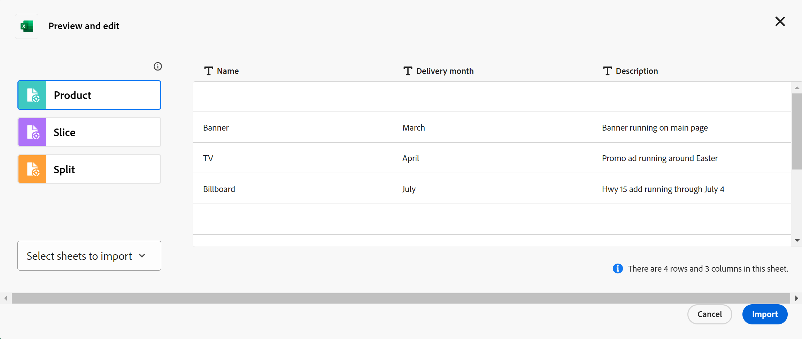

<!--udpate the metadata with real information when making this available in TOC and in the left nav-->

# Skapa driftsposttyper

{{maestro-important-intro}}

Posttyper är objekttyperna för Adobe Workfront-planering. I Workfront-planeringen kan du skapa anpassade posttyper som illustrerar de arbetsrelaterade objekt som behövs i organisationens livscykel.

Posttyper kan vara något av följande:

* **Operativa posttyper**
* **Taxonomier**

Mer information om posttyper finns i [Översikt över posttyper och taxonomier](../architecture/overview-of-record-types-and-taxonomies.md).

Att skapa driftsposttyper liknar att skapa taxonomiposttyper. I den här artikeln beskrivs hur du skapar driftsposttyper.

Mer information om att skapa taxonomier finns i [Skapa taxonomiposttyper](../architecture/create-a-taxonomy.md).

## Åtkomstkrav

Du måste ha följande åtkomst för att kunna utföra stegen i den här artikeln:

<table style="table-layout:auto">
 <col>
 </col>
 <col>
 </col>
 <tbody>
    <tr>
<tr>
<td>
   
 Produkt
 </td>
   <td> Adobe Workfront
   </td>
  </tr>  
 <td role="rowheader">
Adobe Workfront-avtal
</td>
   <td>

Din organisation måste vara registrerad i det betaprogram som Adobe Workfront planerar stängda. Kontakta din kontorepresentant om du vill veta mer om det nya erbjudandet. 

   </td>
  </tr>
  <tr>
   <td role="rowheader">
Adobe Workfront
</td>
   <td>

Alla

   </td>
  </tr>
  <tr>
   <td role="rowheader">
Adobe Workfront-licens
</td>
   <td>
   
Aktuell: Planera

   eller
   
Nytt: Standard 
 
  </td>
  </tr>

<tr>
   <td role="rowheader">
Konfigurationer på åtkomstnivå
</td>
   <td> 
Det finns inga åtkomstnivåkontroller för Workfront-planering
  
</td>
  </tr>
<tr>
   <td role="rowheader">
Layoutmall
</td>
   <td> 
Din Workfront- eller gruppadministratör måste lägga till Maestro-området i layoutmallen. Mer information finns i <a href="../access/access-overview.md">Åtkomstöversikt</a>. 
  
</td>
  </tr>
<tr>
   <td role="rowheader">
Behörigheter
</td>
   <td> 
Hantera behörigheter till en arbetsyta</a> 
  
   
Systemadministratörer har behörighet till alla arbetsytor, inklusive de som de inte skapade
</td>
  </tr>
 </tbody>
</table>

<!--Maybe enable this at GA - but Maestro is not supposed to have Access controls in the Workfront Access Level: 
>[!NOTE]
>
>If you don't have access, ask your Workfront administrator if they set additional restrictions in your access level. For information on how a Workfront administrator can change your access level, see [Create or modify custom access levels](../administration-and-setup/add-users/configure-and-grant-access/create-modify-access-levels.md). -->

<!-- Notes to add for the table: for the "Workfront plans" row: the above is only for closed beta; when going to GA - activate the following plans:    

Current plan: Prime and Ultimate

Legacy plan: Enterprise
-->

<!-- Notes for the table: for the "Workfront access" row: 
For more information, see <a href="../../administration-and-setup/add-users/access-levels-and-object-permissions/wf-licenses.md" class="MCXref xref">Adobe Workfront licenses overview</a>.
-->

## Att tänka på när du skapar posttyper

* Du kan skapa posttyper på en arbetsyta på följande sätt:

   * Automatiskt:
      * När du skapar en arbetsyta med hjälp av en mall.

        Mer information finns i [Skapa arbetsytor](../architecture/create-workspaces.md).
      * När du importerar dem med en Excel- eller CSV-fil. Detta är inte tillgängligt för taxonomiposttyper.

        >[!IMPORTANT]
        >
        >Den här funktionen har tillfälligt inaktiverats sedan 21 mars 2024. Den aktiveras vid ett senare tillfälle.

     <!--this should not ne known anymore: * When you add objects from another application to a linked record field of a Maestro record. This creates a read-only record type in Maestro which is connected to object types from the original application. 
        For information about connecting record types with object types from another application, see [Connect record types](/help/quicksilver/maestro/architecture/connect-record-types.md).
        For information about connecting objects with Maestro records, see [Connect records](/help/quicksilver/maestro/records/connect-records.md). -->
   * Manuellt:

      * Från scratch.

## Skapa posttyper med hjälp av en arbetsytemall

Du kan skapa posttyper automatiskt när du skapar en arbetsyta med en planeringsmall från Workfront. Varje mall innehåller exempel på posttyper för drift och taxonomi.

Mer information om hur du skapar arbetsytor finns i [Skapa arbetsytor](../architecture/create-workspaces.md).

Mer information om vilka posttyper som ingår i respektive mall finns i [Lista över arbetsytemallar](../architecture/workspace-templates.md).

## Skapa en posttyp från grunden

I den här artikeln beskrivs hur du skapar driftsposttyper från grunden. Att skapa operativa posttyper från grunden liknar att skapa taxonomier.

Mer information om taxonomier finns i [Skapa en taxonomi](../architecture/create-a-taxonomy.md).

{{step1-to-maestro}}

Den senast använda arbetsytan bör öppnas som standard.

1. (Valfritt) Expandera den nedåtriktade pilen till höger om namnet på en befintlig arbetsyta och markera den arbetsyta som du vill skapa posttyper för.
1. Klicka **Lägg till posttyp**.
1. (Villkorligt) Om du skapar en operativ posttyp klickar du på **Från början**. Det här alternativet är inte tillgängligt när du skapar taxonomier.

   Rutan Lägg till posttyp öppnas.

   

1. Uppdatera följande information:

   * **Posttypnamn**: Ersätt&quot;Namnlös operativ posttyp&quot; med namnet på din framtida posttyp.
   * **Utseende**: Definiera färg och form för ikonen som är associerad med posttypen. Gör följande:
      * Välj en färg som identifierar den nya posttypen. Det här är färgen på ikonen för posttyp. Grått är markerat som standard.
      * Välj en ikon i listan eller börja skriva namnet på en ikon för att beskriva vad den representerar och markera den sedan när den visas. Det här är ikonen för posttypen. Som standard är en filikon markerad.

1. Klicka utanför **Lägg till posttyp** för att spara posttypen.

   Posttypkortet läggs till på den arbetsyta som du har valt.
Antalet fält som posttypen innehåller visas på kortet.
1. (Valfritt) Klicka på posttypskortet för att öppna posttypssidan.

   

   Posttypssidan visas som standard i tabellvyn. Kolumnerna i tabellen är fält som är kopplade till den nya posttypen. Varje rad är en unik post som du måste lägga till.

   Som standard visas följande fält i tabellvykolumnerna för en operativ posttyp:

   * Namn

     Fältet Namn är det enda fält som skapas automatiskt för taxonomier.
   * Beskrivning
   * Startdatum
   * Slutdatum
   * Status

1. (Valfritt) Uppdatera posttypens namn i sidhuvudet

   eller

   Klicka på **Mer** icon  till höger om posttypens namn och klicka på **Byt namn** för att byta namn på den.

1. (Valfritt) Klicka på **+ Ny post** om du vill lägga till poster av den valda posttypen. Mer information finns i [Skapa poster](../records/create-records.md).
1. (Valfritt) Klicka på **+** i tabellens övre högra hörn om du vill lägga till fler fält i posttypen.

   Mer information om hur du skapar fält finns i [Skapa fält](../fields/create-fields.md).

1. (Valfritt) Klicka på vänsterpilen till vänster om posttypens namn för att gå tillbaka till den valda arbetsytan.

   Posttypkortet visar antalet fält och anslutningar som posttypen innehåller.

   

   Mer information om hur du lägger till poster, tar bort eller redigerar posttyper eller uppdaterar vyn på posttypsidan finns i följande artiklar:

   * [Skapa poster](../records/create-records.md)
   * [Ta bort posttyper](../architecture/delete-record-types.md)
   * [Redigera posttyper](../architecture/edit-record-types.md)
   * [Hantera postvyer](../views/manage-record-views.md)

## Skapa posttyper genom att importera en Excel- eller CSV-fil

>[!IMPORTANT]
>
>Den här funktionen har tillfälligt inaktiverats sedan 21 mars 2024. Den aktiveras vid ett senare tillfälle.

Tänk på följande när du importerar posttyper med en Excel- eller CSV-fil:

* Varje blad i Excel-filen blir en posttyp.
* Kolumnerna i varje blad blir de fält som är kopplade till varje posttyp.
* Fält är unika för respektive posttyp.
* Varje rad i varje blad blir en unik post som är kopplad till respektive posttyp.
* Varje blad i Excel-filen får inte överskrida följande:
   * 50 000 rader
   * 500 kolumner
* Excel-filen får inte vara större än 5 MB.
* Tomma blad stöds inte.

Så här importerar du posttyper med en Excel-fil:

{{step1-to-maestro}}

Den senast använda arbetsytan bör öppnas som standard.

1. (Valfritt) Expandera den nedåtriktade pilen till höger om namnet på en befintlig arbetsyta och markera den arbetsyta som du vill skapa posttyper för.
1. Klicka **Lägg till posttyp**.
1. (Villkorligt) Om du skapar en operativ posttyp klickar du på **Excel/CSV**.

   >[!NOTE]
   >
   >    Det här alternativet är inte tillgängligt när du skapar taxonomiposttyper.

1. Dra och släpp en Excel- eller CSV-fil som tidigare sparats på datorn eller klicka på **Välj en CSV- eller Excel-fil** för att hitta en.
1. Klicka **Granska dina data**.

   Rutan Förhandsgranska och redigera visas med följande information:

   * Namnen på arken eller de framtida posttyperna visas på den vänstra panelen. I Workfront-planeringen väljs en ikon och en färg för varje ny posttyp som standard.
   * Den första arks- eller posttypen markeras och namnen på de fält som är kopplade till den visas som kolumnrubriker. Som standard väljs typen för varje fält.
   * Varje rad representerar en ny post. Endast de första 10 posterna visas i rutan Förhandsgranska och redigera.

   

1. (Valfritt) Klicka på namnet på varje blad i den vänstra panelen för att granska informationen som det innehåller.

   >[!NOTE]
   >
   >    Blad som är tomma stöds inte och är nedtonade.

1. (Valfritt) Klicka på **Välj ark att importera** och avmarkera de blad som du inte vill importera.

   

   Blad som du avmarkerat visas med grå bakgrund.

1. Klicka **Importera** när du är redo att importera filen.

   Följande information importeras till Workfront-planering:

   * Nya posttyper
   * Nya fält som är associerade med varje posttyp
   * Nya poster associerade med varje posttyp

   Du kan börja hantera fält och poster på posttypssidorna.

   Alla som har tillgång till Workfront kan nu visa och redigera importerade posttyper och deras information. <!--this will change with permissions-->

<!--## Connect record types with object types from another application

You can connect a Maestro record type and an object type from another application. This creates a read-only record type in Maestro that corresponds to the object type in the other application. 

For example, you can create record types by connecting Maestro record types with Workfront projects. As a result, the Workfront project object type is imported into Maestro as a read-only record type. By default, the record type is named "Workfront Project." (********************)has this name changed? Lusine wanted to change it at some point***********)
    
You can import the following objects from the following applications: 

* From Workfront:

    * Projects
    * Portfolios
    * Programs
    * Company
    * Group

For more information, see [Connect record types](../architecture/connect-record-types.md). 
-->