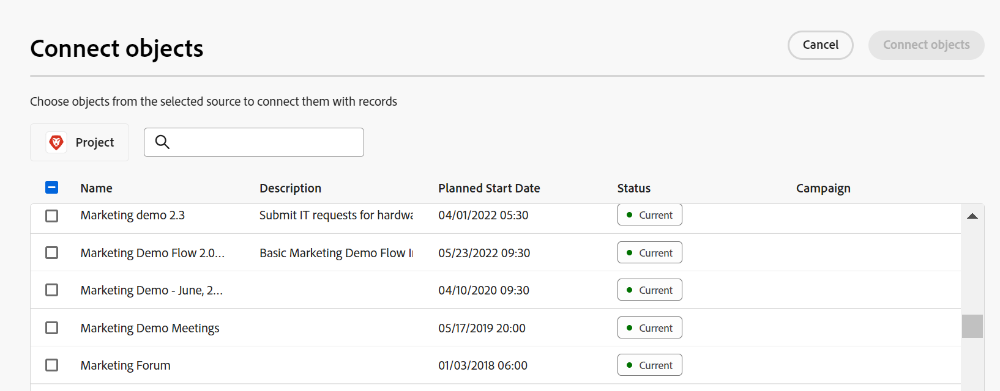
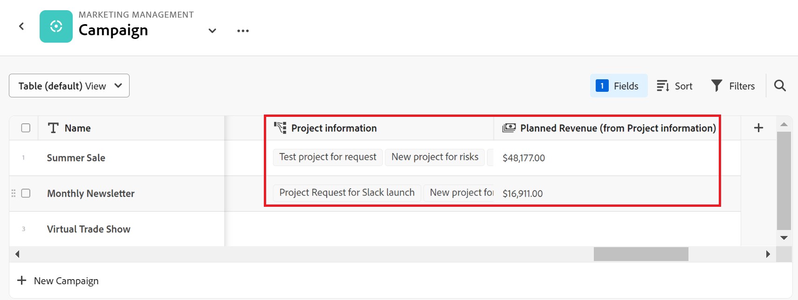

# Exempel på att ansluta posttyper och poster

{{maestro-important-intro}}

I den här artikeln beskrivs ett exempel på följande:

* Så här skapar du en anslutning mellan två posttyper i Workfront Planning och två poster.

* Så här skapar du en anslutning mellan en Workfront Planning-posttyp och en Workfront-projektobjekttyp samt en anslutning mellan en post och ett projekt.

Mer information finns i följande artiklar:

* [Koppla posttyper](../architecture/connect-record-types.md)
* [Koppla poster](../records/connect-records.md)

## Koppla samman två posttyper och poster i Workfront Planning (exempel)

Du har till exempel posttypen Campaign som ursprunglig posttyp.

Du har också en annan posttyp som heter Produkt, som har ett valutafält som heter Budget.

Du vill skapa ett fält på posttypen för Campaign där du kan visa värdena i budgetfältet för posttypen Produkt.

Så här gör du:

1. Öppna tabellvyn för Campaign-posttypen på en arbetsyta.
1. Klicka på **+** i tabellvyns övre högra hörn för att lägga till ett nytt fält och klicka sedan på **Ny anslutning** och sedan klicka **Produkt** i den markerade arbetsytan.
1. Lägg till följande information, till exempel:

   * **Posttyp**: Produkt <!--did they change the casing here?-->
   * **Namn**: Ge det nya fältet ett namn. Till exempel&quot;Produktinformation&quot;. Det här är namnet på det länkade postfältet.
   * **Beskrivning**: Lägg till en beskrivning av det nya fältet. Exempel:&quot;Det här är de produkter som jag vill att mina kampanjer ska vara kopplade till.&quot; Beskrivningen av fältet visas när du hovrar över fältet i kolumnrubriken.
   * **Tillåt flera poster**: Om du låter det här alternativet vara markerat kan användarna välja flera poster när det länkade posttypsfältet (produktinformation) visas på de ursprungliga posterna (kampanjer). I vårt fall kan användarna välja flera produkter som ska kopplas till en kampanj.
   * **Välj sökfält**: Om du låter det här alternativet vara markerat visas **Lägg till sökfält** öppnas nästa ruta så att du kan länka produktfält till posttypen Campaign. Klicka **Hoppa över** om du vill hoppa över det här steget och lägga till produktfält senare.

   

1. (Villkorligt) Om du markerade **Välj alternativ för sökfält** i föregående steg, från listan med fält som är kopplade till **Produkt** posttyp, klicka på **+** ikonen för **Budget** fält och klicka sedan på **Lägg till fält**. Detta skapar ett fält med namnet **Budget (från produktinformation)**, vilket är namnet på det länkade fältet. All information för produktbudgeten visas i det här fältet för kampanjposterna.

   

   >[!TIP]
   >
   >    Om du vill visa budgeten för alla valda produkter som ett totalt tal väljer du **SUM** i listrutan till höger om fältnamnet. När användare väljer flera produkter i **Produktinformation** länkat postfält, **Budget (från produktinformation)** läggs alla deras budgetvärden samman och summan visas. <!-- check the shot below - added a bug with a couple of UI changes here-->
   >
   > Om du väljer **Ingen**, i stället för **SUM** visas de enskilda budgetarna för de valda produkterna åtskilda med kommatecken.

   Detta genererar följande fält:

   * I registervyn Campaign och på kampanjpostsidan för en kampanj:

      * **Produktinformation** (det länkade postfältet): Detta visar namnen på produkterna när du lägger till dem.
      * **Budget (från produktinformation)** (det länkade fältet): Här visas budgetarna för de produkter som valts i fältet Produktinformation.

   * I produktposttabellvyn och på produktpostsidan för en produkt:

      * **Campaign**: Detta anger att produktposttypen är länkad från posttypen Campaign.

     

   >[!TIP]
   >
   >    Länkade postfält föregås av relationsikonen .

1. Från **Campaign** posttypstabellvy, skapa en kampanj genom att lägga till en ny rad i posttypssidans tabell för Campaign.

1. Dubbelklicka inuti  **Produktinformation** den nya kampanjens kolumn.

   

1. Gör något av följande:

   * Klicka på en ansluten produkts namn i listan för att lägga till den till den valda posten. Produkten läggs till automatiskt.
   * Börja skriva namnet på en produkt och klicka på den när den visas i listan. Produkten läggs till automatiskt.
   * Klicka **Se alla** för att visa alla produkter.

1. (Villkorligt) Om du klickade **Se alla** i föregående steg **Koppla objekt** visas.

   

1. Börja skriva namnet på en produkt i sökrutan och markera den sedan när den visas i listan

   eller

   Välj de produktposter som du vill ansluta till kampanjposterna och klicka sedan på **Koppla objekt**.

   >[!TIP]
   >
   >    Du kan öppna en Campaigns postsida, hitta det länkade postfältet och klicka på **+** -ikonen i fältet för att lägga till produkter från den anslutna produktposttypen.

   Följande kolumner är ifyllda i posttyptabellen för Campaign:
   * The **Produktinformation** fylls i för Campaign-posten med de valda produkterna.
   * **Budgeten (från produktinformation)** fylls i med budgetvärdet för varje vald produkt, eller med summan av alla budgetar för de valda produkterna (om du valde SUM för aggregatorn).

   

   >[!TIP]
   >
   >Om du inte väljer en aggregator för de flera värdena visas alla värden från de valda produkterna avgränsade med kommatecken.

1. Fylla i **Campaign** fält från **Produkt** i tabellvyn, upprepa steg 5-7 med början från tabellvyn för produktposttyper och välj kampanjinformation. Detta uppdaterar även produktinformationsfältet i posttypssidans register för Campaign. <!--ensure the step numbers remain correct-->

## Koppla en Workfront Planning-posttyp till en Workfront-projektobjekttyp och koppla en post till enskilda projekt

>[!IMPORTANT]
>
>    Alla som har behörighet att visa eller högre på arbetsytan kan visa informationen i de länkade fälten, oavsett behörighet eller åtkomstnivå i Workfront.

Du har till exempel posttypen Campaign som ursprunglig posttyp.

Du har också projekt i Workfront med ett fält som heter&quot;Planerad intäkt&quot;.

Du vill skapa ett anslutningsfält för posttypen Campaign där du kan visa värdena i fältet Planerad intäkt för de projekt i Workfront som är kopplade till kampanjer i Workfront Planning.

Så här gör du:

1. Gå till en arbetsyta där du vill koppla posttypen Campaign till Workfront-projekt.
1. Öppna tabellvyn för Campaign-posttypen på den valda arbetsytan.
1. Klicka på **+** i tabellvyns övre högra hörn för att lägga till ett nytt fält och klicka sedan på **Ny anslutning** och sedan klicka **Projekt** i **Workfront objekttyper** -avsnitt.
1. Lägg till följande information, till exempel:

   * **Posttyp**: Projekt (från Workfront underavsnitt)
   * **Namn**: Ge det nya fältet ett namn, till exempel &quot;Projektinformation&quot;.
   * **Beskrivning**: Lägg till en beskrivning av det nya fältet. Exempel:&quot;Detta är de projekt som jag vill att mina kampanjer ska vara kopplade till.&quot; Beskrivningen visas i tabellvyn när du hovrar över fältnamnet i kolumnrubriken.
   * 
      * **Tillåt flera poster**: Om det här alternativet är markerat kan användare markera flera projekt när det länkade projekttypsfältet (projektinformation) visas på de ursprungliga posterna (kampanjer).
   * **Välj sökfält**: Om du låter det här alternativet vara markerat visas **Lägg till sökfält** öppnas nästa ruta så att du kan länka projektfält till posttypen Campaign. Klicka **Hoppa över** om du vill hoppa över det här steget och lägga till projektfält senare.

   

1. (Villkorligt) Om du markerade **Välj alternativ för sökfält** i föregående steg, från listan med fält som är kopplade till **Projekt** objekttyp, klicka på **+** ikonen för **Planerad intäkt** fält och klicka sedan på **Lägg till fält**. Detta skapar ett fält med namnet **Planerad intäkt (från projektinformation)**, vilket är namnet på det länkade fältet. All information från fältet Planerad intäkt för projekt visas automatiskt i det här fältet för kampanjposterna.

   >[!TIP]
   >
   >    Om du vill visa planerad intäkt för alla valda projekt som ett totalt tal väljer du **SUM** i listrutan till höger om fältnamnet. När användare väljer flera projekt i **Projektinformation** länkat objektfält, **Planerad intäkt (från produktinformation)** läggs alla deras värden ihop och summan visas. <!-- check the shot below - added a bug with a couple of UI changes here-->
   >
   > Om du väljer **Ingen**, i stället för **SUM**, visas de enskilda planerade intäkterna med kommatecken.

   

   Detta genererar följande fält:

   * I posttabellvyn för Campaign och på kampanjpostsidan:

      * **Projektinformation** (det länkade objektfältet): Detta visar projektens namn.
      * **Planerad intäkt (från projektinformation)** (det länkade fältet): Detta visar de planerade intäkterna för de projekt som valts i fältet Projektinformation.

   >[!TIP]
   >
   >    Länkade objektfält föregås av relationsikonen .

1. Från **Campaign** posttyptabellvy, skapa en kampanj genom att lägga till en ny rad i tabellen.

1. Dubbelklicka inuti  **Projektinformation** den nya kampanjens kolumn.

   

1. Gör något av följande:

   * Klicka på ett projektnamn i listan för att lägga till det i den valda posten. Projektet läggs till automatiskt.
   * Börja skriva namnet på ett projekt och klicka på det när det visas i listan. Projektet läggs till automatiskt.
   * Klicka **Se alla** för att visa alla projekt.

1. (Villkorligt) Om du klickade **Se alla** i föregående steg **Koppla objekt** visas.

   

1. Börja skriva namnet på ett projekt i sökrutan och markera det sedan när det visas i listan

   eller

   Markera de projektposter som du vill ansluta till Campaign-posterna och klicka sedan på **Koppla objekt**.

   >[!TIP]
   >
   >    Du kan öppna sidan för en kampanj, hitta det länkade projektfältet och klicka på **+** -ikonen i fältet för att lägga till projekt från den anslutna produktposttypen.

   Detta lägger till följande på den markerade arbetsytan:

   * I registret Kampanjposttyp:
      * The **Projektinformation** fylls i för Campaign-posten med de valda projekten.
      * The **Planerad intäkt (från produktinformation)** fylls i med budgetvärdet för varje vald produkt. Det här är ett skrivskyddat fält.

   

   >[!TIP]
   >
   >Om du inte väljer en aggregator för de flera värdena och du markerar flera objekt i det objektlänkade fältet, visas alla värden avgränsade med kommatecken.

1. Klicka på namnet på ett projekt i det anslutna postfältet.

   Detta öppnar den skrivskyddade sidan för projektet Woekfront Planning.
Granska information om projektet. Endast markerade projektfält visas på postens sida.

1. Klicka **Gå till källa** i skärmens övre högra hörn för att öppna projektet i Workfront, om du har minst behörigheten Visa för projektet.
1. (Valfritt) Uppdatera information om projektet i Workfront, om du har behörighet att göra det.

1. (Valfritt) I Campaign-tabellvyn håller du pekaren över **Projektinformation** och klicka på nedåtpilen och klicka sedan på **Redigera uppslagsfält.**
1. Klicka på **+** ikon för de projektfält som du vill lägga till i projektposten för Workfront Planning i **Omarkerade fält** -avsnitt.
1. Klicka på **-** ikon för alla projektfält som du vill ta bort från Workfront Project Planning-posten i **Markerade fält** -avsnitt.
1. Klicka **Spara**.

   Ytterligare länkade fält läggs till i Campaign-posttypen.
