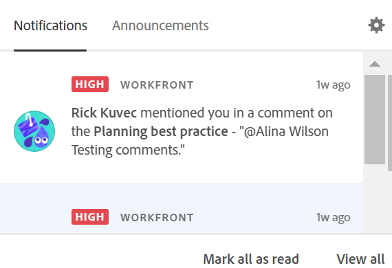

# Hantera meddelanden i appen för Adobe Workfront Planning

{{maestro-important-intro}}

När någon taggar dig i en postkommentar kan du få ett meddelande i appen för den taggen.

Mer information om hur du taggar andra i en postkommentar finns i [Hantera postkommentarer](/help/quicksilver/maestro/records/manage-record-comments.md).

## Åtkomstkrav

Du måste ha följande åtkomst för att kunna utföra stegen i den här artikeln:

<table style="table-layout:auto">
 <col>
 </col>
 <col>
 </col>
 <tbody>
    <tr>
<tr>
<td>
   
 Produkt
 </td>
   <td>
   
 Adobe Workfront
 </td>
  </tr>  
 <td role="rowheader">
Adobe Workfront-avtal
</td>
   <td>

Din organisation måste vara registrerad i betaprogrammet Adobe Workfront Planning. Kontakta din kontorepresentant om du vill veta mer om det nya erbjudandet. 

   </td>
  </tr>
  <tr>
   <td role="rowheader">
Adobe Workfront
</td>
   <td>

Alla

   </td>
  </tr>
  <tr>
   <td role="rowheader">
Adobe Workfront-licens
</td>
   <td>
   
Alla
 
  </td>
  </tr>

<tr>
   <td role="rowheader">
Åtkomstnivåkonfiguration
</td>
   <td> 
Det finns inga åtkomstnivåkontroller i Workfront Planning. 
  
</td>
  </tr>
<tr>
   <td role="rowheader">
Behörigheter
</td>
   <td> 
Visa eller högre behörigheter på en arbetsyta</a> 
  
   
Systemadministratörer har behörighet till alla arbetsytor, inklusive de som de inte skapade

</td>
  </tr>

<tr>
   <td role="rowheader">
Layoutmall
</td>
   <td> 
Workfront- eller gruppadministratören måste lägga till planeringsområdet i layoutmallen. Mer information finns i <a href="../access/access-overview.md">Åtkomstöversikt</a>. 
  
</td>
  </tr>
 </tbody>
</table>

## Förutsättningar

Företaget måste vara en Adobe Unified Experience Workfront-kund för att du ska få ett meddelande i appen när någon taggar dig i en registerkommentar.

Information om hur du avgör om du är användare av Adobe Unified Experience finns i [Adobe enhetliga upplevelse för Workfront](/help/quicksilver/workfront-basics/navigate-workfront/workfront-navigation/adobe-unified-experience.md).

## Hantera meddelanden i appen

1. (Villkorligt) När någon taggar dig i en kommentar för en post går du till appen **Meddelanden** icon  i Adobe Experience Cloud.

   

1. Klicka på meddelandet.

   Sidan med postinformation öppnas i Workfront. Du kan uppdatera posten eller svara på kommentaren.

1. (Valfritt) Klicka på **Markera alla som lästa** för att ange att du har läst alla meddelanden.
1. (Valfritt) Klicka på **Visa alla** för att gå till **Meddelanden** i Adobe Experience Cloud.