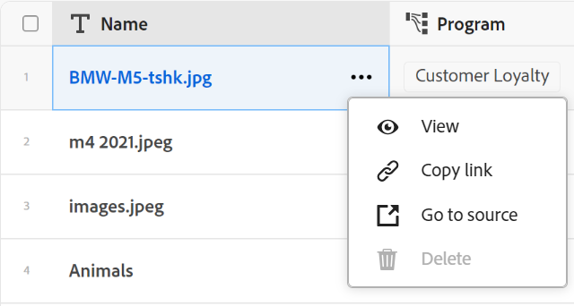

<!--when you make this live, update the metadata above to this: 
---
title: Connect records and objects
description: In addition to connecting Maestro records to one another, you can also connect Maestro records to objects from other applications.  
topic: Architecture
role: User
hidefromtoc: yes
hide: yes
---
-->
<!--udpate the metadata with real information when making this available in TOC and in the left nav-->

<!--if you change steps here, also update steps in the "Connect records" article-->

# Koppla poster

>[!IMPORTANT]
>
>Informationen i den här artikeln handlar om Adobe Maestro, ett nytt erbjudande från Adobe Workfront.
>
>För närvarande ingår Adobe Maestro i ett betaprogram som är öppet för ett begränsat antal kunder. Du måste vara Workfront-kund för att kunna använda Maestro-funktionerna.
>
>Kontakta din kontorepresentant om du vill ha mer information om hur du går med i betaprogrammet för Maestro.
>
>Mer information finns i [Adobe Maestro - översikt](../maestro-overview.md).

Du kan ansluta Adobe Maestro-poster till varandra eller till objekt från andra program.

Du måste först koppla ihop två posttyper eller en posttyp till en objekttyp från ett annat program, och sedan kan du använda posttypens tabellvy för att koppla poster till varandra eller poster till andra objekt.

Mer information om hur du ansluter posttyper till varandra eller till objekttyper från andra program finns i [Koppla posttyper](../architecture/connect-record-types.md).

Ett exempel på hur du ansluter posttyper finns i [Exempel på att ansluta posttyper och poster](../architecture/example-connect-record-types-and-records.md).

Du kan ansluta följande:

* Mejsarkiv
* Mejsel operationsregister till taxonomiposter
* Arkiv och objekt från andra program.

  Du kan koppla Maestro-poster till objekt av den typ som listas nedan från följande program:

   * Adobe Workfront

      * Projekt
      * Portfolio
      * Program
      * Företag
      * Grupp

   * Adobe Experience Manager Assets

      * Bildfiler
      * Mappar

  <!--when you add more objects, fix the Access Requirements below which right now refer only to projects-->

## Åtkomstkrav

Du måste ha följande åtkomst för att kunna utföra stegen i den här artikeln:

<table style="table-layout:auto">
 <col>
<tbody>
<td>
   
 Adobe product
 
   </td>
   <td>
   
 Adobe Workfront
 
För att kunna koppla Maestro-poster till Experience Manager Assets måste du ha en Adobe Experience Manager Assets-licens och instansen av Workfront måste vara registrerad på Adobe Business Platform eller Adobe Admin Console.
</td>
  </tr>  
 <td role="rowheader">
Adobe Workfront-avtal
</td>
   <td>

Din organisation måste vara registrerad i det betaprogram som Adobe Maestro stängt. Kontakta din kontorepresentant om du vill veta mer om det nya erbjudandet. 

   </td>
  </tr>
  <tr>
   <td role="rowheader">
Adobe Workfront
</td>
   <td>

Alla

   </td>
  </tr>
  <tr>
   <td role="rowheader">
Adobe Workfront-licens
</td>
   <td>
Valfritt, för att skapa Maestro-poster
 

Arbeta eller högre för att visa projekt i Workfront

  
Mer information finns i <a href="../../administration-and-setup/add-users/access-levels-and-object-permissions/wf-licenses.md">Översikt över Adobe Workfront-licenser</a>.
 
  </td>
  </tr>
  <tr>
   <td role="rowheader">Åtkomstnivå</td>
   <td> 
Valfritt, för att skapa Maestro-poster

Visa eller ge högre åtkomst till projekt, Portfolio, program
 

Ytterligare åtkomst till grupper och företag när användare visar grupper eller företag tillhör de inte
   
</td>
  </tr>
<tr>
   <td role="rowheader">
Objektbehörigheter
</td>
   <td> 
Visa eller ange högre behörighet för de objekt som du vill länka till Maestro-poster  
</td>
  </tr>
<tr>
   <td role="rowheader">
Layoutmall
</td>
   <td> 
Systemadministratören måste lägga till Maestro-området i layoutmallen. Mer information finns i <a href="../access/grant-access.md">Ge åtkomst till Adobe Maestro</a>. 
</td>
  </tr>
 </tbody>
</table>

<!--
After permssions - replace the table with: 

<table style="table-layout:auto">
 <col>
 </col>
 <col>
 </col>
 <tbody>
    <tr>
<tr>
<td>
   
 Adobe product
 </td>
   <td>
   
 Adobe Workfront
 </td>
  </tr>  
 <td role="rowheader">
Adobe Workfront agreement
</td>
   <td>

Your organization must be enrolled in the Adobe Maestro closed beta program. Contact your account representative to inquire about this new offering. 

   </td>
  </tr>
  <tr>
   <td role="rowheader">
Adobe Workfront plan
</td>
   <td>

Any

   </td>
  </tr>
  <tr>
   <td role="rowheader">
Adobe Workfront license
</td>
   <td>
   
Any
 
  </td>
  </tr>
  
  <tr>
   <td role="rowheader">
Access level
</td>
   <td> 
Any
  
</td>
  </tr>
<tr>
   <td role="rowheader">
Layout template
</td>
   <td> 
Your Workfront or group administrator must add the Maestro area in your layout template. For information, see <a href="../access/grant-access.md">Grant access to Adobe Maestro</a>. 
  
</td>
  </tr>
<tr>
   <td role="rowheader">
Permissions
</td>
   <td> 
Manage permissions to a workspace</a> 
  
   
System Administrators have permissions to all workspaces, including the ones they did not create

</td>
  </tr>
 </tbody>
</table>

-->

<!--Maybe enable this at GA - but Maestro is not supposed to have Access controls in the Workfront Access Level: 
>[!NOTE]
>
>If you don't have access, ask your Workfront administrator if they set additional restrictions in your access level. For information on how a Workfront administrator can change your access level, see [Create or modify custom access levels](../administration-and-setup/add-users/configure-and-grant-access/create-modify-access-levels.md). -->

<!-- Notes to add for the table: for the "Workfront plans" row: the above is only for closed beta; when going to GA - activate the following plans:    

Current plan: Prime and Ultimate

Legacy plan: Enterprise
-->

<!-- Notes for the table: for the "Workfront access" row: 
For more information, see <a href="../../administration-and-setup/add-users/access-levels-and-object-permissions/wf-licenses.md" class="MCXref xref">Adobe Workfront licenses overview</a>.
-->

## Koppla poster

### Att tänka på när det gäller att ansluta poster

* När du har anslutit posttyper visas de kopplade posttyperna som länkade postfält i tabellen med de posttyper de är länkade från.
* Du kan bläddra bland och lägga till poster och objekt för den länkade posten och objekttyperna från de länkade postfälten.
* Du kan lägga till fält från de länkade posttyperna i tabellen med den posttyp som du länkar från.
* Du kan inte uppdatera värdena för länkade fält manuellt på de poster som du länkar från.

  Värdena för de länkade fälten från de länkade posterna fyller i den Maestro-post som du länkar från automatiskt från den maestro-arbetsyta som du konfigurerar eller från ett tredjepartsprogram.

* Alla som har tillgång till Maestro kan se kopplingarna mellan Maestro-posterna eller mellan Maestro-poster och andra programobjekt. De kan visa anslutna poster och objekt oavsett vilka behörigheter de har för de tredjepartsprogram som du ansluter till.
* Du kan visa och redigera alla andras anslutningar. <!--add that this is based on your permissions in both Maestro and Workfront (or, later, any other application)-->
* Du kan koppla en Maestro-post till ett eller flera objekt från ett annat program.
* Om du vill länka Maestro-poster till andra poster eller objekt måste du ha följande:

   * Minst en Maestro-arbetsyta, posttyp och post.

     Mer information finns i följande artiklar:

      * [Skapa arbetsytor](../architecture/create-workspaces.md)
      * [Skapa posttyper](../architecture/create-record-types.md)
      * [Skapa poster](../records/create-records.md)

   * Kopplingar mellan posttyper eller mellan posttyper och objekt från andra program. Mer information finns i [Koppla posttyper](../architecture/connect-record-types.md)

### Connect Maestro-poster

{{step1-to-maestro}}

Den senast använda arbetsytan bör öppnas som standard.

1. (Valfritt) Expandera den nedåtriktade pilen till höger om namnet på en befintlig arbetsyta och markera den arbetsyta som du vill koppla poster från.
1. Klicka på kortet för en posttyp för att öppna posttypssidan.
1. Välj en **Tabell** visa från **Visa** nedrullningsbar meny i det övre högra hörnet på posttypssidan.
1. (Valfritt) Lägg till poster till den posttyp du valde genom att lägga till en ny rad i tabellen. Mer information finns i [Skapa poster](../../maestro/records/create-records.md).
1. Gå till kolumnen för den länkade posten från en post som visas i tabellvyn och hovra över cellen som motsvarar den post som du vill länka till andra poster. Klicka sedan på **+** -ikon.

   The **Koppla objekt** visas.

   

1. Börja skriva namnet på en post i sökrutan och markera den när den visas i listan

   eller

   Markera namnet på en eller flera poster i rutan och klicka sedan på **Koppla objekt** i det övre högra hörnet av rutan Anslut objekt.

   Följande ska läggas till:

   * De länkade posterna visas i det länkade postfältet för den post som du valde i steg 5. <!--accurate?--> När du uppdaterar de länkade posterna uppdateras de länkade fälten automatiskt för de poster som du länkar från. Du kan inte redigera länkade fält manuellt.

     >[!TIP]
     >
     >* Vi använder länkade fält och sökfält omväxlande.
     >
     >* Om du har aktiverat **Tillåt flera poster** när du kopplar ihop posttyperna visas fältvärdena för de markerade objekten antingen separerade med kommatecken eller aggregeras enligt den aggregator du väljer.

1. (Valfritt) Stäng sidan för posttypen Maestro och gå till den arbetsyta du valde.
1. Klicka på kortet för den posttyp som du länkade till.

   Om du till exempel har anslutit **Campaign** med produktposten klickar du på **Produkt** kort.

   Posttypkortet ska öppnas i tabellvyn. Om inte, väljer du en tabellvy.

   Observera att **Campaign** I det länkade postfältet visas namnen på de kampanjer du har länkat till produkter på sidan Produktposttyp. Om du uppdaterar Campaign-informationen uppdateras automatiskt det Campaign-länkade postfältet för produktposttypen.

### Koppla Maestro-poster till Workfront-objekt

<!--when we will have more applications to link to from Maestro, change the title to soemthing like: Connect Maestro records to objects from other applications-->

När du har skapat en anslutning mellan en Maestro-posttyp och en Workfront-objekttyp kan du koppla enskilda Maestro-poster till objekt i Workfront. De Workfront-fält som du har anslutit fylls automatiskt i på de Maestro-poster som du länkar objekten från.

{{step1-to-maestro}}

Den senast använda arbetsytan bör öppnas som standard.

1. (Valfritt) Expandera den nedåtriktade pilen till höger om namnet på en befintlig arbetsyta och markera den arbetsyta som du vill koppla poster från.
1. Klicka på kortet för en posttyp för att öppna posttypssidan.
1. Välj en **Tabell** visa från **Visa** nedrullningsbar meny i det övre högra hörnet på posttypssidan.

1. (Valfritt) Lägg till enskilda poster till den posttyp du valde genom att lägga till en ny rad i tabellen. Mer information finns i [Skapa poster](../../maestro/records/create-records.md).
1. (Villkorligt) Om du har kopplat den markerade posttypen till ett Workfront-objekt går du till kolumnen för det länkade objektet och för markören över cellen som motsvarar posten som du vill länka till objekt från Workfront. Klicka sedan på **+** -ikon.

   The **Koppla objekt** visas.

   

   Mer information om hur du ansluter posttyper med objekt från ett tredjepartsprogram finns i [Koppla posttyper](../architecture/connect-record-types.md).

1. Börja skriva namnet på ett Workfront-objekt i sökrutan och markera det sedan när det visas i listan

   eller

   Markera namnet på ett eller flera objekt i rutan och klicka sedan på **Koppla objekt** i det övre högra hörnet av rutan Anslut objekt.

   Följande ska läggas till:

   * De markerade Workfront-objekten läggs till i det länkade postfältet.
   * Om du lade till dem när du kopplade posttypen med Workfront fylls de länkade fälten (eller sökfälten) automatiskt i med information från Workfront.
   * En ny posttyp med namnet &quot;&lt; Namn på Workfront objekttyp >&quot; skapas på samma arbetsyta som den maestro-post som du länkar från. Objektets namn är en del av den här posttypens namn. Om du till exempel länkar till Workfront-projekt skapas **Projekt** posttyp i Maestro.

     Detta är en skrivskyddad posttyp och visar Workfront-objekt som är markerade i det nya länkade objektfältet som du skapade från Maestro-posten. De länkade fälten för det länkade objektet visas även på de skrivskyddade länkade Workfront-posterna.

     >[!IMPORTANT]
     >
     > Den skrivskyddade posttypen för Workfront-objekt skapas bara när enskilda projekt läggs till i Maestro-poster. Workfront-posttypen skapas inte om du skapar en anslutning mellan en Maestro-posttyp och en Workfront-objekttyp.

     All befintlig information från fälten i Workfront-objekten visas i de länkade fälten eller sökfälten.

     >[!TIP]
     >
     >
     >* Om du har aktiverat inställningen Tillåt flera poster visas värdena för de olika objekten antingen avgränsade med kommatecken eller aggregeras enligt den aggregator du har valt.
     >
     >* Ett länkat postfält till de länkade dataposterna skapas inte för de länkade Workfront-objekten i Workfront.

1. (Valfritt) Stäng sidan för posttypen Maestro och gå till den arbetsyta du valde.
1. (Valfritt) Klicka på kortet för posttypen Workfront-objekt. Klicka till exempel på **Projekt** om du har länkat till Workfront-projekt. Skrivskyddat posttypskort för Workfront ska öppnas i tabellvyn.

   Posterna som visas på posttypssidan i Workfront är skrivskyddade Workfront-objekt som har länkats från Maestro-poster. De fält som är länkade från posttypen för Workfront visas också som skrivskyddade kolumner, och de fylls i automatiskt när de fylls i i Workfront.

1. (Valfritt) Gör något av följande om du vill öppna Workfront objektpostinformationssida i Maestro:

   * Gå till det länkade postfältet för Workfront-objektet från den posttyp du länkade från och klicka på namnet på Workfront-objektet.
   * Från **Tabell** vy över posttypssidan för Workfront, klicka på namnet på Workfront-objektet

     eller

     Klicka på **Mer** till höger om Workfront-objektnamnet och klicka sedan på **Visa**.

     

   Då öppnas sidan Maestro Details (Maestro-information) för det länkade Workfront-objektet. Det här är en skrivskyddad sida.

1. (Valfritt) Gör något av följande om du vill öppna det länkade Workfront-objektet i Workfront:

   * Från **Tabell** visa Workfront posttypsida genom att klicka på namnet på Workfront-objektet för att öppna projektposten i maestro

   eller

   Klicka på **Mer** till höger om Workfront-objektnamnet och klicka sedan på **Gå till källa**.

   

   Då öppnas Workfront objektsida. Du kan redigera information om Workfront-objektet om du har behörighet att göra det.

1. (Valfritt) Klicka på den skrivskyddade postsidan för Workfront-objekt i Macestro **Lägg till fält** icon  i tabellvyns övre högra hörn för att lägga till eller ta bort Workfront-fält från posttypen Workfront.

   >[!NOTE]
   >
   >  De fält som du lägger till eller tar bort på Workfront objektposttypsida läggs inte till och tas inte bort från Maestro-posttypen som länkar till Workfront-objekttypen. Fälten visas bara på den skrivskyddade posttypssidan för Workfront, så du kan granska dem i Maestro.

1. (Valfritt och villkorligt) Om du har lagt till minst två datumfält i Workfront-objektet klickar du på **Visa** nedrullningsbar meny på posttypssidan för Workfront-objekt och välj **Tidslinje** visa eller **Skapa vy** för att skapa en tidslinjevy.  Mer information finns i [Hantera tidslinjevyn](/help/quicksilver/maestro/views/manage-the-timeline-view.md).

   De länkade Workfront-objekten visas i tidslinjevyn.

### Koppla Maestro-poster till Adobe Experience Manager-objekt

<!--when we will have more applications to link to from Maestro, change the title to soemthing like: Connect Maestro records to objects from other applications-->

>[!IMPORTANT]
>
>Du måste ha en Adobe Experience Manager Assets-licens och din organisations instans av Workfront måste vara registrerad på Adobe Business Platform eller Adobe Admin Console för att kunna ansluta Maestro-poster till Adobe Experience Manager Assets.
>
>Om du har frågor om hur du kommer igång med Adobe Admin Console kan du läsa [Adobe - frågor och svar om enhetliga upplevelser](/help/quicksilver/workfront-basics/navigate-workfront/workfront-navigation/unified-experience-faq.md).

När du har skapat en anslutning mellan en Maestro-posttyp och Adobe Experience Manager Assets kan du koppla enskilda Maestro-poster till Experience Manager-resurser. De resursfält du anslöt från Experience Manager Assets när du skapade anslutningen fylls automatiskt i med den typ av Maestro-post som du länkade från.

{{step1-to-maestro}}

Den senast använda arbetsytan bör öppnas som standard.

1. (Valfritt) Expandera den nedåtriktade pilen till höger om namnet på en befintlig arbetsyta och markera den arbetsyta som du vill koppla poster från.
1. Klicka på kortet för en posttyp för att öppna posttypssidan.
1. Välj en **Tabell** visa från **Visa** nedrullningsbar meny i det övre högra hörnet på posttypssidan.

1. (Valfritt) Lägg till enskilda poster till den posttyp du valde genom att lägga till en ny rad i tabellen. Mer information finns i [Skapa poster](../../maestro/records/create-records.md).
1. (Villkorligt) Om du har anslutit den markerade posttypen med Experience Manager Assets går du till kolumnen för det länkade objektet och för markören över cellen för den post som du vill länka till andra objekt från Experience Manager. Klicka sedan på **+** -ikon.

   The **Välj resurser** visas. <!--update screen shot with actual assets-->

   

   Mer information om hur du ansluter posttyper med objekt från ett tredjepartsprogram finns i [Koppla posttyper](../architecture/connect-record-types.md).

1. Klicka för att välja någon av följande typer av resurser:

   * Bilder
   * Mappar

   Du kan välja flera resurser.

   >[!IMPORTANT]
   >
   > Du kan bara ansluta resurser som du har tillgång till för att visa i Experience Manager. När du är uppkopplad kan alla Maestro-användare visa resurserna i Maestro, oavsett vilken åtkomst de har i Experience Manager Assets.

1. Klicka **Välj**.

   Följande ska läggas till:

   * De markerade Experience Manager-resurserna läggs till i det länkade postfältet.
   * De länkade fälten (eller sökfälten) fylls i med information från de Experience Manager-anslutna resurserna.
   * En ny posttyp med namnet&quot;Experience Manager Assets&quot; skapas på samma arbetsyta som den maestro-post som du länkar från. <!--is this still added?-->

     Det här är en skrivskyddad posttyp och visar Experience Manager-resurser som är markerade i det nya länkade objektfältet som du skapade från Maestro-posten. De länkade fälten för det länkade objektet visas även på de skrivskyddade länkade Experience Manager-posterna.

     >[!IMPORTANT]
     >
     > Den skrivskyddade posttypen för Experience Manager Assets skapas bara när enskilda resurser läggs till i Maestro-poster. Om du bara skapar en anslutning mellan en Maestro-posttyp och Experience Manager Assets skapas inte posttypen Experience Manager Assets.

     All befintlig information från fälten för resurserna i Experience Manager visas i de länkade fälten eller sökfälten.

     >[!TIP]
     >
     >
     >* Om du har aktiverat inställningen Tillåt flera poster visas värden för flera objekt avgränsade med kommatecken.
     >
     >* Ett länkat postfält till de Maestro-länkade posterna skapas inte för de länkade Experience Manager-resurserna i Experience Manager Assets-programmet.

1. (Valfritt) Stäng sidan för posttypen Maestro och gå till den arbetsyta du valde.
1. Klicka på kortet för posttypen Experience Manager Assets. Skrivskyddat posttypskort för Experience Manager Assets ska öppnas i tabellvyn.

   Posterna som visas på posttypssidan i Experience Manager Assets är skrivskyddade resurser. De fält som är länkade från posttypen Experience Manager Assets visas också som skrivskyddade kolumner och fylls i automatiskt när de fylls i Experience Manager.

1. (Valfritt) Gå till den posttyp som du länkade till Experience Manager Assets från och klicka på namnet på en resurs i det länkade postfältet. Information om resursen Experience Manager i ett popup-fönster. <!--update screen shot with hi-rez picture-->

   

   Följande fält visas för en bildfil:

   * En miniatyrbild av bilden
   * Bildfilens namn
   * Dimensioner
   * Storlek
   * Beskrivning
   * Filsökvägen i Experience Manager
   * Tillgångstypen
   * Skapad den
   * Ändrat den

1. (Valfritt) Gör så här för att öppna Experience Manager Assets postinformationssida i Maestro:

   1. Gå till **Experience Manager Assets** Posttypkortet i maestro i den arbetsyta som du ursprungligen valde och klicka för att öppna posttypssidan.
Posttypssidan för Experience Manager Assets Maestro är skrivskyddad.
   1. Klicka på namnet på en resurs i tabellvyn

      eller

      Håll muspekaren över namnet på en resurs och klicka på **Mer** meny  till höger om resursnamnet och klicka sedan på **Visa**.\
      Då öppnas resursens Maestro **Information** sida. Det här är en skrivskyddad sida.
1. (Valfritt) Gör något av följande om du vill öppna informationssidan för resursposten i Experience Manager i Experience Manager:

   * Gå till posttypssidan för den post du länkar från, klicka på namnet på en resurs i det länkade postfältet för att öppna snabbfönstret och klicka sedan på **Öppna** icon  för att öppna resursen.
   * Gå till **Experience Manager Assets** Posttypkortet i maestro på den arbetsyta som du ursprungligen valde och klicka för att öppna posttypssidan, klicka på namnet på en resurs för att öppna Makestro **Information** sida och klicka sedan på **Gå till källa** i skärmens övre högra hörn.

     
   * Gå till **Experience Manager Assets** Posttypkortet i maestro på den arbetsyta som du ursprungligen valde och klicka på kortet för att öppna posttypssidan för Experience Manager Assets, håll muspekaren över namnet på en resurs och klicka på **Mer** menyn och klicka sedan på **Gå till källa**.

     

   Resursen öppnas i Experience Manager Assets.

1. (Valfritt) Klicka på **Lägg till fält** icon  i tabellvyns övre högra hörn på posttypssidan i Experience Manager Assets om du vill lägga till eller ta bort fält i Experience Manager.

   >[!NOTE]
   >
   >  De fält som du lägger till eller tar bort på posttypssidan för Experience Manager Assets läggs inte till eller tas bort från posttypen för maestro som länkar till resursen Experience Manager. Fälten visas bara på den skrivskyddade posttypssidan för Experience Manager Assets, så du kan granska dem i Maestro.

1. (Valfritt och villkorligt) Om du har lagt till minst två datumfält i den länkade resursen för Experience Manager klickar du på **Visa** nedrullningsbar meny på posttypssidan för Experience Manager Assets och välj **Tidslinje** visa eller **Skapa vy** för att skapa en tidslinjevy.  Mer information finns i [Hantera tidslinjevyn](/help/quicksilver/maestro/views/manage-the-timeline-view.md).
De länkade Experience Manager Assets-resurserna visas i tidslinjevyn.