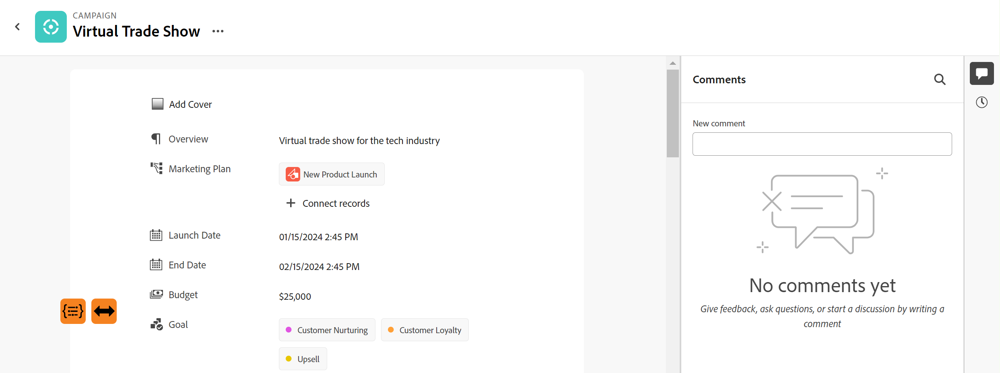

<!--update the metadata with real information when making this avilable in TOC and in the left nav-->

# Hantera postsidan

{{maestro-important-intro}}

Du kan redigera layouten för postförhandsgranskning och -sida i Adobe Workfront Planning.

Förhandsgranskningen av posten är en mindre vy av postsidan som visas i vyn av en posttyp.

När du ändrar layouten för en postförhandsgranskning och sida påverkar ändringarna förhandsvisningsrutorna och informationssidorna för alla poster av samma typ.

I den här artikeln beskrivs hur du kan ändra layouten och utseendet på en postförhandsvisningsruta eller en postsida. Mer information om hur du redigerar poster finns i [Redigera poster](/help/quicksilver/maestro/records/edit-records.md).

Du måste skapa posttyper och poster innan du kan börja redigera postsidor.

Mer information finns i följande artiklar:

* [Skapa posttyper](../architecture/create-record-types.md)

* [Skapa poster](/help/quicksilver/maestro/records/create-records.md)

## Åtkomstkrav

Du måste ha följande åtkomst för att kunna utföra stegen i den här artikeln:

<table style="table-layout:auto">
 <col>
 </col>
 <col>
 </col>
 <tbody>
    <tr>
<tr>
<td>
   
 Produkt
 </td>
   <td>
   
 Adobe Workfront
 </td>
  </tr>  
 <td role="rowheader">
Adobe Workfront-avtal
</td>
   <td>

Din organisation måste vara registrerad i betaprogrammet Adobe Workfront Planning. Kontakta din kontorepresentant om du vill veta mer om det nya erbjudandet. 

   </td>
  </tr>
  <tr>
   <td role="rowheader">
Adobe Workfront
</td>
   <td>

Alla

   </td>
  </tr>
  <tr>
   <td role="rowheader">
Adobe Workfront-licens*
</td>
   <td>
   
Nytt: Ljus eller högre

   eller
   
Aktuell: Arbete eller högre
 
  </td>
  </tr>

<tr>
   <td role="rowheader">
Konfigurationer på åtkomstnivå
</td>
   <td> 
Det finns inga åtkomstkontroller för Adobe Workfront Planning
  
</td>
  </tr>
<tr>
   <td role="rowheader">
Behörigheter
</td>
   <td> 
Hantera eller högre behörigheter på en arbetsyta</a> 
  
   
Systemadministratörer har behörighet till alla arbetsytor, inklusive de som de inte skapade

</td>
  </tr>
<tr>
   <td role="rowheader">
Layoutmall
</td>
   <td> 
Workfront- eller gruppadministratören måste lägga till planeringsområdet i layoutmallen. Mer information finns i <a href="../access/access-overview.md">Åtkomstöversikt</a>. 
  
</td>
  </tr>

</tbody>
</table>

*Mer information finns på [Åtkomstkrav i Workfront-dokumentation](/help/quicksilver/administration-and-setup/add-users/access-levels-and-object-permissions/access-level-requirements-in-documentation.md).

## Att tänka på när du redigerar postsidor

* Om du ordnar om fälten i postförhandsvisningen eller på sidan ordnas fälten om för alla poster av den typen och för alla användare som använder dessa poster.

* Visningsändringar som du gör i postförhandsgranskningen visas direkt på postinformationssidan. Ändringar som görs på postsidan visas också i rutan Förhandsgranska post.

<!--Replace the first bullet with this when we add sections:

* The following changes affect all the records of the same type and are visible to all users accessing those records: 

   * Rearranging fields
   * Adding or removing sections
-->

* Att lägga till en omslagsbild i en post ingår inte i den övergripande layouten för postförhandsvisningen eller -sidan. Du kan lägga till unika omslagsbilder till varje post. Mer information finns i [Lägga till en omslagsbild till en post](/help/quicksilver/maestro/records/add-a-cover-image-to-a-record.md).

<!--

## Add sections to a record preview or page

You can add sections to a record preview or page, to organize the information by common criteria and make it easier to find. 

Consider the following when adding sections to a record page:

* There is no limit to how many sections you can have on a page (***************IS THIS TRUE???***********)
* You cannot have an empty section. You must have at least one field in a section. 
* You can drag and drop fields from one section to another. 
* When you remove all the fields from a section, the section is automatically deleted and cannot be recovered. 

To add a section to a record preview or page: 

{{step1-to-maestro}}

The workspace that you access last opens. 

1. (Optional) Click the downward-pointing arrow to the right of the workspace name to select the workspace whose records you want to update. 
1. Click a record type card. 

    The record type page opens. 

1. From a view of any type, click the name of a record 

    Or 
    
    From the table table view, click the **Open details** icon  to the left of a record name. 
    
    The record's preview opens in the view.

     

    >[!TIP]
    >
    >You can view the **Open details** icon to the left of the Name field of a record in a table view only when the Name field is a primary field. 

1. (Optional) Click the **Open in new tab** icon  (****************check the icon; they are changing it**********)  in the upper-right corner of the record preview  to open the record's page in a new tab. 

    The record page opens. 

    

1. In the record preview or page, hover over the white space to the left of the fields, then click the **Add section** icon  to add a section. 
1. Click inside the section's name and replace **Untitled** with a name, then click Enter. (************has this changed to Untitled section???**********)
1. Start dragging and dropping fields to the new section, as described in the section [Rearrange fields in the record preview or page](#rearrange-fields-in-the-record-preview-or-page) in this article. 

1. (Optional) Hover over the name of a section and click the **More** menu . 

   
1. (Optional) Do one of the following to edit the section: 

   * Click **Rename** to rename the section

      >[!TIP]
      >
      > You can rename a section inline, by clicking the name.
   
   * Click **Move up** to move the section up one position 

      Or 
      
      Click **Move down** to move the section down one position.
      All fields in the section move with the section. 

   * Click **Delete** to delete the section. The section is deleted and it cannot be recovered. All users accessing the records of this type will no longer view the deleted section. 

1. Click the downward-pointing arrow to the left of a section name to collapse it, or the right-pointing arrow  to expand it. 
   All sections are expanded by default. 

1. (Optional) Click the **grab** icon  to the left of a section name, then drag and drop it in a desired spot. 

    The new position of the section updates in both the preview and the page of all records of the same type for all users viewing the records. 

    All changes to sections and field order are saved automatically. 

-->

## Ordna om fält i postens förhandsgranskning eller sida

{{step1-to-maestro}}

Arbetsytan som du öppnar senast öppnas.

1. (Valfritt) Klicka på nedåtpilen till höger om arbetsytans namn för att markera arbetsytan vars poster du vill uppdatera.
1. Klicka på ett posttypskort.

   Posttypssidan öppnas.

1. Klicka på en post i en vy av valfri typ

   eller

   I tabelltabellvyn klickar du på **Öppna detaljer** icon  till vänster om ett postnamn.

   Postens förhandsgranskning öppnas i vyn.

   

   >[!TIP]
   >
   >Du kan visa **Öppna detaljer** ikonen till vänster om fältet Namn för en post i en tabellvy enbart när fältet Namn är primärt.

1. (Valfritt) Klicka på **Öppna på ny flik** icon  <!--check the icon; they are changing it--> i det övre högra hörnet av postförhandsgranskningen om du vill öppna postens sida på en ny flik.

   Postsidan öppnas.

   

1. Klicka på knappen **ta** icon  till vänster om ett fältnamn och sedan dra och släppa det på önskad plats. <!--You can drag and drop fields to another section. You must have at least one field in a section.-->

   Den nya positionen för fältet uppdateras både i förhandsvisningen och på sidan med alla poster av samma typ för alla användare som visar posterna.

   Alla ändringar av layouten för postförhandsgranskningen eller sidan sparas automatiskt.

