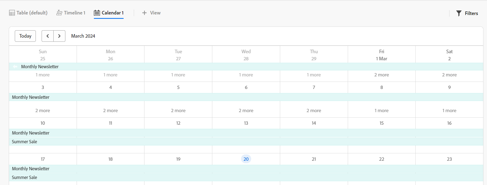

# Hantera kalendervyn

<!--
title: Manage the calendar view
description: You can display records in a calendar view.
hidefromtoc: yes
author: Alina
feature: Work Management
role: User
hide: yes
-->

<!--update the metadata with real information when making this available in TOC and in the left nav-->

{{maestro-important-intro}}

Du kan visa poster och deras fält i en kalendervy från posttypssidan.

Mer information om Maestro-vyer och hur du hanterar dem finns i [Hantera postvyer](../views/manage-record-views.md).

## Åtkomstkrav

Du måste ha följande åtkomst för att kunna utföra stegen i den här artikeln:

<table style="table-layout:auto">
 <col>
 </col>
 <col>
 </col>
 <tbody>
    <tr>
<tr>
<td>
   
 Produkt
 </td>
   <td>
   
 Adobe Workfront
 </td>
  </tr>  
 <td role="rowheader">
Adobe Workfront-avtal
</td>
   <td>

Din organisation måste vara registrerad i det betaprogram som Adobe Maestro stängt. Kontakta din kontorepresentant om du vill veta mer om det nya erbjudandet. 

   </td>
  </tr>
  <tr>
   <td role="rowheader">
Adobe Workfront
</td>
   <td>

Alla

   </td>
  </tr>
  <tr>
   <td role="rowheader">
Adobe Workfront-licens
</td>
   <td>
   
Alla
 
  </td>
  </tr>

<tr>
   <td role="rowheader">Åtkomstnivåkonfiguration</td>
   <td> 
Det finns inga åtkomstnivåkontroller för Maestro 
  
</td>
  </tr>

<tr>
   <td role="rowheader">
Behörigheter
</td>
   <td> 
Hantera behörigheter till vyn
  
</td>
  </tr>

<tr>
   <td role="rowheader">Layoutmall</td>
   <td> 
Systemadministratören måste lägga till Maestro-området i layoutmallen. Mer information finns i <a href="../access/access-overview.md">Åtkomstöversikt</a>. 
  
</td>
  </tr>
 </tbody>
</table>

## Hantera en kalendervy {#manage-a-calendar-view}

<!--insert screen shot of calendar view-->

Tänk på följande:

* Du kan bara skapa en kalendervy om du har minst två datumfält kopplade till en posttyp. När du har ett eller inga datumfält kopplade till en posttyp är alternativet Kalendervy nedtonat.
* Följande scenarier:

   * När start- och slutdatum inte har några värden visas inte posterna i kalendern
   * När start- eller slutdatumet inte har något värde visas posten som en endagshändelse
   * När startdatumet är efter slutdatumet visas inte posten i kalendern.

Så här hanterar du en kalendervy:

1. Gå till den posttypssida som du vill visa kalendern för.
1. Skapa en kalendervy enligt beskrivningen i artikeln [Hantera postvyer](../views/manage-record-views.md).

   

   Posterna som är associerade med den posttyp som du har valt visas som staplar i en kalender.

1. Navigera i kalendern genom att göra något av följande:

   * Klicka på vänster- och högerikonerna eller använd den vågräta rullningen för att flytta bakåt och framåt i kalendern.
   * Klicka **Idag** för att centrera kalendern på dagens datum.
   * Välj något av följande alternativ på den nedrullningsbara menyn för tidsram för att uppdatera tidsstegen:

      * Månad