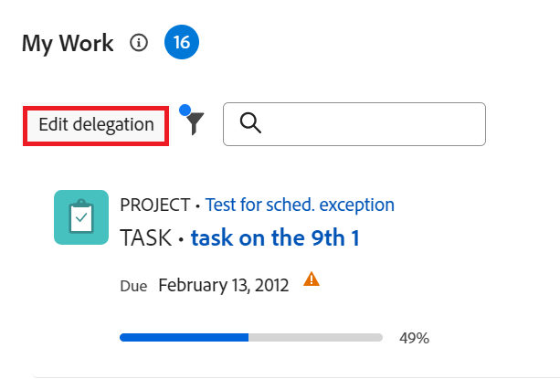

# Delegera uppgifter och ärenden

<!-- Audited: 10/2024 -->

<!--
<NOTE: 
<you might need to change the tile to Delegate PTI, etc, when that functionality is added. Named it this so it will not conflict with the TOC article for Delegate section which was also "Delegate work"
I wrote this as a "Manage..." article and I did not add three separate articles, to match what we have for delegating approval requests)
-->

Du kan tillfälligt delegera det arbete du är tilldelad när du inte är på kontoret.

Du kan delegera uppgifter och utgivningstilldelningar eller delegera godkännanden. I den här artikeln beskrivs hur du delegerar uppgifter och utfärdar tilldelningar.

Allmän information om delegering av arbete finns i [Delegera arbetsöversikt](../../manage-work/delegate-work/delegate-work-overview.md).

## Åtkomstkrav

+++ Expandera om du vill visa åtkomstkrav för funktionerna i den här artikeln.

>[!IMPORTANT]
>
>* De användare som du väljer som ombud får samma behörigheter som de uppgifter och utgåvor som du delegerar till dem.
>* Behörigheterna måste fungera inom sina åtkomstnivåer och ibland kan deras åtkomstnivåer vara lägre än dina.
>
>   
>   Om en användare till exempel bara har Visa åtkomst till uppgifter på sin åtkomstnivå och du har behörigheten Hantera för de uppgifter som du delegerar till dem, får de behörigheten Hantera för de uppgifter som du delegerar till dem. De kan dock inte utföra samma åtgärder som du för de delegerade uppgifterna. Om du vill kunna uppdatera uppgifter utan att vara närvarande måste du begära redigeringsåtkomst till uppgifter från systemadministratören.
>
>   
>   Mer information om hur en systemadministratör kan ändra din åtkomstnivå finns i [Skapa eller ändra anpassade åtkomstnivåer](../../administration-and-setup/add-users/configure-and-grant-access/create-modify-access-levels.md).
>
>* För objekt som tilldelas efter att delegeringen redan har startats kan det ta upp till en timme efter det att objektet tilldelats [!DNL Workfront] att dela de nyligen tilldelade objekten med delegaten.

Du måste ha följande åtkomst för att kunna utföra stegen i den här artikeln:

<table style="table-layout:auto"> 
 <col> 
 <col> 
 <tbody> 
  <tr> 
   <td role="rowheader">[!DNL Adobe Workfront] plan</td> 
   <td> 
Alla
 </td> 
  </tr> 
  <tr> 
   <td role="rowheader">[!DNL Adobe Workfront] licens*</td> 
   <td> 
Nytt: Medarbetare eller högre

eller

Aktuell: Granska eller senare

>[!NOTE]
>
>Även om du kan tilldelas att arbeta när du har en Request-licens, kan du inte delegera ditt arbete till andra. [!DNL Workfront] rekommenderar inte att du tilldelar arbete till gransknings-, begärande- eller medverkande användare.

</tr> 
  <tr> 
   <td role="rowheader">Konfigurationer på åtkomstnivå</td> 
   <td> 
Redigera åtkomst till uppgifter och ärenden 
     
 </td> 
  </tr> 
  <tr> 
   <td role="rowheader">Objektbehörigheter</td> 
   <td> 
Visa eller högre behörigheter för de uppgifter eller utgåvor som du har tilldelats
 
    </td> 
  </tr> 
 </tbody> 
</table>

*Mer information finns i [Åtkomstkrav i Workfront-dokumentation](/help/quicksilver/administration-and-setup/add-users/access-levels-and-object-permissions/access-level-requirements-in-documentation.md).

+++

<!--note from the table for Object permissions:
     
Contribute or higher permissions to the projects where you are designated as the Project&nbsp;Owner (NOTE:&nbsp;you cannot delegate projects yet)

    -->

## Förutsättningar

Innan du kan utföra de aktiviteter som beskrivs i den här artikeln måste du se till följande:

* [!DNL Workfront]- eller gruppadministratören aktiverade inställningen [!UICONTROL **Tillåt användare att delegera sina uppgifter och ärenden**] i avsnittet [!UICONTROL Tasks & Issues Preferences] i [!UICONTROL Setup]-delen av [!DNL Workfront]-instansen.

  Mer information finns i [Konfigurera inställningar för aktiviteter och problem i hela systemet](../../administration-and-setup/set-up-workfront/configure-system-defaults/set-task-issue-preferences.md).

## Delegera uppgifter och ärenden till en annan användare

Innan du delegerar arbete till andra rekommenderar vi att du kontaktar dem och informerar dem om att de kommer att utses till delegater på dina arbetsuppgifter. Be om deras muntliga godkännande innan du delegerar arbetet för att försäkra dig om att de har den tid som krävs för att slutföra arbetet medan du är utanför kontoret.

Allmän information om hur du delegerar uppgifter och problem finns i [Översikt över delegeringsuppgifter och problem](/help/quicksilver/manage-work/delegate-work/delegate-work-overview.md).

Så här delegerar du dina uppgifter och utgåvor till andra:

1. Gå till området [!UICONTROL **Hem**].
1. Kontrollera att widgetarna [!UICONTROL **Mitt arbete**], [!UICONTROL **Mina uppgifter**] eller [!UICONTROL **Mina problem**] har lagts till i ditt [!UICONTROL **hem**].

   Mer information finns i [Lägga till, redigera eller ta bort widgetar i Hem](/help/quicksilver/workfront-basics/using-home/using-the-home-area/add-edit-remove-widgets-in-new-home.md)

1. Klicka på [!UICONTROL **Delegera**] i det övre vänstra hörnet av widgetarna [!UICONTROL **Mitt arbete**], [!UICONTROL **Mina uppgifter**] eller [!UICONTROL **Mina problem**].

   

1. Uppdatera följande:

   * [!UICONTROL **Delegera dina uppgifter och ärenden till**]: Börja skriva namnet på en användare som du vill att dina uppgifter och utgåvor ska delegeras till och markera den när den visas i listan. Du kan bara välja en användare.

     Användaren som du väljer som ombud får samma behörigheter som dina behörigheter för de uppgifter och utgåvor som du delegerar till dem.

   * [!UICONTROL **Startdatum**]: Välj ett datum i kalendern när delegeringen av dina arbetsobjekt ska starta.

     >[!TIP]
     >
     >Startdatumet får inte vara tidigare.

   * [!UICONTROL **Inget slutdatum**]: Välj det här alternativet om du inte vill ange slutdatumet för din delegering.

   * [!UICONTROL **Slutdatum**]: Välj ett datum i kalendern när delegeringen ska stoppas.

     >[!TIP]
     >
     >Om du låter fältet Slutdatum vara tomt och alternativet Inget slutdatum inte är markerat, ställs delegeringen bara in för den aktuella dagen.

     
     <!--check screen shot - submitted bug for casing-->

1. Klicka på [!UICONTROL **Spara**].

   Följande saker händer:

   * Ditt arbete delegeras till den angivna användaren. Alla ofullständiga uppgifter eller utgåvor som har datum inom den tidsram du valde (inklusive nyligen tilldelade uppgifter, efter att delegeringen aktiverats) delegeras.

     >[!TIP]
     >
     >   Slutförda arbetsuppgifter som har datum inom delegeringens tidsram delegeras inte.

   * Du får ett meddelande längst ned på skärmen som bekräftar att du har aktiverat delegering av ditt arbete till en annan användare. Namnet på delegatanvändaren visas i bekräftelsemeddelandet.

   * En indikation på att dina uppgifter och utgåvor har delegerats till andra användare visas på de flesta områden där du kan se tilldelningar i [!DNL Workfront]. Mer information om vilka områden som inte innehåller delegaternas namn finns i [Delegera arbetsöversikt](delegate-work-overview.md).

   * Knappen [!UICONTROL **Delegera**] i området [!UICONTROL **Hem**] ändras till [!UICONTROL **Redigera delegering**] för att ange att det finns en delegering på plats.
     <!--
      <MadCap:conditionalText data-mc-conditions="QuicksilverOrClassic.Draft mode">
      (NOTE: is this shot correct?&nbsp;See UI - this is a mock)
      </MadCap:conditionalText>
      -->

     

   * Om dina händelsemeddelanden och dina personliga meddelanden är aktiverade får du också en e-postbekräftelse från din delegering.

   * Användaren som du har valt som ombud får ett e-postmeddelande om delegeringen, om deras händelsemeddelanden är aktiverade.

     Mer information om hur du aktiverar personliga e-postmeddelanden finns i [Ändra dina egna e-postmeddelanden](../../workfront-basics/using-notifications/activate-or-deactivate-your-own-event-notifications.md).

## Redigera eller stoppa delegering

Du kan låta en delegering förfalla, om du har valt ett slutdatum, eller så kan du stoppa det manuellt. Du kan också ändra tidsramen för delegeringen om datumen för delegeringen ändras.

1. Gå till området [!UICONTROL **Hem**] och klicka sedan på [!UICONTROL **Redigera delegering**] i någon av följande widgetar: **Mitt arbete**, **Mina uppgifter** eller **Mina problem**.
1. Gör något av följande i rutan [!UICONTROL Stop delegating tasks and issues]:
   * Ändra [!UICONTROL **startdatumet**] eller [!UICONTROL **slutdatumet**]
   * Klicka på [!UICONTROL **Stoppa delegering**]

   >[!TIP]
   >
   >    Du kan bara redigera slutdatumet för en delegering om delegeringen redan har startats.

   

1. (Villkorligt) Klicka på [!UICONTROL **Spara**] för att spara de nya delegeringsdatumen

   eller

   Klicka på [!UICONTROL **Stoppa delegering**] i bekräftelserutan för att bekräfta att delegeringen har stoppats.

   Delegeringen har antingen uppdaterat datumen eller stoppat och de delegerade användarna har tagits bort från dina uppgifter och problem. Deras behörigheter till uppgifter och problem finns kvar.

## Hitta information om delegerat arbete och delegerande

<!--(if this was released, make sure that viewing delegated approvals has not changed, as documented here: /Content/Review and approve work/Manage Approvals/delegate-approval-requests.html) 
-->

När uppgifter och ärenden delegeras finns det flera områden i [!DNL Workfront] där du kan se det delegerade arbetet eller vilka delegaterna är.

* [Hitta delegater i rutan Uppdrag](#locate-delegates-in-the-assignments-box)
* [Hitta delegerat arbete i [!UICONTROL Home]](#locate-delegated-work-in-home)

### Hitta ombud i rutan [!UICONTROL Assignments]

När system- eller gruppadministratören aktiverar delegering av arbete i systemet visas följande flikar i rutan [!UICONTROL Assignments] där du kan komma åt den:

* [!UICONTROL **Uppdrag**]: Användare som har tilldelats uppgiften eller utgåvan visas här.
* [!UICONTROL **Delegeringar**]: Användare som har utsetts till delegater av de som har tilldelats uppgiften eller utgåvan visas här.

Du kommer åt rutan [!UICONTROL Assignments] i följande områden:

* Aktivitets- eller utgivningsrubriken

  Fältet [!UICONTROL Assignments] i aktivitets- eller utgivningsrubriken ändras till [!UICONTROL Assignments and delegations].

  

* [!UICONTROL Workload Balancer] när uppgifter eller problem tilldelas manuellt

  

>[!NOTE]
>
> Du kan inte visa delegater i avsnittet [!UICONTROL Assignments] i en uppgift eller i rutan Redigera problem.

Om en aktivitet eller ett problem har delegerats och underfliken [!UICONTROL Delegations] är tom kan något av följande scenarier finnas:

* Du har inte tilldelats uppgiften eller utgåvan.
* Aktivitets- eller utgivningsdatumet ligger utanför delegeringens tidsram.

>[!TIP]
>
>Planerade eller faktiska timmar för delegerade uppgifter och ärenden beaktas inte i resurshanteringsverktyg som [!UICONTROL Workload Balancer] eller [!DNL Resource Planner] för delegerade användare. Timmarna förblir bara kopplade till den tilldelade användaren.

### Hitta delegerat arbete i [!UICONTROL Home]

1. Gå till området [!UICONTROL **Hem**] i widgeten [!UICONTROL **Mitt arbete**].
1. Klicka på listrutan för filter och välj ett eller flera av följande alternativ:
   * [!UICONTROL **Delegerad**]: för att visa uppgifter och utgåvor som delegerats till dig eller av dig.
   * [!UICONTROL **Delegerad till mig**]: för att visa uppgifter och ärenden som delegerats till dig av en annan användare.
   * [!UICONTROL **Delegerad av mig**]: för att visa uppgifter och utgåvor som du delegerat till andra användare.

     

1. (Valfritt) Klicka på listrutan [!UICONTROL **Sortera**] om du vill sortera listan efter följande villkor:
   * [!UICONTROL Due Date]. Detta är standardalternativet för sortering.
   * [!UICONTROL Name]
   * [!UICONTROL Percent Complete]
   * [!UICONTROL Status]
1. (Valfritt) Expandera den nedrullningsbara menyn Grupperingar i det övre högra hörnet av widgeten [!UICONTROL **Mitt arbete**] och gruppera efter ett av följande villkor:
   * Ingenting. Det här är standardgrupperingsalternativet.
   * [!UICONTROL Project]
   * [!UICONTROL Status]
   * [!UICONTROL Due Date]

1. Om du vill visa objekt som du har delegerat eller som har delegerats till dig kan du visa något av följande:

   * För objekt som du har delegerat till andra, söker du efter delegatens namn under status för uppgiften eller utgåvan, efter [!UICONTROL **Delegerad till**].

   * För objekt som har delegerats till dig hittar du den tilldelades namn under status för uppgiften eller utgåvan, efter [!UICONTROL **delegerad till dig av**].

     >[!TIP]
     >
     >    Om delegeringen är inställd på att starta ett datum efter dagens datum visas också delegeringens startdatum i [!UICONTROL Work List]. De delegerade objekten visas i den gruppering som du väljer för [!UICONTROL Work List], beroende på grupperingens typ. Om du till exempel grupperar efter [!UICONTROL Planned Completion Date] visas de delegerade objekten i grupperingen som matchar deras planerade slutförandedatum.
