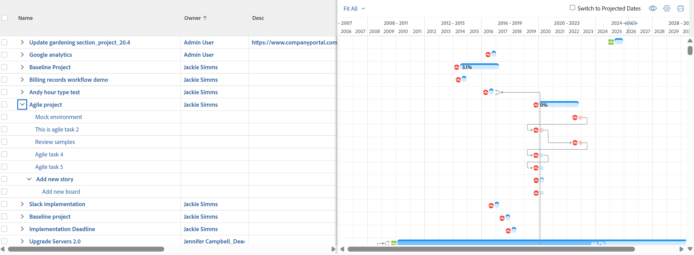
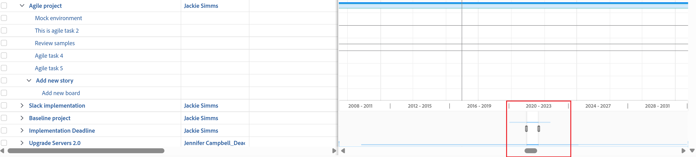

# Visa information i [!UICONTROL Gantt Chart]

Uppgiftslistan [!UICONTROL Gantt Chart] och projektlistan [!UICONTROL Gantt Chart] visar information om projekt och uppgifter.

## Åtkomstkrav

Du måste ha följande för att kunna följa stegen i den här artikeln:

<table style="table-layout:auto"> 
 <col> 
 <col> 
 <tbody> 
  <tr> 
   <td role="rowheader">[!DNL Adobe Workfront] plan*</td> 
   <td> 
Alla 
 </td> 
  </tr> 
  <tr> 
   <td role="rowheader">[!DNL Adobe Workfront] licensöversikt*</td> 
   <td> 
[!UICONTROL Review] eller högre
 </td> 
  </tr> 
  <tr> 
   <td role="rowheader">Konfigurationer på åtkomstnivå*</td> 
   <td> 
[!UICONTROL View] eller högre åtkomst till projekt och uppgifter
 
<b>ANMÄRKNING</b>

Om du fortfarande inte har åtkomst frågar du [!DNL Workfront]-administratören om de anger ytterligare begränsningar för din åtkomstnivå. Mer information om hur en [!DNL Workfront]-administratör kan ändra din åtkomstnivå finns i <a href="../../../administration-and-setup/add-users/configure-and-grant-access/create-modify-access-levels.md" class="MCXref xref">Skapa eller ändra anpassade åtkomstnivåer</a>.
 </td>
</tr> 
  <tr> 
   <td role="rowheader">Objektbehörigheter</td> 
   <td> 
[!UICONTROL View] eller bättre åtkomst till projektet
 
Mer information om hur du begär ytterligare åtkomst finns i <a href="../../../workfront-basics/grant-and-request-access-to-objects/request-access.md" class="MCXref xref">Begär åtkomst till objekt </a>.
 </td> 
  </tr> 
 </tbody> 
</table>

&#42;Kontakta [!DNL Workfront]-administratören om du vill ta reda på vilken plan, licenstyp eller åtkomst du har.

## Hitta [!UICONTROL Gantt Chart]

Du kan hitta både aktivitetslistans Gantt-schema och projektlistan [!UICONTROL Gantt chart] från flera områden i Workfront. Mer information finns i [Kom igång med [!UICONTROL Gantt Chart]](../../../manage-work/gantt-chart/use-the-gantt-chart/get-started-with-gantt.md).

## Visa aktiviteter på [!UICONTROL Critical Path]

I projektlistan [!UICONTROL Gantt Chart] visas uppgifter som inte finns på [!UICONTROL Critical Path] som ljusblå vågräta linjer. Uppgifter som finns på [!UICONTROL Critical Path] i ett projekt visas som röda vågräta linjer.

Mer information om aktiviteter på [!UICONTROL Critical Path] finns i [Översikt över projektet [!UICONTROL Critical Path]](../../../manage-work/tasks/manage-tasks/critical-path.md).

## Visa aktivitetsinformation i projektlistan [!UICONTROL Gantt Chart]

Du kan visa uppgiftsinformation för ett projekt direkt från projektlistan. Uppgifter visas under namnet på varje projekt.

>[!NOTE]
>
>Du kan inte redigera aktiviteter från projektlistan [!UICONTROL Gantt Chart].

Du kan visa uppgiftsinformation för ett projekt direkt från en lista med projekt i följande områden:

* I området [!UICONTROL Projects]
* Inom en Portfolio
* Inom ett program

Så här visar du uppgifter i ett projekt från en lista med projekt:

1. Gå till något av de områden som nämns ovan.

   Klicka till exempel på [!UICONTROL Main Menu] på **[!UICONTROL Projects]**.

   En lista med projekt visas.

1. Klicka på ikonen **[!UICONTROL Gantt chart]**  i skärmens övre högra hörn.

   <!--
   
(NOTE: images conditioned for classic and nwe)  

   -->

1. Klicka på ikonen **[!UICONTROL Show Task List]**.

1. Klicka på listrutepilen bredvid namnet på projektet i projektlistan till vänster om du vill visa uppgifter under det projektet.\
   Detta visar aktivitetsinformation på [!UICONTROL Gantt Chart].\
   

1. (Valfritt) Klicka på ikonen **[!UICONTROL Print]** i det övre högra hörnet för att exportera [!UICONTROL Gantt Chart].

   >[!NOTE]
   >
   >Projektlistan [!UICONTROL Gantt Chart] exporterar endast projekt. Uppgiftsinformation ingår inte.

## Ändra den tidsperiod för vilken information visas i [!UICONTROL Gantt Chart]

Du kan justera tidsperioden som visas på [!UICONTROL Gantt Chart] om du vill visa information på detaljnivå, eller så kan du snabbt navigera till en dag-, vecka-, månad-, kvarts- eller årsvy:

* [Ändra tidsperioden på en detaljnivå](#change-the-time-period-on-a-granular-level)
* [Visa information per dag, vecka, månad, kvartal eller år](#view-information-by-day-week-month-quarter-or-year)

### Ändra tidsperioden på en detaljnivå {#change-the-time-period-on-a-granular-level}

1. Håll pekaren över tidslinjen för [!UICONTROL Gantt Chart] och dra sedan zoomindikatorn från vänster till höger för att utöka eller dra samman tidslinjen.\
   

### Visa information per dag, vecka, månad, kvartal eller år {#view-information-by-day-week-month-quarter-or-year}

1. Klicka på listrutan för tidsbildrutor i [!UICONTROL Gantt Chart].

   

1. Välj en tidsram bland följande tillgängliga alternativ:

   * **[!UICONTROL Fit All]**: Det här alternativet visar tidslinjen för hela projektet.
   * **[!UICONTROL All Projects]**: Det här alternativet är bara tillgängligt i Gantt-schemat för projektlistan.
   * **[!UICONTROL Year]**
   * **[!UICONTROL Quarter]**
   * **[!UICONTROL Month]**
   * **[!UICONTROL Week]**
   * **[!UICONTROL Day]**

1. (Valfritt) Välj en mer detaljerad tidsram, till exempel [!UICONTROL Week] eller [!UICONTROL Day], och klicka och dra den vågräta rullningslisten längst ned i [!UICONTROL Gantt Chart] för att flytta från vänster till höger på tidslinjen i projektet.\
   En ögonblicksbild av [!UICONTROL Gantt] visas för att visa hela projektet.

   >[!TIP]
   >
   >Ögonblicksbilden av tidslinjen visas först när du har klickat på den vågräta rullningslisten.

   

1. (Valfritt) Klicka var som helst inuti ögonblicksbilden av tidslinjen för att navigera till en viss punkt i projektets livslängd.\
   eller\
   Dra handtagen för ögonblicksbildvisningsprogrammet för att markera ett visst tidslinjeintervall och visa det i huvudfönstret [!UICONTROL Gantt].

## Använda filter, vyer och grupperingar

[!UICONTROL Gantt Chart] är en visuell representation av den information som för närvarande visas i uppgiftslistan. Du kan använda filter, vyer och grupperingar på de objekt som listas i båda [!UICONTROL Gantt Chart].

>[!CAUTION]
>
>Du kan inte använda filter, vyer och grupperingar när du väljer [!UICONTROL Manual] Spara [!UICONTROL Timeline Planning] för att spara ändringar i uppgiftslistan. Mer information om hur du sparar ändringar i uppgifter i en lista finns i [Redigera uppgifter i en lista](../../../manage-work/tasks/manage-tasks/edit-tasks-in-a-list.md).

Filter och grupperingar som du tillämpar på listan återspeglas både i projektlistan och i uppgiftslistan [!UICONTROL Gantt Chart] och inkluderas även när Gantt-scheman exporteras:

* Filter\
   Du kan använda ett filter på listan för att styra informationen som visas i [!UICONTROL Gantt Chart].\
   Mer information om hur du använder ett filter finns i [Översikt över filter](../../../reports-and-dashboards/reports/reporting-elements/filters-overview.md).

* Grupperingar\
   Grupperingar som du tillämpar på listan återspeglas på [!UICONTROL Gantt Chart].\
   Mer information om hur du använder en gruppering finns i [Översikt över grupperingar i Adobe Workfront](../../../reports-and-dashboards/reports/reporting-elements/groupings-overview.md).

Vyer visas inte på [!UICONTROL Gantt Chart]. När du exporterar [!UICONTROL Gantt Chart] (enligt beskrivningen i [&#x200B; Exportera [!UICONTROL Gantt Chart] till PDF](../../../manage-work/gantt-chart/use-the-gantt-chart/export-gantt-chart-to-pdf.md)) exporteras uppgiftslistan förutom [!UICONTROL Gantt chart], med den aktuella vyn tillämpad på listan.

## Konfigurera visningsalternativ

Du kan välja vilken typ av information som ska visas i båda [!UICONTROL Gantt charts]. Mer information finns i [Konfigurera hur information visas på [!UICONTROL Gantt Chart]](../../../manage-work/gantt-chart/use-the-gantt-chart/configure-info-on-gantt-chart.md).
