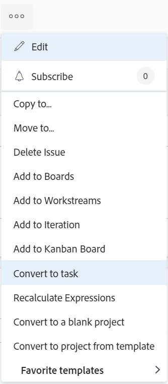

# Konvertera ett problem till en uppgift i Adobe Workfront

Om du måste göra mer för att slutföra ett problem efter att utgåvan har skickats kan du konvertera utgåvan till en uppgift.

Allmän information om hur du konverterar problem finns i [Översikt över konverteringsproblem i Adobe Workfront](../../../manage-work/issues/convert-issues/convert-issues.md).

## Åtkomstkrav

Du måste ha följande åtkomst för att kunna utföra stegen i den här artikeln:

<table style="table-layout:auto"> 
 <col> 
 <col> 
 <tbody> 
  <tr> 
   <td role="rowheader">Adobe Workfront-plan*</td> 
   <td> 
Alla
 </td> 
  </tr> 
  <tr> 
   <td role="rowheader">Adobe Workfront-licens*</td> 
   <td> 
Arbeta eller högre
 </td> 
  </tr> 
  <tr> 
   <td role="rowheader">Konfigurationer på åtkomstnivå*</td> 
   <td> 
Redigera åtkomst till problem, uppgifter och projekt
 
Obs! Om du fortfarande inte har åtkomst frågar du Workfront-administratören om de anger ytterligare begränsningar för din åtkomstnivå. Information om hur en Workfront-administratör kan ändra åtkomstnivån finns i <a href="../../../administration-and-setup/add-users/configure-and-grant-access/create-modify-access-levels.md" class="MCXref xref">Skapa eller ändra anpassade åtkomstnivåer</a>.
 </td> 
  </tr> 
  <tr> 
   <td role="rowheader">Objektbehörigheter</td> 
   <td> 
Visa behörigheter för utgåvan
 
Contribute-behörigheter till projektet
 
Du får behörigheten Hantera för uppgiften när problemet har konverterats
 
Mer information om hur du begär ytterligare åtkomst finns i <a href="../../../workfront-basics/grant-and-request-access-to-objects/request-access.md" class="MCXref xref">Begär åtkomst till objekt </a>.
 </td> 
  </tr> 
 </tbody> 
</table>

*Kontakta Workfront-administratören om du vill veta vilken plan, licenstyp eller åtkomst du har.

## Konvertera ett problem till en uppgift

1. Gå till ett projekt och klicka på [!UICONTROL **Problem** ] i den vänstra panelen.
1. Klicka på det problem du vill konvertera för att gå till problemets startsida.
1. Klicka på [!UICONTROL **Mer**] -menyn på problemet och sedan [!UICONTROL **Konvertera till aktivitet**].

   

   >[!TIP]
   >
   >Om problemet är kopplat till en godkännandeprocess eller om det redan är kopplat till ett objekt som åtgärdar problemet visas en varning högst upp i Workfront [!UICONTROL Convert to Project] för att meddela dig att godkännandet har tagits bort eller att det matchande objektet har skrivits över under konverteringen. Mer information finns i [Översikt över konverteringsproblem i Adobe Workfront](../../../manage-work/issues/convert-issues/convert-issues.md).

1. Uppdatera aktivitetsnamnet i [!UICONTROL Task Name] -avsnitt. Som standard får aktiviteten samma namn som den ursprungliga utgåvan.

   

1. Klicka [!UICONTROL **Målprojekt**] börjar du sedan skriva namnet på projektet där du vill placera den nya uppgiften i [!UICONTROL **Målprojekt**] och markera det när det visas i listan. Utgåvans projekt är valt som standard.

1. Klicka [!UICONTROL **Översikt**] skriver du en [!UICONTROL **Beskrivning**] för uppgiften.

   >[!TIP]
   >
   >   En system- eller gruppadministratör kan ändra ordningen på avsnitten i den vänstra panelen i konverteringsrutan genom att ändra layoutmallen.

1. (Valfritt och villkorligt) Klicka på [!UICONTROL **Alternativ**] väljer du något av alternativen nedan.

   Workfront-administratören eller gruppadministratören måste aktivera de här inställningarna innan de visas vid konverteringen av problem:

   * [!UICONTROL **Behåll det ursprungliga problemet och knyt lösningen till den här uppgiften**]

      Om du inte markerar det här alternativet tas den ursprungliga utgåvan bort.

      >[!NOTE]
      >
      >Användare som saknar åtkomst eller behörighet att ta bort problem kan inte ta bort problemet eftersom de konverterar det, oavsett status för den här inställningen. Mer information om åtkomst och behörigheter till problem finns i:
      >   
      >   * [Bevilja åtkomst till utleveranser](../../../administration-and-setup/add-users/configure-and-grant-access/grant-access-issues.md)
      >   * [Dela ett ärende](../../../workfront-basics/grant-and-request-access-to-objects/share-an-issue.md)

   * [!UICONTROL **Tillåt (användarnamn) åtkomst till den här aktiviteten**]

      Om du inte markerar det här alternativet har problemets primära kontakt ingen åtkomst till den nya aktiviteten.

   * [!UICONTROL **Behåll planerat datum för slutförande av utgåvan**]

      Om alternativet inte är markerat visas [!UICONTROL Planned Completion Date] för den nya aktiviteten beräknas från [!UICONTROL Planned Start Date] för uppgiften. The [!UICONTROL Planned Start Date] för den nya uppgiften anges i enlighet med systeminställningarna för nya uppgifter.

      >[!NOTE]
      >
      >
      >Vilka alternativ som visas här beror på hur Workfront-administratören konfigurerade dem för alla i systemet. Mer information finns i [Konfigurera inställningar för uppgifter och problem i hela systemet](../../../administration-and-setup/set-up-workfront/configure-system-defaults/set-task-issue-preferences.md).
      >
      >Eller, om de översta grupperna i din organisation konfigurerade dem separat, beror alternativen som visas här på vilken grupp som är associerad med projektet som du valde i steg 6. Mer information finns i [Konfigurera inställningar för aktiviteter och utgåvor för en grupp](../../../administration-and-setup/manage-groups/create-and-manage-groups/configure-task-issue-preferences-group.md).

1. (Valfritt) Klicka på [!UICONTROL **Anpassad Forms**] och bifoga ett eget formulär för den nya uppgiften.

   >[!TIP]
   >
   >Om ett anpassat formulär med flera objekt som är kopplat till utgåvan är konfigurerat för användning med både utgåvor och uppgifter bifogas formuläret som standard. All information som sparas i utgivningsformuläret sparas för uppgiften när du gör konverteringen.
   >
   >Om målprojektet har några standardformulär definierade i fältet Standardinställd Forms för uppgifter när projektet redigeras, läggs även dessa uppgiftsformulär till i den nya uppgiften. Alla anpassade fält som är gemensamma mellan den ursprungliga utgåvan och fälten i standardaktivitetsformulären är förifyllda med information från utgivningsfälten.

1. Klicka [!UICONTROL **Konvertera till uppgift**].

   Problemet är nu en uppgift i det angivna projektet om du bestämde dig för att ta bort den ursprungliga utgåvan.

   eller

   Problemet är nu länkat till den nya uppgiften i det projekt du valde, och det slutförs när uppgiften är klar, om du bestämde dig för att behålla det ursprungliga problemet.

   Vissa problemfält överförs till uppgiften. Mer information finns i [Visa ursprunglig probleminformation om projekt och uppgifter](#view-original-issue-information-on-projects-and-tasks) i den här artikeln.

1. (Valfritt) Fortsätt redigera uppgiften efter behov.

## Visa ursprunglig probleminformation om projekt och uppgifter {#view-original-issue-information-on-projects-and-tasks}

Du kan visa den ursprungliga utgivningsinformationen i projekt- och uppgiftslistor och rapporter eller i området Projektinformation. Mer information om hur du skapar rapporter finns i [Skapa en anpassad rapport](../../../reports-and-dashboards/reports/creating-and-managing-reports/create-custom-report.md).

Tabellen nedan visar vilka problemfält som visas i de konverterade projekten och uppgifterna.

| Ärendefält | Projekt eller aktivitetsfält | Projektlista eller rapport | Området Projektinformation | Uppgiftslista eller rapport | Området Uppgiftsinformation |
|---|---|---|---|---|---|
| [!UICONTROL Issue Name] | [!UICONTROL Converted Issue Name] | ✔ | ✔ | ✔ | ✔ |
| [!UICONTROL Primary Contact] | [!UICONTROL Converted Issue Originator Name] | ✔ | ✔ | ✔ |
| [!UICONTROL Entry Date] | [!UICONTROL Converted Issue Entry Date] | ✔ |  | ✔ |

>[!CAUTION]
>
>Om [!UICONTROL Primary Contact] om ett problem ändras eller om problemet inte längre är kopplat till projektet eller uppgiften efter att problemet har konverterats, [!UICONTROL Converted Issue Originator Name ]uppdateras inte och originalet visas [!UICONTROL Primary Contact] av problemet vid tidpunkten då emissionen konverterades.
