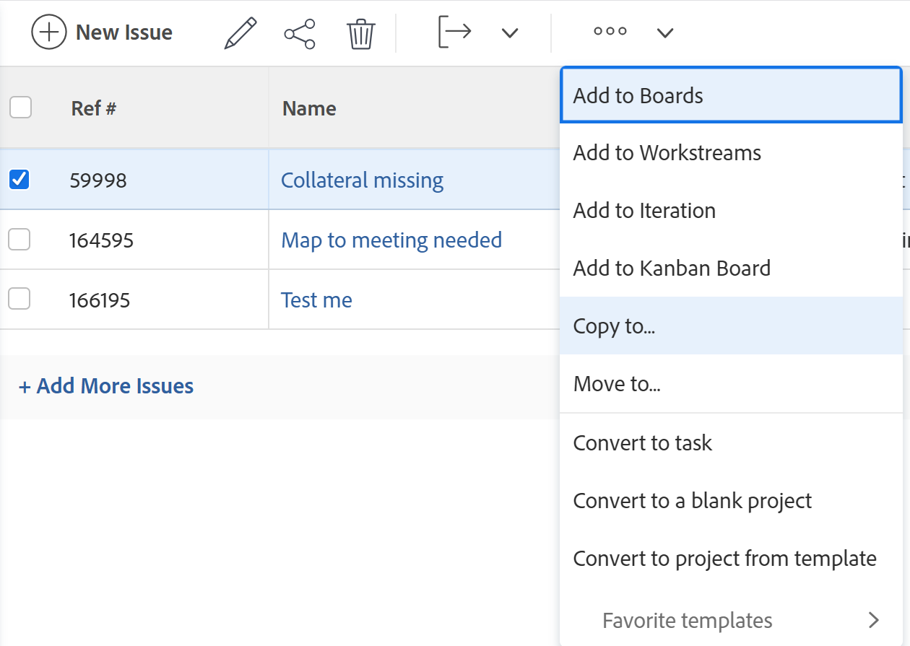

# Kopiera problem

Du kan kopiera en utgåva eller en förfrågan och spara dem i samma eller ett annat projekt. Du kan även kopiera ett ärende från en aktivitet till ett annat projekt.

Du kan kopiera utgåvor från följande objekt:

* Från ett projekt till samma projekt (duplicera det i samma projekt)
* Från en uppgift till samma uppgift (dubblett om samma uppgift används)
* Från ett projekt till ett annat projekt
* Från en uppgift till ett projekt

>[!TIP]
>
>&quot;Issues&quot; och &quot;requests&quot; används utan åtskillnad i Workfront. Du kan registrera problem i både projekt och uppgifter för att indikera oförutsedda arbeten som behöver åtgärdas. Du kan också skicka in begäranden som spelas in som utleveranser i ett projekt som har angetts som en frågekö.

## Åtkomstkrav

Du måste ha följande åtkomst för att kunna utföra stegen i den här artikeln:

<table style="table-layout:auto"> 
 <col> 
 <col> 
 <tbody> 
  <tr> 
   <td role="rowheader">Adobe Workfront-plan*</td> 
   <td> 
Alla
 </td> 
  </tr> 
  <tr> 
   <td role="rowheader">Adobe Workfront-licens*</td> 
   <td> 
Begäran eller senare
 
Granska eller högre licens för att kopiera ett problem i avsnittet Problem i ett projekt.
 </td> 
  </tr> 
  <tr> 
   <td role="rowheader">Åtkomstnivå*</td> 
   <td> 
Redigera åtkomst till problem
 
Visa eller öka åtkomsten till projekt och uppgifter
 
Obs! Om du fortfarande inte har åtkomst frågar du Workfront-administratören om de anger ytterligare begränsningar för din åtkomstnivå. Mer information om åtkomst till problem på din åtkomstnivå finns i <a href="../../../administration-and-setup/add-users/configure-and-grant-access/grant-access-issues.md" class="MCXref xref">Bevilja åtkomst till utleveranser</a>. Information om hur en Workfront-administratör kan ändra åtkomstnivån finns i <a href="../../../administration-and-setup/add-users/configure-and-grant-access/create-modify-access-levels.md" class="MCXref xref">Skapa eller ändra anpassade åtkomstnivåer</a>. 
 </td> 
  </tr> 
  <tr> 
   <td role="rowheader">Objektbehörigheter</td> 
   <td> 
Hantera behörigheter för problemet
 
Contribute-behörigheter för det objekt du kopierar problemet till med möjligheten att lägga till problem.
 
 Information om hur du beviljar behörigheter för problem finns i <a href="../../../workfront-basics/grant-and-request-access-to-objects/share-an-issue.md" class="MCXref xref">Dela ett ärende </a>
 
Mer information om hur du begär ytterligare behörigheter finns i <a href="../../../workfront-basics/grant-and-request-access-to-objects/request-access.md" class="MCXref xref">Begär åtkomst till objekt </a>.
 </td> 
  </tr> 
 </tbody> 
</table>

&#42;Kontakta Workfront-administratören om du vill veta vilken plan, licenstyp eller åtkomst du har.

## Att tänka på vid problem som är kopplade till dokument eller begärandeköer

Tänk på följande när du kopierar problem som innehåller dokument eller är kopplade till en begärandekö:

* **När ett problem är kopplat till en begärandekö:** När du kopierar en utgåva till ett annat objekt och utgåvan är kopplad till en begärandekö, är den kopierade utgåvan inte längre kopplad till den ursprungliga kön som den första utgåvan kom från.
* **När ett dokument bifogas till utgåvan:** När du kopierar en utgåva till ett annat objekt och utgåvan har ett bifogat dokument, flyttas även dokumentet och dess versioner till den nya utgåvan. Eventuella korrektur eller godkännanden som är kopplade till dokumentet flyttas inte.
* **När ett problem är länkat till ett dokument eller en mapp:** När du kopierar ett ärende som har dokument eller mappar länkade till en tredjepartstjänst som Google Drive, överförs länkarna till dokumenten till den kopierade utgåvan. 

## Kopiera utgåvor i en lista

Du kan kopiera en eller flera utgåvor från en lista med utgåvor eller från en problemrapport.

1. Gå till projektet som innehåller problemet eller problemen som du vill kopiera.

   eller

   Gå till en problemrapport.

1. Om du valde att gå till ett projekt klickar du på **Problem** i den vänstra panelen.
1. Markera det eller de problem som du vill kopiera och klicka på **Menyn Mer** överst i problemlistan klickar du på **Kopiera till**.

   

1. Fortsätt med att kopiera problemet, enligt beskrivningen i avsnittet [Kopiera en utgåva](#copy-a-single-issue) med början från steg 2.

   <!--
   <MadCap:conditionalText data-mc-conditions="QuicksilverOrClassic.Draft mode">
   (NOTE:&nbsp;ensure step number stays accurate)
   </MadCap:conditionalText>
   -->

## Kopiera en utgåva {#copy-a-single-issue}

Du kan kopiera en utgåva när du visar den.

1. Gå till en utgåva som du vill kopiera och klicka sedan på **Mer** meny  till höger om problemets namn, och **Kopiera** till.

   

   The **Kopiera problem** visas.

   

1. I **Välj målprojekt** anger du namnet på det projekt där du vill kopiera problemen. Namnet på det aktuella projektet visas som standard.

   >[!TIP]
   >
   >Endast 100 projekt visas i listan.

1. (Villkorligt) Klicka **begära åtkomst** om du inte har tillgång till kopieringsutgåvor av projektet.
1. (Villkorligt) Fortsätt att kopiera utgåvan till det valda målprojektet utan att begära åtkomst om du har tillgång till att lägga till utgåvor till någon av åtgärderna i målprojektet.

   

   >[!TIP]
   >
   >Liknande meddelanden visas om det valda projektet väntar på godkännande, är slutfört eller är inaktivt, när Workfront-administratören förhindrar att det uppstår problem i dessa projekt. Mer information finns i [Konfigurera systemomfattande projektinställningar](../../../administration-and-setup/set-up-workfront/configure-system-defaults/set-project-preferences.md).

1. (Valfritt) I dialogrutan **Alternativ** avmarkerar du något av objekten i tabellen nedan för att ta bort dem från den nya utgåvan. Alla alternativ är markerade som standard.

   >[!NOTE]
   Detta påverkar bara de kopierade utgåvorna och inte de ursprungliga utgåvorna.

   <table style="table-layout:auto"> 
    <col> 
    <col> 
    <tbody> 
     <tr> 
      <td role="rowheader">Uppdrag</td> 
      <td>Tar bort användare, jobbroller eller team som är tilldelade till problemet.</td> 
     </tr> 
     <tr> 
      <td role="rowheader">Förlopp</td> 
      <td>Tar bort procent slutfört, om någon, av utgåvan. </td> 
     </tr> 
     <tr> 
      <td role="rowheader">Dokument</td> 
      <td>Tar bort allt på dokumentfliken, inklusive dokumentversioner, länkade dokument och mappar.  Som standard kan dokumentkorrektur och godkännanden inte kopieras till en annan utgåva.</td> 
     </tr> 
     <tr> 
      <td role="rowheader">Behörigheter</td> 
      <td>Tar bort de entiteter som utgåvan delas med. </td> 
     </tr> 
     <tr> 
      <td role="rowheader">Uppdateringar</td> 
      <td>Tar bort kommentarer från uppdateringsavsnittet för problemet.</td> 
     </tr> 
     <tr> 
      <td role="rowheader">Anpassade data</td> 
      <td>Tar bort informationen från det anpassade formuläret i frågan, samt informationen om anpassade formulär som är kopplade till dokument som är kopplade till problemet, om de också kopieras med problemet. De anpassade formulären förblir kopplade till problemen och dokumenten, men informationen i formulären kommer inte att överföras till den nya utgåvan. </td> 
     </tr> 
    </tbody> 
   </table>

1. (Valfritt) I dialogrutan **Välj uppgift** väljer du den uppgift där du vill flytta problemet.
1. Klicka **Kopiera utgåva** eller **Kopiera problem** om du har valt flera utgåvor i en lista.

   De kopierade utgåvorna läggs till i det angivna projektet.

 
