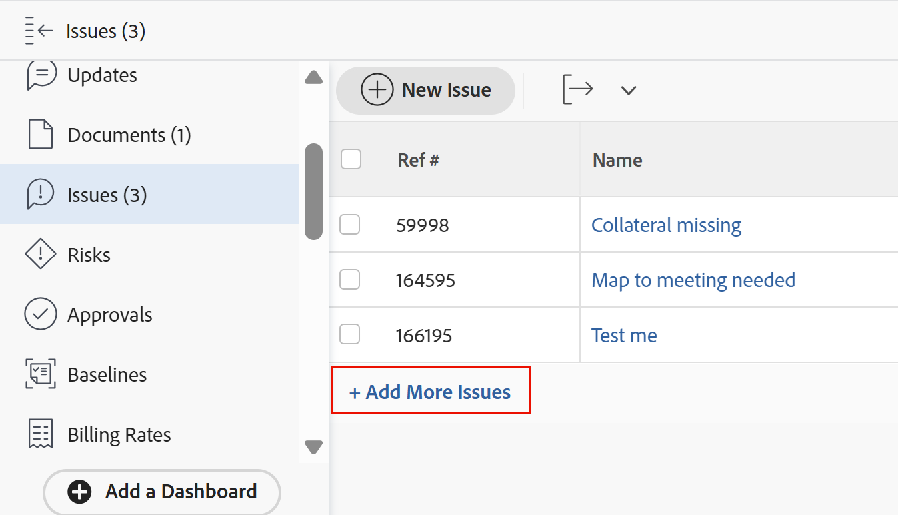

# Skapa problem

<!--Audited: 08/2025-->

<!--

The highlighted information on this page refers to functionality not yet generally available. It is available only in the Preview environment for all customers. After the monthly releases to Production, the same features are also available in the Production environment for customers who enabled fast releases. 

For information about fast releases, see [Enable or disable fast releases for your organization](../../../administration-and-setup/set-up-workfront/configure-system-defaults/enable-fast-release-process.md).  

For information about the current release, see [Fourth Quarter 2023 release overview](../../../product-announcements/product-releases/23-q4-release-activity/23-q4-release-overview.md).  

-->

När du arbetar med ett projekt kanske du upptäcker att oväntade händelser inträffar. Du kan logga oväntade händelser som problem för ett visst projekt eller en uppgift. Användare med lämplig åtkomst kan visa och övervaka status för problem allt eftersom projektet eller aktiviteten fortskrider till slutförandet, vilket eliminerar behovet av långa e-postkedjor eller statusmöten. Till skillnad från planerade aktiviteter representerar ärenden oplanerade arbetsuppgifter i Adobe Workfront.

Du kan även lägga till problem i projekt som begäranden. Mer information finns i [Skapa och skicka Adobe Workfront-begäranden](../../../manage-work/requests/create-requests/create-submit-requests.md).

>[!TIP]
>
>Problem och förfrågningar används utan åtskillnad i Workfront. Du kan registrera problem i både projekt och uppgifter för att indikera oförutsedda arbeten som behöver åtgärdas. Du kan också skicka in begäranden som spelas in som utleveranser i ett projekt som har angetts som en frågekö.

## Åtkomstkrav

+++ Expandera om du vill visa åtkomstkrav för funktionerna i den här artikeln.

<table style="table-layout:auto"> 
 <col> 
 <col> 
 <tbody> 
  <tr> 
   <td role="rowheader">Adobe Workfront package</td> 
   <td> 
Alla
 </td> 
  </tr> 
  <tr> 
   <td role="rowheader">Adobe Workfront-licens</td> 
   <td>
   <ul><li>Medarbetare eller högre</li>
   <li>Ljus eller högre för att redigera problem i avsnittet Problem i en uppgift eller ett projekt</li></ul>
   eller
   <ul><li>Begäran eller senare</li> <li>Granska eller högre för att redigera problem i avsnittet Problem i en uppgift eller ett projekt</li></ul> </td> 
  </tr> 
  <tr> 
   <td role="rowheader">Konfigurationer på åtkomstnivå</td> 
   <td> 
Redigera åtkomst till problem
 
Visa eller öka åtkomsten till projekt och uppgifter
 </td> 
  </tr> 
  <tr> 
   <td role="rowheader">Objektbehörigheter</td> 
   <td> 
Contribute eller högre behörigheter med möjlighet att lägga till problem i den uppgift eller det projekt där du skapade problemet
 </td> 
  </tr> 
 </tbody> 
</table>

*Mer information finns i [Åtkomstkrav i Workfront-dokumentation](/help/quicksilver/administration-and-setup/add-users/access-levels-and-object-permissions/access-level-requirements-in-documentation.md).

+++

<!--Old:

<table style="table-layout:auto"> 
 <col> 
 <col> 
 <tbody> 
  <tr> 
   <td role="rowheader">Adobe Workfront plan</td> 
   <td> 
Any
 </td> 
  </tr> 
  <tr> 
   <td role="rowheader">Adobe Workfront license*</td> 
   <td> 
New license:

   <ul><li>Contributor or higher</li>
   <li>Light or higher to edit issues in the Issues section of a task or project</li></ul>
   
Current license:

  <ul><li>Request or higher</li> <li>Review or higher to edit issues in the Issues section of a task or a project</li></ul> </td> 
  </tr> 
  <tr> 
   <td role="rowheader">Access level configurations</td> 
   <td> 
Edit access to Issues
 
View or higher access to Projects and Tasks
 </td> 
  </tr> 
  <tr> 
   <td role="rowheader">Object permissions</td> 
   <td> 
Contribute or higher permissions with ability to Add Issues to the task or project where you create the issue
 </td> 
  </tr> 
 </tbody> 
</table>

*For information, see [Access requirements in Workfront documentation](/help/quicksilver/administration-and-setup/add-users/access-levels-and-object-permissions/access-level-requirements-in-documentation.md). -->

<!--
(NOTE: in NWE Requestors CAN see the Issues tab on a project but in classic they cannot! However, even when they DO see it, they cannot enter the issues - logged this issue for it but they might decide not to fix it: https://hub.workfront.com/issue/60181e28000058980cce29597185b2d6/updates?email-source=comm)

-->

## Begränsningar för att skapa problem

När du har rätt behörighet och behörighet kan du skapa problem i ett projekt eller en uppgift. I följande fall kanske du inte kan skapa problem:

* Din Workfront-administratör eller en gruppadministratör måste aktivera tillägg av problem i ett projekt som har statusen Fullständigt eller Dölj i området Projektinställningar. Mer information om hur du anger projektinställningar finns i [Konfigurera systemomfattande projektinställningar](../../../administration-and-setup/set-up-workfront/configure-system-defaults/set-project-preferences.md).
* Du kan inte lägga till utgåvor i ett projekt som väntar på godkännande.

## Förbered formuläret för nytt problem

Organisationen bör ha en väldefinierad process för när och hur ett problem ska registreras. När du konfigurerar den här processen är det första steget att skapa det formulär som behövs för att skicka in ett ärende.

Användare kan lägga till problem i ett projekt på följande sätt:

* Lägg till dem direkt i uppgifter och projekt.
* Skicka dem till en begärandekö.

Formuläret Nytt problem kan innehålla viktig information som kan vara till hjälp när du snabbt vill lösa problemet.

Du kan konfigurera formuläret Nytt problem så att det innehåller följande information när användare lägger till problem i projektet eller dess uppgifter:

* Anpassade fält
* Godkännanden
* Uppdrag (hanteringsregler)

Fälten för nya utgåvor eller förfrågningar definieras i avsnittet Köinformation i projektet där problemen loggas.

Mer information om hur du konfigurerar avsnittet Köinformation i projektet finns i [Skapa en frågekö](../../../manage-work/requests/create-and-manage-request-queues/create-request-queue.md).

Mer information om hur du skapar problem genom att skicka dem till en begärandekö finns i avsnittet [Skapa problem genom att ange en ny begäran](#create-issues-by-entering-a-new-request) i den här artikeln.

## Skapa problem i en uppgift eller ett projekt med knappen Nytt problem

När du har definierat fälten för ett nytt utgivningsformulär i ditt projekt kan du börja skapa problem.

Så här skapar du ett problem för en aktivitet eller ett projekt:

1. Gå till ett projekt där du vill skapa problemet.
1. (Valfritt) Om du vill logga problemet för en aktivitet går du till området **Åtgärder** och klickar sedan på namnet på en aktivitet.
1. Klicka på avsnittet **Problem**.

   Listan med projektproblem visas

1. Klicka på **Nytt problem** högst upp i listan över utgåvor.
Rutan Nytt problem visas.

   

1. (Villkorligt) Om den som skapat projektet har skapat köämnen eller ämnesgrupper i projektet läggs de till i det nya utgivningsformuläret. Ange **ämnesgruppen** eller **köämnet** för det nya problemet. Ämnesgrupper och Köämnen har namn som är anpassade efter din miljö.\
   Mer information om hur du skapar ämnesgrupper finns i [Skapa ämnesgrupper](../../../manage-work/requests/create-and-manage-request-queues/create-topic-groups.md). Mer information om hur du skapar köämnen finns i [Skapa köämnen](../../../manage-work/requests/create-and-manage-request-queues/create-queue-topics.md).

   * Om det bara finns ett köämne i projektet visas det automatiskt.
   * Om ämnesgruppen inte har några köämnen eller ämnesgrupper under sig är ingenting tillgängligt i listrutan Ämnesgrupp.

1. Lägg till problemnamnet i fältet **Ämne** och lägg sedan till en **Beskrivning**.

1. (Villkorligt) Om den som skapat projektet tillåter att fältet **Typ av begäran** visas i formuläret Nytt problem, väljer du typ av problem bland följande alternativ:

   * Felrapport
   * Ändra ordning
   * Problem
   * Begäran\
     Beroende på hur din Workfront-administratör har konfigurerat dina projektinställningar kan det finnas olika namn på problemtyperna.

   >[!TIP]
   >
   >Begärandetyperna måste vara aktiverade i köinformationen och även när du skapar ett köämne som ska visas som ett val i formuläret Nytt problem. Mer information finns i följande artiklar:
   >* [Skapa en begärandekö](../../requests/create-and-manage-request-queues/create-request-queue.md)
   >  * [Skapa köämnen](../../requests/create-and-manage-request-queues/create-queue-topics.md)

1. Fortsätt att ange fälten som är tillgängliga i formuläret **Ny utgåva**. Mer information om de fält som är tillgängliga när du anger ett nytt problem finns i [Redigera problem](../../../manage-work/issues/manage-issues/edit-issues.md).

   >[!IMPORTANT]
   >
   >Alla problemrelaterade fält är inte tillgängliga i formuläret Ny utgåva. Den som skapar projektet aktiverar de fält som är tillgängliga när ett problem skapas när de definierar området Köinformation i projektet. Mer information finns i [Skapa en begärandekö](../../requests/create-and-manage-request-queues/create-request-queue.md).

1. (Villkorligt) Om köämnen är kopplade till ett anpassat formulär visas det anpassade formuläret i formuläret **Nytt problem**.\
   eller\
   Om projektet är kopplat till ett anpassat formulär via området Köinformation, visas formuläret i formuläret **Nytt problem**, efter Workfront standardfält.

   Mer information finns i [Skapa en frågekö](../../../manage-work/requests/create-and-manage-request-queues/create-request-queue.md).

1. Klicka på **Skicka**.

   Problem kan tilldelas flera användare, jobbroller eller ett team. Mer information om hur du tilldelar och hanterar begäranden finns i [Hantera arbets- och teamförfrågningar](../../../people-teams-and-groups/work-with-team-requests/manage-work-and-team-requests.md).

## Skapa ärenden för en aktivitet eller ett projekt

>[!IMPORTANT]
>
>Projektägaren måste aktivera **Tillåt användare att lägga till interna utgåvor** när de definierar utgåvinställningar för projektet innan du kan lägga till utgåvor i projektet eller aktiviteterna. Mer information om hur du konfigurerar probleminställningar för ett projekt finns i [Redigera projekt](../../../manage-work/projects/manage-projects/edit-projects.md).
>

När du snabbt vill lägga till flera problem kan du skapa problem för en uppgift eller ett projekt genom att lägga till dem i en lista med problem.

>[!NOTE]
>
>När du lägger till fel i dokumentet använder Workfront inte formuläret Nytt problem för de nya utgåvorna. Vi rekommenderar inte att du infogar fel om du vill att användarna ska ange viss information när de anger problem. Detta kan ha en negativ inverkan på problemrapporteringen och senare på möjligheten för användaren som är tilldelad problemet att ha all information som krävs för att lösa problemet.

Så här skapar du interna utgåvor:

1. Gå till ett projekt där du vill skapa problemet.
1. (Valfritt) Om du vill logga problemet för en aktivitet går du till avsnittet **Åtgärder** och klickar sedan på namnet på en aktivitet.
1. Klicka på avsnittet **Problem** i den vänstra panelen.
1. Klicka på **Lägg till fler problem** längst ned i listan med utgåvor.

   En ny rad skapas i listan med problem i avsnittet Problem.

   >[!TIP]
   >
   >Det här alternativet är nedtonat om inställningen Tillåt användare att lägga till interna utgåvor är avmarkerad i rutan Redigera projekt. Mer information finns i [Redigera projekt](../../../manage-work/projects/manage-projects/edit-projects.md).

   

1. Börja skriva namnet på problemet i fältet Namn och fortsätt sedan att lägga till mer information om problemet.

   >[!TIP]
   >
   >De fält som är tillgängliga för redigering online är tillgängliga i den vy du använder i din problemlista. Du kanske inte kan redigera följande typer av fält:
   >   
   >* Fält som tillhör ett annat objekt
   >* Fält som du inte har behörighet att redigera
   >* Fält som är beräkningar och som uppdateras automatiskt av Workfront

1. Klicka på Retur för att slutföra den infogade redigeringen och lägga till problemet i projektet eller uppgiften.

## Skapa problem genom att ange en ny begäran {#create-issues-by-entering-a-new-request}

Du kan ange projekt som mottagare för att ta emot ärenden. Den här typen av projekt kallas frågeköer i Workfront. Du kan öppna Begärandeköer från området Förfrågningar på huvudmenyn.

>[!TIP]
>
>Termerna&quot;issue&quot; och&quot;request&quot; är utbytbara i Workfront.

Mer information om hur du konfigurerar projekt som frågeköer för att ta emot problem finns i [Skapa en frågekö](../../../manage-work/requests/create-and-manage-request-queues/create-request-queue.md). Mer information om hur du skickar begäranden finns i [Skapa och skicka Adobe Workfront-begäranden](../../../manage-work/requests/create-requests/create-submit-requests.md).
