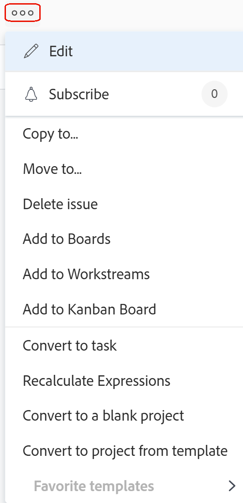

# Ta bort problem

<!--Audited: 01/2024-->

Du kan ta bort problem eller förfrågningar i Adobe Workfront om du har rätt behörighet att göra det.

>[!TIP]
>
>&quot;Issues&quot; och &quot;requests&quot; används utan åtskillnad i Workfront. Du kan registrera problem i både projekt och uppgifter för att indikera oförutsedda arbeten som behöver åtgärdas. Du kan också skicka in begäranden som spelas in som utleveranser i ett projekt som har angetts som en frågekö.

## Åtkomstkrav

Du måste ha följande åtkomst för att kunna utföra stegen i den här artikeln:

<table style="table-layout:auto"> 
 <col> 
 <col> 
 <tbody> 
  <tr> 
   <td role="rowheader">Adobe Workfront</td> 
   <td> 
Alla
 </td> 
  </tr> 
  <tr> 
   <td role="rowheader">Adobe Workfront-licens*</td> 
   <td> 
Nytt: Medarbetare eller högre

   
Aktuell: Begäran eller senare

 </td> 
  </tr> 
  <tr> 
   <td role="rowheader">Åtkomstnivåkonfiguration</td> 
   <td> 
Redigera åtkomst till problem
 
Visa eller öka åtkomsten till projekt och uppgifter
  
Mer information om åtkomst till problem på din åtkomstnivå finns i <a href="../../../administration-and-setup/add-users/configure-and-grant-access/grant-access-issues.md" class="MCXref xref">Bevilja åtkomst till utleveranser</a>.  
 </td> 
  </tr> 
  <tr> 
   <td role="rowheader">Objektbehörigheter</td> 
   <td> 
Hantera behörigheter för problemet
 
Contribute eller högre behörighet för projektet eller aktiviteten
 
 Information om hur du beviljar behörigheter för problem finns i <a href="../../../workfront-basics/grant-and-request-access-to-objects/share-an-issue.md" class="MCXref xref">Dela ett ärende </a>
 </td> 
  </tr> 
 </tbody> 
</table>

&#42;Kontakta Workfront-administratören om du vill veta vilken plan, licenstyp eller åtkomst du har. Mer information om åtkomstkrav finns i [Åtkomstkrav i Workfront-dokumentation](/help/quicksilver/administration-and-setup/add-users/access-levels-and-object-permissions/access-level-requirements-in-documentation.md).

## Att tänka på när du tar bort problem

* Din Workfront-administratör eller en gruppadministratör måste aktivera borttagning av problem i ett projekt som har statusen Fullständigt i området Projektinställningar. Mer information om hur du ställer in projektinställningar finns i [Konfigurera systemomfattande projektinställningar](../../../administration-and-setup/set-up-workfront/configure-system-defaults/set-project-preferences.md).

* Om problemet har loggat timmar måste Workfront-administratören eller en gruppadministratör tillåta att dessa problem tas bort genom att konfigurera inställningarna för Aktivitet och problem i din Workfront-instans. Detta gäller också när du försöker ta bort projekt som har problem med timmar inloggade.

  <!--
  <MadCap:conditionalText data-mc-conditions="QuicksilverOrClassic.Draft mode">
  (this is not possible in classic)
  </MadCap:conditionalText>
  -->

  Mer information om hur du aktiverar borttagning av problem där timmar är loggade finns i avsnittet Borttagning i [Konfigurera inställningar för uppgifter och problem i hela systemet](../../../administration-and-setup/set-up-workfront/configure-system-defaults/set-task-issue-preferences.md).

## Effekten av att ta bort problem

När du tar bort ett problem påverkas andra objekt som är länkade till problemet.

Följande objekt som är kopplade till ett problem tas också bort när du tar bort ett problem:

* Dokument

  Du kan inte ta bort en utgåva som har ett dokument som har checkats ut bifogat. Mer information om utcheckning av dokument finns i [Checka ut dokument](../../../documents/managing-documents/check-out-documents.md).

* Anteckningar
* Godkännanden

Beroende på hur din Workfront- eller gruppadministratör konfigurerar inställningarna för Projekt, Uppgift eller Frågeborttagning i dialogrutan **Inställningar för tidrapport och timme** I Workfront-instansen hanteras timmar som har loggats för problemen på något av följande sätt när du tar bort ett problem:

* Gå över till projektet och återställs inte om problemet återställs senare.
* tas bort och återställs om problemet återställs senare.

  Detta gäller också när du försöker ta bort projekt som har uppgifter som har loggats in i timmar.

  <!--
  <MadCap:conditionalText data-mc-conditions="QuicksilverOrClassic.Draft mode">
  (this is not possible in classic)
  </MadCap:conditionalText>
  -->

  Mer information om hur du konfigurerar raderingsinställningarna för timmar som är inloggade finns i [Konfigurera tidrapport och timinställningar](../../../administration-and-setup/set-up-workfront/configure-timesheets-schedules/timesheet-and-hour-preferences.md).

* De användare som är tilldelade utgåvan eller godkännandet av utgåvan blir kvar i projektteamet.\
  Mer information om projektteam finns i [Översikt över projektgruppen](../../../manage-work/projects/planning-a-project/project-team-overview.md).

## Ta bort problem

* [Ta bort flera problem i ett projekt samtidigt](#delete-multiple-issues-in-a-project-simultaneously)
* [Ta bort en enstaka utgåva](#delete-a-single-issue)

### Ta bort flera problem i ett projekt samtidigt  {#delete-multiple-issues-in-a-project-simultaneously}

1. Gå till **Huvudmeny**.
1. Klicka **Projekt**.
1. Klicka på projektnamnet som innehåller de problem som du vill ta bort.
1. Klicka **Problem** till vänster.
1. Välj ett problem och klicka sedan på **Ta bort** icon  högst upp i listan.

1. Om borttagning tillåts klickar du på **Ja, ta bort den**.\
   Din Workfront-administratör kanske inte tillåter borttagning av problem där timmar är loggade.\
   Mer information om åtkomst och behörigheter som krävs för att ta bort ett problem finns i [Ta bort problem](#access-and-permissions-needed).

### Ta bort en enstaka utgåva {#delete-a-single-issue}

{{step1-to-projects}}

1. Klicka på projektnamnet som innehåller problemet som du vill ta bort.
1. Klicka **Problem** till vänster.

   

1. Klicka på namnet på det problem som du vill ta bort.
1. Klicka på **Mer** till höger om problemets namn.

   

1. Klicka **Ta bort problem**.
1. Om borttagning tillåts klickar du på **Ja, ta bort den**.

   Din Workfront-administratör kanske inte tillåter borttagning av problem där timmar är loggade.\
   Mer information om åtkomst och behörigheter som krävs för att ta bort ett problem finns i [Ta bort problem](#access-and-permissions-needed).

## Återställ borttagna problem

En Workfront- eller gruppadministratör kan återställa problem inom 30 dagar efter att de har tagits bort. Mer information om hur du återställer objekt i Workfront finns i [Återställ borttagna objekt](../../../administration-and-setup/manage-workfront/manage-deleted-items/restore-deleted-items.md).
