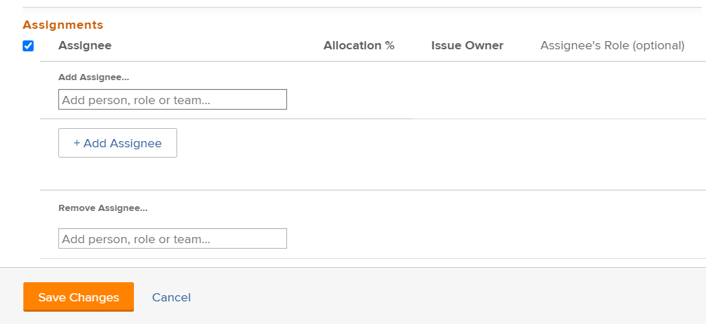

# Ändra användartilldelningar för flera utgåvor i en lista

<!--

(NOTE: similar article exists for tasks)

-->

Du kan ändra användartilldelningar samtidigt till flera utgåvor. Mer information om hur du redigerar problem eller tilldelar dem en åt gången finns i följande artiklar:

* [Redigera problem](../../../manage-work/issues/manage-issues/edit-issues.md)
* [Tilldela ärenden](../../../manage-work/issues/manage-issues/assign-issues.md)

Allmän information om hur du tilldelar problem finns i [Översikt över hur du ändrar problemtilldelningar](../../../manage-work/issues/manage-issues/modify-issue-assignments-overview.md).

>[!NOTE]
>
>Du måste ha minst Contribute-behörighet för ett problem för att kunna göra tilldelningar av problemet.

## Åtkomstkrav

Du måste ha följande åtkomst för att kunna utföra stegen i den här artikeln:

<table style="table-layout:auto"> 
 <col> 
 <col> 
 <tbody> 
  <tr> 
   <td role="rowheader">Adobe Workfront-plan*</td> 
   <td> 
Alla 
 </td> 
  </tr> 
  <tr> 
   <td role="rowheader">Adobe Workfront-licenser*</td> 
   <td> 
Begäran eller senare
 </td> 
  </tr> 
  <tr> 
   <td role="rowheader">Konfigurationer på åtkomstnivå*</td> 
   <td> 
Redigera åtkomst till problem
 
Obs! Om du fortfarande inte har åtkomst frågar du Workfront-administratören om de anger ytterligare begränsningar för din åtkomstnivå. Mer information om hur en Workfront-administratör kan ändra åtkomstnivån finns i <a href="../../../administration-and-setup/add-users/configure-and-grant-access/create-modify-access-levels.md" class="MCXref xref">Skapa eller ändra anpassade åtkomstnivåer</a>.
 </td> 
  </tr> 
  <tr> 
   <td role="rowheader">Objektbehörigheter</td> 
   <td> 
Hantera behörigheter för problemet
 
Mer information om hur du begär ytterligare åtkomst finns i <a href="../../../workfront-basics/grant-and-request-access-to-objects/request-access.md" class="MCXref xref">Begär åtkomst till objekt </a>.
 </td> 
  </tr> 
 </tbody> 
</table>

&#42;Kontakta Workfront-administratören om du vill veta vilken plan, licenstyp eller åtkomst du har.

<!--

<h2>When to modify user assignments on issues</h2>

(NOTE:&nbsp;drafted and moved to the overview article: Modify issue assignments overview)

You might want to modify the user assignments for multiple issues for a variety of&nbsp;reasons, including the following:

<ul>
<li>Users join or leave&nbsp;your team</li>
<li>A user takes a vacation that extends beyond the issue&nbsp;due dates</li>
<li>A specific role or user is set as the assignee for multiple issues and you want to quickly modify all items to be assigned to a different user or role</li>
</ul>

-->

## Ändra tilldelningar för flera utgåvor

1. Gå till listan med ärenden som innehåller de ärenden vars uppdrag du vill ändra.
1. (Valfritt) Skapa ett filter som endast visar ärenden som tilldelats den tilldelade personen som du vill ändra.

   Du kan t.ex. skapa ett filter som bara visar problem med en viss roll som tilldelad. Sedan kan du ersätta rollen med en viss användare. Gör följande:

   1. Klicka på listrutan **Filter** och sedan på **Nytt filter**.

      Dialogrutan Nytt filter visas.

   1. Klicka på **Lägg till en filterregel.**
   1. Om du vill filtrera efter en viss roll expanderar du **Tilldelningsroller** och klickar sedan på **ID.**

      eller

      Om du vill filtrera efter en viss användare expanderar du **Tilldelningsanvändare** och klickar sedan på **ID.**

      >[!TIP]
      >
      >Använd inte **Tilldelad till** eftersom det här fältet endast refererar till utfärdaren och inte till alla tilldelningar.

   1. I listrutan väljer du **Lika med** som filterkvalificerare.
   1. Börja skriva namnet på den användare eller roll som du vill filtrera efter och klicka sedan på namnet när det visas i listrutan.
   1. Klicka på **Spara filter.**

1. Markera de ärenden som du vill ändra uppdrag för och klicka sedan på ikonen **Redigera**  .

   **Redigera problem** visas. De redigerade objekten visas i det övre vänstra hörnet på sidan.

1. Gå till avsnittet **Uppdrag** och välj sedan **Tilldelad**.

   

1. Gör något av följande:

   1. Så här lägger du till en ny tilldelad:

      1. Börja skriva namnet på en användare, roll eller team och markera det sedan när det visas i listan. Uppdraget läggs till och ersätter inte de aktuella tilldelningarna för de valda utgåvorna.

         >[!TIP]
         >
         >Du kan tilldela flera användare, jobbroller eller team. Du kan bara tilldela aktiva användare, jobbroller och team.
         >
         >Om en användare, jobbroll eller ett team tilldelades innan de inaktiverades, förblir de tilldelade till arbetsuppgiften. I det här fallet rekommenderar vi följande:
         >
         >* Tilldela om arbetsuppgiften till aktiva resurser.
         >* Associera användarna i ett inaktiverat team med ett aktivt team och omfördela arbetsposten till det aktiva teamet.

         Information som är gemensam för alla valda utgåvor visas. Om samma användare till exempel har tilldelats alla utgåvor visas den användaren i kolumnen **Tilldelning**. Om information inte är vanlig i de markerade problemen visas ingen information.

   1. Så här tar du bort enskilda tilldelningar:

      1. Klicka på **X-ikonen** bredvid namnet på den tilldelade personen som du vill ta bort om den tilldelade personen visas i uppdragslistan.

         eller

         (Villkorligt) Om den tilldelade personen som du vill ta bort inte visas i avsnittet Uppdrag eftersom den tilldelade personen endast är tilldelad till vissa av de utgåvor som du har markerat, klickar du på **Ta bort tilldelad** och börjar skriva namnet på den tilldelade personen som du vill ta bort. Klicka sedan på namnet när det visas i listrutan.

      1. Klicka på **Ta bort tilldelad** igen om du vill lägga till ytterligare en tilldelad som ska tas bort.

   1. Så här tar du bort alla befintliga tilldelningar:

      1. Klicka på **Ta bort alla befintliga tilldelningar** och sedan på **Ja, Ta bort alla tilldelningar**.

         Detta tar inte bara bort vanliga tilldelningar (tilldelningar som visas i redigeringsdialogrutan), utan även alla tilldelningar för alla markerade frågor.

1. (Valfritt) Ändra något av följande alternativ för de tilldelningar du har valt för att associera med problemen:

   * **Ägare av utgåva:** Markera alternativknappen för att ange vilken tilldelad som är ägare av utgåvor. Om alternativet inte är markerat utser Adobe Workfront den första tilldelade personen till utfärdaren. Detta är inte tillgängligt för grupptilldelningar.
   * **Tilldelningens roll**: Välj en roll i listrutan. Om alternativet inte är markerat väljs automatiskt användarens primära roll.

1. Klicka på **Spara ändringar**.
