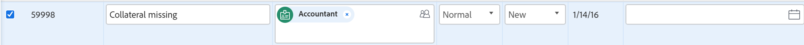

# Redigera problem i en lista

Du kan redigera ett enskilt problem eller redigera problem i en problemlista eller rapport. I den här artikeln beskrivs hur du redigerar problem i listor.

Mer information om hur du redigerar ett enskilt problem finns i [Redigera problem](../../../manage-work/issues/manage-issues/edit-issues.md).

## Åtkomstkrav

Du måste ha följande åtkomst för att kunna utföra åtgärderna i den här artikeln:

<table style="table-layout:auto"> 
 <col> 
 <col> 
 <tbody> 
  <tr> 
   <td role="rowheader">Adobe Workfront-plan*</td> 
   <td> 
Alla
 </td> 
  </tr> 
  <tr> 
   <td role="rowheader">Adobe Workfront-licens*</td> 
   <td> 
Begäran eller senare
 
Granska eller högre licens för att redigera problem i avsnittet Problem i ett projekt.
 </td> 
  </tr> 
  <tr> 
   <td role="rowheader">Konfigurationer på åtkomstnivå*</td> 
   <td> 
Redigera åtkomst till problem
 
Om du fortfarande inte har åtkomst frågar du Workfront-administratören om de anger ytterligare begränsningar för din åtkomstnivå. Mer information om hur en Workfront-administratör kan ändra åtkomstnivån finns i <a href="../../../administration-and-setup/add-users/configure-and-grant-access/create-modify-access-levels.md" class="MCXref xref">Skapa eller ändra anpassade åtkomstnivåer</a>.
 </td> 
  </tr> 
  <tr> 
   <td role="rowheader">Objektbehörigheter</td> 
   <td> 
Contribute eller högre behörighet för problemet
 
 Mer information om att bevilja behörigheter för problem finns i <a href="../../../workfront-basics/grant-and-request-access-to-objects/share-an-issue.md" class="MCXref xref">Dela ett problem </a>
 
Mer information om hur du begär ytterligare behörigheter finns i <a href="../../../workfront-basics/grant-and-request-access-to-objects/request-access.md" class="MCXref xref">Begär åtkomst till objekt </a>.
 </td> 
  </tr> 
 </tbody> 
</table>

&#42;Kontakta Workfront-administratören om du vill veta vilken plan, licenstyp eller åtkomst du har.

## Inline edit issues

Du kan redigera information om utgåvor i en lista med utgåvor genom att infoga redigeringsfält som visas i listvyn.

Tänk på följande när du redigerar problem i en lista:

* Du kan redigera alla felfält som visas i listan och som du har behörighet att uppdatera.
* Du kan redigera ett problem i följande listor:

   * Avsnittet Problem i ett projekt eller en uppgift
   * En problemrapport

Så här infogar du redigering av en utgåva:

1. Gå till en lista med problem i ett projekt eller en uppgift.
1. Klicka i ett fält som du har behörighet att uppdatera manuellt. Fältet kan redigeras och du kan göra ändringarna.

   

1. Tryck på Retur när du vill acceptera ändringarna. Ändringarna sparas omedelbart.

   Mer information om redigering av textbundna objekt finns i [Redigera objekt textbundet i en lista i Adobe Workfront](../../../workfront-basics/navigate-workfront/use-lists/inline-edit-objects.md).

## Redigera problem i en lista

1. Gå till en lista med problem i ett projekt eller en uppgift.
1. Gör något av följande

   * Markera problemet i listan och klicka sedan på ikonen Redigera  i verktygsfältet.
   * Klicka på menyn **Mer**  till höger om problemnamnet och klicka sedan på **Öppna på en ny flik**. Då öppnas sidan med problem på en ny flik. Klicka på **Mer** > **Redigera** på sidan Problem.
   * Klicka på menyn **Mer**  till höger om problemnamnet och klicka sedan på **Redigera**.

     Alla dessa åtgärder öppnar rutan Redigera problem.

     Mer information om hur du redigerar problem i rutan Redigera problem finns i [Redigera problem](../../../manage-work/issues/manage-issues/edit-issues.md).

## Redigera problem med hjälp av Sammanfattning

Du kan redigera ett problem i en lista med hjälp av Sammanfattning.

1. Gå till det projekt vars utgåvor du vill redigera.
1. Klicka på **Problem** i den vänstra panelen.

   Listan med problem i projektet visas.

1. Markera ett problem som du vill redigera och klicka sedan på ikonen **Öppna sammanfattning**  i det övre högra hörnet av problemlistan.

   **Sammanfattningen** öppnas.

1. (Valfritt) Börja skriva en uppdatering för problemet i området **Uppdateringar** .
1. Klicka på någon av följande ikoner eller områden för att gå till problemet och redigera information på problemnivå:

   | Dokument | Klicka **Klicka här om du vill lägga till** för att lägga till dokument i utgåvan. |
   |---|---|
   | Information | Klicka för att uppdatera information om problemet. |
   | Timmar | Klicka för att logga timmar. |
   | Godkännanden | Klicka för att lägga till godkännanden av utgåvor. |

1. (Valfritt) Klicka på ikonen **Öppna sammanfattning** igen eller på ikonen **X** i det övre högra hörnet av sammanfattningen för att stänga panelen och redigera ärendet textbundet.

## Redigera flera problem samtidigt

Du kan redigera flera utgåvor samtidigt och uppdatera all information samtidigt.

Så här redigerar du flera problem samtidigt:

1. Gå till **huvudmenyn**.
1. Klicka på **Projekt**.
1. Klicka på ett projektnamn för att komma åt projektet.
1. Klicka på **Problem** i den vänstra panelen.
1. Markera flera problem i listan.
1. Klicka på ikonen **Redigera** .

   Dialogrutan **Redigera problem** öppnas.

1. Ange information om alla valda utgåvor.

   Att redigera information i alla frågor är identiskt med att redigera information i ett problem när du redigerar följande områden:

   * Ökning
   * Inställningar
   * Uppdrag
   * Kommentar

   Mer information om hur du redigerar ett problem finns i [Redigera problem](../../../manage-work/issues/manage-issues/edit-issues.md).

   >[!NOTE]
   >
   >Informationen som du ändrar för alla markerade problem åsidosätter den befintliga informationen om enskilda utgåvor, förutom fältet **Uppdrag**. Om du lägger till en ny tilldelad i gruppredigering läggs den tilldelande till i alla markerade utgåvor. Om andra tilldelningar har tilldelats till de valda utgåvorna, förblir de tilldelade utöver den som lagts till via massredigering.

1. Klicka på **Anpassad Forms** om du vill redigera anpassade formulär som är kopplade till alla markerade problem.

   Om de markerade problemen inte har några vanliga anpassade formulär visas inga formulär i det här avsnittet.

   Du kan bara redigera fält i formulären som är kopplade till alla markerade problem och som du har behörighet att redigera.

1. (Valfritt) I området **Anpassade Forms** markerar du alternativet **Beräkna om anpassade uttryck** för att se till att alla beräknade anpassade fält i den anpassade Forms som är kopplade till de valda problemen är aktuella.

   >[!IMPORTANT]
   >
   >Vi rekommenderar att du inte väljer mer än 500 utgåvor åt gången när du beräknar om anpassade uttryck.

1. Klicka på **Spara ändringar**.

   Alla ändringar du har gjort visas nu för alla markerade problem.
