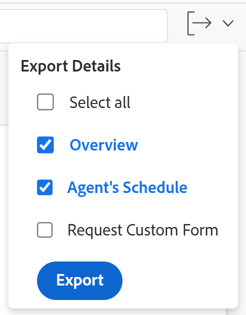
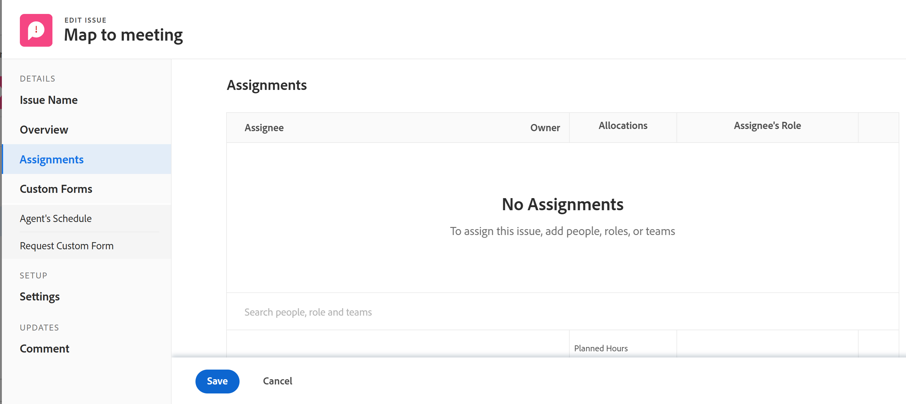
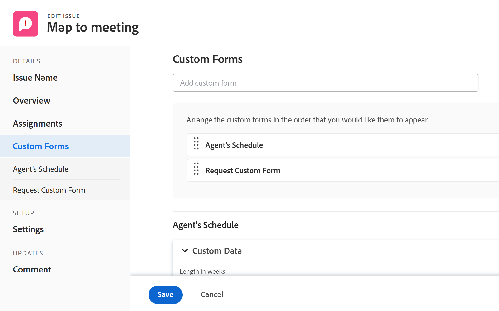
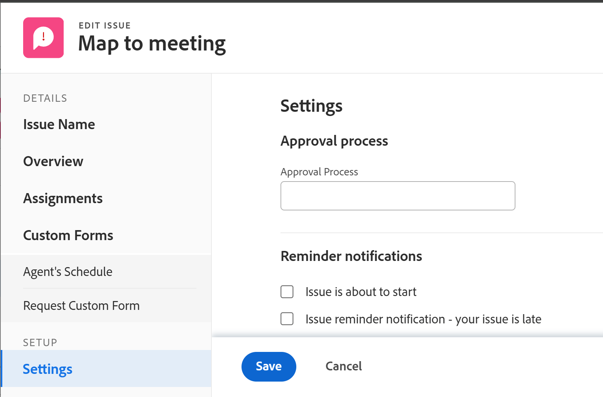

# Redigera problem

<!--Audited: 10/2025-->

<!--

 

The highlighted information on this page refers to functionality not yet generally available. It is available only in the Preview environment for all customers. The same features will also be available in the Production environment for all customers starting with  a week from the Preview release.      

For more information, see [Interface modernization](/help/quicksilver/product-announcements/product-releases/interface-modernization/interface-modernization.md).  

 
-->

Du kan redigera information om problem som du har skapat eller som andra användare har skapat om de delat problemen med dig.

Du kan redigera en enstaka utgåva eller redigera utgåvor i en lista. Mer information om hur du redigerar problem i en lista finns i [Redigera problem i en lista](../../../manage-work/issues/manage-issues/edit-issues-in-a-list.md).

## Åtkomstkrav

+++ Expandera om du vill visa åtkomstkrav för funktionerna i den här artikeln. 

<table style="table-layout:auto"> 
 <col> 
 <col> 
 <tbody> 
  <tr> 
   <td role="rowheader">Adobe Workfront package</td> 
   <td> 
Alla
 </td> 
  </tr> 
  <tr> 
   <td role="rowheader">Adobe Workfront-licens</td> 
   <td> <ul><li>Medarbetare eller högre</li>
   <li>Ljus eller högre för att redigera problem i avsnittet Problem i en uppgift eller ett projekt</li></ul>
   Eller:
   <ul><li>Begäran eller senare</li> <li>Granska eller högre för att redigera problem i avsnittet Problem i en uppgift eller ett projekt</li></ul> </td> 
  </tr> 
  <tr> 
   <td role="rowheader">Åtkomstnivå</td> 
   <td> 
Redigera åtkomst till problem
  </td> 
  </tr> 
  <tr> 
   <td role="rowheader">Objektbehörigheter</td> 
   <td> 
Contribute-behörighet för ett problem om du vill redigera följande fält i området Detaljer: 

   <ul>
   <li>Beskrivning</li>
   <li>Status</li>
   <li>Allvarlighetsgrad</li>
   </ul>
   
Hantera behörigheter för ett problem för att redigera alla fält i området Detaljer eller i rutan Redigera problem
 
 Mer information om att bevilja behörigheter för problem finns i <a href="../../../workfront-basics/grant-and-request-access-to-objects/share-an-issue.md" class="MCXref xref">Dela ett problem </a>
 
Mer information om hur du begär ytterligare behörigheter finns i <a href="../../../workfront-basics/grant-and-request-access-to-objects/request-access.md" class="MCXref xref">Begär åtkomst till objekt </a>.
 </td> 
  </tr> 
 </tbody> 
</table>

*Mer information finns i [Åtkomstkrav i Workfront-dokumentation](/help/quicksilver/administration-and-setup/add-users/access-levels-and-object-permissions/access-level-requirements-in-documentation.md).

+++

<!--Old:

<table style="table-layout:auto"> 
 <col> 
 <col> 
 <tbody> 
  <tr> 
   <td role="rowheader">Adobe Workfront plan</td> 
   <td> 
Any 
 </td> 
  </tr> 
  <tr> 
   <td role="rowheader">Adobe Workfront license*</td> 
   <td> 
New license:

   <ul><li>Contributor or higher</li>
   <li>Light or higher to edit issues in the Issues section of a task or project</li></ul>
   
Current license:

  <ul><li>Request or higher</li> <li>Review or higher to edit issues in the Issues section of a task or a project</li></ul> </td> 
  </tr> 
  <tr> 
   <td role="rowheader">Access level</td> 
   <td> 
Edit access to Issues
  </td> 
  </tr> 
  <tr> 
   <td role="rowheader">Object permissions</td> 
   <td> 
Contribute permissions to an issue to edit the following fields in the Details area: 

   <ul>
   <li>Description</li>
   <li>Status</li>
   <li>Severity</li>
   </ul>
   
Manage permissions to an issue to edit all the fields in the Details area or in the Edit Issue box
 
 For information about granting permissions to issues, see <a href="../../../workfront-basics/grant-and-request-access-to-objects/share-an-issue.md" class="MCXref xref">Share an issue </a>
 
For information on requesting additional permissions, see <a href="../../../workfront-basics/grant-and-request-access-to-objects/request-access.md" class="MCXref xref">Request access to objects </a>.
 </td> 
  </tr> 
 </tbody> 
</table>-->

## Begränsningar vid redigering av problem

Det finns vissa begränsningar som kan förhindra dig från att redigera problem.

* Du kan inte redigera problem som ingår i en godkännandeprocess. Du kan bara logga tid eller uppdatera statusen för ett problem som väntar på godkännande.
* Du kan bara redigera och lägga till dokument i ärenden i ett projekt som har statusen Fullständigt, Dölj eller Väntar på godkännande när Workfront-administratören eller en gruppadministratör har aktiverat den här funktionen i området Projektinställningar. Mer information om hur du anger projektinställningar finns i [Konfigurera systemomfattande projektinställningar](../../../administration-and-setup/set-up-workfront/configure-system-defaults/set-project-preferences.md).

## Redigera ett enstaka ärende

Du kan redigera ett problem under Redigera problem eller Ärendeinformation. I följande steg beskrivs hur du redigerar ett problem i rutan Redigera problem.

1. Gå till **huvudmenyn**.
1. Klicka på **Projekt** och sedan på namnet på ett projekt för att öppna projektet.
1. (Valfritt) Klicka på **Åtgärder** och sedan på namnet på en uppgift för att öppna uppgiften.
1. Klicka på **Problem** i den vänstra panelen.

   

1. (Valfritt) Om du vill redigera begränsad information om ett problem klickar du på **Ärendeinformation** i den vänstra panelen.

   >[!NOTE]
   >
   >Beroende på hur Workfront-administratören eller gruppadministratören ändrade din layoutmall kan fälten i området Ärendeinformation ordnas om eller inte visas. Mer information finns i [Anpassa detaljvyn med hjälp av en layoutmall](../../../administration-and-setup/customize-workfront/use-layout-templates/customize-details-view-layout-template.md).

   Så här redigerar du information i detaljavsnittet:

   1. (Valfritt) Klicka på ikonen **Komprimera alla** i det övre högra hörnet om du vill komprimera alla områden.
   1. (Valfritt och villkorligt) När ett område är komprimerat klickar du på **högerpilen**  bredvid varje område för att expandera det område som du vill redigera.
   1. (Valfritt) Om du vill bifoga ett anpassat formulär börjar du skriva namnet på ett formulär i fältet **Lägg till anpassat formulär** och markerar det när det visas i listan. Klicka sedan på **Spara ändringar**.
   1. (Valfritt) Klicka på ikonen **Exportera**  om du vill exportera översiktsinformation och anpassad formulärinformation till en PDF-fil. Klicka sedan på **Exportera**. Välj bland följande:

      * Markera alla (visas bara när det finns minst ett anpassat formulär bifogat)
      * Översikt
      * Namnet på ett eller flera anpassade formulär

      PDF-filen hämtas till din dator.

      

      Mer information finns i [Exportera anpassade formulär och objektinformation](../../../workfront-basics/work-with-custom-forms/export-custom-forms-details.md).

   Om du vill ha information om de fält som visas i avsnittet Ärendeinformation kan du fortsätta redigera problemet i rutan Redigera problem enligt nedan.

1. Om du vill redigera all information om ett problem markerar du ett problem i en lista och klickar sedan på **Redigera** överst i listan

   eller

   Klicka på namnet på ett problem i en lista och klicka sedan på menyn **Mer** bredvid problemnamnet. Sedan **Redigera.**

   Dialogrutan **Redigera problem** visas.

   >[!IMPORTANT]
   >
   >Du måste ha behörigheten Hantera för problemet för att kunna se länken Redigera.

   Alla problemfält är tillgängliga i rutan Redigera problem och grupperas efter de områden som visas i den vänstra panelen.

1. Det kan vara bra att ange information i följande avsnitt:

   * [Ärendenamn](#issue-name)
   * [Översikt](#overview)
   * [Uppdrag](#assignments)
   * [Anpassad Forms](#Custom%C2%A0F)
   * [Inställningar](#settings)

   >[!NOTE]
   >
   >Beroende på hur din Workfront-administratör konfigurerar vår layoutmall kan fälten i rutan Redigera problem vara annorlunda i din miljö. Mer information finns i [Anpassa detaljvyn med hjälp av en layoutmall](../../../administration-and-setup/customize-workfront/use-layout-templates/customize-details-view-layout-template.md).
   >
   >De flesta fält som listas i avsnitten nedan är också tillgängliga i rutan Nytt problem när du skapar ett problem. De avsnitt som fälten finns under matchar inte rutan Nytt problem. Mer information om hur du skapar problem finns i [Skapa problem](../../issues/manage-issues/create-issues.md).

### Ärendenamn {#issue-name}

1. Börja redigera ett problem enligt beskrivningen ovan.
1. Klicka på **Ärendenamn**.

   

1. Uppdatera fältet **Utgivningsnamn**.
1. Klicka på **Spara** eller fortsätt redigera följande avsnitt.

### Översikt {#overview}

1. Börja redigera ett problem enligt beskrivningen ovan.
1. Klicka på **Översikt**.

   

1. Uppdatera eller granska något av fälten i följande tabell:

   <table style="table-layout:auto"> 
    <col> 
    <col> 
    <tbody> 
     <tr> 
      <td role="rowheader">Beskrivning</td> 
      <td> 
Lägg till ytterligare information om problemet.
 </td> 
     </tr>

   <tr> 
      <td role="rowheader">Status</td> 
      <td> 
Välj status för utgåvan. Mer information om status för problem finns i <a href="../../../administration-and-setup/customize-workfront/creating-custom-status-and-priority-labels/issue-statuses.md" class="MCXref xref">Åtkomst till listan över status för systemproblem</a>. 
 </td> 
     </tr> 
     <tr> 
      <td role="rowheader">Prioritet</td> 
      <td> 
Det här är en visuell flagga som gör att du kan prioritera problem.
 
Välj bland följande alternativ:
 
       <ul> 
        <li> 
<strong>Ingen</strong> 
 </li> 
        <li> 
<strong>Låg</strong> 
 </li> 
        <li> 
<strong>Normal</strong> 
 </li> 
        <li> 
<strong>Hög</strong> 
 </li> 
        <li> 
<strong>Brådskande</strong> 
 </li> 
       </ul> 
Beroende på vilka projektinställningar du har valt av Workfront-administratören kan prioritetsnamnen vara olika för dig. Mer information om redigeringsprioriteringar finns i <a href="../../../administration-and-setup/customize-workfront/creating-custom-status-and-priority-labels/create-customize-priorities.md" class="MCXref xref">Skapa och anpassa prioriteringar</a>.
 </td> 
     </tr> 
     <tr> 
      <td role="rowheader">Allvarlighetsgrad</td> 
      <td> 
Det här är en visuell flagga som anger hur allvarligt problemet som beskrivs i problemet är. Allvarlighetsgrader är specifika för frågor. Välj bland följande alternativ:
 
       <ul> 
        <li> 
Kosmetisk
 </li> 
        <li> 
Orsakar förvirring
 </li> 
        <li> 
Fel med tillfälliga lösningar
 </li> 
        <li> 
Fel utan någon lösning
 </li> 
        <li> 
Allvarligt fel
 </li> 
       </ul> 
Beroende på vilka projektinställningar du har valt av Workfront-administratören kan namnet på svårigheterna vara olika för dig. Mer information om hur du redigerar allvarlighetsgrader finns i <a href="../../../administration-and-setup/customize-workfront/creating-custom-status-and-priority-labels/create-customize-issue-severities.md" class="MCXref xref">Skapa eller anpassa utgåvans svårighetsgrad</a>.
 </td> 
     </tr>

   <tr> 
   <td role="rowheader">Utfärdandevillkor</td> 
   <td> 
Villkoret för ett problem är en flagga som anger hur det går.
 
   
Du kan ställa in villkoret för en uppgift eller ett problem antingen automatiskt eller manuellt.

   
Du måste tilldelas utgåvan för att kunna ändra dess villkor.

   
Välj bland följande alternativ:
 
      <ul> 
   <li> 
Går smidigt
 </li> 
   <li> 
Vissa bekymmer
 </li> 
   <li> 
Större vägspärrar
 </li> 
   </ul> </td> 
     </tr>

   <tr> 
      <td role="rowheader">URL</td> 
      <td> 
Skriv en webblänk som relaterar till informationen om problemet.
 </td> 
     </tr> 
     <tr> 
      <td role="rowheader">Typ</td> 
      <td> 
Beroende på de köegenskaper som projektledaren har valt i området Köinformation i projektet kan du eventuellt ange typen av problem. Välj bland följande alternativ i listrutan <b>Typ</b>: 
 
       <ul> 
        <li> 
<strong>Felrapport</strong> 
 </li> 
        <li> 
<strong>Ändra ordning</strong> 
 </li> 
        <li> 
<strong>Utgåva</strong> 
 </li> 
        <li> 
<strong>Begäran</strong> 
 </li> 
       </ul> 
Beroende på vilka projektinställningar du har valt av Workfront-administratören kan det vara olika namn på problemtyperna.
 </td> 
     </tr> 
     <tr> 
      <td role="rowheader">Primär kontakt</td> 
      <td>Som standard är den primära kontakten den som skapar problemet. Om du vill ändra detta börjar du skriva namnet på en aktiv användare i Workfront och väljer den i listan. Ett problem kan bara ha en primär kontakt.  Om du ändrar den primära kontakten har den ursprungliga primära kontakten fortfarande Hantera åtkomst till problemet. När du delar ett problem måste du ta bort den här åtkomsten manuellt från rutan Utfärdandeåtkomst.

   <b>TIPS</b>

   
När du lägger till en primär kontaktanvändare ska du lägga märke till avataren, användarens primära roll och användarens e-postadress för att skilja mellan användare med identiska namn. Användarna måste vara associerade med minst en jobbroll för att kunna visa den när du lägger till dem.

      
 Du måste ha inställningen Visa kontaktinformation aktiverad på din åtkomstnivå för att användare ska kunna visa användarnas e-postmeddelanden. Mer information finns i <a href="../../../administration-and-setup/add-users/configure-and-grant-access/grant-access-other-users.md">Bevilja åtkomst för användare</a>.

   </td> 
     </tr> 
     <tr> 
      <td role="rowheader">Bekräfta datum och tid</td> 
      <td> 
Detta är det datum då den som har tilldelats emissionen uppskattar att problemet kommer att vara slutfört. Endast tilldelningar kan redigera det här fältet.
 </td> 
     </tr> 
     <tr> 
      <td role="rowheader">Planerat startdatum</td> 
      <td>Som standard är det planerade startdatumet det datum och den tidpunkt då utgåvan skapades. Du kan uppdatera det <strong>planerade startdatumet</strong> för utgåvan. </td> 
     </tr> 
     <tr> 
      <td role="rowheader">Planerat slutförandedatum och tid</td> 
      <td> Som standard är det planerade slutförandedatumet 24 timmar från standarddatumet för planerad start. Som standard har utleveranser en varaktighet på 1 dag. Du kan uppdatera det <strong>planerade slutförandedatumet</strong> för problemet.</td> 
     </tr> 
     <tr> 
      <td role="rowheader">Faktiskt startdatum och -tid</td> 
      <td>Det faktiska startdatumet fylls i automatiskt när du ändrar status för utgåvan till <strong>Pågår</strong>. Du kan uppdatera det <strong>faktiska startdatumet</strong> för utgåvan. Du kan uppdatera datumet manuellt om det behövs. </td> 
     </tr> 
     <tr> 
      <td role="rowheader">Faktiskt slutförandedatum och -tid</td> 
      <td>Faktiskt slutförandedatum fylls i automatiskt när du ändrar status för utgåvan till <strong>Stängd</strong> eller <strong>Löst</strong>. Du kan uppdatera det <strong>faktiska slutförandedatumet</strong> för utgåvan. Du kan uppdatera datumet manuellt om det behövs.</td> 
     </tr> 
     <tr> 
      <td role="rowheader">Löst av</td> 
      <td> 
Detta visar om problemet har lösts av ett annat objekt. Du kan välja om problemet ska lösas av en aktivitet, ett projekt eller något annat problem i listrutan och sedan börja skriva namnet på uppgiften, projektet eller problemet som ska lösa problemet. Markera den när den visas i listan.

   <b>ANTECKNINGAR</b>

   <ul><li>När du väljer ett objekt som ska lösa ett problem länkas problemstatusen till det objekt som ska lösas och kan inte ändras i det här problemet. Mer information om hur du löser objekt finns i <a href="../../../manage-work/issues/convert-issues/resolving-and-resolvable-objects.md" class="MCXref xref">Översikt över objekt som kan lösas och lösas </a>.</li>

   <li>När du ansluter ett problem som ska lösas av en annan uppgift, ett problem eller ett projekt, överförs ingen information från problemet till det objekt som löser problemet (uppgiften, problemet eller projektet som listas i fältet Löst av). </li>

   <li>När system- eller gruppadministratören lägger till fältet"Löst av" i ett anpassat felhuvud, ändras fältet till"Lösa problem","Lös aktivitet" eller"Lösa projekt" när det finns ett matchande objekt som är kopplat till problemet.

   Du kan inte redigera det här fältet när det visas i utgåvans huvud. Mer information om hur du anpassar felhuvuden finns i <a href="../../../administration-and-setup/customize-workfront/use-layout-templates/customize-object-headers.md">Anpassa objekthuvuden med en layoutmall </a></li></ul>
   </td> 
     </tr>

   <tr> 
      <td role="rowheader">Löser problem, åtgärdar aktivitet eller löser projekt</td> 
      <td>Det länkade namnet på det problem, den uppgift eller det problem som löser problemet.  </td> 
     </tr> 
      <tr> 
      <td role="rowheader">Den här lösningen</td> 
      <td>Det länkade namnet på det problem som slutförs när det problem som du försöker få åtkomst till är löst.  </td> 
     </tr> 
    </tbody> 
   </table>

1. Klicka på **Spara** eller fortsätt redigera följande avsnitt.

#### Uppdrag {#assignments}

1. Börja redigera problemet enligt beskrivningen ovan.
1. Klicka på **Uppdrag** i den vänstra panelen.

   

1. Klicka på **Sök efter personer, roller och team** och börja skriva namnet på en användare, roll eller team som du vill tilldela problemet. Klicka sedan på det eller tryck på Retur när det visas i listan.

   <!--
   (NOTE: ensure this is still called this; asked Anna to change it to "roles" and add a comma)
   -->

   >[!NOTE]
   >
   >Om användarens namn innehåller ett specialtecken måste du inkludera specialtecknet i sökfältet.

   Du kan tilldela flera användare, jobbroller eller team. Du kan bara tilldela aktiva användare, jobbroller och team.

   >[!TIP]
   >
   >
   >Om en användare, en jobbroll eller ett team tilldelades innan de inaktiverades, förblir de tilldelade till arbetsuppgiften. I det här fallet rekommenderar vi följande:
   >
   >* Tilldela om arbetsuppgiften till aktiva resurser.
   >* Associera användarna i ett inaktiverat team med ett aktivt team och omfördela arbetsposten till det aktiva teamet.

   <!--1. (Conditional) Depending on what environment you are editing issues in, do one of the following:
   1. In the Production environment, INDENT THE FOLLOWING STEPS FURTHER AT RELEASE: (Optional) Indicate whether an assignee is the primary assignee on the issue, by hovering over the name of the assignee and clicking **Make Primary**. A team cannot be the primary assignee of an issue. -->

1. Uppdatera följande fält:

   <table style="table-layout:auto"> 
    <col> 
    </col> 
    <col> 
    </col> 
    <tbody> 
     <tr> 
      <td role="rowheader">Planerade timmar</td> 
      <td> 
Detta är den faktiska tid det skulle ta för de som tilldelats utgåvan att slutföra den. Skriv in antalet planerade timmar för utgåvan. 
 
<b>ANMÄRKNING</b>
  
Om du ändrar de planerade timmarna för problemet ändras inte det planerade datumet för slutförandet. 
 </td> 
     </tr> 
     <tr data-mc-conditions=""> 
      <td role="rowheader">Uppdragarens roll</td> 
      <td> 
Välj en roll i listrutan <strong>Tilldelarens roll</strong> när du har valt en person som tilldelad. Detta är den roll som den som tilldelas kan fylla i denna fråga. 
 
<b>TIPS</b>

   Endast de jobbroller som är kopplade till varje tilldelad i deras profil visas i listrutan.
 </td>
   </tr> 
    </tbody> 
   </table>

   <!--
   

   1. (Conditional) In the Preview environment, do one of the following:
         * Click **Assign to me** to assign the issue to yourself
      * Update the **Planned Hours** field.
         The **Planned Hours** is the amount of hours it would take the assignees of the issue to complete it. 
         >[!NOTE]
         >
         >Changing the Planned Hours of the issue will not change the issue Planned Completion Date. 
   
 -->

1. Information om hur du tar bort tilldelningar från alla utgåvor finns i [Tilldela utgåvor](/help/quicksilver/manage-work/issues/manage-issues/assign-issues.md).

1. Klicka på **Spara** eller fortsätt redigera följande avsnitt.

### Anpassad Forms

1. Börja redigera ett problem enligt beskrivningen ovan.
1. Klicka på **Anpassad Forms**.

   

1. I fältet **Lägg till anpassat formulär** väljer du det eller de anpassade formulär som du vill associera med utgåvan. Du måste skapa anpassade formulär innan de kan väljas i det här fältet. Endast aktiva anpassade formulär visas i listan. Mer information om hur du skapar anpassade formulär finns i [Skapa ett anpassat formulär](/help/quicksilver/administration-and-setup/customize-workfront/create-manage-custom-forms/form-designer/design-a-form/design-a-form.md). Du kan lägga till upp till tio anpassade formulär i ett ärende.

1. (Villkorligt) Om du har kopplat ett anpassat formulär till problemet kan du redigera alla fält i formuläret. Du måste ange alla obligatoriska fält innan du kan spara problemet.

   >[!NOTE]
   >
   >Beroende på hur din Workfront-administratör anger behörigheter för avsnitten i ditt anpassade formulär kan inte alla visa eller redigera samma fält i ett visst anpassat formulär. Behörigheterna att redigera fält i ett avsnitt i ett anpassat formulär beror på vilka behörigheter du har för själva problemet. Mer information om att ange behörigheter för avsnitt i ett anpassat formulär finns i [Skapa ett anpassat formulär](/help/quicksilver/administration-and-setup/customize-workfront/create-manage-custom-forms/form-designer/design-a-form/design-a-form.md). Mer information om hur du ställer in utfärdandebehörigheter finns i [Dela ett problem](../../../workfront-basics/grant-and-request-access-to-objects/share-an-issue.md).

1. Klicka på **Spara** eller fortsätt redigera följande avsnitt.

### Inställningar {#settings}

1. Börja redigera ett problem enligt beskrivningen ovan.
1. Klicka på **Inställningar**.

   

   Uppdatera följande information:

   <table style="table-layout:auto"> 
    <col> 
    </col> 
    <col> 
    </col> 
    <tbody> 
     <tr> 
      <td role="rowheader">Godkännandeprocess</td> 
      <td> 
       
 
       
Välj en godkännandeprocess som du vill koppla till utgåvan. Workfront-administratören måste definiera godkännandeprocesser på systemnivå innan du kan koppla dem till problem. Användare med administrativ åtkomst till godkännandeprocesserna  kan också skapa gruppspecifika godkännandeprocesser.Mer information om hur du skapar godkännandeprocesser finns i <a href="../../../administration-and-setup/customize-workfront/configure-approval-milestone-processes/create-approval-processes.md" class="MCXref xref">Skapa en godkännandeprocess för arbetsobjekt</a>. 
 
       
Tänk på följande när du lägger till godkännandeprocesser: 
 
       <ul> 
       <li>Endast aktiva godkännandeprocesser visas i listan. </li> 
       <li> 
Systemomfattande och gruppspecifika godkännandeprocesser visas i listan. En godkännandeprocess som är associerad med en annan grupp än den som projektet har visas inte i listan.
 
Viktigt: Om projektgruppen ändras blir den gruppspecifika godkännandeprocessen en godkännandeprocess för engångsbruk. Mer information om hur ändringar i projektgruppen eller ändringar i godkännandeprocessen påverkar godkännandeinställningarna finns i <a href="../../../administration-and-setup/customize-workfront/configure-approval-milestone-processes/how-changes-affect-group-approvals.md" class="MCXref xref">Hur ändringar i grupp- och godkännandeprocessen påverkar tilldelade godkännandeprocesser</a>. 
 </li> 
       <li> 
Du kan definiera standardprocesser för godkännande som automatiskt bifogas till ärenden när du skapar frågeköer eller köämnen. Mer information om hur du uppdaterar köinformation finns i <a href="../../../manage-work/requests/create-and-manage-request-queues/create-request-queue.md" class="MCXref xref">Skapa en frågekö</a>. Mer information om hur du skapar köämnen finns i <a href="../../../manage-work/requests/create-and-manage-request-queues/create-queue-topics.md" class="MCXref xref">Skapa köämnen</a>. 
 </li> 
       <li>Följande scenarier används vid gruppredigering: 
       <ul> 
       <li>
När du väljer flera utgåvor från samma grupp visas både system- och gruppspecifika godkännandeprocesser i det här fältet.
</li> 
       <li>
När du väljer flera utgåvor från olika grupper visas endast godkännandeprocesser på systemnivå i det här fältet.
</li> 
       <li>
När någon av frågorna har en enda godkännandeprocess, ersätts den av den process på system- eller gruppnivå som du väljer. 
</li> 
       </ul></li> 
       </ul> 
       
 </td> 
     </tr> 
     <tr> 
      <td role="rowheader">Påminnelsemeddelanden</td> 
      <td> 
Markera den kryssruta för vilken du vill bifoga påminnelsemeddelanden till den här utgåvan. Alla påminnelsemeddelanden för problem visas. Workfront-administratören måste konfigurera påminnelsemeddelanden innan du kan välja dem i ett ärende. Mer information om hur du konfigurerar påminnelsemeddelanden finns i <a href="../../../administration-and-setup/manage-workfront/emails/set-up-reminder-notifications.md" class="MCXref xref">Konfigurera påminnelsemeddelanden</a>
 </td> 
     </tr> 
    </tbody> 
   </table>

1. Klicka på **Spara.**

## Redigera ett problem i utgåvans huvud (begränsat)

Du kan redigera en begränsad mängd information i utgåvans huvud.

Systemadministratören eller gruppadministratören kan anpassa fälten i utgåvans huvud. Mer information finns i [Anpassa objektrubriker med hjälp av en layoutmall](../../../administration-and-setup/customize-workfront/use-layout-templates/customize-object-headers.md).

Följande fält inkluderas som standard i utgåvans rubrik:

* Ärendenamn
* Procent färdigt

  Mer information finns i [Visa och uppdatera Procent färdigt för uppgifter](/help/quicksilver/manage-work/projects/updating-work-in-a-project/view-update-percent-complete-for-tasks.md).
* Uppdrag
* Planerat slutförandedatum och tid
* Status
* Fatta godkännandebeslut om du har angett som godkännare i en aktuell godkännandeprocess
