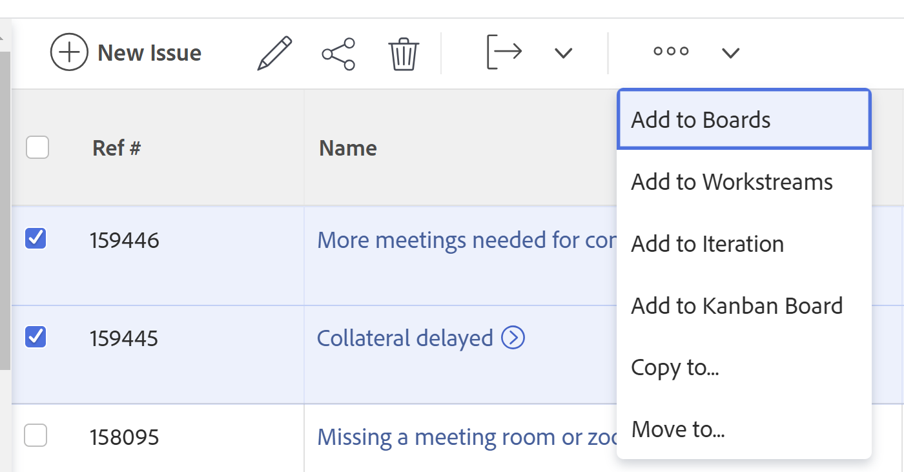
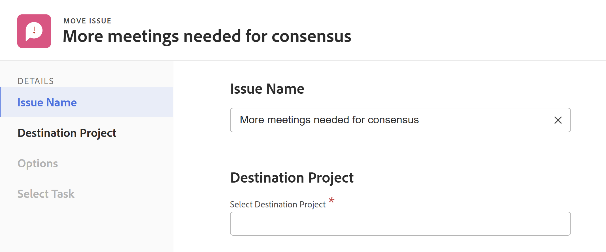

# Flytta problem

<!--Audited: 12/2024-->

Den markerade informationen på den här sidan hänvisar till funktioner som ännu inte är allmänt tillgängliga. Det är bara tillgängligt i förhandsvisningsmiljön för alla kunder. Efter de månatliga releaserna i Production finns samma funktioner även i produktionsmiljön för kunder som aktiverat snabba releaser. 

Mer information om snabba releaser finns i [Aktivera eller inaktivera snabba releaser för din organisation](/help/quicksilver/administration-and-setup/set-up-workfront/configure-system-defaults/enable-fast-release-process.md). 

Du kan flytta problem mellan följande objekt:

* Från ett projekt till ett annat projekt
* Från en uppgift till en annan uppgift i samma projekt eller i ett annat projekt
* Från en uppgift till ett projekt eller till ett annat projekt
* Från ett projekt till en uppgift i samma projekt eller en uppgift i ett annat projekt

## Åtkomstkrav

+++ Expandera om du vill visa åtkomstkrav för funktionerna i den här artikeln.

Du måste ha följande åtkomst för att kunna utföra stegen i den här artikeln:

<table style="table-layout:auto"> 
 <col> 
 <col> 
 <tbody> 
  <tr> 
   <td role="rowheader">Adobe Workfront</td> 
   <td> 
Alla
 </td> 
  </tr> 
  <tr> 
   <td role="rowheader">Adobe Workfront-licens*</td> 
   <td> 
Nytt:
 
   <ul><li>Medarbetare eller högre</li>
   <li>Ljus eller högre för att flytta problem i avsnittet Problem i ett projekt</li></ul>
   
Aktuell:

   <ul>
   <li>
Begäran eller senare
</li>
   <li>
Granska eller högre licens för att flytta problem i avsnittet Problem i ett projekt.
</li></ul>   
     </td> 
  </tr> 
  <tr> 
   <td role="rowheader">Konfigurationer på åtkomstnivå</td> 
   <td> 
Redigera åtkomst till problem
 
Visa eller öka åtkomsten till projekt och uppgifter
 </td> 
  </tr> 
  <tr> 
   <td role="rowheader">Objektbehörigheter</td> 
   <td> 
Hantera behörigheter för problemet
 
Contribute-behörigheter till det objekt där du flyttar problemet med möjligheten att lägga till problem.</td> 
  </tr> 
 </tbody> 
</table>

*Mer information finns i [Åtkomstkrav i Workfront-dokumentation](/help/quicksilver/administration-and-setup/add-users/access-levels-and-object-permissions/access-level-requirements-in-documentation.md).

+++

## Att tänka på när det gäller rörliga frågor

Tänk på följande när du flyttar problem som innehåller dokument eller är kopplade till en begärandekö:

* **När ett problem är kopplat till en frågekö:** När du flyttar ett problem till ett annat objekt och problemet är kopplat till en frågekö, är det flyttade problemet inte längre kopplat till den ursprungliga kön som det första problemet kom från.
* **När ett dokument är kopplat till utgåvan:** När du flyttar en utgåva till ett annat objekt och utgåvan har ett dokument kopplat till sig, flyttas även dokumentets versioner och korrektur till den nya utgåvan. Alla godkännanden som är kopplade till dokumentet flyttas inte.
* **När ett problem är länkat till ett dokument eller en mapp:** När du flyttar ett ärende som har dokument eller mappar länkade till en tredjepartstjänst som Google Drive, flyttas länkarna till dokumenten med problemet.

* Din system- eller gruppadministratör kan hindra dig från att flytta problem som har loggade timmar, beroende på hur de konfigurerar Tillåt användare att flytta uppgifter och problem med loggade timmar i inställningsområdet. Mer information finns i [Konfigurera uppgifter och utgåvinställningar för hela systemet](/help/quicksilver/administration-and-setup/set-up-workfront/configure-system-defaults/set-task-issue-preferences.md).

## Flytta problem i en lista

Du kan flytta en eller flera utgåvor från en lista med utgåvor eller från en problemrapport.

1. Gå till projektet som innehåller problemet eller problemen som du vill flytta.

   eller

   Gå till en problemrapport.

1. Om du valde att gå till ett projekt klickar du på **Problem** i den vänstra panelen.
1. Markera det eller de problem som du vill flytta och klicka på menyn **Mer** överst i problemlistan och klicka sedan på **Flytta till**.

   

1. Fortsätt med att flytta problemen enligt beskrivningen i avsnittet [Flytta ett enskilt problem](#move-a-single-issue) med början från steg 2.

## Flytta ett enstaka ärende {#move-a-single-issue}

Du kan flytta ett problem när du visar det.

### Flytta ett enstaka problem i förhandsvisningsmiljön

1. Gå till ett problem som du vill kopiera, klicka på menyn **Mer**  till höger om problemnamnet och välj sedan **Flytta** till.

   

   Rutan **Flytta problem** visas.

   

1. I avsnittet **Välj målprojekt** anger du namnet på det projekt där du vill flytta problemen. Namnet på det aktuella projektet visas som standard.

   >[!TIP]
   >
   >Endast 100 projekt visas i listan.

1. (Villkorligt) Klicka på **Begär åtkomst** om du inte har åtkomst att flytta ärenden till projektet.
1. (Villkorligt) Fortsätt att flytta problemet i det valda målprojektet utan att begära åtkomst om du har åtkomst till att lägga till problem i någon av åtgärderna i målprojektet.

   

   >[!TIP]
   >
   >Liknande meddelanden visas om det valda projektet väntar på godkännande, är slutfört eller är inaktivt, när Workfront-administratören förhindrar att det uppstår problem i dessa projekt. Mer information finns i [Konfigurera systemomfattande projektinställningar](../../../administration-and-setup/set-up-workfront/configure-system-defaults/set-project-preferences.md).

1. (Valfritt) I avsnittet **Alternativ** avmarkerar du något av objekten i tabellen nedan för att ta bort dem från det flyttade problemet. Alla alternativ är markerade som standard.

   >[!IMPORTANT]
   >
   >Om du avmarkerar objekt i alternativlistan förlorar du data. Information från den befintliga utgåvan tas bort och kan inte återställas.

   <table style="table-layout:auto"> 
    <col> 
    <col> 
    <tbody> 
     <tr> 
      <td role="rowheader">Markera alla</td> 
      <td>Avmarkera det här alternativet om du vill ta bort all information från problemet när det flyttas till sin nya plats. </td> 
     </tr> 
     <tr> 
      <td role="rowheader">Uppdrag</td> 
      <td>Tar bort användare, jobbroller eller team som är tilldelade till problemet.</td> 
     </tr> 
     <tr> 
      <td role="rowheader">Förlopp</td> 
      <td>Tar bort procent slutfört, om någon, av utgåvan. </td> 
     </tr> 
     <tr> 
      <td role="rowheader">
Dokument
</td> 
      <td> 
Tar bort allt på dokumentfliken, inklusive dokumentversioner, länkade dokument och mappar.

   <b>OBS!</b>

   Om du inte vill att dokumenten ska flyttas med utgåvan, kommer dokumenten att tas bort och placeras i papperskorgen i 30 dagar. En administratör kan återställa dem och de kommer att återställas vid det flyttade problemet.

   Om problemet tas bort efter att det har flyttats placeras de återställda dokumenten i området Dokument på administratörens användarsida, som återställer dem.
     
 </td>
   </tr> 
     <tr> 
      <td role="rowheader">Behörigheter</td> 
      <td>Tar bort de entiteter som utgåvan delas med. </td> 
     </tr> 
     <tr> 
      <td role="rowheader">Uppdateringar</td> 
      <td>Tar bort kommentarer från uppdateringsavsnittet för problemet.</td> 
     </tr> 
    </tbody> 
   </table>

1. (Valfritt) I avsnittet **Välj uppgift** väljer du den uppgift där du vill flytta problemet.
1. Klicka på **Flytta problem** eller **Flytta problem** om du har valt flera utgåvor i en lista.

   De flyttade problemen läggs till i det angivna projektet.

