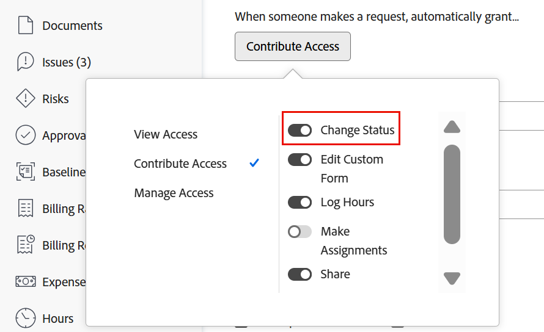

# Uppdatera automatiskt utskicksstatus från Väntar på feedback till Pågår

När den primära kontakten för ett problem gör en uppdatering av problemet genom att antingen uppdatera ett fält (inklusive ett anpassat fält) eller lägga till en kommentar, uppdateras ärendets status automatiskt.

Följande krävs för att denna automatiska statusändring ska kunna utföras:

* Problemet måste anges via en begärandekö.

  Mer information om hur du skapar begärandeköer finns i [Skapa och hantera frågeköer](../../../manage-work/requests/create-and-manage-request-queues/create-manage-request-queues.md) -avsnitt. Mer information om hur du skapar begäranden finns i [Skapa och skicka Adobe Workfront-förfrågningar](../../../manage-work/requests/create-requests/create-submit-requests.md).

* Köinformationen i begärandekön måste ha följande inställningar:
   * **När någon gör en förfrågan tilldelar du automatiskt** är inställd på **Contribute Access**
   * **Ändra status** är markerat under Avancerade inställningar

  

  >[!IMPORTANT]
  >
  >  När du konfigurerar en begärandekö kan du definiera den primära kontaktpersonens åtkomst till de utgåvor de skickar.
  >
  >När du avmarkerar inställningen Ändra status när du ställer in begärandekön måste du komma ihåg att systemadministratörer alltid har tillgång till att ändra status för problem, även om alternativet Ändra status är avmarkerat i inställningarna för begärandekön.

  Mer information om köinformation finns i [Skapa en begärandekö](../../../manage-work/requests/create-and-manage-request-queues/create-request-queue.md).

* Problemet måste ha statusen Väntar på feedback.
* Det måste finnas en AWF-status (Väntar på feedback) för problem på systemnivå.

  Mer information om statusvärden på systemnivå finns i [Skapa eller redigera en status](../../../administration-and-setup/customize-workfront/creating-custom-status-and-priority-labels/create-or-edit-a-status.md).
