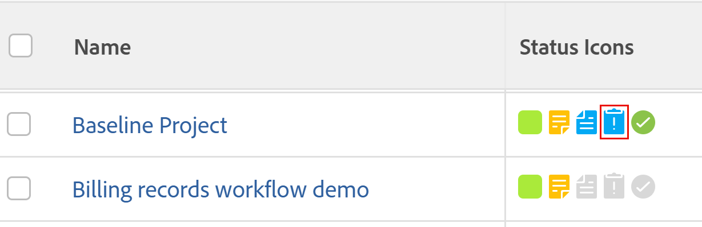

# Visa problem

Du kan visa problem som är kopplade till ett projekt, en uppgift eller en iteration.

## Åtkomstkrav

Du måste ha följande åtkomst för att kunna utföra stegen i den här artikeln:

<table style="table-layout:auto"> 
 <col> 
 <col> 
 <tbody> 
  <tr> 
   <td role="rowheader">Adobe Workfront-plan*</td> 
   <td> 
Alla
 </td> 
  </tr> 
  <tr> 
   <td role="rowheader">Adobe Workfront-licens*</td> 
   <td> 
Begäran eller senare
 
Granska eller högre licens för att visa problem i avsnittet Problem i ett projekt.
 </td> 
  </tr> 
  <tr> 
   <td role="rowheader">Konfigurationer på åtkomstnivå*</td> 
   <td> 
Visa åtkomst till problem
 
Visa eller öka åtkomsten till projekt och uppgifter
 
Obs! Om du fortfarande inte har åtkomst frågar du Workfront-administratören om de anger ytterligare begränsningar för din åtkomstnivå. Mer information om åtkomst till problem på din åtkomstnivå finns i <a href="../../../administration-and-setup/add-users/configure-and-grant-access/grant-access-issues.md" class="MCXref xref">Bevilja åtkomst till problem</a>. Mer information om hur en Workfront-administratör kan ändra åtkomstnivån finns i <a href="../../../administration-and-setup/add-users/configure-and-grant-access/create-modify-access-levels.md" class="MCXref xref">Skapa eller ändra anpassade åtkomstnivåer</a>. 
 </td> 
  </tr> 
  <tr> 
   <td role="rowheader">Objektbehörigheter</td> 
   <td> 
Visa behörigheter för utgåvan
 
 Mer information om att bevilja behörigheter för problem finns i <a href="../../../workfront-basics/grant-and-request-access-to-objects/share-an-issue.md" class="MCXref xref">Dela ett problem </a>
 
Mer information om hur du begär ytterligare behörigheter finns i <a href="../../../workfront-basics/grant-and-request-access-to-objects/request-access.md" class="MCXref xref">Begär åtkomst till objekt </a>.
 </td> 
  </tr> 
 </tbody> 
</table>

&#42;Kontakta Workfront-administratören om du vill veta vilken plan, licenstyp eller åtkomst du har.

## Visa problem baserat på status

Så här visar du problem i ett projekt, en uppgift eller en iteration:

1. Öppna ett projekt, en uppgift eller en iteration som innehåller problem och klicka sedan på **Problem** i den vänstra panelen.

1. Om du vill visa alla, öppna eller stängda problem klickar du på något av de filter som listas nedan i listrutan **Filter** .

>[!TIP]
>
>Listan med filter varierar beroende på vad system- eller gruppadministratören har valt att visa i den.

* **Öppna:** Visar problem som är öppna.

  Detta inkluderar de som är kopplade till ett upplöst objekt och de som har statusen Stängt - Väntar på godkännande.

  Mer information om hur du löser objekt finns i [Översikt över objekt som kan lösas och lösas](../../../manage-work/issues/convert-issues/resolving-and-resolvable-objects.md).

* **Slutförd:** Visar alla problem som har ett faktiskt slutförandedatum.
* **Alla** Visar alla problem.

## Förstå information om problem

Du kan visa information om ett problem när du öppnar det.

Så här öppnar du ett problem och visar information om det:

1. Öppna ett projekt, en uppgift eller en iteration som innehåller problem och klicka sedan på **Problem** i den vänstra panelen.
1. I listrutan **Filter** väljer du filtret för att visa de problem som du försöker visa.

   Välj bland följande:

   * Öppna
   * Slutförd
   * Alla

1. Klicka på namnet på ett problem.

   När du har behörighet att hantera problemet kan du redigera alla redigerbara fält i utgåvan och lägga till godkännanden, timmar eller dokument i utgåvan.

1. Klicka på något av följande i den vänstra panelen för att visa mer information om problemet:

* **Uppdateringar**: Du kan utföra följande åtgärder:

   * Kommentera frågan eller svara på en befintlig kommentar.
   * Loggtid.
   * Ändra status för utgåvan.

     Mer information om hur du uppdaterar arbete i Workfront finns i [Uppdatera arbete](/help/quicksilver/workfront-basics/updating-work-items-and-viewing-updates/update-work.md).

* **Dokument**: Bifoga dokument till utgåvan. Mer information om hur du lägger till dokument i Workfront finns i [Lägga till dokument i Adobe Workfront från filsystemet](../../../documents/adding-documents-to-workfront/add-documents-from-file-system.md).

* **Ärendeinformation**: Utöka den här länken om du vill visa områdena **Översikt** och **Anpassad Forms**.

  Om du har behörighet att hantera problemet och redigera behörigheter för det anpassade formuläret kan du redigera en del av informationen här.

  Visa eller redigera följande fält i området **Översikt**:

   * **Namn**
   * **Sökväg**: Den sökväg genom vilken felet loggades till projektet.

     Om ett problem skickades som en begäran i en begärandekö visas namnen på projektet, ämnesgruppen och köämnet här. Det går inte att redigera det här fältet.

     Mer information om hur du skickar begäranden finns i [Skapa och skicka Adobe Workfront-begäranden](../../../manage-work/requests/create-requests/create-submit-requests.md).

   * **Beskrivning**
   * **URL**: alla webbadresser som är relaterade till problemet.
   * **Prioritet**: En visuell flagga som gör att du kan prioritera problem.
   * **Allvarlighetsgrad**: en visuell flagga som anger hur allvarligt problemet som beskrivs i problemet är.
   * **Primär kontakt**: Den primära standardkontakten är den användare som skapade problemet. Det här fältet kan redigeras.
   * **Planerade timmar**: visar hur lång tid det tar för någon att slutföra problemet. Standardvärdet är 8 timmar. Det här fältet kan redigeras.
   * **Faktiska timmar**: visar hur lång tid det tog att slutföra utgåvan. Detta är den tidpunkt då någon loggar för problemet.
   * **Planerat startdatum**: det datum då utgåvan planeras starta. Standardvärdet är datumet och tidpunkten då utgåvan skapades.
   * **Faktiskt startdatum**: datum och tid då utfärdandestatusen ändrades till Pågår.
   * **Planerat slutförandedatum**: det datum då utgåvan planeras att slutföras.
   * **Faktiskt slutförandedatum**: det datum då utgåvan faktiskt slutfördes. Det här fältet fylls i automatiskt när utgivningsstatusen ändras till Stängd eller Löst, eller kan redigeras manuellt.
   * **Faktisk kostnad**: Kostnaden baseras på de faktiska timmar som har loggat på utgåvan. Det här fältet kan inte redigeras. Den faktiska kostnaden för en utleverans beräknas baserat på följande formel, där användarkostnadstariffen är den kostnadstariff som är associerad med användaren som loggar tiden till utleverans:

     Utleverans faktisk kostnad = timmar loggade * Andel användarkostnader

   * **Anges av**: Det här är användaren som skapade problemet. Det här fältet kan inte redigeras.
   * **Senast uppdaterad av**: Det här är den användare som senast uppdaterade något fält i problemet. Det här fältet kan inte redigeras.

     I området **Anpassad Forms** kan du visa hur du väljer ett eller flera anpassade formulär som ska kopplas till problemet.

* **Timmar**: Visar en lista med timposter i utgåvan.
* **Godkännanden:** Visar godkännandesökvägarna som är associerade med problemet.

  Mer information om hur du associerar godkännanden med ett problem finns i avsnittet [Associera en godkännandeprocess med ett arbetsobjekt](../../../administration-and-setup/customize-workfront/configure-approval-milestone-processes/create-approval-processes.md#associating-the-approval-process-with-an-object) i [Skapa en godkännandeprocess för arbetsobjekt](../../../administration-and-setup/customize-workfront/configure-approval-milestone-processes/create-approval-processes.md).

## Visa vilka projekt och uppgifter som har problem

Du kan lägga till ikoner i vyn för ett projekt, en uppgiftsrapport eller en lista för att visa om de har problem bifogade. Att lägga till ikoner i vyn för en rapport eller lista fungerar ungefär på samma sätt för projekt och uppgifter.

Så här lägger du till ikoner som visar om ett projekt har problem i en projektrapport:

1. Klicka på ikonen **Huvudmeny**  i det övre högra hörnet av Adobe Workfront.
1. Klicka på **Rapportering** > **Ny rapport** > **Projektrapport**.
1. I fältet **Visa i den här kolumnen** börjar du skriva **Statusikoner** och markerar den när den visas i listan.

1. Klicka på **Spara + Stäng** .

   Problemikonerna visas i de projekt som har problem i kolumnen **Statusikoner** .

   
