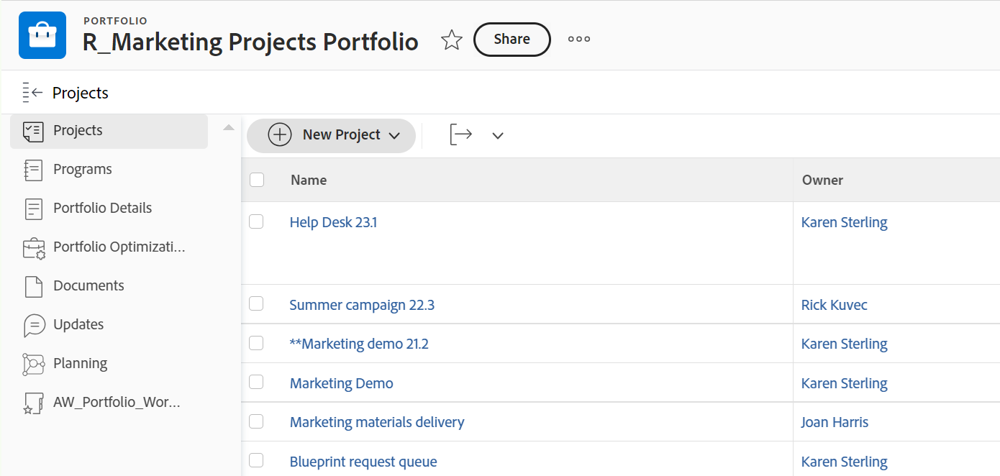
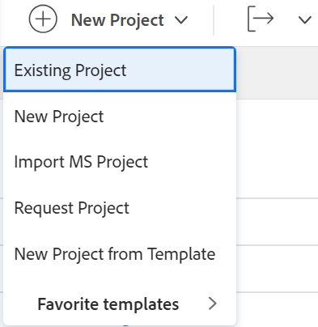
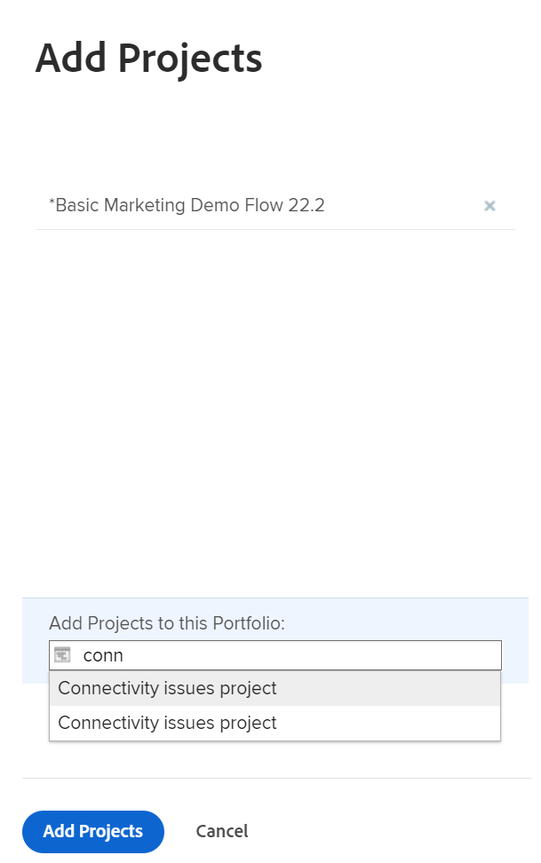

# Lägga till projekt i en portfölj

Vi rekommenderar att du lägger till projekt i portföljer när du initierar dem. Du kan dock lägga till dem i en portfölj när som helst under deras livstid.

Tänk på följande när du lägger till projekt i portföljer:

* Även om en portfölj kan innehålla ett obegränsat antal projekt kan du bara koppla en portfölj till ett projekt.
* Ett projekt blir kvar i en portfölj tills det tas bort eller kopplas till en annan portfölj.

## Åtkomstkrav

Du måste ha följande åtkomst för att kunna utföra stegen i den här artikeln:

<table style="table-layout:auto"> 
 <col> 
 <col> 
 <tbody> 
  <tr> 
   <td role="rowheader">[!DNL Adobe Workfront] plan*</td> 
   <td> 
[!UICONTROL Business] eller högre
 </td> 
  </tr> 
  <tr> 
   <td role="rowheader">[!DNL Adobe Workfront] licens*</td> 
   <td> 
[!UICONTROL Plan] 
 </td> 
  </tr> 
  <tr> 
   <td role="rowheader">Konfigurationer på åtkomstnivå*</td> 
   <td> 
[!UICONTROL View] behörighet till Portfolio eller högre
 
[!UICONTROL Edit] behörighet till projekt
 
Obs! Om du fortfarande inte har åtkomst kan du fråga [!DNL Workfront] om de anger ytterligare begränsningar för din åtkomstnivå. För information om hur en [!DNL Workfront] administratören kan ändra din åtkomstnivå, se <a href="../../../administration-and-setup/add-users/configure-and-grant-access/create-modify-access-levels.md" class="MCXref xref">Skapa eller ändra anpassade åtkomstnivåer</a>.
 </td> 
  </tr> 
  <tr> 
   <td role="rowheader">Objektbehörigheter</td> 
   <td> 
[!UICONTROL View] behörighet till portföljen
 
[!UICONTROL Manage] behörigheter till projekten
 
Mer information om hur du begär ytterligare åtkomst finns i <a href="../../../workfront-basics/grant-and-request-access-to-objects/request-access.md" class="MCXref xref">Begär åtkomst till objekt </a>.
 </td> 
  </tr> 
 </tbody> 
</table>

&#42;Kontakta [!DNL Workfront] administratör.

## Lägg till ett projekt i en portfölj

1. Gå till en portfölj och klicka sedan på **[!UICONTROL Projects]** i den vänstra panelen.

   

1. Klicka **[!UICONTROL New Project]** och väljer en metod för att lägga till ett projekt.

   >[!TIP]
   >
   >Du kan inte lägga till projekt när du visar listan med projekt i [!UICONTROL Milestone] vy.

   Välj bland följande alternativ:

   <table style="table-layout:auto"> 
    <col> 
    <col> 
    <tbody> 
     <tr> 
      <td role="rowheader">[!UICONTROL Existing Project]</td> 
      <td> 
Lägg till ett projekt som redan har skapats.
 </td> 
     </tr> 
     <tr> 
      <td role="rowheader">[!UICONTROL New Project]</td> 
      <td> 
Lägg till ett nytt projekt. 
 
Mer information om hur du skapar ett nytt projekt finns i <a href="../../../manage-work/projects/create-projects/create-project.md" class="MCXref xref">Skapa ett projekt</a>. 
 </td> 
     </tr> 
     <tr> 
      <td role="rowheader">[!UICONTROL Import a Project from [!DNL MS Project]] </td> 
      <td> 
Lägg till ett projekt som du tidigare har exporterat från [!DNL MS Project] och har sparat på datorn. 
 
Mer information om hur du skapar ett nytt projekt genom att importera det från [!DNL Microsoft Project], se <a href="../../../manage-work/projects/create-projects/import-project-from-ms-project.md" class="MCXref xref">Importera ett projekt från [!DNL Microsoft Project]</a>.
 </td> 
     </tr> 
     <tr> 
      <td role="rowheader">[!UICONTROL Request Project]</td> 
      <td> 
Begär att ett projekt godkänns.
 
Mer information om hur du begär projekt finns i <a href="../../../manage-work/projects/create-projects/request-project.md">Begär ett projekt</a>. 
 </td> 
     </tr> 
     <tr> 
      <td role="rowheader">[!UICONTROL New from Template]</td> 
      <td> 
Lägg till ett nytt projekt med en befintlig mall. 
 
Mer information om hur du skapar ett projekt från en mall finns i <a href="../../../manage-work/projects/create-projects/create-project-from-template.md" class="MCXref xref">Skapa ett projekt med en mall</a>.
 </td> 
     </tr> 
    </tbody> 
   </table>

   

1. (Villkorligt) Om du valde att lägga till ett befintligt projekt börjar du skriva namnet på ett projekt i **[!UICONTROL Add Projects]** och sedan klicka på dem när de visas i listan. Du kan lägga till flera projekt samtidigt.

   

1. Klicka på **[!UICONTROL Add Projects]**.

   Det eller de projekt du har valt är nu kopplade till portföljen.
