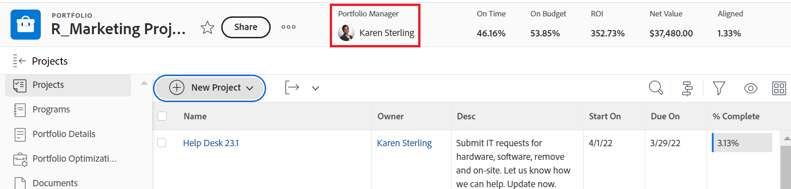

# Skapa en portfölj

<!--Audited: 7/2024-->

En Portfolio är en samling projekt som konkurrerar om samma resurser, budget och tidsplan. Projekten i en Portfolio är tillräckligt lika så att de skulle använda samma resurspool och mätas mot samma styrkort.

Du kan använda portföljer för att gruppera projekt som tillhör samma produktlinjer, avdelningar, avdelningar, företag eller andra affärsenheter.

## Åtkomstkrav

+++ Expandera om du vill visa åtkomstkrav för funktionerna i den här artikeln.

<table style="table-layout:auto"> 
 <col> 
 <col> 
 <tbody> 
  <tr> 
   <td role="rowheader">[!DNL Adobe Workfront] plan*</td> 
   <td> 
Alla
</td> 
  </tr> 
  <tr> 
   <td role="rowheader">[!DNL Adobe Workfront] licens*</td> 
   <td> 
Nytt: [!UICONTROL Standard]

   
Aktuell:[!UICONTROL Plan] 
 </td> 
  </tr> 
  <tr> 
   <td role="rowheader">Konfigurationer på åtkomstnivå</td> 
   <td> 
[!UICONTROL Edit] åtkomst till portföljer
  </td> 
  </tr> 
  <tr> 
   <td role="rowheader">Objektbehörigheter</td> 
   <td> 
När du har skapat en portfölj har du som standard behörighet att hantera den
  </td> 
  </tr> 
 </tbody> 
</table>

*Mer information finns i [Åtkomstkrav i Workfront-dokumentation](/help/quicksilver/administration-and-setup/add-users/access-levels-and-object-permissions/access-level-requirements-in-documentation.md).

+++

## Olika sätt att skapa portföljer

Du kan skapa portföljer i Workfront på något av följande sätt:

* Skapa en portfölj från början i portföljområdet på huvudmenyn. I den här artikeln beskrivs hur du kan skapa en portfölj från grunden.

* Importera en portfölj med hjälp av snabbstarter.

  Som Workfront-administratör kan du importera portföljer med en snabbstart.

  Mer information om hur du importerar data med hjälp av snabbstartsfunktioner i Workfront finns i [Importera data till Adobe Workfront med en snabbstartsmall](/help/quicksilver/administration-and-setup/manage-workfront/using-kick-starts/import-data-via-kickstarts.md).

* Lägg till portföljer när du kopplar dem från en posttyp i Workfront Planning.

  Du måste ha en ny Workfront-licens och en extra Workfront Planning-licens för Workfront Planning.

  Mer information om åtkomst till Workfront Planning finns i [Åtkomstöversikt](/help/quicksilver/planning/access/access-overview.md).

  Mer information om hur du skapar portföljer genom att lägga till dem i poster finns i avsnittet&quot;Skapa poster när du ansluter dem&quot; i artikeln [Skapa poster](/help/quicksilver/planning/records/create-records.md).

## Skapa en portfölj

{{step1-click-main-menu}}

1. Klicka på **[!UICONTROL Portfolios]**.
1. Klicka på **[!UICONTROL New Portfolio]**.
1. Ersätt **[!UICONTROL Untitled Portfolio]** med det namn du vill ha för portföljen.

   Namnet kan innehålla upp till 255 tecken.

1. (Valfritt) Klicka på namnet under **[!UICONTROL Portfolio Manager]** i sidhuvudet högst upp på sidan om du vill tilldela en annan portföljförvaltare.

   

   Som skapare av portföljen tilldelas du som standard som portföljförvaltare.

1. Klicka på **[!UICONTROL Portfolio Details]** i den vänstra panelen.
1. Ändra någon av följande information i området **[!UICONTROL Overview]**:

   <table style="table-layout:auto"> 
    <col> 
    <col> 
    <tbody> 
     <tr> 
      <td role="rowheader">[!UICONTROL Description]</td> 
      <td> 
Skriv en beskrivning av Portfolio för att ange vad som är unikt med det. 
 </td> 
     </tr> 
     <tr> 
      <td role="rowheader">[!UICONTROL Portfolio Manager]</td> 
      <td> 
Börja skriva namnet på en användare som du vill ange som portföljförvaltare och markera den sedan när den visas i listan. Detta är samma som [!UICONTROL Portfolio Owner]. Detta är den person som kan övervaka arbetet som definieras i portföljens projekt och godkänna affärsärendet.
 
Viktigt! När du anger någon som [!UICONTROL Portfolio Manager] får de automatiskt [!UICONTROL Manage] behörighet till portföljen, programmen och projekten i portföljen. 
 
Tips! Du kan även uppdatera [!UICONTROL Portfolio Manager] i sidhuvudet överst på sidan.
 </td> 
     </tr> 
     <tr data-mc-conditions=""> 
      <td role="rowheader">Grupp </td> 
      <td> 
Lägg till namnet på en enskild grupp om gruppen äger portföljen eller har ansvar för att slutföra den. 
 
Du kan se till att du väljer rätt grupp genom att hålla markören över den och klicka på ikonen [!UICONTROL information]  som visas bredvid den. Här visas ett verktygstips med information om gruppen, till exempel hierarkin för grupper ovanför och dess administratörer.
 
  
 </td> 
     </tr> 
    </tbody> 
   </table>

1. (Valfritt) Klicka i rutan **[!UICONTROL Add custom form]** i det övre högra hörnet på sidan [!UICONTROL Portfolio Details] för att välja ett anpassat formulär för portföljen och uppdatera de anpassade fälten.

   >[!TIP]
   >
   >Du måste ha egna portföljformulär som redan har skapats innan du kan bifoga dem till portföljer.

1. Klicka på **[!UICONTROL Save Changes]**.
1. (Valfritt) Klicka på **[!UICONTROL Programs]** i den vänstra panelen och sedan på **[!UICONTROL Add Programs]** för att lägga till program i portföljen.

   Mer information om hur du skapar program finns i [Skapa ett program](../../../manage-work/portfolios/create-and-manage-programs/create-program.md).

1. (Valfritt) Klicka på **[!UICONTROL Projects]** i den vänstra panelen och sedan på **[!UICONTROL Add Projects]** för att lägga till projekt i portföljen.

   Mer information om hur du lägger till projekt i en Portfolio finns i [Lägga till projekt i en portfölj](../../../manage-work/portfolios/create-and-manage-portfolios/add-projects-to-portfolios.md).

<!--

<h2>Deactivate a portfolio</h2>

(NOTE: drafted this and moved it to their own article: delete-deactivate-portfolios)

When you deactivate a portfolio, you can still access it from the Portfolios area, but it no longer displays in the list of portfolios when users try to add it to a project.

<ol>
<li value="1">Click the <strong>Main Menu</strong> icon  in the upper-right corner of Adobe Workfront.</li>
<li value="2">Click <strong>Portfolios</strong> .</li>
<li value="3"> 
Click the name of the portfolio.
 </li>
<li value="4" data-mc-conditions="QuicksilverOrClassic.Quicksilver">Click the More menu  to the right of the portfolio name, then click <strong>Deactivate Portfolio</strong>.</li>
</ol>
<h2>Delete a portfolio</h2>
<ol>
<li value="1">Click the <strong>Main Menu</strong> icon  in the upper-right corner of Adobe Workfront.</li>
<li value="2"> 
Click <strong>Portfolios</strong> .
 </li>
<li value="3"> 
Select the portfolio, then click the Delete icon .
 </li>
<li value="4"> 
In the box that appears, click <strong>Yes, Delete It</strong> to confirm.
 </li>
</ol>

-->
