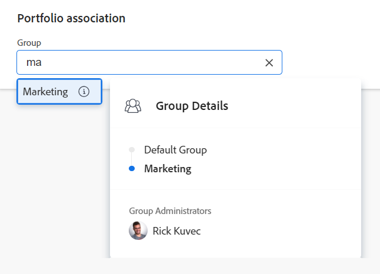

# Redigera portföljer

Du kan redigera information om portföljer som du har skapat eller som andra användare har skapat om de har delat dem med dig.

Du kan redigera en [!UICONTROL portfolio] på portföljsidan eller redigera portföljer i en lista.

## Åtkomstkrav

+++ Expandera om du vill visa åtkomstkrav för funktionerna i den här artikeln.

<table style="table-layout:auto"> 
 <col> 
 <col> 
 <tbody> 
  <tr> 
   <td role="rowheader">[!DNL Adobe Workfront] plan</td> 
   <td> 
Alla
</td> 
  </tr> 
  <tr> 
   <td role="rowheader">Adobe [!DNL Workfront] licenser*</td> 
   <td> 
Nytt: Standard

   
Aktuell: [!UICONTROL Plan] 
 </td> 
  </tr> 
  <tr> 
   <td role="rowheader">Åtkomstnivå</td> 
   <td> 
[!UICONTROL Edit] behörighet till Portfolio
  </td> 
  </tr> 
  <tr> 
   <td role="rowheader">Objektbehörigheter</td> 
   <td> 
[!UICONTROL Manage] behörigheter till en portfölj

   
 Hantera behörigheter för projekten i portföljen för att lägga till eller ta bort dem från portföljen
  </td> 
  </tr> 
 </tbody> 
</table>

*Mer information finns i [Åtkomstkrav i Workfront-dokumentation](/help/quicksilver/administration-and-setup/add-users/access-levels-and-object-permissions/access-level-requirements-in-documentation.md).

+++

## Redigera portföljer

{{step1-to-portfolios}}

1. Klicka på namnet på en portfölj för att öppna den.
1. (Valfritt) Om du vill redigera begränsad information om portföljen klickar du på **[!UICONTROL Portfolio Details]** i den vänstra panelen.

   

   <!--
   
(NOTE: the note below will also be true for Edit Portfolio box)

   -->

   >[!NOTE]
   >
   >Beroende på hur administratören eller gruppadministratören för [!DNL Workfront] ändrade din layoutmall kan fälten i området [!UICONTROL Portfolio Details] ordnas om eller inte visas. Mer information finns i [Anpassa vyn [!UICONTROL Details] med hjälp av en layoutmall](../../../administration-and-setup/customize-workfront/use-layout-templates/customize-details-view-layout-template.md).

   Så här redigerar du information i avsnittet [!UICONTROL Details]:

   1. (Valfritt) Klicka på ikonen **[!UICONTROL Collapse All]** i det övre högra hörnet om du vill komprimera alla områden.
   1. (Valfritt och villkorligt) När ett område är komprimerat klickar du på den **högerriktade pilen**  bredvid varje område för att expandera det område som du vill redigera.
   1. Om du vill ha information om de fält som visas i avsnittet [!UICONTROL Portfolio Details] kan du fortsätta redigera portföljen i rutan [!UICONTROL Edit Portfolio] enligt beskrivningen nedan.
   1. (Valfritt) Om det inte finns några anpassade formulär kopplade till portföljen börjar du skriva namnet på ett formulär i fältet **[!UICONTROL Add custom form]**, markerar det när det visas i listan och klickar sedan på **[!UICONTROL Save Changes]**.
   1. (Valfritt) Klicka på ikonen **[!UICONTROL Export]**  om du vill exportera [!UICONTROL Overview] och anpassad formulärinformation till en PDF-fil. Klicka sedan på **[!UICONTROL Export]**. Välj bland följande:

      * Markera alla (visas bara när det finns minst ett anpassat formulär bifogat)
      * Ökning
      * Namnet på ett eller flera anpassade formulär

      PDF-filen hämtas till datorn.

      

      Mer information finns i [Exportera anpassade formulär och objektinformation](../../../workfront-basics/work-with-custom-forms/export-custom-forms-details.md).

1. Om du vill redigera all information om en eller flera portföljer gör du något av följande:

   <!--
   
(NOTE: this might have to be split in two sections if the single edit and the bulk edit won't come at the same time for portfolios)

   -->

   * Klicka på menyn **[!UICONTROL More]** bredvid portföljnamnet och sedan **[!UICONTROL Edit].**

     <!--   
     
(NOTE: this will change in NWE with a new Edit Portfolio UI)
   
     -->

   * Gå till en lista med portföljer och välj en eller flera portföljer som du vill redigera. Klicka sedan på ikonen **[!UICONTROL Edit]**  högst upp i listan.

     <!--   
     
(NOTE: this will need to split into another section when they release the new [!UICONTROL Edit Portfolio] UI)
   
     -->
   Dialogrutan **[!UICONTROL Edit Portfolio]** visas.

   

   Alla portföljfält är tillgängliga i rutan [!UICONTROL Edit Portfolio] och grupperas efter de områden som visas i den vänstra panelen.

1. Det kan vara bra att ange information i följande avsnitt:

   * [[!UICONTROL Overview]](#overview)
   * [Anpassad Forms](#Custom%C2%A0F)
   * [Kommentar](#comment)

### [!UICONTROL Overview] {#overview}

1. Börja redigera en portfölj enligt beskrivningen ovan.
1. Klicka på **[!UICONTROL Overview]** och ange följande fält:

   <!--
   
(NOTE: note below is drafted: drafted till they release new Edit Portfolio boxes)

   -->

   <!--
   <note type="note">
   Depending on how your Workfront administrator or Group administrator sets up our Layout Template, the fields in the Edit Portfolio box might be rearranged or not display. For information, see
   <a href="../../../administration-and-setup/customize-workfront/use-layout-templates/customize-details-view-layout-template.md" class="MCXref xref">Customize the Details view using a layout template</a>.
   </note>
   -->

   <table style="table-layout:auto"> 
    <col> 
    <col> 
    <tbody> 
     <tr> 
      <td role="rowheader">[!UICONTROL Name]</td> 
      <td> 
Uppdatera namnet på portföljen. 
 
Tips! Detta är inte tillgängligt när du har valt mer än en portfölj. 
 </td> 
     </tr> 
     <tr> 
      <td role="rowheader">[!UICONTROL Description]</td> 
      <td> 
Skriv en beskrivning av Portfolio för att ange vad som är unikt med det. 
 </td> 
     </tr> 
     <tr> 
      <td role="rowheader">[!UICONTROL Portfolio Manager]</td> 
      <td> 
Börja skriva namnet på en användare som du vill ange som portföljförvaltare och markera den sedan när den visas i listan. Detta är samma som [!UICONTROL Portfolio Owner]. Detta är den person som kan övervaka arbetet som definieras i portföljens projekt och godkänna affärsärendet.
 
Viktigt: När du anger någon som Portfolio Manager får de automatiskt [!UICONTROL Manage] behörigheter till portföljen, programmen och projekten i portföljen. 
 
Tips! Du kan snabbt uppdatera portföljförvaltaren i portföljrubriken. 
 </td> 
     </tr> 
     <tr> 
      <td role="rowheader">[!UICONTROL Group]</td> 
      <td> 
Lägg till namnet på en enskild grupp om gruppen är associerad med portföljen eller har ansvar för att slutföra den. 
 
Tips:  
Gör följande när du öppnar fältet [!UICONTROL Group] från sidan [!UICONTROL Portfolio Details]: 
 
Du kan se till att du väljer rätt grupp genom att hålla markören över den och klicka på ikonen [!UICONTROL information]  som visas bredvid den. Här visas ett verktygstips med information om gruppen, till exempel hierarkin för grupper ovanför och dess administratörer.
 
  
 
Det här alternativet är inte tillgängligt i rutan [!UICONTROL Edit Portfolio]. 
 
 </td> 
     </tr> 
     <tr> 
      <td role="rowheader"> 
[!UICONTROL Alignment Scorecard]
 </td> 
      <td> 
Välj det justeringskort som du vill använda i listrutan. Ett styrkort används för att mäta hur väl ett projekt överensstämmer med de fastställda kriterierna för ett Portfolio som ofta återspeglar en organisations uppdrag, värderingar och strategiska mål. Mer information finns i <a href="../../../manage-work/projects/define-a-business-case/apply-scorecard-to-project-to-generate-alignment-score.md" class="MCXref xref">Använda ett styrkort i ett projekt och generera ett justeringsresultat</a> och <a href="../../../administration-and-setup/set-up-workfront/configure-system-defaults/create-scorecard.md" class="MCXref xref">Skapa ett styrkort</a>.
 </td> 
     </tr> 
     <tr> 
      <td role="rowheader">[!UICONTROL Is Active]</td> 
      <td> 
 Markera den här kryssrutan om du vill att portföljen ska vara aktiv. Andra användare kan hitta aktiva portföljer och bifoga dem till projekt när de skapar eller redigerar projekt. Inaktiva portföljer kan inte kopplas till projekt. Detta är aktiverat som standard.
 </td> 
     </tr> 
    </tbody> 
   </table>

1. Klicka på **[!UICONTROL Save Changes]** eller fortsätt redigera följande avsnitt.

### Anpassad Forms

1. Börja redigera portföljen enligt beskrivningen ovan.
1. Klicka på listrutan **[!UICONTROL Add Forms]** för att välja ett anpassat formulär och lägga till det i portföljen.

   Du måste skapa anpassade portföljformulär innan de kan läggas till.

   >[!NOTE]
   >
   >Beroende på hur din [!DNL Workfront]-administratör anger behörigheter för avsnitten i ditt anpassade formulär kan inte alla visa eller redigera samma fält i ett visst anpassat formulär. Behörigheterna att redigera fält i ett avsnitt i ett anpassat formulär beror på vilka behörigheter du har på själva portföljen. Mer information om att ange behörigheter för avsnitt i ett anpassat formulär finns i [Skapa ett anpassat formulär](/help/quicksilver/administration-and-setup/customize-workfront/create-manage-custom-forms/form-designer/design-a-form/design-a-form.md).

1. Uppdatera fält i anpassade formulär och klicka sedan på **[!UICONTROL Save Changes]** eller fortsätt med följande avsnitt.

### Kommentar {#comment}

1. Börja redigera en portfölj enligt beskrivningen ovan.
1. Klicka på **[!UICONTROL Comment]**.

   

1. Lägg till en kommentar i fältet **[!UICONTROL Post an update to the portfolio]**.
1. (Valfritt) Klicka på ikonen **[!UICONTROL People]** för att lägga till en användare eller ett team i kommentaren.
1. (Valfritt) Klicka på ikonen **[!UICONTROL Lock]** om du vill låsa kommentaren och göra den privat för endast användare i ditt företag.
1. Klicka på **[!UICONTROL Save Changes]**.
