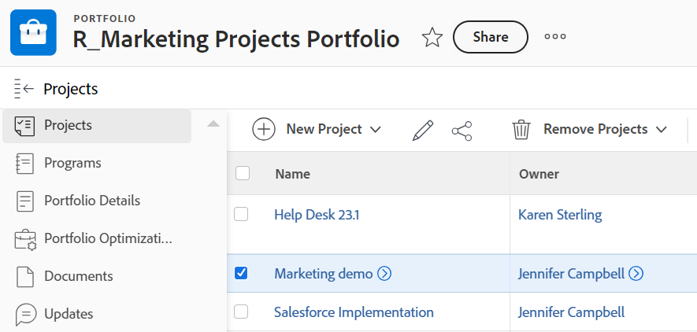

# Ta bort ett projekt från en portfölj

Du kan ta bort ett projekt från en portfölj och associera det med en annan portfölj eller ta bort kopplingen mellan ett projekt och en portfölj helt.

Du kan också ta bort projekt från en portfölj som också tar bort dem från [!DNL Adobe Workfront].

## Åtkomstkrav

Du måste ha följande åtkomst för att kunna utföra stegen i den här artikeln:

<table style="table-layout:auto"> 
 <col> 
 <col> 
 <tbody> 
  <tr> 
   <td role="rowheader">[!DNL Adobe Workfront] plan*</td> 
   <td> 
[!UICONTROL Business] eller högre
 </td> 
  </tr> 
  <tr> 
   <td role="rowheader">[!DNL Adobe Workfront] licens*</td> 
   <td> 
[!UICONTROL Plan] 
 </td> 
  </tr> 
  <tr> 
   <td role="rowheader">Konfigurationer på åtkomstnivå*</td> 
   <td> 
[!UICONTROL Edit] behörighet till projekt
 
[!UICONTROL View] behörighet till Portfolio eller högre
 
Obs! Om du fortfarande inte har åtkomst frågar du [!DNL Workfront]-administratören om de anger ytterligare begränsningar för din åtkomstnivå. Mer information om hur en [!DNL Workfront]-administratör kan ändra din åtkomstnivå finns i <a href="../../../administration-and-setup/add-users/configure-and-grant-access/create-modify-access-levels.md" class="MCXref xref">Skapa eller ändra anpassade åtkomstnivåer</a>.
 </td> 
  </tr> 
  <tr> 
   <td role="rowheader">Objektbehörigheter</td> 
   <td> 
[!UICONTROL Manage] behörigheter på Portfolio för att ta bort projekt  [!UICONTROL Manage] behörigheter med [!UICONTROL Delete]-åtkomst till projekten för att ta bort dem från portföljen
 
Mer information om hur du begär ytterligare åtkomst finns i <a href="../../../workfront-basics/grant-and-request-access-to-objects/request-access.md" class="MCXref xref">Begär åtkomst till objekt </a>.
 </td> 
  </tr> 
 </tbody> 
</table>

&#42;Kontakta [!DNL Workfront]-administratören om du vill ta reda på vilken plan, licenstyp eller åtkomst du har.

## Ta bort ett projekt från en portfölj

1. Gå till Portfolio och klicka på **[!UICONTROL Projects]** i den vänstra panelen.
1. Välj det projekt som ska tas bort. 

   

1. Klicka på **[!UICONTROL Remove Projects]**.
1. Klicka på **[!UICONTROL Delete]** om du vill ta bort projektet från [!DNL Workfront] eller **[!UICONTROL Remove]** **[!UICONTROL from Portfolio]** om du vill ta bort det från den markerade Portfolio.

1. (Valfritt och villkorligt) Hitta det projekt som du har tagit bort från portföljen och koppla det till en annan portfölj. Mer information om hur du associerar projekt med portföljer finns i [Lägga till projekt i en portfölj](../../../manage-work/portfolios/create-and-manage-portfolios/add-projects-to-portfolios.md).
