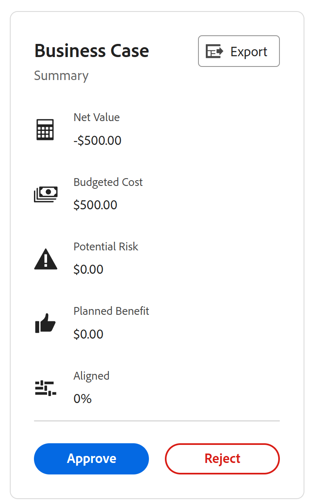

# Granska begärda projekt

<!--Audited: 10/2025-->

När flera projektförfrågningar skickas in för granskning kan projektledningskontoret eller portföljkommittén mötas för att granska inskickade förfrågningar och fastställa godkännanden av projektförfrågningar. Projektbegäranden visas som projekt med statusen [!UICONTROL Requested] i [!DNL Adobe Workfront].

Du kan skicka en projektförfrågan för granskning genom att göra något av följande:

* Ändra projektstatus till **[!UICONTROL Requested]**.
* Slutför [!UICONTROL Business Case] av projektet och skicka det för godkännande.\
   Mer information om hur du fyller i ett affärsärende för ett projekt finns i [Skapa ett affärsärende för ett projekt](../../../manage-work/projects/define-a-business-case/create-business-case.md).

Du kan granska begärda projekt i följande områden i [!DNL Adobe Workfront]:

* I en projektrapport
* Inom en portfölj

## Åtkomstkrav

+++ Expandera om du vill visa åtkomstkrav för funktionerna i den här artikeln. 

<table style="table-layout:auto"> 
 <col> 
 <col> 
 <tbody> 
  <tr> 
   <td role="rowheader">[!DNL Adobe Workfront] package</td> 
   <td>
Alla
 </td> 
  </tr> 
  <tr> 
   <td role="rowheader">[!DNL Adobe Workfront] licens</td> 
   <td> 
[!UICONTROL Standard] 
 
   
[!UICONTROL Plan]
 </td> 
  </tr> 
  <tr> 
   <td role="rowheader">Konfigurationer på åtkomstnivå</td> 
   <td> 
[!UICONTROL View] åtkomst eller senare till portföljer
 
[!UICONTROL Edit] behörighet till projekt
  </td> 
  </tr> 
  <tr> 
   <td role="rowheader">Objektbehörigheter</td> 
   <td> 
[!UICONTROL View] behörigheter eller högre för portföljen
 
[!UICONTROL Manage] behörigheter för projekten för att uppdatera deras status
  </td> 
  </tr> 
 </tbody> 
</table>

*Mer information finns i [Åtkomstkrav i Workfront-dokumentation](/help/quicksilver/administration-and-setup/add-users/access-levels-and-object-permissions/access-level-requirements-in-documentation.md).

+++

<!--Old:

<table style="table-layout:auto"> 
 <col> 
 <col> 
 <tbody> 
  <tr> 
   <td role="rowheader">[!DNL Adobe Workfront] plan</td> 
   <td>
Any
 </td> 
  </tr> 
  <tr> 
   <td role="rowheader">[!DNL Adobe Workfront] license*</td> 
   <td> 
[!UICONTROL Plan] 
 </td> 
  </tr> 
  <tr> 
   <td role="rowheader">Access level configurations</td> 
   <td> 
[!UICONTROL View] access or higher to Portfolios
 
[!UICONTROL Edit] access to Projects
  </td> 
  </tr> 
  <tr> 
   <td role="rowheader">Object permissions</td> 
   <td> 
[!UICONTROL View] permissions or higher on the portfolio
 
[!UICONTROL Manage] permissions on the projects to update their status
  </td> 
  </tr> 
 </tbody> 
</table>-->

## Granska begärda projekt i en projektrapport

Du kan skapa en rapport för projekt för att se vilka projekt som har statusen [!UICONTROL Requested].

Mer information om hur du godkänner projektbegäranden genom att skapa en projektrapport finns i avsnittet [[!UICONTROL Approving the Business Case by Building a Project Report]](../../../manage-work/projects/define-a-business-case/approve-business-case.md#build-a-report) i [Godkänn ett affärsärende](../../../manage-work/projects/define-a-business-case/approve-business-case.md).

## Granska begärda projekt i en portfölj

1. Gå till portföljen vars begärda projekt du vill granska.
1. Klicka på **[!UICONTROL Projects]** i den vänstra panelen
1. Välj **[!UICONTROL Filter]** i listrutan **[!UICONTROL Requested]**.

   Endast projekt med statusen **[!UICONTROL Requested]** visas i listan.

   >[!TIP]
   >
   > Förutom statusen **[!UICONTROL Requested]** måste projekt associeras med den valda Portfolio som ska visas i den här listan.

1. Klicka på namnet på ett projekt i listan för att öppna det.
1. Klicka på **[!UICONTROL Project Details]** i den vänstra panelen.
1. Gör något av följande:

   * Klicka på **[!UICONTROL Business Case]** och sedan på **[!UICONTROL Approve]** eller **[!UICONTROL Reject]** i området [!UICONTROL Business Case Summary] för att godkänna eller avvisa affärsärendet.

     

     Projektstatusen ändras till **[!UICONTROL Approved]** om affärsärendet har godkänts.

     Projektstatusen ändras till **[!UICONTROL Rejected]** om affärsärendet avvisas.

     >[!NOTE]
     >
     >Det finns inga meddelanden som informerar användaren som skickade in godkännandet av affärsärendet om hans/hennes projektförfrågan godkändes eller avvisades.

     eller

   * Ändra status för projektet till någon annan status i listrutan **[!UICONTROL Status]**.

     

