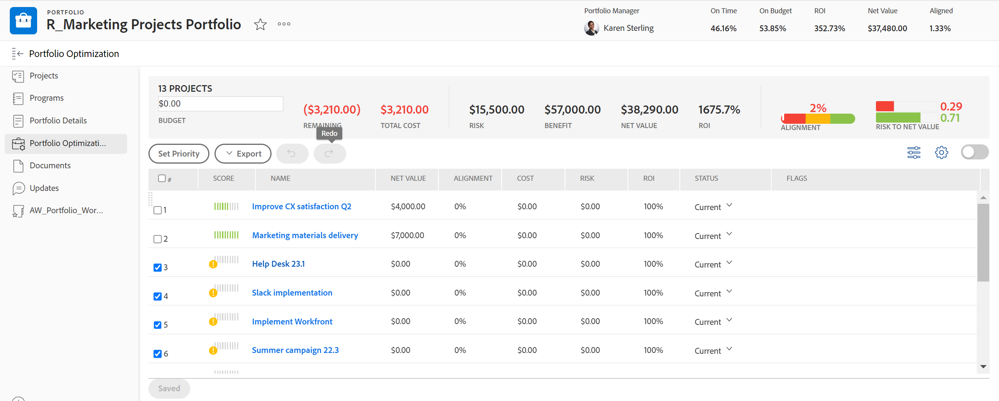
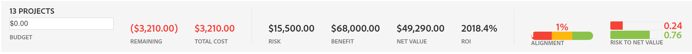
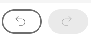

# [!UICONTROL Portfolio Optimizer] - översikt

<!-- Audited: 01/2024 -->

[!UICONTROL Portfolio Optimizer] är det verktyg som används för projektutvärdering och jämförelse. Gransknings- och jämförelseprocessen för [!UICONTROL Business Case]-värden för projekt som tilldelats en portfölj är hur en portföljförvaltare kan prioritera projekt och generera det högsta värdet för en organisation.

Syftet med [!UICONTROL portfolio optimizer] är att tillhandahålla ett gränssnitt genom vilket en portföljförvaltare, styrkommitté eller produktledning kan visa sammanfattande information om varje projekts affärsmodell. Projekten kan sedan prioriteras enligt strategiska värden och mål, eller enligt deras övergripande poäng.

[!UICONTROL Portfolio Optimizer] kan bara hjälpa dig om du har uppfyllt följande krav:

* [!UICONTROL Business Cases] har slutförts i projekten. Mer information finns i artiklarna i [Definiera ett affärsärende: artikelindex](../../projects/define-a-business-case/define-business-case.md).
* En portfölj definieras i området Projektöversikt i avsnittet Projektinformation för de projekt som du vill granska.
* Du har angett projektbudget och planerad förmån för de projekt som du vill granska. Fast kostnad och Fast intäkt är valfria men tillför ytterligare värde. Mer information finns i [Projektfinansieringsfält](../../projects/project-finances/project-finances-overview-1.md).

Mer information om hur du hittar [!UICONTROL Portfolio Optimizer] finns i [Leta reda på [!UICONTROL Portfolio Optimizer]](../../../manage-work/portfolios/portfolio-optimizer/locate-portfolio-optimizer.md).

## Finanser i [!UICONTROL Portfolio Optimizer]

Du kan se portföljens ekonomiska status när som helst under projektens livstid när du använder [!UICONTROL Portfolio Optimizer].

Tänk på följande när du arbetar med ekonomi i [!UICONTROL Portfolio Optimizer]:

* Alla projekt får ett poängvärde när deras [!UICONTROL Business Cases] slutförs enligt vilka kriterier de matchar i [!UICONTROL Portfolio Optimizer]. Låga eller höga justeringsprojekt får till exempel högre poäng.

  Mer information om hur du beräknar portföljoptimeringspoängen för ett projekt finns i [Översikt över [!UICONTROL Portfolio Optimizer] bakgrundsmusiken ](../../../manage-work/portfolios/portfolio-optimizer/portfolio-optimizer-score.md).

* De ekonomiska beräkningarna för [!UICONTROL Portfolio Optimizer] använder [!UICONTROL Budgeted Cost] i [!UICONTROL Business Case] för projektet.
* Du kan prioritera dina projekt i [!UICONTROL Portfolio Optimizer] manuellt, med hänsyn tagen till all information om dem. Detta inkluderar till exempel ekonomiska data, anpassning till deras styrkort och avkastning.

### De ekonomiska områdena i [!UICONTROL Portfolio Optimizer] {#the-financial-areas-in-the-portfolio-optimizer}

Du kan visa ekonomisk information i följande områden av [!UICONTROL Portfolio Optimizer]:

* **[!UICONTROL Portfolio Header]**: I det här området visas ekonomisk information som samlats in från alla projekt i portföljen. Den visas på alla flikar i Portfolio-objektet.
* **[!UICONTROL Portfolio Finances for Selected Projects]**: I det här området visas ekonomisk information som samlats in från de projekt som har valts i [!UICONTROL Portfolio Optimizer]. Du kan lägga till eller ta bort projekt och förstå hur detta påverkar portföljens ekonomi genom att visa informationen i det här området.
* **[!UICONTROL Projects Finances]**: I det här området visas den ekonomiska informationen för varje projekt i [!UICONTROL Portfolio Optimizer].

### De ekonomiska fälten i [!UICONTROL Portfolio Optimizer] {#the-financial-fields-in-the-portfolio-optimizer}

Följande ekonomiska fält visas i [!UICONTROL Portfolio Optimizer]:

* [Portfolio header](#portfolio-header)
* [Portfolio finanser för utvalda projekt](#portfolio-finances-for-selected-projects)

#### Portfolio header {#portfolio-header}

[!DNL Adobe Workfront] beräknar de ekonomiska fälten i portföljrubriken med hjälp av information från projekt med statusvärden som bara motsvarar [!UICONTROL Approved] eller [!UICONTROL Current].

<table style="table-layout:auto"> 
 <col> 
 <col> 
 <thead> 
  <tr> 
   <th><strong>Fältets namn</strong> </th> 
   <th><strong>Beskrivning</strong> </th> 
  </tr> 
 </thead> 
 <tbody> 
  <tr> 
   <td>[!UICONTROL On Time]</td> 
   <td> 
Procentandelen projekt i portföljen som betraktas som [!UICONTROL On Time]. Detta visas från alla flikar i en portfölj.
 
Ett projekt anses vara [!UICONTROL On Time] när projektet <strong>[!UICONTROL Condition]</strong> är <strong>[!UICONTROL On Target]</strong>.  Mer information om [!UICONTROL Project Conditions] finns i artikeln <a href="../../../manage-work/projects/manage-projects/project-condition-and-condition-type.md" class="MCXref xref">Översikt över projektvillkor och villkorstyp</a>.
 
Procentandelen <strong>[!UICONTROL On Time]</strong> beräknas med följande formel:
 
<em>[!UICONTROL On Time Portfolio Percentage] = Antal [!UICONTROL On Time] projekt/totalt antal projekt i en [!UICONTROL Current] eller [!UICONTROL Approved] status </em> 
 </td> 
  </tr> 
  <tr> 
   <td>[!UICONTROL On Budget]</td> 
   <td> 
Procentandelen projekt i portföljen som betraktas som [!UICONTROL On Budget]. Detta visas från alla flikar i en [!UICONTROL portfolio].
 
Projekt är <strong>[!UICONTROL On Budget]</strong> när de inte har överskridit sin fördefinierade budget.  Mer information om budgeten för ett projekt finns i artikeln <a href="../../../manage-work/projects/project-finances/manage-project-finance-area.md" class="MCXref xref">[!UICONTROL Manage] information i projektfinansieringsdelen </a>.
 
Procentandelen [!UICONTROL On Budget] beräknas med följande formel:
 
<em>[!UICONTROL On Budget Portfolio Percentage] = Antal [!UICONTROL On Budget] projekt/totalt antal projekt </em><em> i en [!UICONTROL Current] eller [!UICONTROL Approved] status</em> 
 </td> 
  </tr> 
  <tr> 
   <td>Räntabilitet (för portfölj)</td> 
   <td> 
[!UICONTROL Return on Investment] (ROI) för portföljen beräknas genom att ta hänsyn till totalt [!UICONTROL Benefit] för [!UICONTROL Portfolio] och totalt [!UICONTROL Budgeted Costs] för projekten. Detta visas från alla flikar i en portfölj.
 
Portfolio avkastningsvärde beräknas med följande formel:
 
<em>Portfolio ROI = ([!UICONTROL Total Benefit] - [!UICONTROL Total Budgeted Cost])/ [!UICONTROL Total Cost] * 100</em> 
 
Mer information om hur avkastningen beräknas för ett projekt finns i artikeln <a href="../../../manage-work/projects/project-finances/calculate-roi.md" class="MCXref xref">Beräkna avkastning på investering (ROI)</a>.
 </td> 
  </tr> 
  <tr> 
   <td>[!UICONTROL Aligned] eller [!UICONTROL Alignment Score] </td> 
   <td> 
Ett genomsnitt av alla [!UICONTROL Project Alignment Score]-värden, som beräknas efter att [!UICONTROL Scorecard] har slutförts i [!UICONTROL Business Case] för projektet. Justeringspoängen för varje projekt listas i kolumnen [!UICONTROL Alignment] i [!UICONTROL Portfolio Optimizer]. Detta visas från alla flikar i en portfölj.
 
Mer information om hur du genererar justeringspoäng för ett projekt finns i artikeln <a href="../../../manage-work/projects/define-a-business-case/apply-scorecard-to-project-to-generate-alignment-score.md" class="MCXref xref">Använda ett styrkort för ett projekt och generera ett justeringspoäng</a>.
 </td> 
  </tr> 
  <tr> 
   <td>[!UICONTROL Net Value]</td> 
   <td> 
Summan av alla [!UICONTROL Net Values] av alla projekt i portföljen. Detta visas från alla flikar i en portfölj.
 
Mer information om hur [!UICONTROL Net Value] beräknas för ett projekt finns i artikeln <a href="../../../manage-work/projects/project-finances/calculate-net-value.md" class="MCXref xref">Beräkna nettovärde</a>.
 </td> 
  </tr> 
 </tbody> 
</table>

#### Portfolio finanser för utvalda projekt {#portfolio-finances-for-selected-projects}

<table style="table-layout:auto"> 
 <col> 
 <col> 
 <thead> 
  <tr> 
   <th><strong>Fältets namn</strong> </th> 
   <th><strong>Beskrivning</strong></th> 
  </tr> 
 </thead> 
 <tbody> 
  <tr> 
   <td>[!UICONTROL Number of projects]</td> 
   <td> 
Det totala antalet aktiva projekt i portföljen. Projekt som betraktas som aktiva i en portfölj kan ha någon av följande statusvärden:
 
    <ul> 
     <li>[!UICONTROL Current]</li> 
     <li>[!UICONTROL Planning]</li> 
     <li>[!UICONTROL Approved]</li> 
    </ul> </td> 
  </tr> 
  <tr> 
   <td>[!UICONTROL Budget]</td> 
   <td>Du kan uppdatera det här fältet manuellt för att ange den totala budgeten för hela portföljen. Den här budgeten används för alla projekt i portföljen. </td> 
  </tr> 
  <tr> 
   <td>[!UICONTROL Remaining]</td> 
   <td> 
Den återstående budgeten efter alla [!UICONTROL Budgeted Costs] för alla projekt i portföljen har dragits av från portföljens budget.
 
[!UICONTROL Remaining Portfolio Budget] beräknas med följande formel:
 
<em>[!UICONTROL Remaining Portfolio Budget] = [!UICONTROL Total Portfolio Budget] - Totalt [!UICONTROL Budgeted Cost] för alla Portfolio-projekt </em> 
 
Den totala [!UICONTROL Budgeted Cost] för alla projekt i portföljen visas i indikatorfältet i budgetfältet. 
 
Mer information om hur du spårar kostnader för ett projekt finns i <a href="../../../manage-work/projects/project-finances/track-costs.md" class="MCXref xref">Spåra kostnader</a>.
 </td> 
  </tr> 
  <tr> 
   <td>[!UICONTROL Total Cost]</td> 
   <td> 
Summan av kostnaderna för alla projekt som visas i [!UICONTROL Portfolio Optimizer]. Kostnaden för varje projekt är densamma som för [!UICONTROL Budgeted Cost] i projektet som det visas i [!UICONTROL Business Case Summary]. 
 
Mer information om de finansiella fälten i projekt i [!UICONTROL Business Case] finns i avsnittet"Understanding Financial Fields in the Business Case" i artikeln <a href="../../../manage-work/projects/define-a-business-case/create-business-case.md" class="MCXref xref">Create a Business Case for a project</a>.
 </td> 
  </tr> 
  <tr> 
   <td>[!UICONTROL Risk] </td> 
   <td> 
Summan av alla [!UICONTROL Potential Risk Costs] av alla projekt i portföljen. [!UICONTROL Potential Risk Cost] för varje projekt visas i kolumnen [!UICONTROL Risk] i [!UICONTROL Portfolio Optimizer]. 
 
Mer information om hur du beräknar risker för projekt finns i artikeln <a href="../../../manage-work/projects/project-finances/potential-risk-cost.md" class="MCXref xref">Beräkna potentiella riskkostnader</a>.
 </td> 
  </tr> 
  <tr> 
   <td>[!UICONTROL Benefit]</td> 
   <td> 
Summan av alla [!UICONTROL Planned Benefit]-värden för alla projekt i portföljen. Det planerade förmånsvärdet för varje projekt listas i kolumnen [!UICONTROL Benefit] i [!UICONTROL Portfolio Optimizer]. 
 
Mer information om [!UICONTROL Planned Benefit] för ett projekt finns i artikeln <a href="../../../manage-work/projects/project-finances/project-planned-benefit.md" class="MCXref xref">Översikt över projektplanerad förmån</a>.
 </td> 
  </tr> 
  <tr> 
   <td>[!UICONTROL Risk to Net Value] indikator</td> 
   <td> 
Mäter värdet [!UICONTROL Potential Risk], med beaktande av [!UICONTROL Net Value] som tillhandahålls av alla projekt i portföljen. För att uppnå maximal effektivitet i portföljen vill du se att indikatorn [!UICONTROL Risk] är låg och att indikatorn [!UICONTROL Net Value] är hög. 
 
Mer information om hur du beräknar risk för [!UICONTROL Net Value] finns i artikeln <a href="../../../manage-work/portfolios/portfolio-optimizer/calculate-risk-to-net-value-in-portfolio.md" class="MCXref xref">Beräkna risk till nettovärde i en portfölj</a>.
 </td> 
  </tr> 
 </tbody> 
</table>

## Anpassa [!UICONTROL Portfolio Optimizer]

Du kan bara anpassa projektlistområdet för [!UICONTROL Portfolio Optimizer] genom att använda inställningar för att ändra informationen i listan.

Följande ikoner och alternativ är tillgängliga för [!UICONTROL Portfolio Optimizer]:

<table style="table-layout:auto"> 
 <col> 
 <col> 
 <col> 
 <tbody> 
  <tr> 
   <td><strong>Ikon i Portfolio Optimizer</strong></td> 
   <td><strong>Namn</strong></td> 
   <td><strong>Funktion</strong></td> 
  </tr> 
  <tr> 
   <td>  </td> 
   <td>[!UICONTROL Set project priority]</td> 
   <td>
Använd den här ikonen när du vill spara projektordningen utifrån deras prioritet.

   
Du måste ha behörigheten Hantera för alla projekt i listan för att kunna använda <b>Ange projektprioritet</b>
.
    </td> 
  </tr> 
  <tr> 
   <td>  </td> 
   <td>[!UICONTROL Optimize portfolio]</td> 
   <td>Använd den här ikonen för att optimera portföljen baserat på följande ekonomiska värden för projekten:
    <ul>
     <li>[!UICONTROL Cost]</li>
     <li>[!UICONTROL Alignment]</li>
     <li>[!UICONTROL Value]</li>
     <li>[!UICONTROL Risk to Benefit]</li>
     <li>[!UICONTROL ROI]</li>
    </ul>
Mer information om hur du optimerar din portfölj finns i artikeln <a href="../../../manage-work/portfolios/portfolio-optimizer/optimize-projects-in-portfolio-optimizer.md" class="MCXref xref">Optimera projekt i [!UICONTROL Portfolio Optimizer]</a>.
</td> 
  </tr> 
  <tr> 
   <td>  </td> 
   <td>[!UICONTROL Undo]/ [!UICONTROL Redo] ikoner</td> 
   <td>Använd de här ikonerna om du vill avbryta eller göra om de ändringar du gjorde i [!UICONTROL Portfolio Optimizer] innan du sparade.</td> 
  </tr> 
  <tr> 
   <td>  </td> 
   <td>[!UICONTROL Show]/[!UICONTROL Hide] omarkerade projekt</td> 
   <td>Använd de här ikonerna för att visa eller dölja projekt i portföljen som du inte har markerat.</td> 
  </tr> 
  <tr> 
   <td>  </td> 
   <td>[!UICONTROL Export] </td> 
   <td> 
Använd den här ikonen om du vill exportera data i området [!UICONTROL Project Prioritization] i [!UICONTROL Portfolio Optimizer]. Du kan exportera den till följande format:
 
    <ul> 
     <li>PDF</li> 
     <li>[!DNL Excel]</li> 
     <li>[!UICONTROL Tab] Avgränsad</li> 
    </ul> </td> 
  </tr> 
  <tr> 
   <td>  </td> 
   <td>[!UICONTROL Preferences]</td> 
   <td> 
Använd den här ikonen om du vill ändra de projektfält som visas i kolumnerna för [!UICONTROL Portfolio Optimizer], eller om du vill ändra vilka projekt som visas i [!UICONTROL Optimizer] utifrån deras status. 
 
Tips:  
     <ul> 
      <li> 
Alla [!DNL Workfront] standardfält är inte tillgängliga för tillägg i kolumnerna. 
 </li> 
     </ul> 
     <ul> 
      <li> 
Du kan bara lägga till anpassade fält som har ett annat värde än noll i något av projekten i portföljen.
 </li> 
     </ul> 
 </td> 
  </tr> 
 </tbody> 
</table>
