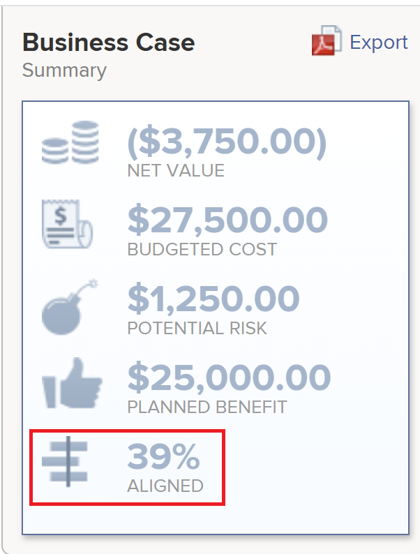
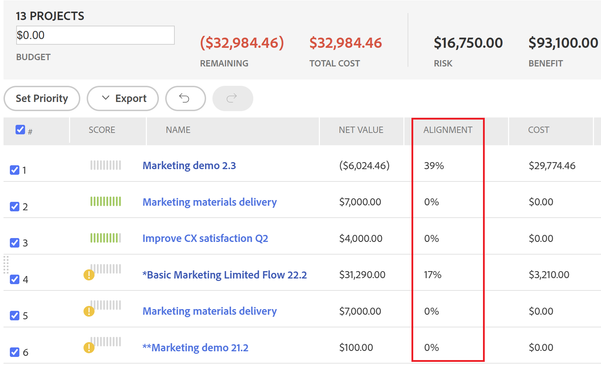
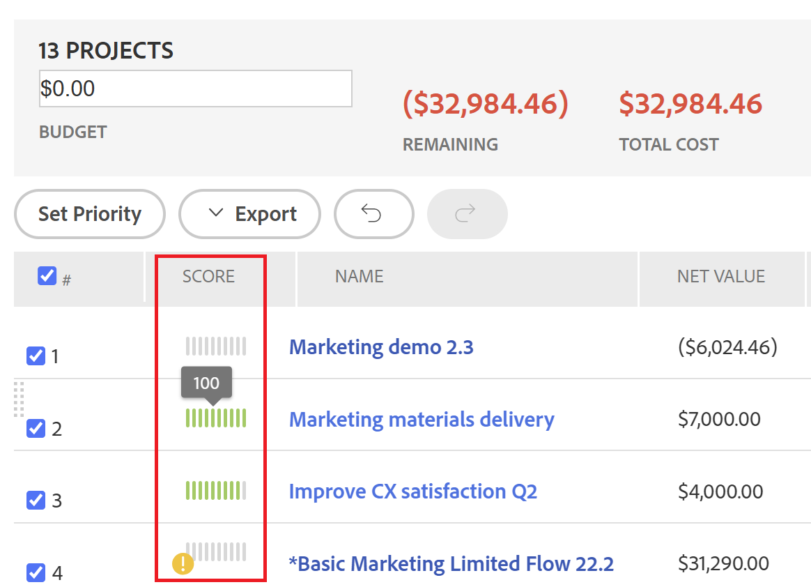

# Översikt över poängen [!UICONTROL Portfolio Optimizer]

<!--Audited: 01/2025-->

Du hittar [!UICONTROL Portfolio Optimizer]-poängen i [!UICONTROL Portfolio Optimizer]. Den visas i kolumnen **[!UICONTROL Score]** för varje projekt. Detta representerar ett poängtal för varje projekt i portföljen.

Mer information om hur du hittar [!UICONTROL Portfolio Optimizer] finns i artikeln [[!UICONTROL Portfolio Optimizer] overview](../../../manage-work/portfolios/portfolio-optimizer/portfolio-optimizer-overview.md).

Mer information om hur [!DNL Adobe Workfront] använder projektbakgrundsmusik och annan projektinformation för att optimera projekt i [!UICONTROL Portfolio Optimizer] finns i [Optimera projekt i Portfolio Optimizer](../../../manage-work/portfolios/portfolio-optimizer/optimize-projects-in-portfolio-optimizer.md).

## Skillnad mellan [!UICONTROL Alignment Score] och [!UICONTROL Portfolio Optimizer Score]

Det finns en skillnad mellan justeringspoängen och portföljoptimeringspoängen för ett projekt.

Justeringspoängen för ett projekt beräknas utifrån de poäng som erhålls när styrkortet har fyllts i. Poängen används sedan för att fastställa poängen för portföljjusteringen. Justeringspoängen visas i procent.

Justeringspoängen för ett projekt visas i kolumnen **[!UICONTROL Alignment]** i [!UICONTROL Portfolio Optimizer] eller i fältet [!UICONTROL Alignment] i [!UICONTROL Business Case Summary].





Mer information om hur du genererar justeringspoäng för ett projekt finns i artikeln [Använda ett styrkort för ett projekt och generera en justeringspoäng](../../../manage-work/projects/define-a-business-case/apply-scorecard-to-project-to-generate-alignment-score.md).

[!UICONTROL portfolio optimizer]-poängen är en rankning som beräknas automatiskt i [!UICONTROL Portfolio Optimizer] som projekt kan prioriteras med. Poängen för portföljoptimering visas som en indikatorikon tillsammans med ett tal och visas i kolumnen **[!UICONTROL Score]** i [!UICONTROL Portfolio Optimizer].

>[!NOTE]
>
>Ett projekt kan bara poängsättas i [!UICONTROL Portfolio Optimizer] om dess affärsärende har slutförts. Mer information om hur du slutför ett affärsärende finns i artikeln [[!UICONTROL Create a Business Case] för ett projekt ](../../../manage-work/projects/define-a-business-case/create-business-case.md).



Poängen för varje projekt beräknas utifrån vikten av följande kategorier:

* [!UICONTROL Cost]
* [!UICONTROL Alignment]
* [!UICONTROL Net Value]
* [!UICONTROL Risk to Benefit]
* [!UICONTROL ROI]

## Beräkna poängen för [!UICONTROL Portfolio Optimizer]

<!--
<p data-mc-conditions="QuicksilverOrClassic.Draft mode">(NOTE: This was edited based on this issue, per Anna: https://hub.workfront.com/issue/603d0c58000095ea0bc00ce5e2110693/overview)</p>
-->

[!DNL Workfront] skapar en poäng med [!UICONTROL Portfolio Optimizer] som är en rankning som hjälper till med prioriteringen av projekt. Värdena i portföljen baseras på värden som anges i projektens affärsfall och används för att beräkna en poäng för projektet. Projekt med högre poäng kan anses vara av större betydelse och kan prioriteras för att slutföras först.

Så här tar du reda på rangordningen för ett projekt:

1. Gå till [!UICONTROL Portfolio Optimizer].
1. Håll pekaren över rankningsikonen för att se resultatet för portföljoptimering för ett projekt.


Algoritmen för beräkning av poängen tar hänsyn till de värden som anges i projektens affärsfall och de vikter de har. Det ger varje projekt i optimeraren en poäng och normaliserar poängen så att det alltid finns ett projekt med poängen 100. Detta ger det bästa projektet en hög poäng.

>[!BEGINSHADEBOX]

**EXEMPEL**

Om du t.ex. gör [!UICONTROL higher alignment] till den enda faktorn att tänka på får projektet med den högsta justeringen poängen 100.

>[!ENDSHADEBOX]

Följande kriterier kan användas för att göra ett projekt poäng:

* [!UICONTROL Cost]
* [!UICONTROL Alignment]
* [!UICONTROL Value]
* [!UICONTROL Risk to Benefit]
* [!UICONTROL ROI]


Mer information om hur du optimerar projekt i portföljen finns i [Optimera projekt i [!UICONTROL Portfolio Optimizer]](../../../manage-work/portfolios/portfolio-optimizer/optimize-projects-in-portfolio-optimizer.md).

Varje villkor på konfigurationspanelen ([!UICONTROL Cost], [!UICONTROL Alignment], [!UICONTROL ROI], [!UICONTROL Net Value], [!UICONTROL Risk to Benefit]) får sina vikter i intervallet 0-100 baserat på vad du har valt.

För varje projekt med ett fullständigt affärsärende genereras ett poängtal per kriterium med följande formel:

```
Score Per Criteria = (Project Value For The Criteria - AVG(all the project values for this criteria)) / Standard Deviation of that value for that project
```

**Exempel:** För [!UICONTROL Alignment Score] för projekt A har du följande:

```
Alignment Score = (Project A Alignment Score - AVG (of all the project Alignments)) / Standard Deviation of alignment score for that project
```

När du har beräknat alla [!UICONTROL Score Per Criteria] kan du lägga till dem med hänsyn till deras vikt för att få fram det fullständiga poängtalet per projekt. Projektets poäng beräknas med följande formel:

```
Score = Cost Score * Cost Weight + Alignment Score * Alignment Weight + ROI Score * ROI Weight + Net Value Score * Net Value Weight + Risk Score * Risk Weight
```

För projektkostnaden och [!UICONTROL risk] fungerar logiken tvärtom jämfört med hur de andra villkoren fungerar: om du vill att [!UICONTROL Low Cost] ska vara viktig för dig ökar den inte, utan minskar projektets övergripande poäng med `Cost Score * Cost Weight`.

När poängen har beräknats för varje projekt definieras [!UICONTROL Optimization Score] för projekten på följande sätt:

1. [!UICONTROL Minimum] och [!UICONTROL Maximum] bakgrundsmusik har definierats.
1. Intervallet mellan dessa värden beräknas.
1. För varje projekt beräknas [!UICONTROL Optimization Score] med följande formel:

   ```
   Optimization Score = Rounded ((Score - Minimum / Range)*100)
   ```
