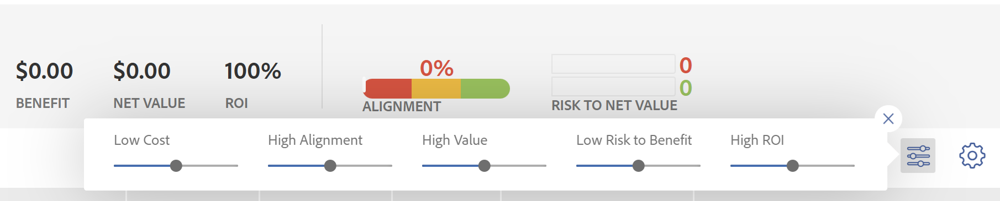

# Översikt över [!UICONTROL Portfolio Optimizer] Poäng

Du hittar [!UICONTROL Portfolio Optimizer] i [!UICONTROL Portfolio Optimizer]. Den visas i **[!UICONTROL Score]** -kolumn för varje projekt. Detta representerar ett poängtal för varje projekt i portföljen.

Mer information om hur du hittar [!UICONTROL Portfolio Optimizer], se artikeln [[!UICONTROL Portfolio Optimizer] översikt](../../../manage-work/portfolios/portfolio-optimizer/portfolio-optimizer-overview.md).

Mer information om hur [!DNL Adobe Workfront] använder projektbakgrundsmusik och annan projektinformation för att optimera projekt i [!UICONTROL Portfolio Optimizer], se [Optimera projekt i Portfolio Optimizer](../../../manage-work/portfolios/portfolio-optimizer/optimize-projects-in-portfolio-optimizer.md).

## Skillnaden mellan [!UICONTROL Alignment Score] och [!UICONTROL Portfolio Optimizer Score]

Det finns en skillnad mellan justeringspoängen och portföljoptimeringspoängen för ett projekt.

Justeringspoängen för ett projekt beräknas utifrån de poäng som erhålls när styrkortet har fyllts i. Poängen används sedan för att fastställa poängen för portföljjusteringen. Justeringspoängen visas i procent.\
Justeringspoängen för ett projekt visas i **[!UICONTROL Alignment]** kolumn i [!UICONTROL Portfolio Optimizer] eller i [!UICONTROL Alignment] fält för [!UICONTROL Business Case Summary].


Mer information om hur du genererar justeringspoängen för ett projekt finns i artikeln [Tillämpa ett styrkort på ett projekt och generera ett justeringsresultat](../../../manage-work/projects/define-a-business-case/apply-scorecard-to-project-to-generate-alignment-score.md).

The [!UICONTROL portfolio optimizer] poängen beräknas automatiskt i [!UICONTROL Portfolio Optimizer] genom vilka projekt kan prioriteras. Poängen för portföljoptimering visas som en indikatorikon tillsammans med ett tal och visas i **[!UICONTROL Score]** kolumn i [!UICONTROL Portfolio Optimizer].

>[!NOTE]
>
>Ett projekt kan poängsättas i [!UICONTROL Portfolio Optimizer] endast om ärendet har slutförts. Mer information om hur du fyller i ett affärsärende finns i artikeln [[!UICONTROL Create a Business Case] för ett projekt](../../../manage-work/projects/define-a-business-case/create-business-case.md).


Poängen för varje projekt beräknas utifrån vikten av följande kategorier:

* [!UICONTROL Cost]
* [!UICONTROL Alignment]
* [!UICONTROL Net Value]
* [!UICONTROL Risk to Benefit]
* [!UICONTROL ROI]

## Beräkna [!UICONTROL Portfolio Optimizer] Poäng

<!--
<p data-mc-conditions="QuicksilverOrClassic.Draft mode">(NOTE: This was edited based on this issue, per Anna: https://hub.workfront.com/issue/603d0c58000095ea0bc00ce5e2110693/overview)</p>
-->

[!DNL Workfront] skapar ett bakgrundsmusik med [!UICONTROL Portfolio Optimizer] som är en rankning som kan bidra till att prioritera projekt. Värdena i portföljen baseras på värden som anges i projektens affärsfall och används för att beräkna en poäng för projektet. Projekt med högre poäng kan anses vara av större betydelse och kan prioriteras för att slutföras först.

Så här tar du reda på rangordningen för ett projekt:

1. Gå till [!UICONTROL Portfolio Optimizer].
1. Håll pekaren över rankningsikonen för att se resultatet för portföljoptimering för ett projekt.


Algoritmen för beräkning av poängen tar hänsyn till de värden som anges i projektens affärsfall och de vikter de har. Det ger varje projekt i optimeraren en poäng och normaliserar poängen så att det alltid finns ett projekt med poängen 100. Detta ger det bästa projektet en hög poäng.

**Exempel:** Om du till exempel skapar [!UICONTROL higher alignment] Den enda faktorn som ska beaktas är att projektet med den högsta justeringen får poängen 100.

Följande kriterier kan användas för att göra ett projekt poäng:

* [!UICONTROL Cost]
* [!UICONTROL Alignment]
* [!UICONTROL Value]
* [!UICONTROL Risk to Benefit]
* [!UICONTROL ROI]



Mer information om hur du optimerar projekt i portföljen finns i [Optimera projekt i [!UICONTROL Portfolio Optimizer]](../../../manage-work/portfolios/portfolio-optimizer/optimize-projects-in-portfolio-optimizer.md).

Varje villkor på konfigurationspanelen ([!UICONTROL Cost], [!UICONTROL Alignment], [!UICONTROL ROI], [!UICONTROL Net Value], [!UICONTROL Risk to Benefit]) får sina vikter i intervallet 0-100 baserat på vad du har valt.

För varje projekt med ett fullständigt affärsärende genereras ett poängtal per kriterium enligt följande formel:

```
Score Per Criteria = (Project Value For The Criteria - AVG(all the project values for this criteria)) / Standard Deviation of that value for that project
```

**Exempel:** För [!UICONTROL Alignment Score] För projekt A har du följande:

```
Alignment Score = (Project A Alignment Score - AVG (of all the project Alignments)) / Standard Deviation of alignment score for that project
```

När du har fått alla [!UICONTROL Score Per Criteria] kan du lägga till dem med hänsyn till deras vikt för att få hela poängen per projekt. Projektets poäng beräknas med följande formel:

```
Score = Cost Score * Cost Weight + Alignment Score * Alignment Weight + ROI Score * ROI Weight + Net Value Score * Net Value Weight + Risk Score * Risk Weight
```

För projektkostnaden och [!UICONTROL risk] logiken fungerar tvärtom jämfört med hur de andra kriterierna fungerar: om du vill ha [!UICONTROL Low Cost] För att vara viktig för dig kommer det inte att öka utan minska projektets övergripande poäng med `Cost Score * Cost Weight`.

När poängen har beräknats för varje projekt är [!UICONTROL Optimization Score] definieras för projekten på följande sätt:

1. [!UICONTROL Minimum] och [!UICONTROL Maximum] bakgrundsmusik definieras.
1. Intervallet mellan dessa värden beräknas.
1. För varje projekt [!UICONTROL Optimization Score] beräknas med följande formel:

   ```
   Optimization Score = Rounded ((Score - Minimum / Range)*100)
   ```
