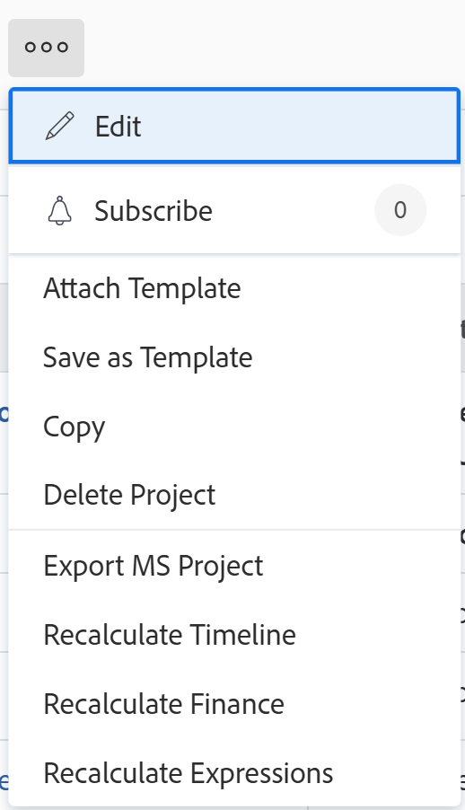

# Bifoga en mall till ett projekt

<!-- Audited: 10/2025 -->

Du kan bifoga en mall till ett projekt antingen under den inledande fasen av projektet eller efter att det har skapats.

Mer information om hur du skapar ett projekt med en mall finns i [Skapa ett projekt med en mall](../../../manage-work/projects/create-projects/create-project-from-template.md).

## Åtkomstkrav

+++ Expandera om du vill visa åtkomstkrav för funktionerna i den här artikeln.

<table style="table-layout:auto"> 
 <col> 
 <col> 
 <tbody> 
  <tr> 
   <td role="rowheader">Adobe Workfront package</td> 
   <td> 
Alla
 </td> 
  </tr> 
  <tr> 
   <td role="rowheader">Adobe Workfront-licens</td> 
   <td> 
Standard

    
Plan

    
 </td> 
  </tr> 
  <tr> 
   <td role="rowheader">Konfigurationer på åtkomstnivå</td> 
   <td> 
Redigera åtkomst till projekt 
 
Visa åtkomst till mallar
</td> 
  </tr> 
  <tr> 
   <td role="rowheader">Objektbehörigheter</td> 
   <td> 
Hantera behörigheter för projektet
 
Visa behörigheter eller högre till mallen
 </td> 
  </tr> 
 </tbody> 
</table>

Mer information om informationen i den här tabellen finns i [Åtkomstkrav i Workfront-dokumentationen](/help/quicksilver/administration-and-setup/add-users/access-levels-and-object-permissions/access-level-requirements-in-documentation.md).

+++

<!--Old:
 
 <table style="table-layout:auto"> 
 <col> 
 <col> 
 <tbody> 
  <tr> 
   <td role="rowheader">Adobe Workfront plan</td> 
   <td> 
Any 
 </td> 
  </tr> 
  <tr> 
   <td role="rowheader">Adobe Workfront license</td> 
   <td> 
New: Standard

   
Or

   
Current: Plan

    
 </td> 
  </tr> 
  <tr> 
   <td role="rowheader">Access level configurations</td> 
   <td> 
Edit access to Projects 
 
For information about project access, see <a href="../../../administration-and-setup/add-users/configure-and-grant-access/grant-access-projects.md" class="MCXref xref">Grant access to projects</a>.
 
View access to&nbsp;Templates
 
For information about template permissions, see <a href="../../../workfront-basics/grant-and-request-access-to-objects/share-a-template.md" class="MCXref xref">Share a template</a>. 
 
For information about template access, see <a href="../../../administration-and-setup/add-users/configure-and-grant-access/grant-access-templates.md" class="MCXref xref">Grant access to templates</a>.
 
Note: If you still don't have access, ask your Workfront administrator if they set additional restrictions in your access level. For information on how a Workfront administrator can modify your access level, see <a href="../../../administration-and-setup/add-users/configure-and-grant-access/create-modify-access-levels.md" class="MCXref xref">Create and modify custom access levels</a>.
 </td> 
  </tr> 
  <tr> 
   <td role="rowheader">Object permissions</td> 
   <td> 
Manage permissions to the project
 
For information about project permissions, see <a href="../../../workfront-basics/grant-and-request-access-to-objects/share-a-project.md" class="MCXref xref">Share a project in Adobe Workfront</a>. 
 
View permissions or higher to the template
 
For information on requesting additional access, see <a href="../../../workfront-basics/grant-and-request-access-to-objects/request-access.md" class="MCXref xref">Request access to objects </a>.
 </td> 
  </tr> 
 </tbody> 
</table>-->

<!--

<h2>Considerations when adding templates to projects</h2>

(NOTE: moved this to an Overview article of its own) 

Consider the following when adding templates to projects:

<ul>
<li> 
You can attach only active templates to projects. 
 </li>
<li> 
You can attach a template to a project when the project is in a status of Complete, Dead, or in Pending Approval, only when your Adobe Workfront administrator or a group administrator has enabled this functionality in the Project&nbsp;Preferences area. For information about setting project preferences, see <a href="../../../administration-and-setup/set-up-workfront/configure-system-defaults/set-project-preferences.md" class="MCXref xref">Configure system-wide project preferences</a>. 
 </li>
<li> 
Unless you exclude specific template tasks from being added in the attachment process, all template tasks are added to the existing project. 
 </li>
<li> 
Most template settings are added to the project. 
 </li>
<li> 
Some settings from the template automatically transfer to the project, unless you specifically mark them to be excluded. 

Example: </b>">
<b>Example: </b>

For example, these settings are added to the project:

<ul>
<li>Start&nbsp;From field</li>
<li>Custom forms and the information on them</li>
<li>Queue Details </li>
<li>Financial settings </li>
</ul>

 </li>
</ul>

-->

## Koppla en mall till ett befintligt projekt {#attach-a-template-to-an-existing-project}

Du kan bifoga en mall till ett projekt från projektsidan eller från en projektlista eller rapport.

{{step1-to-projects}}

1. På sidan **Projekt** väljer du det projekt som du vill koppla en mall till.

1. Klicka på ikonen **Mer**  till höger om projektnamnet.

   

   eller

   Gå till en projektlista eller rapport och välj ett projekt och klicka sedan på ikonen **Mer**  högst upp i listan.

   

1. Klicka på **Bifoga mall**. Rutan **Koppla mall** visas.

1. Börja skriva namnet på mallen som du vill bifoga i fältet **Sökmallar** och klicka sedan på den när den visas i listan.

   eller

   Klicka på namnet på en mall i området **Andra mallar**.

   En förhandsgranskning av mallen visas till höger som innehåller följande information om mallen:

   * Varaktighet
   * Ägare
   * Antalet uppgifter på den översta nivån (innehåller en lista över de tre första uppgifterna på den översta nivån)
   * Totalt antal uppgifter
   * Namn på kopplade anpassade formulär

   

1. (Valfritt) Klicka på ikonen **Favoriter**  till höger om mallnamnet för att markera det som en favorit och flytta det till listan **Favoriter** .

1. (Valfritt) Klicka på ikonen **Favoriter**  igen för att ta bort den från listan **Favoriter**.
1. Klicka på **Anpassa och bifoga**. Sidpanelen **Bifoga mall** öppnas.

1. (Valfritt) Uppdatera information i följande avsnitt:

   <table style="table-layout:auto"> 
    <col> 
    <col> 
    <tbody> 
     <tr> 
      <td role="rowheader" colspan="2"> 
Avsnittet Uppgifter
 
  
 </td> 
     </tr> 
     <tr> 
      <td role="rowheader">De valda malluppgifterna nedan importeras till projektet. Avmarkera de som du vill utesluta. </td> 
      <td>Avmarkera alla uppgifter som du vill utesluta från mallen innan du bifogar den till projektet.</td> 
     </tr> 
     <tr> 
      <td role="rowheader">Välj den projektuppgift som du vill ha som föregångare för aktiviteterna i den här mallen.</td> 
      <td> 
Klicka på fältet för att visa en lista med projektuppgifter och välj sedan vilken uppgift som ska slutföras innan malluppgifterna kan startas. Du kan också hoppa över det här steget och ställa in relationer inom projektet efter att mallen har bifogats. 
 
 Markera informationen om <strong>beroendetyp</strong>, <strong>fördröjd tid</strong> och om du vill att föregångaren ska framtvingas genom att markera kryssrutan <strong>Framtvinga föregående</strong> . 
 </td> 
     </tr> 
     <tr> 
      <td role="rowheader">Välj den projektuppgift som du vill ska vara överordnad uppgifterna i den här mallen.</td> 
      <td> Välj vilken projektuppgift som du vill ange som överordnad uppgift för alla malluppgifter. Om du inte gör något val visas alla malluppgifter i slutet av de aktuella projektaktiviteterna. Du kan hoppa över det här steget och flytta runt aktiviteter i projektet när mallen har bifogats.</td> 
     </tr> 
     <tr> 
      <td role="rowheader" colspan="2"> 
Alternativavsnitt
 
  
 </td> 
     </tr> 
     <tr> 
      <td role="rowheader">De valda objekten nedan överförs till projektet. Avmarkera de som du vill utesluta.</td> 
      <td> 
Avmarkera kryssrutorna för information som du vill utesluta från mallen innan du bifogar den till projektet. Mer information om varje fält finns i <a href="../../../manage-work/projects/create-and-manage-templates/attach-template-to-project-overview.md" class="MCXref xref">Översikt över hur du bifogar en mall till ett projekt</a>. 
 
Viktigt! Om du markerar kryssrutan <strong>Köegenskaper och inställningar för problem</strong> skriver köinformationen för mallen över projektets. I det här fallet läggs reglerna för routning, köämnen och ämnesgrupper i mallen till i projektets.  Om projektet är konfigurerat som en begärandekö och mallen som du bifogar till projektet inte är konfigurerad som en begärandekö, tas projektets köinformation bort om du inte markerar kryssrutan <strong>Köegenskaper och inställningar för problem</strong> .  Om du avmarkerar kryssrutan <strong>Köegenskaper och utgivningsinställningar</strong> bevaras alla inställningar för köinställningar i projektet och inga köinställningar från mallen bifogas. 
 </td> 
     </tr> 
     <tr> 
      <td role="rowheader" colspan="2"> 
Anpassat Forms-avsnitt
 
  
 </td> 
     </tr> 
     <tr> 
      <td role="rowheader">Anpassad Forms</td> 
      <td> 
När anpassade formulär bifogas till mallen visas deras namn på den vänstra panelen. 
 </td> 
     </tr> 
    </tbody> 
   </table>

1. (Valfritt) Uppdatera information i anpassade formulär. Den här informationen överförs till projektet.

   >[!TIP]
   >
   >* Det här steget är obligatoriskt när de anpassade formulären i mallen innehåller obligatoriska fält som är tomma.
   >* Om fälten från de anpassade mallformulären redan finns i projektet och innehåller information, bevaras den information som redan finns i projektet. Du kan inte redigera dem medan du bifogar mallen.

1. Klicka på **Bifoga mall.**
1. Klicka på **Avbryt bifogad fil** om du vill sluta koppla mallen.

   eller

   Tillåt att den bifogade filen slutförs för att lägga till mallen i projektet.

   När du har bifogat mallen kan du redigera projektet och justera uppgifter, information och inställningar efter behov.

1. (Valfritt) Klicka på **Projektinformation** i den vänstra panelen och sedan på **Översikt** för att visa namnet på mallen som du bifogade i området **Projektrelationer**.

   >[!TIP]
   >
   >Om du kopplar mer än en mall till projektet visas bara den mall som du bifogade först i det här fältet. Mer information finns i avsnittet [Koppla flera mallar till ett befintligt projekt och visa mallinformation](#attach-multiple-templates-to-an-existing-project-and-view-template-information) i den här artikeln.

1. (Valfritt) Ta bort mallinformation från projektet där du bifogade mallen. Mer information finns i [Ta bort mallinformation från ett projekt](../../../manage-work/projects/create-and-manage-templates/remove-template-from-project.md).

## Bifoga flera mallar till ett befintligt projekt och visa mallinformation {#attach-multiple-templates-to-an-existing-project-and-view-template-information}

Du kan bifoga flera mallar (en åt gången) till samma projekt enligt stegen som beskrivs i avsnittet [Koppla en mall till ett befintligt projekt](#attach-a-template-to-an-existing-project) i den här artikeln. Detta lägger till uppgifter och annan information från varje mall i projektet.

>[!TIP]
>
>När du kopplar flera mallar till ett projekt visas endast den mall som du bifogade först i området Projektinformation.

Så här visar du vilken mall som används för ett projekt:

{{step1-to-projects}}

1. På sidan **Projekt** väljer du det projekt som har en bifogad mall.

1. Klicka på **Projektinformation** i den vänstra panelen.

1. Leta reda på namnet på mallen som är kopplad till projektet i fältet **Mall** längst ned i avsnittet **Översikt** under **Projektrelationer**.

   

