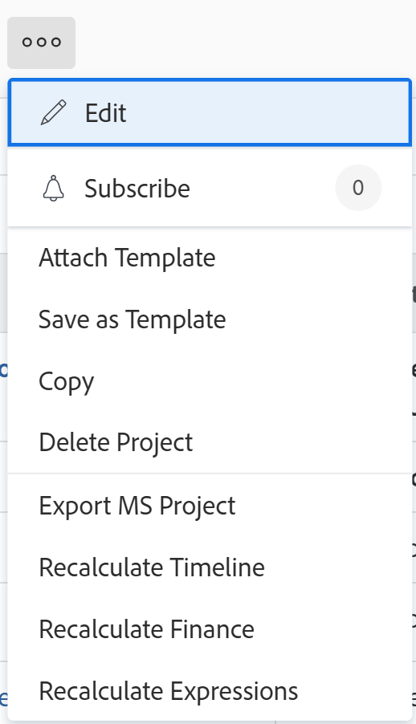

# Kopiera en projektmall

<!--Audited: 5/2025-->

Förutom att skapa en projektmall från grunden kan du även kopiera en befintlig mall och ändra den i Adobe Workfront.

## Åtkomstkrav

+++ Expandera om du vill visa åtkomstkrav för funktionerna i den här artikeln.

Du måste ha följande åtkomst.

<table style="table-layout:auto"> 
 <col> 
 <col> 
 <tbody> 
  <tr> 
   <td role="rowheader">Adobe Workfront</td> 
   <td> 
Alla 
 </td> 
  </tr> 
  <tr> 
   <td role="rowheader">Adobe Workfront-licens*</td> 
   <td>
Nytt: Standard
 
   
Aktuell: Planera 
 </td> 
  </tr> 
  <tr> 
   <td role="rowheader">Konfigurationer på åtkomstnivå</td> 
   <td> 
Redigera åtkomst till mallar
 </td> 
  </tr> 
  <tr> 
   <td role="rowheader">Objektbehörigheter</td> 
   <td> 
Visa eller ge högre behörighet till en mall
  </td> 
  </tr> 
 </tbody> 
</table>

*Mer information finns i [Åtkomstkrav i Workfront-dokumentation](/help/quicksilver/administration-and-setup/add-users/access-levels-and-object-permissions/access-level-requirements-in-documentation.md).

+++

## Att tänka på när du kopierar mallar

Följande objekt kopieras alltid från en befintlig mall till en ny:

* Malluppgifter
* Standardinformation för mallaktivitet (process för standardgodkännande av aktivitet, anpassad Forms för standarduppgift)
* Egna formulär
* Risker
* Information om köinställningar
* Portfolio och Program
* Godkännanden
* Dokument
* Dagarna för de ursprungliga malluppgifterna överförs till den nya mallen. Du måste ändra mallens start- eller slutförandedag (beroende på schemaläge) för att uppdatera de dagar som malluppgifterna gäller, om det behövs.

Följande objekt kopieras aldrig från en befintlig mall till en ny:

* Faktureringstaxor
* Användarkommentarer

## Kopiera en mall

<!--ensure steps and casing on the fields and buttons is accurate with unshim-->

1. Gå till mallen som du vill kopiera.
1. Klicka på **Mer**-menyn  till höger om mallnamnet i sidhuvudet och klicka sedan på **Kopiera**.

   Rutan **Kopiera mall** öppnas.

   <!---->

1. Ange ett namn för mallen i fältet **Nytt mallnamn**.

   Som standard är det nya namnet `Copy of Original template name`.

1. Välj alternativet **Behåll användartilldelningar för uppgifter och mall** om du vill överföra alla uppgifter och malltilldelningar från den ursprungliga mallen till den nya mallen. Uppgiftstilldelningar för mallar, mallägare och sponsor överförs till den kopierade mallen.
1. Klicka på **Spara** för att skapa en kopia av mallen.

   Den nya mallen visas i malllistan i mallområdet i Workfront.
