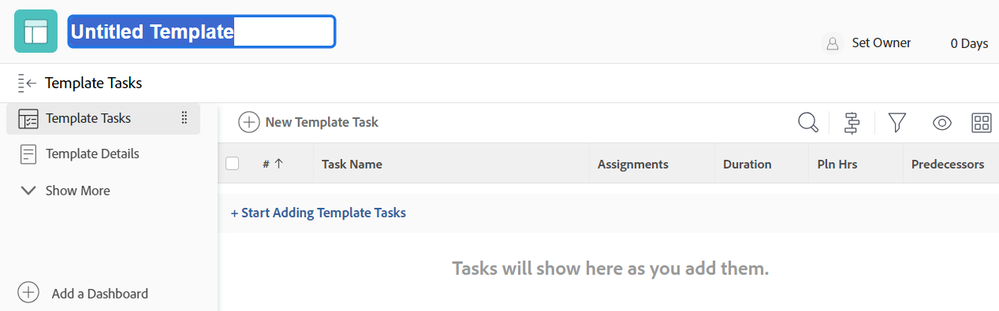

# Skapa en projektmall

<!-- Audited: 1/2024 -->

Du kan skapa och ta bort mallar under Mallar. När du skapar en ny mall kan du ange informationen för alla uppgifter och för dina framtida projektinställningar. Den här informationen överförs sedan till alla projekt som du skapar från mallen.

>[!NOTE]
>
>En mall och dess uppgifter har inga faktiska datum, utan snarare en indikation på vilken dag (från när det framtida projektet kan starta) en aktivitet kan starta och vilken dag aktiviteten kan behöva slutföras. När du använder mallar för att skapa framtida projekt får projekten faktiska datum. Mer information finns i [Skapa ett projekt](../create-projects/create-project.md).

Du kan skapa en ny mall på följande sätt:

* Från början, enligt beskrivningen i den här artikeln.
* Från befintliga projekt genom att spara ett projekt som en mall.

  Mer information om hur du skapar mallar från befintliga projekt finns i [Spara ett projekt som en mall](../../../manage-work/projects/manage-projects/save-project-as-template.md).

* Genom att kopiera den från en annan mall.

  Mer information om hur du kopierar en befintlig mall finns i [Kopiera en projektmall](../../../manage-work/projects/create-and-manage-templates/copy-template.md).

* Genom att importera utkast. Du måste vara Workfront-administratör för att kunna importera utkast. Mer information finns i [Konfigurera en plan](../../../administration-and-setup/blueprints/configure-template-package.md).

## Åtkomstkrav

+++ Expandera om du vill visa åtkomstkrav för funktionerna i den här artikeln.

Du måste ha följande:

<table style="table-layout:auto"> 
 <col> 
 <col> 
 <tbody> 
  <tr> 
   <td role="rowheader">Adobe Workfront</td> 
   <td> 
Alla
 </td> 
  </tr> 
  <tr> 
   <td role="rowheader">Adobe Workfront-licens</td> 
   <td> 
Nytt: Standard 

eller 

Aktuell: Planera 
 
Du måste vara systemadministratör för att kunna importera mallar från utkast
 </td> 
  </tr> 
  <tr> 
   <td role="rowheader">Konfigurationer på åtkomstnivå*</td> 
   <td> 
Redigera åtkomst till mallar
 </td> 
  </tr> 
  <tr> 
   <td role="rowheader">Objektbehörigheter</td> 
   <td> 
Som standard har du behörigheten Hantera för de mallar du skapar
  </td> 
  </tr> 
 </tbody> 
</table>

Mer information om informationen i den här tabellen finns i [Åtkomstkrav i Workfront-dokumentationen](/help/quicksilver/administration-and-setup/add-users/access-levels-and-object-permissions/access-level-requirements-in-documentation.md).

+++

## Skapa en mall

1. Klicka på ikonen **[!UICONTROL Main Menu]**  i det övre högra hörnet av Adobe Workfront, eller (om den är tillgänglig) klicka på ikonen **[!UICONTROL Main Menu]**  i det övre vänstra hörnet och klicka sedan på **Mallar**.

1. Klicka på **Ny mall**.

   Mallen är namnlös.

   

1. Ange ett namn för den nya mallen i mallhuvudet och tryck sedan på **Retur.**
1. Klicka på avsnittet **Malluppgifter** i den vänstra panelen.
1. Klicka på **Börja lägga till malluppgifter**.

   eller

   Klicka på **Ny mallaktivitet** om du vill lägga till aktiviteter i mallen.

   Att lägga till malluppgifter i en mall är detsamma som att lägga till uppgifter i ett projekt.

   Mer information om hur du lägger till uppgifter i ett projekt finns i [Skapa uppgifter i ett projekt](../../../manage-work/tasks/create-tasks/create-tasks-in-project.md).

   >[!NOTE]
   >
   >Du kan inte lägga till återkommande uppgifter i en mall.

1. (Valfritt) Klicka på ikonen **Gantt-schema** i det övre högra hörnet av uppgiftslistan för att visa en visuell representation av mallens uppgiftslista.

   >[!TIP]
   >
   >Du kan inte redigera aktiviteter direkt från det här Gantt-diagrammet.

1. Om du vill lägga till information i den nya mallen klickar du på ikonen **Mer**  och sedan på **Redigera**.

   Mer information om hur du redigerar en mall finns i [Redigera projektmallar](../../../manage-work/projects/create-and-manage-templates/edit-templates.md).

1. Klicka på **Spara ändringar**.
1. (Valfritt) Om du vill lägga till ytterligare objekt i mallen läser du avsnittet [Lägg till ytterligare objekt i en mall](../../../manage-work/projects/create-and-manage-templates/edit-templates.md#add-additional-items-to-a-template) i artikeln [Redigera projektmallar](../../../manage-work/projects/create-and-manage-templates/edit-templates.md).

## Mallinställningar som bestäms av gruppassociationen

Om en projektmall är associerad med en grupp (eller om det inte finns någon grupp) påverkar det hur inställningar för projekt, uppgift och problem bestämmer vissa inställningar i mallen. Mer information finns i avsnittet [Skapa och ändra en grupps projektmallar](../../../administration-and-setup/manage-groups/work-with-group-objects/create-and-modify-a-groups-templates.md#create-and-modify-a-groups-project-templates) i artikeln [Skapa och ändra en grupps projektmallar](../../../administration-and-setup/manage-groups/work-with-group-objects/create-and-modify-a-groups-templates.md).
