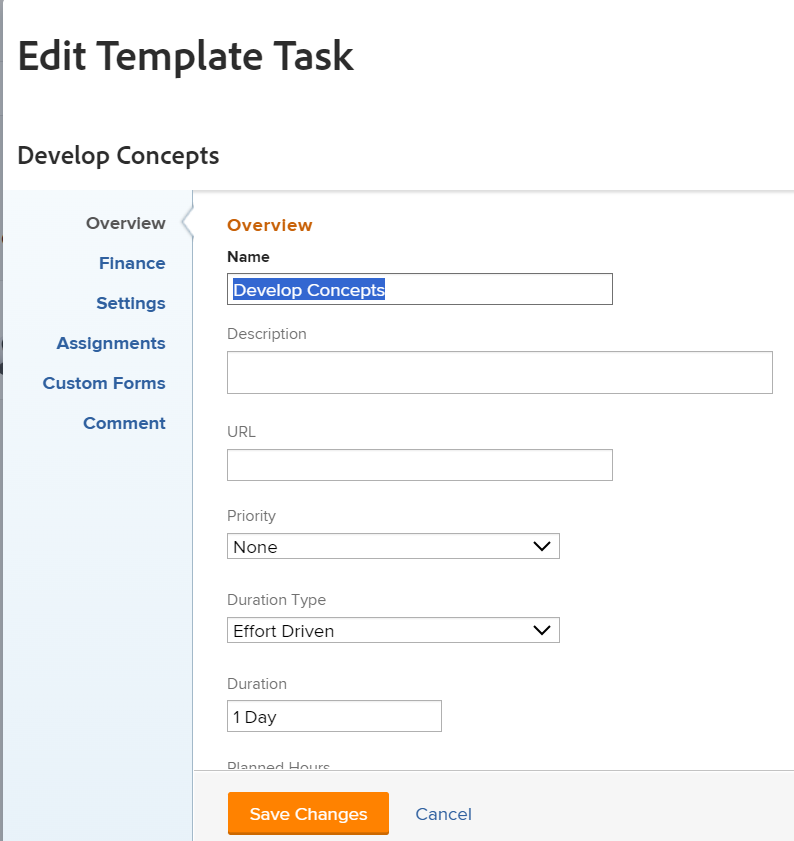
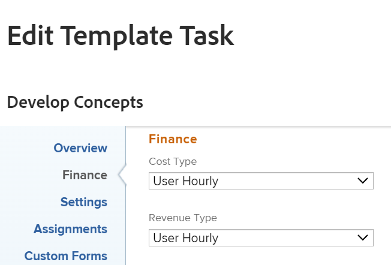
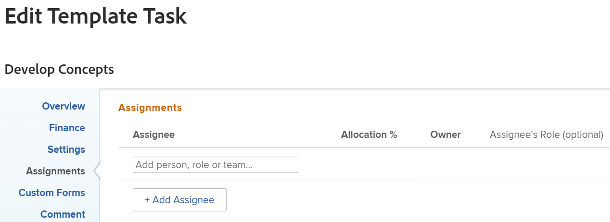
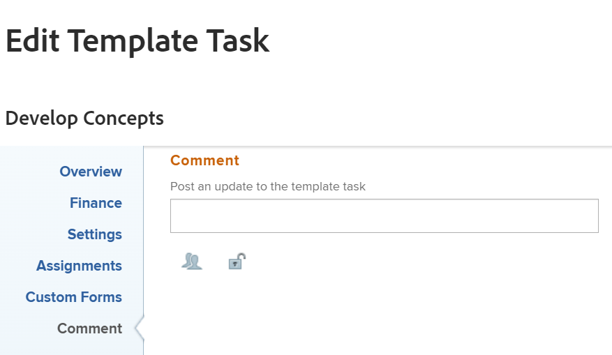

# Redigera malluppgifter

<!--Audited: 11/2025-->

<!--take out production and preview references and new/ old experiences at release-->

<!--
 

The highlighted information on this page refers to functionality not yet generally available. It is available only in the Preview environment for all customers. The same features will also be available in the Production environment for all customers starting with a week from the Preview release.      

For more information, see [Interface modernization](/help/quicksilver/product-announcements/product-releases/interface-modernization/interface-modernization.md).  

-->

När du har skapat en mall kan du redigera informationen för malluppgifterna. Den information som du uppdaterar för en malluppgift kopplas till projektuppgifter när du har använt mallen för att skapa ett projekt eller bifogat mallen till ett projekt.

Mer information om hur du skapar en mall finns i [Skapa en projektmall](../../../manage-work/projects/create-and-manage-templates/create-template.md).

Du kan redigera en malluppgift åt gången eller redigera flera malluppgifter samtidigt.

>[!NOTE]
>
>Du kan inte redigera malluppgifter som tillhör olika mallar samtidigt. Du kan bara redigera malluppgifter som tillhör samma mall.

## Åtkomstkrav

+++ Expandera om du vill visa åtkomstkrav för funktionerna i den här artikeln.

<table style="table-layout:auto"> 
 <col> 
 <col> 
 <tbody> 
  <tr> 
   <td role="rowheader">Adobe Workfront package</td> 
   <td> 
Alla
 </td> 
  </tr> 
  <tr> 
   <td role="rowheader">Adobe Workfront-licens</td> 
   <td> 
Standard

   
Plan 
</td> 
  </tr> 
  <tr> 
   <td role="rowheader">Åtkomstnivåkonfiguration</td> 
   <td> 
Redigera åtkomst till mallar
  </td> 
  </tr> 
  <tr> 
   <td role="rowheader">Objektbehörigheter </td> 
   <td> 
Hantera behörigheter för en mall. 
 
Du kan inte dela en malluppgift. 
 </td> 
  </tr> 
 </tbody> 
</table>

Mer information finns i [Åtkomstkrav i Workfront-dokumentation](/help/quicksilver/administration-and-setup/add-users/access-levels-and-object-permissions/access-level-requirements-in-documentation.md).

+++

<!--Old:

<table style="table-layout:auto"> 
 <col> 
 <col> 
 <tbody> 
  <tr> 
   <td role="rowheader">Adobe Workfront plan</td> 
   <td> 
Any
 </td> 
  </tr> 
  <tr> 
   <td role="rowheader">Adobe Workfront license*</td> 
   <td> 
Standard 

   
Plan 
 </td> 
  </tr> 
  <tr> 
   <td role="rowheader">Access level</td> 
   <td> 
Edit access to Templates
  </td> 
  </tr> 
  <tr> 
   <td role="rowheader">Object permissions </td> 
   <td> 
Manage permissions for a template. 
 
You cannot share a template task. 
 </td> 
  </tr> 
 </tbody> 
</table>-->

## Förutsättningar

Innan du börjar måste du

* Skapa en mall.

  Mer information om hur du skapar en mall finns i [Skapa en projektmall](../../../manage-work/projects/create-and-manage-templates/create-template.md).

## Redigera malluppgifter

Du kan redigera en malluppgift med området Redigera malluppgift eller Malluppgiftsinformation.

{{step1-to-templates}}

1. Klicka på namnet på en mall för att öppna den.
1. Klicka på **Malluppgifter** i den vänstra panelen.
1. Klicka på namnet på en malluppgift i listan för att öppna malluppgiften.
1. Så här redigerar du begränsad information om mallaktiviteten:
   1. (Valfritt) Klicka på **Uppdateringar** i den vänstra panelen för att lägga till uppdateringar i mallaktiviteten. Uppdateringar av malluppgifter överförs inte till projektaktiviteter när mallen används för att skapa ett projekt.
   1. (Valfritt) Klicka på **Dokument** i den vänstra panelen för att lägga till dokument i mallåtgärden. Dokumenten överförs till projektuppgifterna när du använder mallen för att skapa projektet.
   1. (Villkorligt) Om du vill redigera begränsad information om en malluppgift klickar du på **Information om malluppgift** i den vänstra panelen. Gå sedan till områdena i detaljavsnittet för att redigera information för varje område.
   1. (Valfritt) Gör något av följande:
      * Klicka på ikonen **Komprimera alla**  om du vill komprimera alla områden.
      * Klicka på ikonen **Redigera**  och välj sedan något av områdena nedan. Du kan också klicka på **Redigera alla** om du vill redigera information i alla områden:

         * Översikt
         * Anpassad Forms
Namnen på tullformulär visas bara om det finns anpassade formulär kopplade till malluppgiften.
         * Ekonomi

        >[!TIP]
        >
        >Om du vill ha information om alla fält som visas i området Detaljer kan du fortsätta redigera alla fält med rutan Redigera malluppgift, som beskrivs nedan.

   1. (Valfritt) Klicka på avsnittet **Underaktiviteter** i den vänstra panelen för att lägga till underordnade för malluppgiften. Att lägga till underaktiviteter för malluppgifter liknar att lägga till underaktiviteter för projektaktiviteter. Mer information finns i avsnittet Skapa underaktiviteter från avsnittet Underaktiviteter för aktiviteter i artikeln [Skapa underaktiviteter](/help/quicksilver/manage-work/tasks/create-tasks/create-subtasks.md).
   1. (Valfritt) Klicka på **Utgifter** i den vänstra panelen och lägg till utgifter i malluppgifterna. Malluppgiftsutgifter överförs till framtida projektaktiviteter när mallen används för att skapa ett projekt.
   1. (Valfritt) Klicka på **Godkännanden** i den vänstra panelen för att skapa godkännanden eller koppla globala godkännanden eller godkännanden på gruppnivå till mallåtgärderna. Godkännandena överförs till framtida projektaktiviteter.
   1. (Valfritt) Klicka på avsnittet **Föregående** i den vänstra panelen för att lägga till föregående för malluppgifterna. Att lägga till malluppgiftsföregångare liknar att lägga till föregångare för projektaktiviteter. Mer information finns i [Skapa en föregående relation med området Föregående användare](/help/quicksilver/manage-work/tasks/use-prdcssrs/create-predecessors-in-predecessors-area.md).

1. (Villkorligt) Om du vill redigera all information om en malluppgift eller om flera uppgifter samtidigt klickar du för att markera dem i en lista och sedan på ikonen **Redigera**  längst upp i listan.

   Rutan **Redigera mallaktivitet** visas.

   

   >[!TIP]
   >
   >Du kan också välja en malluppgift i en lista och sedan klicka på **Redigera** till höger om malluppgiftens namn i sidhuvudet för att öppna rutan **Redigera malluppgift** .

1. Det kan vara bra att ange information i följande avsnitt:

* [Malluppgiftsnamn](#template-task-name)
* [Översikt](#overview)
* [Uppdrag](#assignments)
* [Ekonomi](#finance)
* [Anpassad Forms](#custom-forms)
* [Inställningar](#settings)
* [Kommentar](#comment)

1. Fortsätt redigera malluppgifterna enligt beskrivningen i avsnitten nedan.

### Malluppgiftsnamn

>[!TIP]
>
>Avsnittet Malluppgiftsnamn är inte tillgängligt när du redigerar malluppgifter samtidigt.

1. Börja redigera en malluppgift enligt beskrivningen ovan.
1. I rutan Redigera mallaktivitet klickar du på **Malluppgiftsnamn** och lägger till ett namn för mallaktiviteten.

   Den här vyn är inte tillgänglig när du redigerar flera malluppgifter samtidigt.

1. (Valfritt) Fortsätt redigera följande avsnitt, beroende på vilken information du vill ändra.

   eller

   Klicka på **Spara**.

### Översikt {#overview}

1. Börja redigera en malluppgift enligt beskrivningen ovan.
1. Klicka på **Översikt** i den vänstra panelen i rutan **Redigera mallaktivitet**.

   

1. Uppdatera något av följande:

   <table style="table-layout:auto"> 
    <col> 
    <col> 
    <tbody> 
     <tr> 
      <td role="rowheader"><strong>Beskrivning</strong> </td> 
      <td>Lägg till ytterligare information om mallaktiviteten.</td> 
     </tr> 
     <tr> 
      <td role="rowheader"><strong>Prioritet</strong> </td> 
      <td> 
Det här är en visuell flagga som gör att du kan prioritera mallåtgärder. 
 
Välj bland följande alternativ:
 
       <ul> 
        <li> 
<strong>Ingen</strong> 
 </li> 
        <li> 
<strong>Låg</strong> 
 </li> 
        <li> 
 <b>Normal</b>
 </li> 
        <li> 
<b>Hög</b> 
 </li> 
        <li> 
<b>Brådskande</b> 
 </li> 
       </ul> 
Beroende på vilka projektinställningar du har valt av Workfront-administratören kan prioritetsnamnen vara olika för dig. Mer information om redigeringsprioriteringar finns i <a href="../../../administration-and-setup/customize-workfront/creating-custom-status-and-priority-labels/create-customize-priorities.md" class="MCXref xref">Skapa och anpassa prioriteringar</a>.
 </td> 
     </tr> 
     <tr> 
      <td role="rowheader"><strong>Aktivitetsbegränsning</strong> </td> 
      <td> 
Aktiviteten i projektet som skapas från den här mallen har den här begränsningen. Uppgiftsbegränsningar identifierar när en uppgift måste slutföras. 
 
Välj bland följande alternativ:
 
       <ul> 
        <li><strong>Fasta datum</strong>. Ange en <strong>planerad start</strong> och ett <strong>planerat slutförandedatum.</strong></li> 
        <li><strong>måste börja </strong>. Ange ett <strong>planerat startdatum.</strong></li> 
        <li><strong>Måste avslutas </strong>. Ange ett <strong>planerat slutförandedatum</strong>.</li> 
        <li><strong>Så snart som möjligt</strong> </li> 
        <li><strong>Så sent som möjligt</strong> </li> 
        <li style="font-weight: bold;"><strong>Tidigaste tillgängliga tid</strong> </li> 
        <li style="font-weight: bold;"><strong>Senaste tillgängliga tid</strong> </li> 
        <li>Börja inte senare än. Ange ett <strong>planerat startdatum</strong>.</li> 
        <li><strong>Starta inte tidigare än </strong>. Ange ett <strong>planerat startdatum</strong>.</li> 
        <li><strong>Slutför inte senare än </strong>. Ange ett <strong>planerat slutförandedatum</strong>.</li> 
        <li><strong>Slutför inte tidigare än </strong>. Ange ett <strong>planerat slutförandedatum</strong>.</li> 
       </ul> 
Mer information om uppgiftsbegränsning finns i <a href="../../../manage-work/tasks/task-constraints/task-constraint-overview.md" class="MCXref xref">Översikt över uppgiftsbegränsning</a>.
 </td> 
     </tr> 
     <tr> 
      <td role="rowheader">Startdag (valfritt och villkorligt) </td> 
      <td> 
 Du kan bara ange startdagen för en malluppgift när aktivitetsbegränsningen är något av följande:
 
       <ul> 
        <li>Måste börja på</li> 
        <li>Starta tidigast</li> 
        <li>Starta senast</li> 
        <li>Fasta datum</li> 
       </ul> 
Detta motsvarar det datum inom tidslinjen för det framtida projektet då aktiviteten startar. För alla andra begränsningar beräknas startdagen i Workfront baserat på föregående beroende mellan uppgifterna. 
 </td> 
     </tr> 
     <tr> 
      <td role="rowheader"><strong>Slutförandedag</strong> (valfritt och villkorligt) </td> 
      <td> 
 Du kan bara ange slutdagen för en malluppgift när aktivitetsbegränsningen är något av följande:
 
       <ul style="list-style-type: circle;"> 
        <li>Måste avslutas</li> 
        <li>Avsluta tidigast</li> 
        <li>Avsluta senast</li> 
        <li>Fasta datum</li> 
       </ul> 
Detta motsvarar datumet inom tidslinjen för det framtida projektet när aktiviteten ska slutföras. För alla andra begränsningar beräknar Workfront Slutförandedagen baserat på Varaktighet och föregående beroende. 
 </td> 
     </tr> 
     <tr> 
      <td role="rowheader"><strong>URL</strong> </td> 
      <td>Ange en webblänk som relaterar till informationen om mallaktiviteten.</td> 
     </tr>

   <tr> 
      <td role="rowheader"><strong>Arbetsinsats</strong> </td> 
      <td>Välj bland följande alternativ:
      <ul><li>Liten</li>
      <li>Medium</li>
      <li>Stor</li></ul>

   
<b>VIKTIGT</b>

      
Fältet Arbetsinsats visas endast när du redigerar en malluppgift när du väljer inställningen <b>Använd arbetsinsats för att automatiskt beräkna aktivitetsplanerade timmar</b> när du redigerar mallen.

   </td> 
     </tr> 
     </tbody> 
   </table>

1. (Valfritt) Fortsätt redigera följande avsnitt, beroende på vilken information du vill ändra.

   eller

   Klicka på **Spara**.

### Uppdrag {#assignments}

1. Börja redigera din malluppgift enligt beskrivningen ovan.
1. Klicka på **Uppdrag** i den vänstra panelen.

   Området **Uppdrag** öppnas.

   

1. Börja skriva namnet på en användare, en jobbroll eller ett team i fältet **Sök efter personer, en roll eller ett team** och markera dem sedan när de visas i listan.

1. Uppdatera följande information:

   <table style="table-layout:auto"> 
   <col> 
   <col> 
   <tbody> 
   <tr> 
   <td role="rowheader">Varaktighetstyp</td> 
   <td> 
Detta identifierar relationen mellan följande: 
 
   <ul> 
   <li> 
Antalet resurser som tilldelats en aktivitet 
 </li> 
   <li> 
Den totala arbetsinsats som krävs för att slutföra uppgiften 
 </li> 
   <li> 
 Aktivitetens totala varaktighet. 
 </li> 
   </ul> 
Workfront-administratören eller en gruppadministratör väljer standardinställningen för varaktighetstyp för uppgifterna i ditt system eller din grupp. Mer information om hur du anger standardinställningar för projekt finns i <a href="../../../administration-and-setup/set-up-workfront/configure-system-defaults/set-task-issue-preferences.md" class="MCXref xref">Konfigurera systemomfattande uppgifter och inställningar för problem</a>. 
 
Med varaktighetstyper kan du ange konsekventa resurstilldelningar baserat på uppgiftens behov. Mer information om varaktighetstypen för en aktivitet finns i <a href="../../../manage-work/tasks/taskdurtn/task-duration-and-duration-type.md" class="MCXref xref">Översikt över aktivitetsvaraktighet och varaktighetstyp</a>. 
 
Välj bland följande alternativ: 
 
   <ul> 
   <li> 
Beräknad tilldelning 
 </li> 
   <li> 
 Beräknat arbete 
 </li> 
   <li> 
Ansträngningsstyrd 
 </li> 
   <li> 
Enkel
 </li> 
   </ul> </td> 
   </tr> 
   <tr data-mc-conditions="QuicksilverOrClassic.Quicksilver"> 
   <td role="rowheader">Varaktighet per förekomst</td> 
   <td> 
Detta visas endast på den överordnade för återkommande uppgifter. Den visar varaktigheten för varje återkommande uppgift, enligt definition när uppgiften skapades. Mer information om hur du skapar återkommande aktiviteter finns i <a href="../../../manage-work/tasks/create-tasks/create-recurring-tasks.md" class="MCXref xref">Skapa återkommande aktiviteter</a>. 
 
 <b>OBS!</b>

   Varaktigheter som ändras i enskilda återkommande aktiviteter visar inte det värde som anges i det här fältet. 
 </td>
   </tr> 
   <tr> 
   <td role="rowheader">Varaktighet</td> 
   <td> 
   
 
   
 
   
Det här är den tid som du tillåter att en uppgift förblir öppen innan den är slutförd. 
 
   
<b>VIKTIGT</b>

   
Eftersom aktivitetens varaktighet vanligtvis är tiden mellan planerad start och planerad slutförandetid, påverkar det tidslinjen för projektet.
 
   
Så här anger du aktivitetens varaktighet och tidsenhet:
 
   <ul> 
   <li> 
Skriv in tidslängden och välj en tidsenhet i listrutan.
 
<b>TIPS</b>

   När du uppdaterar varaktigheten för uppgifter i en uppgiftslista kan du använda förkortningen för tidsenheten. 
 </li> 
   </ul> 
   
 Du kan välja mellan alternativen för normal tid eller förfluten tid i följande tabell: 
 
   <table style="table-layout:auto"> 
   <col> 
   <col data-mc-conditions=""> 
   <tbody> 
   <tr> 
   <td>Tidsenhet</td> 
   <td>Förkortning</td> 
   </tr> 
   <tr> 
   <td>Minuter</td> 
   <td>M</td> 
   </tr> 
   <tr> 
   <td>Timmar</td> 
   <td>H</td> 
   </tr> 
   <tr> 
   <td>Dagar. Det här är standardinställningen. </td> 
   <td>D</td> 
   </tr> 
   <tr> 
   <td>Veckor</td> 
   <td>B</td> 
   </tr> 
   <tr> 
   <td>Månader</td> 
   <td>T</td> 
   </tr> 
   <tr> 
   <td>Förflutna minuter</td> 
   <td>EM</td> 
   </tr> 
   <tr> 
   <td>Förflutna timmar</td> 
   <td>EH</td> 
   </tr> 
   <tr> 
   <td>Förflutna dagar</td> 
   <td>ED</td> 
   </tr> 
   <tr> 
   <td>Förflutna veckor</td> 
   <td>FV</td> 
   </tr> 
   <tr> 
   <td>Förflutna månader</td> 
   <td>ET</td> 
   </tr> 
   </tbody> 
   </table>

   
<b>ANMÄRKNING</b>

   
Förfluten tid är en tidsenhet för en uppgifts varaktighet. Det är tiden mellan det planerade startdatumet och det planerade slutförandedatumet för en aktivitet som omfattar helger, helger och ledig tid. Med andra ord är förfluten tid en del av kalenderdagarna.

   Med normal tid räknas helger, helger och ledig tid som undantag från uppgiftens varaktighet. Mer information om aktivitetens varaktighet finns i <a href="../../../manage-work/tasks/taskdurtn/task-duration-and-duration-type.md" class="MCXref xref">Översikt över aktivitetsvaraktighet och varaktighetstyp</a>. 

   
 
   
 </td> 
   </tr> 
   <tr> 
   <td role="rowheader">Planerade timmar</td> 
   <td> 
Ange antalet planerade timmar för aktiviteten, i timmar. Detta är den faktiska tid det skulle ta för de som tilldelats uppgiften att slutföra den. Du kan bara ange antalet planerade timmar för en aktivitet när varaktighetstypen är inställd på Beräknad tilldelning. Mer information om varaktighetstyper finns i <a href="../../../manage-work/tasks/taskdurtn/task-duration-and-duration-type.md" class="MCXref xref">Översikt över aktivitetsvaraktighet och varaktighetstyp</a>.
 
   <b>OBS!</b>
   

   När du skapar återkommande uppgifter är de planerade timmarna för varje förekomst. De planerade timmarna för de överordnade uppgifterna är det totala antalet planerade timmar från alla förekomster. Mer information om hur du skapar återkommande aktiviteter finns i <a href="../../../manage-work/tasks/create-tasks/create-recurring-tasks.md" class="MCXref xref">Skapa återkommande aktiviteter</a>.
   

   </td> 
   </tr> 
   <tr> 
   <td role="rowheader">Allokering</td> 
   <td> 
Om aktivitetsbegränsningen är Beräknad arbets- eller insatsstyrd anger du <strong>Allokering %</strong> (allokeringsprocent) för varje tilldelad. Det här är den tid från schemat för den tilldelande personen som de kan lägga på den här aktiviteten. Om du ändrar allokeringsprocenten för en tilldelad ändrar du planerad tid för en uppgift. 
 
När aktivitetsbegränsningen är enkel kan du ange följande:
 
   <ul> 
   <li> 
Allokeringstimmar för varje tilldelad.
 </li> 
   <li> 
Planerade timmar för uppgiften
 </li> 
   <li> 
Uppgiftens varaktighet
 </li> 
   </ul> </td> 
   </tr> 
   <tr> 
   <td role="rowheader">Uppdragarens roll</td> 
   <td> 
Välj en roll i listrutan <strong>Tilldelarens roll</strong> när du har valt en person som tilldelad. Detta är den roll som den som tilldelas kan utföra den här uppgiften. 
 
<b>TIPS</b>

   Endast de jobbroller som är kopplade till varje tilldelad i deras profil visas i listrutan.
 </td>
   </tr> 
   </tbody> 
   </table>
1. Håll muspekaren över namnet på en tilldelad och klicka på **Gör primär**. Detta blir **ägaren** av den framtida projektaktiviteten.

   >[!TIP]
   >
   >Team kan inte utses till ägare eller primär tilldelning av uppgifter eller malluppgifter.

1. Klicka på **Spara** eller fortsätt med följande avsnitt.

### Ekonomi {#finance-2}

1. Börja redigera en malluppgift enligt beskrivningen ovan.
1. I rutan **Redigera mallaktivitet** klickar du på **Ekonomi** i den vänstra panelen.

   

1. Uppdatera något av följande:

   <table style="table-layout:auto"> 
    <col> 
    <col> 
    <tbody> 
     <tr> 
      <td role="rowheader"><strong>Kostnadstyp</strong> </td> 
      <td> 
Ange kostnadstyp för den framtida aktiviteten. Detta avgör hur Kostnaden för aktiviteten beräknas, baserat på antalet timmar för aktiviteterna. 
 
Välj bland följande alternativ:
 
       <ul> 
        <li> 
Ingen kostnad 
 </li> 
        <li> 
Korrigerad timme 
 </li> 
        <li> 
Användartimme 
 </li> 
        <li> 
Roll varje timme 
 </li> 
       </ul> 
Mer information om spårningskostnader finns i <a href="../../../manage-work/projects/project-finances/track-costs.md" class="MCXref xref">Spåra kostnader</a>.
 </td> 
     </tr> 
     <tr> 
      <td role="rowheader"><strong>Intäktstyp</strong> </td> 
      <td> 
Ange intäktstyp för den framtida aktiviteten. Det här avgör hur Intäkten för uppgiften beräknas, baserat på antalet timmar för uppgifterna.
 
Välj bland följande alternativ: 
 
       <ul> 
        <li> 
Ej fakturerbar
 </li> 
        <li> 
Användare per timme
 </li> 
        <li> 
Roll timvis
 </li> 
        <li> 
Fast en timme
 </li> 
        <li> 
Användartimme med versaler
 </li> 
        <li> 
Roll timvis med ändpunkt
 </li> 
        <li> 
Användarens timma plus fast
 </li> 
        <li> 
Roll timvis plus fast
 </li> 
        <li> 
Fast intäkt
 </li> 
       </ul> 
Mer information om att spåra intäkter finns i <a href="../../../manage-work/projects/project-finances/billing-and-revenue-overview.md" class="MCXref xref">Översikt över fakturering och intäkter</a>.
 </td> 
     </tr> 
    </tbody> 
   </table>

1. (Valfritt) Fortsätt redigera följande avsnitt, beroende på vilken information du vill ändra.

   eller

   Klicka på **Spara**.

### Anpassad Forms {#custom-forms-2}

Du kan definiera anpassade formulär som ska bifogas automatiskt som standard till uppgifter när uppgifterna läggs till i ett projekt. Mer information om hur du konfigurerar projektet så att det innehåller anpassade formulär för standarduppgifter finns i avsnittet Åtgärder i artikeln [Redigera projekt](../../../manage-work/projects/manage-projects/edit-projects.md).

Du kan också lägga till anpassade formulär till de framtida uppgifterna i ett projekt när projektet skapas från en mall genom att lägga till anpassade formulär till malluppgifterna.

1. Börja redigera en malluppgift enligt beskrivningen ovan.
1. I rutan **Redigera malluppgift** klickar du på **Egen Forms** i den vänstra panelen.

   

1. Markera det eller de anpassade formulär som du vill koppla till malluppgiften.

   Du måste skapa anpassade formulär innan de kan väljas i det här fältet.
Endast aktiva anpassade formulär visas i listan.

   Mer information om hur du skapar anpassade formulär finns i [Skapa ett anpassat formulär](/help/quicksilver/administration-and-setup/customize-workfront/create-manage-custom-forms/form-designer/design-a-form/design-a-form.md).

   Du kan lägga till upp till tio anpassade formulär i en mallåtgärd.
Formulären läggs automatiskt till i de uppgifter som skapas från mallen.
1. (Villkorligt och valfritt) Om du har kopplat ett anpassat formulär till malluppgiften kan du redigera alla fält i formuläret. Du måste ange alla obligatoriska fält innan du kan spara malluppgiften.

   >[!NOTE]
   >
   >Beroende på hur din Workfront-administratör anger behörigheter för avsnitten i ditt anpassade formulär kan inte alla visa eller redigera samma fält i ett visst anpassat formulär. Behörigheterna att redigera fält i ett avsnitt i ett anpassat formulär beror på vilka behörigheter du har för malluppgiften eller den framtida uppgiften.\
   >Mer information om att ange behörigheter för avsnitt i ett anpassat formulär finns i [Dela ett anpassat formulär](../../../administration-and-setup/customize-workfront/create-manage-custom-forms/share-access-to-a-custom-form.md).\
   >Mer information om hur du anger aktivitetsbehörigheter finns i [Dela en uppgift](../../../workfront-basics/grant-and-request-access-to-objects/share-a-task.md).\
   >Mer information om hur du ställer in mallbehörigheter finns i [Dela en mall](../../../workfront-basics/grant-and-request-access-to-objects/share-a-template.md).

1. (Valfritt) Fortsätt redigera följande avsnitt, beroende på vilken information du vill ändra.

   eller

   Klicka på **Spara**.

### Inställningar {#settings-2}

1. Börja redigera en malluppgift enligt beskrivningen ovan.
1. Klicka på **Inställningar** i den vänstra panelen i **åtgärdsrutan Redigera mall**.

   

1. Uppdatera något av följande:

   <table style="table-layout:auto"> 
    <col> 
    <col> 
    <tbody> 
   <tr> 
      <td role="rowheader">
<b>Milstolpe</b>
</strong> </td> 
      <td> 
Välj en milstolpe som ska associeras med den valda malluppgiften.

   
<b>VIKTIGT</b>

   
Du måste associera en milstolpe-sökväg med en mall för att det här fältet ska kunna visas. Mer information finns i <a href="../create-and-manage-templates/edit-templates.md">Redigera projektmallar</a>.
 
   </td> 
     </tr>
     <tr> 
      <td role="rowheader"><strong>Spårningsläge</strong> </td> 
      <td> 
Ange hur förloppsstatusen för den framtida aktiviteten ska spåras. 
 
Välj bland följande alternativ:
 
       <ul> 
        <li> 
<strong>Användaren måste uppdatera</strong> 
 </li> 
        <li> 
<strong>Anta i tid</strong> 
 </li> 
        <li> 
<strong>Ignorera sena varningar</strong> 
 </li> 
        <li> 
<strong>Komplettera automatiskt</strong> 
 </li> 
        <li> 
<strong>Föregående</strong> 
 </li> 
       </ul> 
Mer information om spårningsläget för uppgifter finns i <a href="../../../manage-work/tasks/task-information/task-tracking-mode.md" class="MCXref xref">Översikt över spårningsläget för aktiviteter</a>.
 </td> 
     </tr> 
     <tr> 
      <td role="rowheader"><strong>Påminnelsemeddelanden</strong> </td> 
      <td> 
Välj vilka påminnelsemeddelanden som du vill bifoga till malluppgiften. De kommer att bifogas till de framtida aktiviteterna i projektet som skapas från den här mallen. Systemadministratören måste konfigurera påminnelsemeddelanden innan du kan välja dem för en uppgift. Mer information om hur du konfigurerar påminnelsemeddelanden finns i <a href="../../../administration-and-setup/manage-workfront/emails/set-up-reminder-notifications.md" class="MCXref xref">Konfigurera påminnelsemeddelanden</a>.
 </td> 
     </tr> 
     <tr> 
      <td role="rowheader"><strong>Godkännandeprocess</strong> </td> 
      <td> 
Välj den godkännandeprocess som du vill associera med malluppgiften. Workfront-administratören måste definiera processer för godkännande av uppgifter på systemnivå innan du kan koppla dem till malluppgifter. En användare med administrativ åtkomst till godkännandeprocesser kan också skapa gruppspecifika godkännandeprocesser. Mer information om hur du skapar godkännandeprocesser finns i <a href="../../../administration-and-setup/customize-workfront/configure-approval-milestone-processes/create-approval-processes.md" class="MCXref xref">Skapa en godkännandeprocess för arbetsobjekt</a>.
 
Tänk på följande när du lägger till godkännandeprocesser: 
 
       <ul> 
       <li>Endast aktiva godkännandeprocesser visas i listan. </li> 
       <li> 
Systemomfattande och gruppspecifika godkännandeprocesser visas i listan. Godkännandeprocesser som är kopplade till en annan grupp än mallens visas inte i listan.
 
Viktigt: Om gruppen som är kopplad till mallen ändras blir den gruppspecifika godkännandeprocessen en godkännandeprocess för enstaka användning. Mer information om hur ändringar i projektgruppen eller ändringar i godkännandeprocessen påverkar godkännandeinställningarna finns i <a href="../../../administration-and-setup/customize-workfront/configure-approval-milestone-processes/how-changes-affect-group-approvals.md" class="MCXref xref">Hur ändringar i grupp- och godkännandeprocessen påverkar tilldelade godkännandeprocesser</a>. 
 </li> 
       <li> 
Om du har lagt till en godkännandeprocess för en enstaka användning visas den som &lt;Anpassad&gt; i det här fältet. Mer information finns i <a href="../../../review-and-approve-work/manage-approvals/associate-approval-with-work.md" class="MCXref xref">Associera en ny eller befintlig godkännandeprocess med arbete</a>. 
  </li> 
       <li> 
När malluppgifter gruppredigeras finns följande scenarier:
 
       <ul> 
       <li> 
När du väljer malluppgifter från samma mallgrupp visas både godkännandeprocesser på system- och gruppnivå i det här fältet.
 </li> 
       <li> 
När du väljer malluppgifter från olika mallgrupper visas endast godkännandeprocesser på systemnivå i det här fältet.
 </li> 
       <li> 
När någon av malluppgifterna har en enda godkännandeprocess, ersätts den av den process på systemnivå eller på gruppnivå som du väljer. 
 </li> 
       </ul> </li> 
       </ul> </td> 
     </tr>

   </tbody> 
   </table>

1. (Valfritt) Fortsätt redigera följande avsnitt, beroende på vilken information du vill ändra.

   eller

   Klicka på **Spara**.

### Kommentar {#comment-2}

1. Börja redigera en malluppgift enligt beskrivningen ovan.
1. Klicka på **Kommentar** i den vänstra panelen i rutan **Redigera malluppgift**.

   

1. I området **Lägg till en uppdatering för mallaktiviteten** anger du en kommentar som du vill visa i uppdateringsströmmen för mallaktiviteten i det tillgängliga fältet. Den här kommentaren är synlig för alla som har åtkomst till mallen och malluppgiften och tillgång till vyn Anteckningar.
1. Klicka på **Spara**.

   När du eller någon annan användare skapar ett projekt från den här mallen används alla inställningar som du har tillämpat på malluppgifter som inställningar för projektuppgifterna.

<!--Temporary content for Assignments redesign:

Editing template tasks differs depending on which environment you choose to edit the tasks. 

### Edit template tasks in the Production environment

>[!NOTE]
>
>Some customers can edit template tasks in their Production environments the same way they edit them in their Preview environment.
>
>For information about editing tasks in the Preview environment, see the section [Edit template tasks in the Preview environment](#edit-template-tasks-in-the-preview-environment) in this article. 

You can edit a template task using the Edit Template Task or Template Task Details areas. 

{{step1-to-templates}}

1. Click the name of a template to open it.
1. Click **Template Tasks** in the left panel. 
1. Click the name of a template task in the list to open the template task.
1. To edit limited information about the template task, do the following: 
   1. (Optional) Click **Updates** in the left panel to add updates to the template task. Template task updates do not transfer to project tasks when the template is used to create a project.
   1. (Optional) Click **Documents** in the left panel to add documents to the template task. The documents will transfer to the project tasks when you use the template to create the project. 
   1. (Conditional) To edit limited information about a template task, click **Template Task Details** in the left panel, then go to the areas of the Details section to edit information for each area.
   1. (Optional) Do any of the following: 
      * Click the **Collapse all** icon  to collapse all areas. 
      * Click the **Edit** icon , then select from any of the areas below, or click **Edit all** to edit information in all areas:

         * Overview
         * Custom Forms
            Names of customs forms display only if there are custom forms attached to the template task.
         * Finance

         >[!TIP]
         >
         >For information about all fields that display in the Details area, continue with editing all fields using the Edit Template Task box, as described below.

   1. (Optional) Click the **Subtasks** section in the left panel to add children for the template task. Adding subtasks for template tasks is similar to adding project task subtasks. For information, see the section  "Create subtasks from the task Subtasks section" in the article [Create subtasks](/help/quicksilver/manage-work/tasks/create-tasks/create-subtasks.md). 
   1. (Optional) Click **Expenses** in the left panel, and add expenses to the template tasks. Template task expenses transfer to future project tasks, when the template is used to create a project. 
   1. (Optional) Click **Approvals** in the left panel to create approvals or attach global or group-level approvals to the template tasks. The approvals transfer to future project tasks. 
   1. (Optional) Click the **Predecessors** section in the left panel to add predecessors for the template tasks. Adding template task predecessors is similar to adding project task predecessors. For information, see [Create a predecessor relationship using the Predecessors area](/help/quicksilver/manage-work/tasks/use-prdcssrs/create-predecessors-in-predecessors-area.md). 

1. (Optional) To edit several template tasks in bulk, select multiple template tasks, then click **Edit** at the top of the template list.
1. (Conditional) To edit all information about the template task or about several tasks at the same time, click to select them from a list, then click the **Edit** icon  at the top of the list.

   The **Edit Template Task** box displays in the new experience.

   

   >[!TIP]
   >
   >You can also select a template task in a list, then click **Edit** to the right of the template task name in the header, to open the **Edit Template Task** box.

   Continue editing the template task as described in the [Edit a template task using the new experience](#edit-a-template-task-using-the-new-experience) section in this article.
   
1. (Optional) Click **Switch back to old experience** at the bottom of the **Edit Template Task** box to open the **Edit Template Task** box in the old experience. 

   

1. Consider specifying information in any of the following sections:

   * [Overview](#overview)
   * [Finance](#finance)
   * [Settings](#settings)
   * [Assignments](#assignments)
   * [Custom Forms](#custom-forms)
   * [Comment](#comment)

1. Continue editing the template task as described in the [Edit a template task using the old experience](#edit-a-template-task-using-the-old-experience) section in this article.

#### Edit a template task using the old experience

##### Overview {#overview}

1. Begin editing a template task as described above.
1. Click **Overview**.

   

1. Update any of the following:

   <table style="table-layout:auto"> 
    <col> 
    <col> 
    <tbody> 
     <tr> 
      <td role="rowheader"><strong>Name</strong> </td> 
      <td>Specify a name for the template task. This field does not display when editing template tasks in bulk.</td> 
     </tr> 
     <tr> 
      <td role="rowheader"><strong>Description</strong> </td> 
      <td>Add additional information about the template task.</td> 
     </tr> 
     <tr> 
      <td role="rowheader"><strong>URL</strong> </td> 
      <td>Specify a web link that relates to the information about the template task.</td> 
     </tr> 
     <tr> 
      <td role="rowheader"><strong>Priority</strong> </td> 
      <td> 
This is a visual flag for you which allows you to prioritize your template tasks. 
 
Select from the following options:
 
       <ul> 
        <li> 
<strong>None</strong> 
 </li> 
        <li> 
<strong>Low</strong> 
 </li> 
        <li> 
 <b>Normal</b>
 </li> 
        <li> 
<b>High</b> 
 </li> 
        <li> 
<b>Urgent</b> 
 </li> 
       </ul> 
Depending on the Project Preferences selected by your Workfront administrator, the names of priorities might be different for you. For more information about editing priorities, see <a href="../../../administration-and-setup/customize-workfront/creating-custom-status-and-priority-labels/create-customize-priorities.md" class="MCXref xref">Create and customize priorities</a>.
 </td> 
     </tr> 
     <tr> 
      <td role="rowheader"><strong>Duration Type</strong> </td> 
      <td> 
The future task created from this template will have this Duration Type.  Duration Type identifies the relationship between the following:
 
- number of resources assigned to a task
 
- the total effort required to complete the task
 
- the total duration of the task. 
 
Duration Types enable you to set consistent resource assignments based on the needs of the task. For more information about the Duration Type of a task, see <a href="../../../manage-work/tasks/taskdurtn/task-duration-and-duration-type.md" class="MCXref xref">Overview of Task Duration and Duration Type</a>.
 
Select from the following options:
 
       <ul> 
        <li> 
Calculated Assignment 
 </li> 
        <li> 
Calculated Work 
 </li> 
        <li> 
Effort Driven 
 </li> 
        <li> 
Simple   
 </li> 
       </ul> </td> 
     </tr> 
     <tr> 
      <td role="rowheader"><strong>Duration</strong> </td> 
      <td> 
Specify the Duration of the future tasks, in minutes, hours, days, weeks, or months. The future task created from this template will have the Duration specified here.
 
By default, Workfront measures Duration in days. This is the amount of time that you allow for the task to remain incomplete, before it must be completed. You cannot specify the Duration of a task when the <strong>Duration Type</strong> of the task is <strong>Simple</strong>, or when the <strong>Task Constraint</strong> is <strong>Fixed Dates</strong>.
 
<b>IMPORTANT</b>
 
Duration is typically the amount of time between the Planned Start and the Planned Completion Dates of a template task, and for this reason, it affects the timeline of the template. This determines the timeline of the future project created from the template. 
 </td> 
     </tr> 
     <tr> 
      <td role="rowheader"><strong>Planned Hours</strong> </td> 
      <td> 
Specify the number of Planned Hours for the future task on the project created with this template. This is the amount of actual time it would take the assignees of the task to complete it. You can only specify the number of Planned Hours for a task when the <strong>Duration Type</strong> is set to <strong>Calculated Assignment</strong>. 
 </td> 
     </tr> 
     
     <tr> 
      <td role="rowheader"><strong>Task Constraint</strong> </td> 
      <td> 
The task on the project created from this template will have this constraint. Task Constraints identify when a task must be completed. 
 
Select from the following options:
 
       <ul> 
        <li><strong>Fixed Dates</strong>. Specify a <strong>Planned Start</strong> and a <strong>Planned Completion Date.</strong></li> 
        <li><strong>Must Start On</strong>. Specify a <strong>Planned Start Date.</strong></li> 
        <li><strong>Must Finish On</strong>. Specify a <strong>Planned Completion Date</strong>.</li> 
        <li><strong>As Soon as Possible</strong> </li> 
        <li><strong>As Late as Possible</strong> </li> 
        <li style="font-weight: bold;"><strong>Earliest Available Time</strong> </li> 
        <li style="font-weight: bold;"><strong>Latest Available Time</strong> </li> 
        <li>Start No Later Than. Specify a <strong>Planned Start Date</strong>.</li> 
        <li><strong>Start No Earlier Than</strong>. Specify a <strong>Planned Start Date</strong>.</li> 
        <li><strong>Finish No Later Than</strong>. Specify a <strong>Planned Completion Date</strong>.</li> 
        <li><strong>Finish No Earlier Than</strong>. Specify a <strong>Planned Completion Date</strong>.</li> 
       </ul> 
For more information on Task Constraint, see <a href="../../../manage-work/tasks/task-constraints/task-constraint-overview.md" class="MCXref xref">Task Constraint overview</a>.
 </td> 
     </tr> 
     <tr> 
      <td role="rowheader">Start Day (Optional and conditional) </td> 
      <td> 
 You can specify the Start Day of a template task only when the Task Constraint is one of the following:
 
       <ul> 
        <li>Must Start On</li> 
        <li>Start No Earlier Than</li> 
        <li>Start No Later Than</li> 
        <li>Fixed Dates</li> 
       </ul> 
This will correspond to the date within the timeline of the future project when the task will start. For all other constraints, Workfront calculates the Start Day based on predecessor dependency between the tasks. 
 </td> 
     </tr> 
     <tr> 
      <td role="rowheader"><strong>Completion Day</strong> (Optional and conditional) </td> 
      <td> 
 You can specify the Completion Day of a template task only when the Task Constraint is one of the following:
 
       <ul style="list-style-type: circle;"> 
        <li>Must Finish On</li> 
        <li>Finish No Earlier Than</li> 
        <li>Finish No Later Than</li> 
        <li>Fixed Dates</li> 
       </ul> 
This will correspond to the date within the timeline of the future project when the task will complete. For all other constraints, Workfront calculates the Completion Day based on Duration and predecessor dependency. 
 </td> 
     </tr> 
    </tbody> 
   </table>

1. (Optional) Continue editing the following sections, depending on the information you want to modify.

   Or

   Click **Save Changes**.

##### Finance {#finance}

1. Begin editing a template task as described above.
1. Click **Finance**.

   

1. Update any of the following:

   <table style="table-layout:auto"> 
    <col> 
    <col> 
    <tbody> 
     <tr> 
      <td role="rowheader"><strong>Cost Type</strong> </td> 
      <td> 
Specify the Cost Type for the future task. This is going to determine how the Cost on the task is calculated, based on the number of hours on the tasks. 
 
Select from the following options:
 
       <ul> 
        <li> 
No Cost 
 </li> 
        <li> 
Fixed Hourly 
 </li> 
        <li> 
User Hourly 
 </li> 
        <li> 
Role Hourly 
 </li> 
       </ul> 
For more information about tracking costs, see <a href="../../../manage-work/projects/project-finances/track-costs.md" class="MCXref xref">Track costs</a>.
 </td> 
     </tr> 
     <tr> 
      <td role="rowheader"><strong>Revenue Type</strong> </td> 
      <td> 
Specify the Revenue Type for the future task. This is going to determine how the Revenue on the task is calculated, based on the number of hours on the tasks.
 
Select from the following options: 
 
       <ul> 
        <li> 
Not Billable
 </li> 
        <li> 
User Hourly
 </li> 
        <li> 
Role Hourly
 </li> 
        <li> 
Fixed Hourly
 </li> 
        <li> 
User Hourly w/Cap
 </li> 
        <li> 
Role Hourly w/Cap
 </li> 
        <li> 
User Hourly Plus Fixed
 </li> 
        <li> 
Role Hourly Plus Fixed
 </li> 
        <li> 
Fixed Revenue
 </li> 
       </ul> 
For more information about tracking revenue, see <a href="../../../manage-work/projects/project-finances/billing-and-revenue-overview.md" class="MCXref xref">Overview of Billing and Revenue</a>.
 </td> 
     </tr> 
    </tbody> 
   </table>

1. (Optional) Continue editing the following sections, depending on the information you want to modify.

   Or

   Click **Save Changes**.

##### Settings {#settings}

1. Begin editing a template task as described above.
1. Click **Settings**.

   

1. Update any of the following:

   <table style="table-layout:auto"> 
    <col> 
    <col> 
    <tbody> 
   <tr> 
      <td role="rowheader">
<b>Milestone</b>
</strong> </td> 
      <td> 
Choose a milestone to associate with the selected template task.

      
   
<b>IMPORTANT</b>

   
You must associate a milestone path with a template for this field to display. For more information, see <a href="../create-and-manage-templates/edit-templates.md">Edit project templates</a>.
 
   </td> 
     </tr>
     <tr> 
      <td role="rowheader"><strong>Tracking Mode</strong> </td> 
      <td> 
Specify how the progress status of the future task will be tracked. 
 
Select from the following options:
 
       <ul> 
        <li> 
<strong>User Must Update</strong> 
 </li> 
        <li> 
<strong>Assume on Time</strong> 
 </li> 
        <li> 
<strong>Ignore Late Warnings</strong> 
 </li> 
        <li> 
<strong>Autocomplete</strong> 
 </li> 
        <li> 
<strong>Predecessor</strong> 
 </li> 
       </ul> 
For more information about the Tracking Mode on tasks, see <a href="../../../manage-work/tasks/task-information/task-tracking-mode.md" class="MCXref xref">Task Tracking Mode overview</a>.
 </td> 
     </tr> 
     <tr> 
      <td role="rowheader"><strong>Approval Process</strong> </td> 
      <td> 
Select the approval process you want to associate with the template task. Your Workfront administrator must define system-level task Approval Processes before you can associate them with template tasks. A user with administrative access to Approval processes can also create group-specific approval processes. For more information about creating approval processes, see <a href="../../../administration-and-setup/customize-workfront/configure-approval-milestone-processes/create-approval-processes.md" class="MCXref xref">Create an approval process for work items</a>.
 
Consider the following when adding approval processes: 
 
       <ul> 
       <li>Only active approval processes display in the list. </li> 
       <li> 
System-wide and group-specific approval processes display in the list. Approval processes associated with a group other than that of the template do not display in the list.
 
Important: If the group associated with the template changes, the group-specific approval process becomes a single-use approval process. For more information about how changes to the group of the project or changes in the approval process affect approval settings, see <a href="../../../administration-and-setup/customize-workfront/configure-approval-milestone-processes/how-changes-affect-group-approvals.md" class="MCXref xref">How group and approval process changes affect assigned approval processes</a>. 
 </li> 
       <li> 
If you added a single-use approval process, it displays as "&lt;Custom&gt;" in this field. For information, see <a href="../../../review-and-approve-work/manage-approvals/associate-approval-with-work.md" class="MCXref xref">Associate a new or existing approval process with work</a>. 
 <!--
(NOTE: this will be valid only for Classic when they edit the Edit Template box in NWE)
************************* </li> 
       <li> 
When bulk-editing template tasks, the following scenarios exist:
 
       <ul> 
       <li> 
When you select template tasks from the same template group, both system-level and group-level approval processes display in this field.
 </li> 
       <li> 
When you select template tasks from different template groups, only system-level approval processes display in this field.
 </li> 
       <li> 
When any of the template tasks has a single-use approval process attached, it is replaced by the system-level or group-level approval process you select. 
 </li> 
       </ul> </li> 
       </ul> </td> 
     </tr> 
     <tr> 
      <td role="rowheader"><strong>Reminder Notifications</strong> </td> 
      <td> 
Select which Reminder Notifications you would like to attach to the template task. They will be attached to the future tasks on the project created from this template. Your system administrator must configure Reminder Notifications before you can select them on a task. For more information about configuring Reminder Notifications, see <a href="../../../administration-and-setup/manage-workfront/emails/set-up-reminder-notifications.md" class="MCXref xref">Set up reminder notifications</a>.
 </td> 
     </tr> 
    </tbody> 
   </table>

1. (Optional) Continue editing the following sections, depending on the information you want to modify.

   Or

   Click **Save Changes**.

##### Assignments {#assignments}

1. Begin editing a template task as described above.
1. Click **Assignments**.

   

1. Click **Add Assignee** to add a new assignee to the template task. You can assign users, roles, or teams to a task. You can have multiple assignees on a task. The future tasks will have the same resources assigned to it when created from this template task. 
1. (Optional) If you have multiple assignees, select the **Owner** radio button to indicate which user or role is considered the Task Owner or the Primary Assignee. Workfront marks the first user or job role that you assign to a template task as the Owner or Primary Assignee. 
1. (Conditional and optional) If your **Duration Type** is **Calculated Work** or **Effort Driven**, specify the **Allocation %** (allocation percentage) for each assignee. This is the amount of time from the schedule of the assignee that they can spend on this task. Changing the allocation percentage for an assignee will change the Planned Hours of a task. 
1. (Conditional and optional) If your **Duration Type** is **Simple**, specify the **Hours** of each assignee

   Or

   Specify the total number of **Planned Hours** for the template task. This distributes the total hours equally between all the assignees. 

1. (Conditional and optional) If your **Duration Type** is Simple, specify the **Duration** of the template task in days. This will become the duration of the task created from this template. 
1. (Optional) Select a role from the **Assignee's Role** drop-down menu. This is the role that the assignee can fulfill on this future task. Only the job roles associated with each assignee in their profile appear in the drop-down menu.
1. (Optional) Continue editing the following sections, depending on the information you want to modify.

   Or

   Click **Save Changes**.

##### Custom Forms {#custom-forms}

You can define custom forms to be automatically attached by default to tasks when the tasks are added to a project. For information about setting up the project to include default task custom forms, see the "Tasks" section in the article [Edit projects](../../../manage-work/projects/manage-projects/edit-projects.md).

You can also add custom forms to the future tasks of a project when the project is created from a template, by adding the custom forms to the template tasks. 

1. Begin editing a template task as described above.
1. Click **Custom Forms**.

   

1. Select the custom form or forms that you want to associate with the template task. 

   You must build the custom forms before they are available to select in this field. 
   Only active custom forms display in the list. 
   For more information about building custom forms, see [Create a custom form](/help/quicksilver/administration-and-setup/customize-workfront/create-manage-custom-forms/form-designer/design-a-form/design-a-form.md). 
   You can add up to ten custom forms to a template task. 
   The forms are automatically added to the tasks created from the template. 
1. (Conditional and optional) If you attached a custom form to the template task, edit any fields on the form. You must specify all required fields before you can save the template task.

   >[!NOTE]
   >
   >Depending on how your Workfront administrator set the permissions for the sections in your custom form, not everyone can view or edit the same fields on a given custom form. The permissions to edit fields within a section of a custom form depend on the permissions you have on the template task or the future task.   
   >For information about setting permissions on sections of a custom form, see [Share a custom form](../../../administration-and-setup/customize-workfront/create-manage-custom-forms/share-access-to-a-custom-form.md).   
   >For information about setting task permissions, see [Share a task](../../../workfront-basics/grant-and-request-access-to-objects/share-a-task.md).   
   >For information about setting template permissions, see [Share a template](../../../workfront-basics/grant-and-request-access-to-objects/share-a-template.md).

1. (Optional) Continue editing the following section, depending on the information you want to modify.

   Or

   Click **Save Changes**.

##### Comment {#comment}

1. Begin editing a template task as described above.
1. Click **Comment**.

   

1. Specify a comment that you want to display in the updates stream of the template task in the available field. This comment is visible for everyone with View access to the template and the template task and with access to view Notes.
1. Click **Save Changes**.

   When you or another user creates a project from this template, all settings you applied to template tasks become the settings for the project tasks.

#### Edit a template task using the new experience

After opening the **Edit Template Task** box in the new experience, consider specifying information in any of the following sections:

* [Template task name](#template-task-name)
* [Overview](#overview-1)
* [Assignments](#assignments-1)
* [Finance](#finance-1)
* [Custom Forms](#custom-forms-1)
* [Settings](#settings-1)
* [Comment](#comment-1)

##### Template Task Name

>[!TIP]
>
>The Template Task Name section is not available when editing template tasks in bulk.

1. Begin editing a template task as described above.
1. In the Edit Template Task box, click **Template Task Name** and add a name for the template task. 

   This view is not available when editing template tasks in bulk. 

1. (Optional) Continue editing the following sections, depending on the information you want to modify.

   Or

   Click **Save**. 

##### Overview {#overview-1}

1. Begin editing a template task as described above.
1. In the **Edit Template Task** box, click **Overview** in the left panel. 

   

1. Update any of the following:

   <table style="table-layout:auto"> 
    <col> 
    <col> 
    <tbody> 
     <tr> 
      <td role="rowheader"><strong>Description</strong> </td> 
      <td>Add additional information about the template task.</td> 
     </tr> 
     <tr> 
      <td role="rowheader"><strong>Priority</strong> </td> 
      <td> 
This is a visual flag for you which allows you to prioritize your template tasks. 
 
Select from the following options:
 
       <ul> 
        <li> 
<strong>None</strong> 
 </li> 
        <li> 
<strong>Low</strong> 
 </li> 
        <li> 
 <b>Normal</b>
 </li> 
        <li> 
<b>High</b> 
 </li> 
        <li> 
<b>Urgent</b> 
 </li> 
       </ul> 
Depending on the Project Preferences selected by your Workfront administrator, the names of priorities might be different for you. For more information about editing priorities, see <a href="../../../administration-and-setup/customize-workfront/creating-custom-status-and-priority-labels/create-customize-priorities.md" class="MCXref xref">Create and customize priorities</a>.
 </td> 
     </tr> 
     <tr> 
      <td role="rowheader"><strong>Task Constraint</strong> </td> 
      <td> 
The task on the project created from this template will have this constraint. Task Constraints identify when a task must be completed. 
 
Select from the following options:
 
       <ul> 
        <li><strong>Fixed Dates</strong>. Specify a <strong>Planned Start</strong> and a <strong>Planned Completion Date.</strong></li> 
        <li><strong>Must Start On</strong>. Specify a <strong>Planned Start Date.</strong></li> 
        <li><strong>Must Finish On</strong>. Specify a <strong>Planned Completion Date</strong>.</li> 
        <li><strong>As Soon as Possible</strong> </li> 
        <li><strong>As Late as Possible</strong> </li> 
        <li style="font-weight: bold;"><strong>Earliest Available Time</strong> </li> 
        <li style="font-weight: bold;"><strong>Latest Available Time</strong> </li> 
        <li>Start No Later Than. Specify a <strong>Planned Start Date</strong>.</li> 
        <li><strong>Start No Earlier Than</strong>. Specify a <strong>Planned Start Date</strong>.</li> 
        <li><strong>Finish No Later Than</strong>. Specify a <strong>Planned Completion Date</strong>.</li> 
        <li><strong>Finish No Earlier Than</strong>. Specify a <strong>Planned Completion Date</strong>.</li> 
       </ul> 
For more information on Task Constraint, see <a href="../../../manage-work/tasks/task-constraints/task-constraint-overview.md" class="MCXref xref">Task Constraint overview</a>.
 </td> 
     </tr> 
     <tr> 
      <td role="rowheader">Start Day (Optional and conditional) </td> 
      <td> 
 You can specify the Start Day of a template task only when the Task Constraint is one of the following:
 
       <ul> 
        <li>Must Start On</li> 
        <li>Start No Earlier Than</li> 
        <li>Start No Later Than</li> 
        <li>Fixed Dates</li> 
       </ul> 
This will correspond to the date within the timeline of the future project when the task will start. For all other constraints, Workfront calculates the Start Day based on predecessor dependency between the tasks. 
 </td> 
     </tr> 
     <tr> 
      <td role="rowheader"><strong>Completion Day</strong> (Optional and conditional) </td> 
      <td> 
 You can specify the Completion Day of a template task only when the Task Constraint is one of the following:
 
       <ul style="list-style-type: circle;"> 
        <li>Must Finish On</li> 
        <li>Finish No Earlier Than</li> 
        <li>Finish No Later Than</li> 
        <li>Fixed Dates</li> 
       </ul> 
This will correspond to the date within the timeline of the future project when the task will complete. For all other constraints, Workfront calculates the Completion Day based on Duration and predecessor dependency. 
 </td> 
     </tr> 
     <tr> 
      <td role="rowheader"><strong>URL</strong> </td> 
      <td>Specify a web link that relates to the information about the template task.</td> 
     </tr> 

     <tr> 
      <td role="rowheader"><strong>Work Effort</strong> </td> 
      <td>Choose from the following options:
      <ul><li>Small</li>
      <li>Medium</li>
      <li>Large</li></ul>

      
<b>IMPORTANT</b>

      
The Work Effort field displays when editing a template task only when you select the <b>Use Work Effort to automatically calculate task Planned Hours</b> setting when editing the template.

      </td> 
     </tr> 
     </tbody> 
   </table>

1. (Optional) Continue editing the following sections, depending on the information you want to modify.

   Or

   Click **Save**.

##### Assignments {#assignments-1}

1. Begin editing a template task as described above.
1. In the **Edit Template Task** box, click **Assignments** in the left panel.

   

1. In the **Search people, role, or teams** field, start typing the name of an assignee, then select it when it displays in the list

   Or

   Click **Assign to me** to assign the template task to yourself.
1. Consider updating the following information: 

   <table style="table-layout:auto"> 
      <col> 
      <col> 
      <tbody> 

   <tr> 
         <td role="rowheader"><strong>Duration Type</strong> </td> 
         <td> 
The future task created from this template will have this Duration Type.  The Duration Type identifies the relationship between the following:
 
         <ul>
         <li>
Number of resources assigned to a task
 </li>
         <li>
The total effort required to complete the task
</li> 
         <li>
The total duration of the task 
</li></ul> 
Using Duration Types, you can set consistent resource assignments based on the needs of the task. For more information about the Duration Type of a task, see <a href="../../../manage-work/tasks/taskdurtn/task-duration-and-duration-type.md" class="MCXref xref">Overview of Task Duration and Duration Type</a>.
 
Select from the following options:
 
         <ul> 
         <li> 
Calculated Assignment 
 </li> 
         <li> 
Calculated Work 
 </li> 
         <li> 
Effort Driven 
 </li> 
         <li> 
Simple   
 </li> 
         </ul> </td> 
      </tr> 
      <tr> 
         <td role="rowheader"><strong>Duration</strong> </td> 
         <td> 
Specify the Duration of the future tasks, in minutes, hours, days, weeks, or months. The future task created from this template will have the Duration specified here.
 
By default, Workfront measures Duration in days. This is the amount of time that you allow for the task to remain incomplete, before it must be completed. You cannot specify the Duration of a task when the <strong>Duration Type</strong> of the task is <strong>Simple</strong>, or when the <strong>Task Constraint</strong> is <strong>Fixed Dates</strong>.
 
<b>IMPORTANT</b>
 
Duration is typically the amount of time between the Planned Start and the Planned Completion Dates of a template task, and for this reason, it affects the timeline of the template. This determines the timeline of the future project created from the template. 
 </td> 
      </tr> 
      <tr> 
         <td role="rowheader"><strong>Planned Hours</strong> </td> 
         <td> 
Specify the number of Planned Hours for the future task on the project created with this template. This is the amount of actual time it would take the assignees of the task to complete it. You can only specify the number of Planned Hours for a task when the <strong>Duration Type</strong> is set to <strong>Calculated Assignment</strong>. 
 </td> 
      </tr> 
   </tbody> 
      </table>

1. (Optional) Continue editing the following sections, depending on the information you want to modify.

   Or

   Click **Save**.

##### Finance {#finance-1}

1. Begin editing a template task as described above.
1. In the **Edit Template Task** box, click **Finance** in the left panel.

   

1. Update any of the following:

   <table style="table-layout:auto"> 
    <col> 
    <col> 
    <tbody> 
     <tr> 
      <td role="rowheader"><strong>Cost Type</strong> </td> 
      <td> 
Specify the Cost Type for the future task. This is going to determine how the Cost on the task is calculated, based on the number of hours on the tasks. 
 
Select from the following options:
 
       <ul> 
        <li> 
No Cost 
 </li> 
        <li> 
Fixed Hourly 
 </li> 
        <li> 
User Hourly 
 </li> 
        <li> 
Role Hourly 
 </li> 
       </ul> 
For more information about tracking costs, see <a href="../../../manage-work/projects/project-finances/track-costs.md" class="MCXref xref">Track costs</a>.
 </td> 
     </tr> 
     <tr> 
      <td role="rowheader"><strong>Revenue Type</strong> </td> 
      <td> 
Specify the Revenue Type for the future task. This is going to determine how the Revenue on the task is calculated, based on the number of hours on the tasks.
 
Select from the following options: 
 
       <ul> 
        <li> 
Not Billable
 </li> 
        <li> 
User Hourly
 </li> 
        <li> 
Role Hourly
 </li> 
        <li> 
Fixed Hourly
 </li> 
        <li> 
User Hourly w/Cap
 </li> 
        <li> 
Role Hourly w/Cap
 </li> 
        <li> 
User Hourly Plus Fixed
 </li> 
        <li> 
Role Hourly Plus Fixed
 </li> 
        <li> 
Fixed Revenue
 </li> 
       </ul> 
For more information about tracking revenue, see <a href="../../../manage-work/projects/project-finances/billing-and-revenue-overview.md" class="MCXref xref">Overview of Billing and Revenue</a>.
 </td> 
     </tr> 
    </tbody> 
   </table>

1. (Optional) Continue editing the following sections, depending on the information you want to modify.

   Or

   Click **Save**.

##### Custom Forms {#custom-forms-1}

You can define custom forms to be automatically attached by default to tasks when the tasks are added to a project. For information about setting up the project to include default task custom forms, see the "Tasks" section in the article [Edit projects](../../../manage-work/projects/manage-projects/edit-projects.md).

You can also add custom forms to the future tasks of a project when the project is created from a template, by adding the custom forms to the template tasks. 

1. Begin editing a template task as described above.
1. In the **Edit Template Task** box, click **Custom Forms** in the left panel.

   

1. Select the custom form or forms that you want to associate with the template task. 

   You must build the custom forms before they are available to select in this field. 
   Only active custom forms display in the list. 

   For more information about building custom forms, see [Create a custom form](/help/quicksilver/administration-and-setup/customize-workfront/create-manage-custom-forms/form-designer/design-a-form/design-a-form.md). 

   You can add up to ten custom forms to a template task. 
   The forms are automatically added to the tasks created from the template. 
1. (Conditional and optional) If you attached a custom form to the template task, edit any fields on the form. You must specify all required fields before you can save the template task.

   >[!NOTE]
   >
   >Depending on how your Workfront administrator set the permissions for the sections in your custom form, not everyone can view or edit the same fields on a given custom form. The permissions to edit fields within a section of a custom form depend on the permissions you have on the template task or the future task.   
   >For information about setting permissions on sections of a custom form, see [Share a custom form](../../../administration-and-setup/customize-workfront/create-manage-custom-forms/share-access-to-a-custom-form.md).   
   >For information about setting task permissions, see [Share a task](../../../workfront-basics/grant-and-request-access-to-objects/share-a-task.md).   
   >For information about setting template permissions, see [Share a template](../../../workfront-basics/grant-and-request-access-to-objects/share-a-template.md).

1. (Optional) Continue editing the following section, depending on the information you want to modify.

   Or

   Click **Save**.

##### Settings {#settings-1}

1. Begin editing a template task as described above.
1. In the **Edit Template Task Box**, click **Settings** in the left panel.

   

1. Update any of the following:

   <table style="table-layout:auto"> 
    <col> 
    <col> 
    <tbody> 
   <tr> 
      <td role="rowheader">
<b>Milestone</b>
</strong> </td> 
      <td> 
Choose a milestone to associate with the selected template task.

      
   
<b>IMPORTANT</b>

   
You must associate a milestone path with a template for this field to display. For more information, see <a href="../create-and-manage-templates/edit-templates.md">Edit project templates</a>.
 
   </td> 
     </tr>
     <tr> 
      <td role="rowheader"><strong>Tracking Mode</strong> </td> 
      <td> 
Specify how the progress status of the future task will be tracked. 
 
Select from the following options:
 
       <ul> 
        <li> 
<strong>User Must Update</strong> 
 </li> 
        <li> 
<strong>Assume on Time</strong> 
 </li> 
        <li> 
<strong>Ignore Late Warnings</strong> 
 </li> 
        <li> 
<strong>Autocomplete</strong> 
 </li> 
        <li> 
<strong>Predecessor</strong> 
 </li> 
       </ul> 
For more information about the Tracking Mode on tasks, see <a href="../../../manage-work/tasks/task-information/task-tracking-mode.md" class="MCXref xref">Task Tracking Mode overview</a>.
 </td> 
     </tr> 
     <tr> 
      <td role="rowheader"><strong>Reminder Notifications</strong> </td> 
      <td> 
Select which Reminder Notifications you would like to attach to the template task. They will be attached to the future tasks on the project created from this template. Your system administrator must configure Reminder Notifications before you can select them on a task. For more information about configuring Reminder Notifications, see <a href="../../../administration-and-setup/manage-workfront/emails/set-up-reminder-notifications.md" class="MCXref xref">Set up reminder notifications</a>.
 </td> 
     </tr> 
     <tr> 
      <td role="rowheader"><strong>Approval Process</strong> </td> 
      <td> 
Select the approval process you want to associate with the template task. Your Workfront administrator must define system-level task Approval Processes before you can associate them with template tasks. A user with administrative access to Approval processes can also create group-specific approval processes. For more information about creating approval processes, see <a href="../../../administration-and-setup/customize-workfront/configure-approval-milestone-processes/create-approval-processes.md" class="MCXref xref">Create an approval process for work items</a>.
 
Consider the following when adding approval processes: 
 
       <ul> 
       <li>Only active approval processes display in the list. </li> 
       <li> 
System-wide and group-specific approval processes display in the list. Approval processes associated with a group other than that of the template do not display in the list.
 
Important: If the group associated with the template changes, the group-specific approval process becomes a single-use approval process. For more information about how changes to the group of the project or changes in the approval process affect approval settings, see <a href="../../../administration-and-setup/customize-workfront/configure-approval-milestone-processes/how-changes-affect-group-approvals.md" class="MCXref xref">How group and approval process changes affect assigned approval processes</a>. 
 </li> 
       <li> 
If you added a single-use approval process, it displays as "&lt;Custom&gt;" in this field. For information, see <a href="../../../review-and-approve-work/manage-approvals/associate-approval-with-work.md" class="MCXref xref">Associate a new or existing approval process with work</a>. 
  </li> 
       <li> 
When bulk-editing template tasks, the following scenarios exist:
 
       <ul> 
       <li> 
When you select template tasks from the same template group, both system-level and group-level approval processes display in this field.
 </li> 
       <li> 
When you select template tasks from different template groups, only system-level approval processes display in this field.
 </li> 
       <li> 
When any of the template tasks has a single-use approval process attached, it is replaced by the system-level or group-level approval process you select. 
 </li> 
       </ul> </li> 
       </ul> </td> 
     </tr> 
     
    </tbody> 
   </table>

1. (Optional) Continue editing the following sections, depending on the information you want to modify.

   Or

   Click **Save**.

##### Comment {#comment-1}

1. Begin editing a template task as described above.
1. In the **Edit Template Task** box, click **Comment** in the left panel.

   

1. In the **Add an update to the template task** area, specify a comment that you want to display in the updates stream of the template task in the available field. This comment is visible for everyone with View access to the template and the template task and with access to view Notes.
1. Click **Save**.

   When you or another user creates a project from this template, all settings you applied to template tasks become the settings for the project tasks.

### Edit template tasks in the Preview environment-->