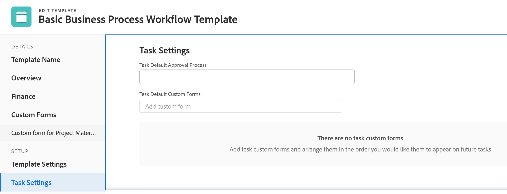
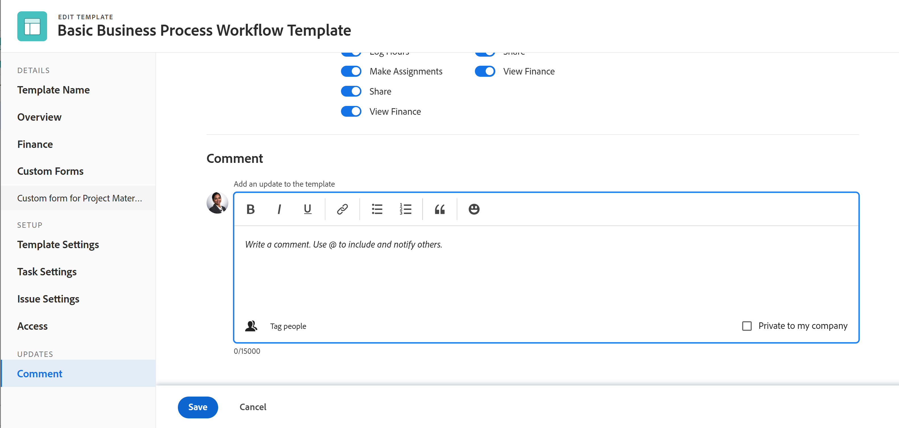

# Redigera projektmallar

<!-- Audited: 7/2025 -->

<!--The Resource Pools part also duplicates in the "Working with Resource Pools" article-->

<!--

 

The highlighted information on this page refers to functionality not yet generally available. It is available only in the Preview environment for all customers. The same features will also be available in the Production environment for all customers after a week from the Preview release.      

For more information, see [Interface modernization](/help/quicksilver/product-announcements/product-releases/interface-modernization/interface-modernization.md).  

 

-->

Du kan redigera projektmallar för att återspegla ändringar i processerna och inställningarna för framtida projekt.

När du har uppdaterat och sparat ändringarna i en mall visas de nya ändringarna i nya projekt när projekten skapas med hjälp av mallen.

De ändringar du gör i mallen återspeglas inte i projekt som för närvarande använder den mallen.

Du kan redigera en mall i taget eller redigera flera mallar samtidigt.

## Åtkomstkrav

+++ Expandera om du vill visa åtkomstkraven.

<table style="table-layout:auto"> 
 <col> 
 <col> 
 <tbody> 
  <tr> 
   <td role="rowheader">Adobe Workfront</td> 
   <td> 
Alla 
 </td> 
  </tr> 
  <tr> 
   <td role="rowheader">Adobe Workfront-licenser*</td> 
   <td>
      
Nytt: Standard

      
eller

      
Aktuell: Planera

   </td> 
  </tr> 
  <tr> 
   <td role="rowheader">Åtkomstnivå</td> 
   <td> 
Redigera åtkomst till mallar
 </td> 
  </tr> 
  <tr> 
   <td role="rowheader">Objektbehörigheter</td> 
   <td> 
    <ul> 
     <li> 
Contribute-behörigheter för en mall som du kan redigera på fliken Mallinformation
 </li> 
     <li> 
Hantera behörigheter för en mall för att redigera den i rutan Redigera mall
 </li> 
   </td> 
  </tr> 
 </tbody> 
</table>

*Mer information om informationen i den här tabellen finns i [Åtkomstkraven i Workfront-dokumentationen](/help/quicksilver/administration-and-setup/add-users/access-levels-and-object-permissions/access-level-requirements-in-documentation.md).

+++

## Redigera en mall {#edit-a-template}

1. Gå till mallen som du vill redigera.
1. (Villkorligt) Om du vill redigera begränsad information om mallen klickar du på **Mallinformation** i den vänstra panelen och går sedan till de områden som visas i den vänstra panelen för att redigera information för varje område.
1. Om du vill redigera information i detaljavsnittet klickar du på ikonen **Redigera**  , väljer något av områdena nedan eller klickar på **Redigera alla** om du vill redigera information i alla områden:

   * Ökning
   * Anpassad Forms

   Namnen på tullformulär visas bara om det finns anpassade formulär kopplade till objektet.

   * Ekonomi

   >[!TIP]
   >
   >Om du vill ha information om alla fält som visas i området Detaljer kan du fortsätta redigera alla fält med rutan Redigera mall nedan.

1. (Villkorligt) Om du vill redigera all information om mallen klickar du på ikonen **Mer**  bredvid mallens namn och sedan på **Redigera**.

   Rutan **Redigera mall** öppnas. Avsnitten i den här rutan innehåller fälten som är tillgängliga i avsnittet Mallinformation samt ytterligare fält.

1. Överväg att redigera information i följande avsnitt:

   * [Mallnamn](#template-name)
   * [Översikt](#overview-preview)
   * [Ekonomi](#finance-preview)
   * [Anpassad Forms](#custom-forms-preview)
   * [Mallinställningar](#template-settings)
   * [Aktivitetsinställningar](#task-settings)
   * [Utgivningsinställningar](#issue-settings)
   * [Åtkomst](#access-preview)
   * [Kommentar](#comment)
   <!--* [Linked folders](#linked-folders-conditional-availability) -->

### Mallnamn{#template-name}

1. Börja redigera mallen enligt beskrivningen ovan.
1. Klicka på **Mallnamn** i rutan **Redigera mall**.
1. Uppdatera eller ersätt namnet på mallen.
1. (Valfritt) Fortsätt redigera följande avsnitt, beroende på vilken information du vill ändra

   eller

   Klicka på **Spara**.

### Ökning {#overview-preview}

1. Börja redigera mallen enligt beskrivningen ovan.
1. Klicka på **Översikt** i rutan **Redigera mall**.

   

1. Uppdatera följande fält:

   <table style="table-layout:auto"> 
       <col> 
       <col> 
       <tbody> 
         <tr> 
         <td role="rowheader"><strong>Beskrivning</strong></td> 
         <td>Lägg till ytterligare information om mallen.</td> 
       </tr> 
         <tr> 
         <td role="rowheader"><strong>Prioritet</strong></td> 
         <td>
Det här är bara en visuell flagga som gör att du kan prioritera dina framtida projekt. Välj bland följande alternativ:
 
         <ul> 
         <li>
<strong>Ingen</strong>
</li> 
         <li>
<strong>Låg</strong>
</li> 
         <li>
<strong>Normal</strong>
</li> 
         <li>
<strong>Hög</strong>
</li> 
         <li>
<strong>Urgent</strong>
</li> 
         </ul>

Beroende på vilka projektinställningar du har valt av Workfront-administratören kan prioritetsnamnen vara olika för dig. Mer information om redigeringsprioriteringar finns i <a href="../../../administration-and-setup/customize-workfront/creating-custom-status-and-priority-labels/create-customize-priorities.md" class="MCXref xref">Skapa och anpassa prioriteringar</a>.

</td> 
       </tr> 
       <tr> 
       <td role="rowheader"><strong>URL</strong></td> 
         <td>Ange en webblänk som relaterar till information om den här mallen.</td> 
       </tr>
<tr> 
      <td role="rowheader"><strong>Är aktiv</strong></td> 
      <td>
Aktivera det här alternativet om du vill att mallen ska vara aktiv. Andra användare kan hitta den här mallen och bifoga den till projekt när de skapar projekt. Inaktivera alternativet om du vill inaktivera mallar som inte längre används. Inaktiverade mallar kan inte bifogas till projekt. Detta är aktiverat som standard. 

<b>TIPS</b>

Du kan inaktivera en mall från mallhuvudet enligt beskrivningen i avsnittet Aktivera eller inaktivera en mall i den här artikeln.
</td> 
     </tr>

<tr> 
<td role="rowheader"><strong>Villkorstyp</strong></td> 
   <td>
Välj mellan följande villkorstyper:
 
   <ul> 
   <li><strong>Manuell:</strong> Projektägaren ställer in projektets villkor manuellt i projektet. <strong></strong></li> 
   <li><strong>Förloppsstatus:</strong> Workfront ställer automatiskt in villkoret för det framtida projektet baserat på förloppsstatusen för aktiviteter på den kritiska sökvägen. Mer information om förloppsstatus finns i <a href="../../../manage-work/tasks/task-information/task-progress-status.md" class="MCXref xref">Översikt över status för åtgärdsförlopp</a>.</li> 
   </ul>
   </td> 
   </tr> 
   <tr> 
   <td role="rowheader"><strong>Schemaläge</strong></td> 
   <td>
Ange om det projekt som använder den här mallen är schemalagt från <strong>Startdatum</strong> eller från <strong>Slutförandedatum</strong>. Det här valet bestämmer planerade datum för framtida aktiviteter i projektet med den här mallen. 

Välj bland följande: 
 
   <ul> 
   <li>
<strong>Schemalägg från startdatum</strong>: Mallens startdatum är i själva verket startdagen. När du schemalägger en mall från startdatum beräknas mallens avslutningsdag baserat på varaktigheten för alla malluppgifter i Adobe Workfront. Mallens startdag blir det planerade startdatumet för det framtida projektet.
</li> 
   <li>
<strong>Schema från slutförandedatum</strong>: Mallens slutförandedatum är faktiskt Slutförandedag. När du schemalägger en mall från Slutförandedatum beräknas mallens startdag i Workfront utifrån varaktigheten för alla malluppgifter. Mallens slutförandedag blir det planerade slutförandedatumet för det framtida projektet. 
</li> 
   </ul>
Mer information om Start- och slutförandedagar för malluppgifter finns i <a href="../../../manage-work/projects/create-and-manage-templates/overview-of-start-completion-day-on-template.md" class="MCXref xref">Översikt över Start- och slutförandedagar i en mall</a>. 

Inställningen Schemalägg från för mallar liknar inställningen för projekt. Workfront-administratören väljer standardinställningen Schemalägg från för projekten i ditt system. Mer information om hur du anger standardinställningar för projekt finns i <a href="../../../administration-and-setup/set-up-workfront/configure-system-defaults/set-project-preferences.md" class="MCXref xref">Konfigurera systemomfattande projektinställningar</a>.
</td> 
   </tr>

<tr> 
   <td role="rowheader"><strong>Portfolio</strong></td> 
   <td>
Ange en Portfolio för de projekt som skapas från den här mallen. Du måste skapa en Portfolio innan den visas i listrutan. 

Endast aktiva portföljer visas i listan. Mer information om hur du skapar portföljer finns i <a href="../../../manage-work/portfolios/create-and-manage-portfolios/create-portfolios.md" class="MCXref xref">Skapa en portfölj </a>.
</td> 
   </tr> 
   <tr> 
   <td role="rowheader"><strong>Program</strong></td> 
   <td>
Om du har valt en Portfolio för mallen anger du ett <strong>program</strong> för det framtida projektet. Vissa portföljer kanske inte har program. Du måste skapa ett program innan det visas i den här listrutan. Endast aktiva program visas i listan.

Mer information om hur du skapar program finns i <a href="../../../manage-work/portfolios/create-and-manage-programs/create-program.md" class="MCXref xref">Skapa ett program</a>.
</td> 
   </tr>  
   <tr data-mc-conditions="QuicksilverOrClassic.Quicksilver"> 
   <td role="rowheader"><strong>Grupp</strong></td> 
   <td>
I listrutan väljer du den grupp som du vill ska associeras med projekt som skapats från mallen. Det kan vara en grupp på alla nivåer. 

Du kan kontrollera att du markerar rätt grupp genom att hålla markören över den och klicka på informationsikonen  som visas bredvid den. Här visas ett verktygstips med information om gruppen, till exempel hierarkin för grupper ovanför och dess administratörer.
 
<b>ANTECKNINGAR</b>

<ul> 
   <li>
När någon skapar ett projekt med en mall som inte har en grupp markerad, kopplas den öppna gruppen till projektet i området Projekt på en grupps sida.

Detta skiljer sig från andra områden där systemet associerar en användares hemgrupp med projektet när användaren skapar projektet med en mall som inte har någon markerad grupp.
</li> 
   <li>
Om en användare väljer en mall som har en grupp markerad när ett projekt skapas, eller när en uppgift eller ett problem konverteras till ett projekt, kan användaren välja en annan grupp för projektet.
</li> 
   <li>Det här fältet är endast tillgängligt i mallar i den nya Adobe Workfront-upplevelsen, men du kan se det i listor och rapporter både där och i Adobe Workfront Classic. </li> 
   </ul> 
</td> 
   </tr> 
   <tr> 
   <td role="rowheader"><strong>Företag</strong></td> 
   <td>
Ange det företag som du vill associera med mallen. Endast aktiva företag visas i listan.
</td> 
   </tr> 
   <tr> 
   <td role="rowheader"><strong>Mallägare</strong></td> 
   <td>
Användaren som anges som mallägare måste vara en Workfront-aktiv användare. 

Tänk på följande när det gäller användaren som angetts som mallägare: 
 
   <ul> 
   <li>De får automatiskt behörigheten Hantera till mallen. </li> 
   <li>De läggs till i projektteamet och får automatiskt behörigheten Hantera för det projekt som skapas från mallen. </li> 
   <li>De blir projektägare när projektet skapas från den här mallen. </li> 
   <li> Om den användare som är utsedd som mallägare har begränsad åtkomst till mallar eller projekt från åtkomstnivån, begränsas behörigheten Hantera för mallen och för projekten. Om de till exempel bara har behörigheten Visa för mallar eller projekt på åtkomstnivån får de automatiskt behörigheterna Visa för mallen och projektet när de har angetts som mallägare.</li>
   </ul></td> 
   </tr> 
   <tr> 
   <td role="rowheader"><strong>Mallsponsor</strong></td> 
   <td>
Användaren som anges i det här fältet blir projektsponsorn när mallen läggs till i projektet. Den här användaren läggs till i projektteamet och får automatiskt visningsbehörighet för projektet. Användaren som är angiven som mallsponsor måste vara en Workfront-användare. 
</td> 
   </tr> 
   <tr> 
   <td role="rowheader"><strong>Resurshanteraren</strong></td> 
   <td>
De angivna användarna får automatiskt behörighet att hantera framtida projekt och kan tilldela resurser till uppgifter och ärenden i projekten. Du kan ange mer än en resurshanterare. 
</td> 
   </tr> 
</table>

1. (Valfritt) Fortsätt redigera följande avsnitt, beroende på vilken information du vill ändra.

   eller

   Klicka på **Spara**.

### Ekonomi {#finance-preview}

1. Börja redigera mallen enligt beskrivningen ovan.
1. Klicka på **Ekonomi** i rutan **Redigera mall**.

   

1. Uppdatera följande fält:

   <table style="table-layout:auto"> 
       <col> 
       <col> 
       <tbody>
       <tr> 
         <td role="rowheader"><strong> Valuta</strong></td> 
         <td>
Ange valutan för det framtida projektet, om den skiljer sig från standardvalutan i systemet. Det här fältet är inte synligt om du bara har standardvalutan i systemet. Mer information om valutor finns i <a href="../../../administration-and-setup/manage-workfront/exchange-rates/set-up-exchange-rates.md" class="MCXref xref">Konfigurera valutakurser</a>.
</td> 
       </tr>
       <tr> 
       <td role="rowheader"><strong>Budget</strong></td> 
       <td>
Ange en budget för de projekt som skapas från den här mallen.
</td> 
       </tr>  
       <tr> 
         <td role="rowheader"><strong>Resultatindexmetod</strong></td> 
         <td>
Välj hur Workfront ska beräkna EV-värden för det framtida projektet. Välj bland följande:
         <ul>
         <li>Timbaserad</li>
         <li>Kostnadsbaserad</li>
         </ul>

   Mer information om prestandaindexmetoden finns i <a href="../../../manage-work/projects/project-finances/set-pim.md" class="MCXref xref">Ange prestandaindexmetod (PIM)</a>. 
</td>
   </tr> 
         <tr> 
         <td role="rowheader"><strong>Planerad förmån</strong></td> 
         <td>
Ange den planerade fördelen för de projekt som skapas från den här mallen. Den planerade förmånen används i projektens och Portfolio Optimizters affärsfall. 

Mer information om en planerad förmån för ett projekt finns i <a href="../../../manage-work/projects/project-finances/project-planned-benefit.md" class="MCXref xref">Översikt över projektplanerad förmån</a>. Den planerade fördelen med ett projekt beaktas när ett projekts nettovärde beräknas. 

Mer information om hur du använder Portfolio Optimizer finns i <a href="../../../manage-work/portfolios/portfolio-optimizer/manage-projects-in-portfolio-optimizer.md" class="MCXref xref">Hantera projekt i Portfolio Optimizer</a> 
</td> 
       </tr> 
       <tr> 
         <td role="rowheader"><strong>Fast kostnad</strong></td> 
         <td>
Ange fast kostnad för projekt som skapas från den här mallen. Detta skiljer sig från arbetskostnaden som kommer från timmarna i projektet och kostnaden som kommer från kostnaderna för projektet. Den fasta kostnaden för ett projekt tas med i beräkningen av ett projekts nettovärde och ingår i den budgeterade kostnaden.
</td> 
       </tr> 
       <tr> 
       <td role="rowheader"><strong>Fast intäkt</strong></td> 
       <td>
Ange fasta intäkter för projekt som skapas från den här mallen.
</td> 
       </tr> 
       <tr> 
       <td role="rowheader"><strong>Kräv tid för godkännande av det här projektet</strong></td> 
       <td>
Välj det här alternativet om du vill att projektägaren för det framtida projektet som skapas från den här mallen ska godkänna den tid som är inloggad på projektet. Om du använder Faktureringsposter och väljer det här alternativet visas endast de godkända timmarna i projektet som tillgängliga fakturerbara timmar för Faktureringsposterna. Godkännandetiden för projektet är oberoende av godkännande av tidrapporter. Mer information om hur du behöver tid för att godkänna ett projekt finns i <a href="../../../manage-work/projects/manage-projects/require-time-approval-for-projects.md" class="MCXref xref">Kräv tid för att godkännas för ett projekt</a>.
</td> 
       </tr> 
       </tbody> 
      </table>

1. (Valfritt) Fortsätt redigera följande avsnitt, beroende på vilken information du vill ändra.

   eller

   Klicka på **Spara**.

### Anpassad Forms {#custom-forms-preview}

1. Börja redigera mallen enligt beskrivningen ovan.
1. Klicka på **Anpassad Forms** i rutan **Redigera mall**.

   

   Namnen på de anpassade formulär som redan är kopplade till mallen visas på den vänstra panelen.

1. Klicka i fältet **Lägg till anpassat formulär** och markera det eller de anpassade formulär som du vill associera med mallen. Du måste skapa anpassade formulär innan de kan väljas i det här fältet.

   Endast aktiva anpassade formulär visas i listan. Mer information om hur du skapar anpassade formulär finns i [Skapa ett anpassat formulär](/help/quicksilver/administration-and-setup/customize-workfront/create-manage-custom-forms/form-designer/design-a-form/design-a-form.md).

   Du kan lägga till upp till tio anpassade formulär i en mall.

   Formulären läggs till i projektet som skapas från den här mallen.

1. (Valfritt) Uppdatera information i något av fälten i de anpassade formulären. Informationen överförs till de projekt som ska skapas från mallen.

1. (Valfritt) Klicka på ikonen **x** till höger om ett anpassat formulärnamn och klicka sedan på **Ta bort** för att ta bort det från mallen.

1. (Valfritt) Fortsätt redigera följande avsnitt, beroende på vilken information du vill ändra.

   eller

   Klicka på **Spara**.

### Mallinställningar {#template-settings}

1. Börja redigera mallen enligt beskrivningen ovan.
1. Klicka på **Projektinställningar** i rutan **Redigera mall**.

   

1. Uppdatera följande fält:

   <table style="table-layout:auto"> 
       <col> 
       <col> 
       <tbody> 
       <tr> 
       <td role="rowheader"><strong>Milstolpesökväg</strong> </td> 
       <td> 
Välj en milstolpe för mallen. Endast aktiva milstolpesökvägar visas i listan. Mer information om milstolpbanor finns i <a href="../../../administration-and-setup/customize-workfront/configure-approval-milestone-processes/create-milestone-path.md" class="MCXref xref">Skapa en milstolpsbana</a>.
 </td> 
       </tr> 
       <tr> 
         <td role="rowheader"><strong>Slutförandeläge</strong> </td> 
         <td> 
Styr hur det framtida projektet markeras som fullständigt.  Välj bland följande alternativ:
 
         <ul> 
         <li> 
<strong>Automatiskt</strong>: Projektet markeras som slutfört när alla aktiviteter och utgåvor har slutförts.
 </li> 
         <li> 
<strong>Manuell</strong>: Du måste manuellt välja statusen Fullständig för projektet när alla aktiviteter och utgåvor har slutförts. 
 </li> 
         </ul> </td> 
       </tr> 
       <tr> 
       <td role="rowheader"><strong>Läge för slutförande av sammanfattning</strong> </td> 
       <td> 
Styr hur de överordnade aktiviteterna i det framtida projektet markeras som slutförda.  Välj bland följande alternativ:
 
       <ul> 
       <li> 
<strong>Automatisk</strong>: De överordnade aktiviteterna är markerade som Slutförd och de uppdaterar automatiskt sin procentandel färdigt, allt eftersom de underordnade aktiviteterna slutförs och procentandelen slutfört av de underordnade uppdateras. 
 </li> 
       <li> 
<strong>Manuell</strong>: Du måste uppdatera procentandelen slutförd och statusen för de överordnade aktiviteterna manuellt, oberoende av vilka ändringar som görs för de underordnade aktiviteterna. 
 </li> 
       </ul> </td> 
       </tr> 
       <tr> 
         <td role="rowheader"><strong>Uppdateringstyp</strong> </td> 
         <td> 
Styr när de ändringar du gör i tidslinjen för det framtida projektet sparas i projektet. 
 
         <b>EXEMPEL </b> 
         
Följande ändringar av projektet utlöser en uppdatering av tidslinjen i projektet:
 
         <ul> 
         <li> 
uppdatera datum för uppgifter
 </li> 
         <li> 
ändra föregående relationer 
 </li> 
         <li> 
ändra överordnade-underordnade relationer
 </li> 
         <li> 
lägga till eller ta bort tilldelningar förutom att ändra uppgiftens begränsning eller varaktighet.
 </li> 
         </ul> 
         
 
Välj bland följande alternativ: 
 
         <ul> 
         <li> 
<strong>Automatisk och vid ändring</strong> (standardinställning): Den framtida projekttidslinjen uppdateras varje gång en ändring inträffar i projektet eller i ett annat projekt som tidslinjen är beroende av (vid ändring). Projektets tidslinje uppdateras också varje natt (automatiskt). Det här är den rekommenderade inställningen för det här fältet eftersom det ser till att projekttidslinjen alltid är uppdaterad. När du utför en åtgärd för en aktivitet eller ett projekt som utlöser en omberäkning av tidslinjen visas alla tillgängliga datum omedelbart, så att du kan fortsätta arbeta. I projekt med mer än 100 uppgifter visas datum som kräver längre omberäkningar som ett frågetecken (mellan 1 och 5 sekunder, eller upp till en minut för stora projekt). Detta anger att omberäkningen ännu inte är klar och att datumen kan ändras. 
 </li> 
         </ul> 
         <ul> 
         <li> 
<strong>Ändra endast</strong>: Projektets tidslinje uppdateras varje gång en ändring inträffar i projektet eller i ett annat projekt som tidslinjen är beroende av. Du kanske vill välja det här alternativet om ändringarna sällan inträffar i projektet eller i andra projekt som tidslinjen är beroende av. 
 </li> 
         </ul> 
         <ul> 
         <li> 
<strong>Endast automatiskt</strong>: Projektets tidslinje uppdateras varje natt. Den uppdateras inte omedelbart efter att ändringar har gjorts. Du kanske vill välja det här alternativet om många ändringar inträffar varje dag i projektet eller i andra projekt som tidslinjen är beroende av. Tänk dock på att du valde den här inställningen eftersom projektet inte uppdateras samtidigt som ändringarna görs. 
 </li> 
         </ul> 
         <ul> 
         <li> 
<strong>Endast manuell</strong>: Projektets tidslinje uppdateras bara när du väljer alternativet att beräkna om tidslinjer, vilket beskrivs i <a href="../../../manage-work/projects/manage-projects/recalculate-project-timeline.md" class="MCXref xref">Beräkna om projekttidslinjer</a>. 
 </li> 
         </ul> 
Du kan välja det här alternativet om du gör många ändringar i projektet samtidigt och du vill att tidslinjen ska räknas om efter att alla ändringar har gjorts (i stället för efter varje enskild ändring).
 </td> 
       </tr> 
       <tr> 
         <td role="rowheader"><strong>Schema</strong> </td> 
         <td> 
Välj ett schema för mallen. Det här blir schemat för projektet som skapas från den här mallen. Det ska vara samma schema som tilldelats de flesta personer som arbetar med projektet. Du måste skapa ett schema innan du kan tilldela det till en mall. Mer information om hur du skapar scheman finns i <a href="../../../administration-and-setup/set-up-workfront/configure-timesheets-schedules/create-schedules.md" class="MCXref xref">Skapa ett schema</a>.  Om du inte har skapat anpassade scheman i systemet väljs standardschemat. 
 </td> 
       </tr> 
       <tr> 
         <td role="rowheader"><strong>Användartid av</strong> </td> 
         <td> 
Avgör om tidpunkten för den primära tilldelades för en uppgift justerar planerade aktivitetsdatum. När du kopplar mallen till ett befintligt projekt, och mallen har en annan inställning för det här fältet än projektet, ändras inte inställningen för projektet. Standardalternativet för den här inställningen för en ny mall är samma som projektinställningen på systemnivå. 
 
Mer information om projektinställningarna på systemnivå finns i <a href="../../../administration-and-setup/set-up-workfront/configure-system-defaults/set-project-preferences.md" class="MCXref xref">Konfigurera systemomfattande projektinställningar</a>. 
 
Mer information om hur den här inställningen påverkar aktivitetsdatum i ett projekt finns i <a href="../../../manage-work/projects/manage-projects/edit-projects.md" class="MCXref xref">Redigera projekt</a>. Välj bland följande alternativ: 
 
         <ul> 
         <li> 
<strong>Överväg användarens tid i aktivitetsvaraktigheter</strong>: När du väljer det här alternativet justeras de planerade datumen för aktiviteterna i projektet som skapas från den här mallen enligt tiden för aktivitetens primära tilldelare, om tiden för aktiviteten infaller under aktivitetens varaktighet. 
 </li> 
         <li> 
<strong>Ignorera användartid för aktivitetsvaraktigheter</strong>: När du väljer det här alternativet förblir de planerade datumen för aktiviteterna i projektet som skapas från den här mallen som de ursprungligen var planerade, även om aktivitetens primära tilldelare har en ledig tid under aktivitetens varaktighet. 
 </li> 
         </ul> </td> 
       </tr> 
       <tr> 
         <td role="rowheader"><strong>Resursutjämningsläge</strong> </td> 
         <td> 
Välj bland följande alternativ: 
 
         <ul> 
         <li> 
<strong>Manuell</strong>: du måste manuellt nivåindela dina resurser i det projekt som skapas från den här mallen (det här är standardinställningen)
 </li> 
         <li> 
<strong>Automatiskt:</strong> Workfront nivåindelar resurserna i det framtida projektet.  Mer information om resursnivåer finns i <a href="../../../manage-work/gantt-chart/use-the-gantt-chart/level-resources-in-gantt.md" class="MCXref xref">Nivåresurser i Gantt-schemat </a>. 
 </li> 
         </ul> </td> 
       </tr> 
       <tr> 
         <td role="rowheader"><strong>Risk</strong> </td> 
         <td> 
Definiera risknivån för projekt som skapas med den här mallen. Risken är bara en indikator på hur riskfylld ett projekt kan vara. Du kan prioritera genomförandet av dina projekt baserat på risknivån. Välj bland följande risknivåer: 
 
         <ul> 
         <li> 
<strong>Mycket låg</strong> 
 </li> 
         <li> 
<strong>Låg</strong> 
 </li> 
         <li> 
<strong>Medium</strong> 
 </li> 
         <li> 
<strong>Hög</strong> 
 </li> 
         <li> 
<strong>Mycket hög</strong> 
 </li> 
         </ul> </td> 
       </tr> 
       <tr> 
         <td role="rowheader"><strong>Resurspooler</strong> </td> 
         <td> 
Ange de resurspooler som är associerade med mallen. Resurspooler är samlingar med användare som behövs samtidigt för att slutföra ett projekt. Mer information om resurspooler finns i <a href="../../../resource-mgmt/resource-planning/resource-pools/work-with-resource-pools.md" class="MCXref xref"> Översikt över resurspooler </a>.
 
 
<b>ANMÄRKNING</b>

   När du redigerar flera mallar samtidigt visas endast de resurspooler som är gemensamma för alla valda mallar i det här fältet. Om de valda mallarna inte har några delade resurspooler kommer det här fältet att vara tomt. Resurspoolerna som du anger här skriver över mallarnas enskilda resurspooler.
 
 </td>
   </tr>

   <tr> 
      <td role="rowheader"><strong>Kräv tid för godkännande av det här projektet</strong></td>

<td>
Välj det här alternativet om du vill att den framtida projektägaren för det projekt som skapas från den här mallen ska godkänna den tid som är inloggad på projektet.
 
   
Om du använder Faktureringsposter och väljer det här alternativet visas endast de godkända timmarna i projektet som tillgängliga fakturerbara timmar för Faktureringsposterna. 

   
Godkännandetiden för projektet är oberoende av godkännande av tidrapporter. Mer information om hur du behöver tid för att godkänna ett projekt finns i <a href="../../../manage-work/projects/manage-projects/require-time-approval-for-projects.md" class="MCXref xref">Kräv tid för att godkännas för ett projekt</a>.

   </td> 
   </tr> 
   <tr> 
   <td role="rowheader"><strong>Typ av filtertimmar</strong> </td> 
   <td> 
Tänk på följande:
 
Välj <strong>Nej</strong> om du vill göra alla projektspecifika timtyper tillgängliga i det framtida projektet. (Det här är standardvalet)
 
eller
 
Välj <strong>Ja</strong> om du bara vill göra en delmängd av de projektspecifika timtyperna tillgängliga i det framtida projektet. Välj sedan de timtyper som du vill göra tillgängliga. (Håll ned Skift om du vill markera flera timtyper.)
 
Om du väljer det här alternativet blir endast de timtyper som du väljer tillgängliga när du loggar timmar i projektet (eller om uppgifter och problem i projektet). Du måste välja minst en timtyp. Om du väljer det här alternativet och inte väljer någon timtyp, blir alla timtyper tillgängliga i projektet.
 
Samma timtypval måste göras på den enskilda användarnivån för att användaren ska kunna se dessa timtypalternativ i projektet. 
 
Mer information om hur du definierar timtyper på användarnivå finns i avsnittet <a href="../../../timesheets/create-and-manage-timesheets/log-time.md#understa" class="MCXref xref">Loggtid</a> i <a href="../../../timesheets/create-and-manage-timesheets/log-time.md" class="MCXref xref">Loggtid</a>.
 </td> 
   </tr> 
   <tr> 
   <td role="rowheader"><strong>Påminnelsemeddelande</strong> </td> 
   <td>Välj det påminnelsemeddelande som ska associeras med det framtida projektet. Du måste konfigurera påminnelsemeddelanden för att projekt för det här fältet ska visas när du redigerar en mall.  Mer information om hur du konfigurerar påminnelsemeddelanden finns i <a href="../../../administration-and-setup/manage-workfront/emails/set-up-reminder-notifications.md" class="MCXref xref">Konfigurera påminnelsemeddelanden</a>.</td> 
   </tr>
   <tr> 
   <td role="rowheader"><strong>Godkännandeprocess</strong> </td> 
   <td> 
Välj den godkännandeprocess som du vill koppla till mallen. Workfront-administratören eller en användare med administrativ åtkomst till godkännandeprocesser måste definiera godkännandeprocesser på system- eller gruppnivå innan du kan koppla dem till en mall. Mer information om hur du skapar godkännandeprocesser finns i <a href="../../../administration-and-setup/customize-workfront/configure-approval-milestone-processes/create-approval-processes.md" class="MCXref xref">Skapa en godkännandeprocess för arbetsobjekt</a>.
 
Tänk på följande när du lägger till godkännandeprocesser: 
 
   <ul> 
   <li>Endast aktiva godkännandeprocesser visas i listan. </li> 
   <li> 
Systemomfattande och gruppspecifika godkännandeprocesser visas i listan. En godkännandeprocess som är kopplad till en annan grupp än den som mallen tillhör visas inte i listan.
 
<b>VIKTIGT</b>

Om gruppen som är kopplad till mallen ändras blir den gruppspecifika godkännandeprocessen en godkännandeprocess för enstaka användning. Mer information om hur ändringar i projektgruppen eller ändringar i godkännandeprocessen påverkar godkännandeinställningarna finns i <a href="../../../administration-and-setup/customize-workfront/configure-approval-milestone-processes/how-changes-affect-group-approvals.md">Hur ändringar i grupp- och godkännandeprocessen påverkar tilldelade godkännandeprocesser</a>. 
 </li>
<li> 
Om du har lagt till en godkännandeprocess för enstaka användning visas den som"Anpassad" i det här fältet. Mer information finns i <a href="../../../review-and-approve-work/manage-approvals/associate-approval-with-work.md" class="MCXref xref">Associera en ny eller befintlig godkännandeprocess med arbete</a>. 
 
      </li> 
      <li> 
När mallar för gruppredigering används finns följande scenarier:
 
      <ul> 
         <li> 
När du väljer mallar från samma grupp visas både godkännandeprocesser på system- och gruppnivå i det här fältet.
 </li> 
         <li> 
När du väljer mallar från olika grupper visas endast godkännandeprocesser på systemnivå i det här fältet.
 </li> 
         <li> 
När någon av mallarna har en enda godkännandeprocess, ersätts den av den systemnivå du väljer. 
 </li> 
      </ul> </li> 
      </ul> </td> 
       </tr>  
       </tbody> 
      </table>

1. (Valfritt) Fortsätt redigera följande avsnitt, beroende på vilken information du vill ändra.\
   eller
1. Klicka på **Spara**.

### Uppgiftsinställningar {#task-settings}

Du kan definiera standardvärden som ska kopplas till alla nya uppgifter när du lägger till dem i ett projekt som skapas från mallen.

Mer information om hur de här inställningarna påverkar skapandet av nya uppgifter finns i [Översikt över Skapa uppgifter](../../../manage-work/tasks/create-tasks/create-tasks-overview.md).

1. Börja redigera mallen enligt beskrivningen ovan.
1. Klicka på **Uppgiftsinställningar** i rutan **Redigera mall**.

   

1. I rutan **Standardprocess för godkännande av aktivitet** väljer du den godkännandeprocess som du vill associera med alla nya uppgifter när du lägger till dem i ett projekt som skapats från den här mallen. Du måste skapa en godkännandeprocess för uppgifter innan du kan koppla den till uppgifter. Endast aktiva godkännandeprocesser visas i listan. Mer information om hur du skapar godkännandeprocesser finns i [Skapa godkännandeprocesser](../../../administration-and-setup/customize-workfront/configure-approval-milestone-processes/create-approval-processes.md).
1. I rutan **Anpassad Forms** för standarduppgift väljer du det eller de anpassade formulär som du vill associera med alla nya uppgifter när du lägger till dem i ett projekt som skapats från den här mallen. Du måste skapa anpassade formulär innan de kan väljas i det här fältet. Endast aktiva anpassade formulär visas i listan. Mer information om hur du skapar anpassade formulär finns i [Skapa ett anpassat formulär](/help/quicksilver/administration-and-setup/customize-workfront/create-manage-custom-forms/form-designer/design-a-form/design-a-form.md). Du kan associera upp till tio anpassade formulär med en uppgift.
1. (Valfritt) Välj **Använd arbetsinsats för att automatiskt beräkna timmar för planerad aktivitet** om du vill aktivera hantering av aktivitetsinsats genom att använda Arbetsinsats i stället för Planerade timmar i det projekt som skapas från mallen.
1. (Villkorligt och valfritt) Om du valde Använd arbetsinsats för att automatiskt beräkna planerade timmar för en uppgift klickar du på listrutan för att uppdatera procentandelen för varje nivå av arbetsinsats. Följande procentvärden är standardvärden:

   | Arbetsinsats | Procentvärde |
   |---|---|
   | Liten | 25 % |
   | Medium | 50 % |
   | Stor | 75 % |

   Mer information om hur du använder Arbetsinsats för att hantera insatsen i projekt finns i [Översikt över Arbetsinsats](../../../manage-work/tasks/task-information/work-effort.md).

1. (Valfritt) Fortsätt redigera följande avsnitt, beroende på vilken information du vill ändra.

   eller

   Klicka på **Spara**.

### Ärendeinställningar {#issue-settings}

Genom att redigera probleminställningarna kan du hindra användare från att lägga till problem i det framtida projekt som skapas från mallen.

1. Börja redigera mallen enligt beskrivningen ovan.
1. Klicka på **Utgivningsinställningar** i rutan **Redigera mall**.

   

1. (Valfritt) Avmarkera alternativet **Tillåt användare att lägga till infogade utgåvor**. Den är aktiverad som standard.

   När du inaktiverar det här alternativet kan användare inte lägga till interna problem i projektet eller aktiviteterna i avsnittet Problem när projektet skapas från mallen.

   >[!TIP]
   >
   >Inaktivera det här alternativet om du vill tvinga användare att fylla i fält för nya utgåvor eller anpassade formulär som är kopplade till nya utgåvor.

   När du inaktiverar det här alternativet kan användare med behörighet att lägga till problem i projektet som skapas från mallen göra det med knappen Nytt problem eller med en frågekö som är kopplad till projektet.

   Mer information om hur du konfigurerar probleminställningar för projekt finns i avsnittet [Ärendeinställningar](../../../manage-work/projects/manage-projects/edit-projects.md#issue) i artikeln [Redigera projekt](../../../manage-work/projects/manage-projects/edit-projects.md).

   Mer information om hur du skapar problem i projekt finns i [Skapa problem](../../../manage-work/issues/manage-issues/create-issues.md).

1. (Valfritt) Fortsätt redigera följande avsnitt, beroende på vilken information du vill ändra.

   eller

   Klicka på **Spara**.

### Åtkomst {#access-preview}

1. Börja redigera mallen enligt beskrivningen ovan.
1. Klicka på **Åtkomst** i rutan **Redigera mall**.

   

   Den åtkomst du anger för mallen blir åtkomsten för användare som är kopplade till projektet när mallen används för att skapa ett projekt.

   Ange följande **Access**-information för mallen:

   <table style="table-layout:auto"> 
       <col> 
       <col> 
       <tbody> 
       <tr> 
         <td role="rowheader"><strong>När någon tilldelas till en uppgift</strong> </td> 
         <td> 
Välj från <strong>Visa</strong>, <strong>Contribute,</strong> eller <strong>Hantera</strong> åtkomst till en uppgift. Användaren som tilldelats en uppgift får automatiskt den här åtkomsten till uppgiften. 
 </td> 
       </tr> 
       <tr> 
         <td role="rowheader"><strong>Bevilja även åtkomst till projektet</strong> </td> 
         <td> 
 Välj från <strong>Visa</strong>, <strong>Contribute</strong> eller <strong>Hantera</strong> åtkomst till projektet. Användaren som tilldelats en uppgift får automatiskt tillgång till projektet. 
 </td> 
       </tr> 
       <tr> 
         <td role="rowheader"><strong>När någon har tilldelats ett problem</strong> </td> 
         <td> 
Välj från <strong>Visa</strong>, <strong>Contribute,</strong> eller <strong>Hantera</strong> åtkomst till ett problem. Användaren som tilldelats en utgåva får automatiskt den här åtkomsten till utgåvan. 
 </td> 
       </tr> 
       <tr> 
         <td role="rowheader"><strong>Bevilja även åtkomst till projektet</strong> </td> 
         <td> 
 Välj från <strong>Visa</strong>, <strong>Contribute</strong> eller <strong>Hantera</strong> åtkomst till projektet. Användaren som tilldelats en utgåva får automatiskt även den här åtkomsten till projektet. 
 </td> 
       </tr> 
       <tr> 
         <td role="rowheader"><strong>När någon skickar en begäran: Ge dem åtkomst</strong> </td> 
         <td> 
 Välj mellan <strong>Visa</strong>, <strong>Contribute</strong> eller <strong>Hantera</strong> åtkomst till begäran. När de skickar in en begäran till projektet får de denna åtkomst till den begäran de skickade. Mer information finns i <a href="../../../workfront-basics/grant-and-request-access-to-objects/share-an-issue.md" class="MCXref xref">Dela ett problem </a>.
 </td> 
       </tr> 
       <tr> 
         <td role="rowheader"><strong>Personer från samma företag ärver samma behörigheter för alla begäranden</strong> </td> 
         <td> 
Markera det här fältet om du vill att personer från samma företag ska ha samma åtkomst till alla förfrågningar i projektet, oavsett om de har skickat dem eller inte.
 </td> 
       </tr> 
       <tr> 
         <td role="rowheader"><strong>När någon får åtkomst till det här projektet: Ge dem åtkomst till ...</strong> </td> 
         <td> 
Välj de åtkomstalternativ som du vill att användarna ska ha i projektet, om projektet delas med dem. Välj de specifika alternativen för deras åtkomst, om de har angetts som <strong>visningsprogram</strong>, <strong>Medarbetare</strong> eller <strong>Chefer</strong> när projektet delas med dem. 
 </td> 
       </tr> 
       </tbody> 
      </table>

1. (Valfritt) Fortsätt redigera följande avsnitt, beroende på vilken information du vill ändra.

   eller

   Klicka på **Spara**.

   Ändringarna skickas för den här mallen.

   När du nu använder den här mallen för att skapa ett projekt överförs alla dessa inställningar till det nya projektet.

<!--I don't think this note is valid anymore - this note was on Edit project when the section below was in that article, by mistake: 
>[!NOTE]
>
>Because linked folders are created when the project is created, editing the linked folder workflow on an existing project is ineffective. Editing these values when creating a project functions as expected.-->

<!-- This section is here by mistake - it should be maybe in layout templates?? 

### Linked folders (conditional availability) {#linked-folders}

Linked folder functionality automatically creates folders in Adobe Experience Manager Assets, and connects these folders to Workfront. 

This section appears only if all of the following apply:

* Your organization has been migrated to the Adobe Admin Console
* Your organization has enabled and configured an integration with Adobe Experience Manager
* The template has enabled and configured linked folders.

For instructions on editing Linked folders, see [Edit workflow values in a project](/help/quicksilver/documents/adobe-workfront-for-experience-manager-assets-essentials/use-aem-workflows.md#edit-workflow-values-in-a-project) in the article [Use workflows in the Experience Manager Assets integration](/help/quicksilver/documents/adobe-workfront-for-experience-manager-assets-essentials/use-aem-workflows.md).

-->

### Kommentar

1. Börja redigera mallen enligt beskrivningen ovan.
1. Klicka på **Kommentar** i rutan **Redigera mall**.

   
1. Lägg till en kommentar om den uppdatering du gör, tagga till ytterligare användare eller markera rutan **Privat till mitt företag** om du vill hålla uppdateringen privat för användare i ditt företag och klicka sedan på **Spara**.

## Redigera flera mallar samtidigt

Du kan redigera flera mallar samtidigt och uppdatera all information om dem.

<!--
Editing templates in bulk differs depending on which environment you are using. 

### Edit templates in bulk in the Production environment 

*****************and hide the first line below************ -->

Så här redigerar du flera mallar samtidigt:

{{step1-to-templates}}

1. Markera flera mallar i listan.
1. Klicka på ikonen **Redigera**  .

   Dialogrutan **Redigera mallar** öppnas.

   

1. Klicka på avsnitten till vänster om du vill redigera alla valda mallar.

   Mer information om hur du redigerar information om mallar finns i avsnittet [Redigera en mall](#edit-a-template) i den här artikeln.

1. Uppdatera följande avsnitt i de valda mallarna:

   * Ökning
   * Ekonomi
   * Portfolio
   * Inställningar
   * Åtkomst
   * Anpassad Forms
   * Uppgifter
   * Problem
   * Kommentar

1. Klicka på **Spara ändringar**.

   Alla ändringar du har gjort visas nu för alla de valda mallarna.

<!--

### Edit templates in bulk in the Preview environment 

*****************and hide/delete the first line below************

To edit templates in bulk:

{{step1-to-templates}}

1. Select several templates in the list.
1. Click the **Edit** icon .

   The **Edit Templates** dialog box opens.

   

1. Click the sections on the left to edit all selected templates.

   For more information about editing information on templates, see the [Edit a template](#edit-a-template) section in this article.

1. Update the following sections of the selected templates:

   * Overview
   * Custom Forms
   * Finance
   * Template Settings
   * Task Settings
   * Issue Settings
   * Access
   * Comment

1. Click **Save**.

   All changes you made are now visible on all the selected templates.

-->

## Lägga till uppgifter i en mall

När du har skapat mallen och redigerat mallinformationen kan du lägga till uppgifter i den.

Att lägga till uppgifter i en mall liknar att lägga till uppgifter i ett projekt.

Mer information om hur du lägger till uppgifter i ett projekt finns i [Skapa uppgifter i ett projekt](../../../manage-work/tasks/create-tasks/create-tasks-in-project.md).

När du lägger till uppgifter i en mall ändras mallens varaktighet och mallens start- och slutförandedagar i enlighet med detta. Mer information om Start- och slutförandedagar för mallen och malluppgifterna finns i [Översikt över Start- och slutförandedagar i en mall](../../../manage-work/projects/create-and-manage-templates/overview-of-start-completion-day-on-template.md).

## Lägga till fler objekt i en mall

När du har skapat mallen och redigerat mallinformationen kan du lägga till fler objekt i den. Objekten som du lägger till är tillgängliga för projektet när du skapar det från mallen.

Att lägga till följande objekt i en mall är detsamma som att lägga till dem i ett projekt:

* Dokument
* Risker

  Mer information om att skapa risker finns i [Skapa och redigera risker i projekt](/help/quicksilver/manage-work/projects/define-a-business-case/create-edit-risks-on-projects.md).

* Godkännandeprocesser

  Mer information om hur du associerar godkännandeprocesser med arbete finns i [Associera en ny eller befintlig godkännandeprocess med arbete](../../../review-and-approve-work/manage-approvals/associate-approval-with-work.md).

* Faktureringstaxor

  Att lägga till faktureringstariffer för en mall liknar att lägga till faktureringstariffer i ett projekt. Mer information finns i [Åsidosätt faktureringshastigheter för jobbroller på projektnivå](/help/quicksilver/manage-work/projects/project-finances/override-job-role-billing-rates-at-the-project-level.md).

* Utgifter

  Mer information om hur du lägger till utgifter finns i [Hantera projektutgifter](../../../manage-work/projects/project-finances/manage-project-expenses.md).

* Köinformation

  Mer information om hur du lägger till köinformation i ett projekt eller en mall finns i [Skapa en frågekö](/help/quicksilver/manage-work/requests/create-and-manage-request-queues/create-request-queue.md).

* Ämnesgrupper och Köämnen

  Mer information om hur du lägger till ämnesgrupper och ämnen i kön till ett projekt eller en mall finns i följande artiklar:

   * [Skapa ämnesgrupper](/help/quicksilver/manage-work/requests/create-and-manage-request-queues/create-topic-groups.md)
   * [Skapa köämnen](/help/quicksilver/manage-work/requests/create-and-manage-request-queues/create-queue-topics.md)

Du kan lägga till följande objekt till uppgifterna i mallen:

* Dokument
* Utgifter

  Mer information om hur du lägger till utgifter finns i [Hantera projektutgifter](../../../manage-work/projects/project-finances/manage-project-expenses.md).

* Godkännanden

  Mer information om hur du associerar godkännanden med arbete finns i [Associera en ny eller befintlig godkännandeprocess med arbete](../../../review-and-approve-work/manage-approvals/associate-approval-with-work.md).

## Aktivera eller inaktivera en mall

Du kan inaktivera en mall om du vill att användarna inte ska kunna hitta den och skapa projekt utifrån den. Du kan inte bifoga en inaktiverad mall till projekt eller använda den för att skapa ett projekt.

Inaktiverade mallar påverkar inte befintliga projekt som skapats med dem.

Så här inaktiverar du en mall:

1. Gå till en aktiv mall och klicka sedan på menyn **Mer**  bredvid mallnamnet och klicka sedan på **Inaktivera**.

   

   Mallen är inte längre aktiv och användarna kan inte längre hitta den för att skapa projekt utifrån den.
1. (Valfritt) Om du vill aktivera mallen klickar du på menyn **Mer**  bredvid mallnamnet och sedan på **Aktivera**.

   Mallen är nu aktiv och kan bifogas till projekt eller användas för att skapa projekt.

<!--
Editing a template differs depending on what environment you choose. 

### Edit a template in the Production environment {#edit-a-template-in-the-production-environment} 

1. Go to the template you want to edit.
1. (Conditional) To edit limited information about the template,  click **Template Details** in the left panel, then go to the areas listed in the left panel to edit information for each area. 
1. To edit information in the Details section, click the **Edit** icon , then select from any of the areas below, or click **Edit all** to edit information in all areas:

   * Overview
   * Custom Forms

     Names of customs forms display only if there are custom forms attached to the object.
   
   * Finance

   >[!TIP]
   >
   >For information about all fields that display in the Details area, continue with editing all fields using the Edit Template box below.

1. (Conditional) To edit all information about the template, click the **More** menu  next to the name of the template, then click **Edit**.

   The **Edit Template** box opens. The sections in this box contain the same fields available in  the Template Details section .

1. Consider editing information in any of the following sections:

   * [Overview](#overview) 
   * [Finance](#finance) 
   * [Portfolio](#portfolio) 
   * [Settings](#settings) 
   * [Access](#access) 
   * [Custom Forms](#custom-forms) 
   * [Tasks](#tasks) 
   * [Issues](#issues) 
   * [Comment](#comment)

### Overview {#overview}

1. Begin editing your template as described above.
1. In the **Edit Template** box, click **Overview**.

   

1. Update the following fields:

   <table style="table-layout:auto"> 
    <col> 
    <col> 
    <tbody> 
     <tr> 
      <td role="rowheader"><strong>Name</strong></td> 
      <td>Specify a name for the template.</td> 
     </tr> 
     <tr> 
      <td role="rowheader"><strong>Description</strong></td> 
      <td>Add additional information about the template.</td> 
     </tr> 
     <tr> 
      <td role="rowheader"><strong>Is Active</strong></td> 
      <td>
Select this checkbox if you want the template to be active. Other users can find this template and attach it to projects when creating projects. Deselect this checkbox if you want to deactivate templates that are no longer used. Deactivated templates cannot be attached to projects. This is enabled by default. 

<b>TIP</b>
      
      You can deactivate a template from the template header as described in the [Activate or deactivate a template](#activate-or-deactivate-a-template) section in this article.
</td> 
     </tr> 
     <tr> 
      <td role="rowheader"><strong>URL</strong></td> 
      <td>Specify a web link that relates to information about this template.</td> 
     </tr> 
     <tr> 
      <td role="rowheader"><strong>Schedule From</strong></td> 
      <td>
Specify whether the project using this template is scheduled from the <strong>Start Date</strong>, or from the <strong>Completion Date</strong>. This selection determines the planned dates of the future tasks on the project using this template. 

Select from the following: 
 
       <ul> 
        <li>
<strong>Schedule From Start Date</strong>: The Start Date of the template is actually the Start Day. When you schedule a template from Start Date, Adobe Workfront calculates the Completion Day of the template based on the Duration of all the template tasks. The Start Day of the template becomes the Planned Start Date of the future project.
</li> 
        <li>
<strong>Schedule from Completion Date</strong>: The Completion Date of the template is actually the Completion Day. When you schedule a template from Completion Date, Workfront calculates the Start Day of the template based on the Duration of all the template tasks. The Completion Day of the template becomes the Planned Completion Date of the future project. 
</li> 
       </ul>
For more information about the Start and Completion Days of template tasks, see <a href="../../../manage-work/projects/create-and-manage-templates/overview-of-start-completion-day-on-template.md" class="MCXref xref">Overview of Start and Completion Days in a template</a>. 

The Schedule From setting for templates is similar to that of projects. Your Workfront administrator selects the default Schedule From setting for the projects in your system. For information about setting project defaults, see <a href="../../../administration-and-setup/set-up-workfront/configure-system-defaults/set-project-preferences.md" class="MCXref xref">Configure system-wide project preferences</a>.
</td> 
     </tr> 
     <tr> 
      <td role="rowheader"><strong>Condition Type</strong></td> 
      <td>
Select between the following Condition Types:
 
       <ul> 
        <li><strong>Manual:</strong> The project owner sets the Condition of the project on the project manually. <strong></strong></li> 
        <li><strong>Progress Status:</strong> Workfront automatically sets the Condition of the future project based on the Progress Status of tasks on the Critical Path. For more information about understanding Progress Status, see <a href="../../../manage-work/tasks/task-information/task-progress-status.md" class="MCXref xref">Task Progress Status overview</a>.</li> 
       </ul></td> 
     </tr> 
     <tr> 
      <td role="rowheader"><strong>Priority</strong></td> 
      <td>
This is just a visual flag for you which allows you to prioritize your future projects. Select from the following options:
 
       <ul> 
        <li>
<strong>None</strong>
</li> 
        <li>
<strong>Low</strong>
</li> 
        <li>
<strong>Normal</strong>
</li> 
        <li>
<strong>High</strong>
</li> 
        <li>
<strong>Urgent</strong>
</li> 
       </ul>

Depending on the Project Preferences selected by your Workfront administrator, the names of priorities might be different for you. For more information about editing priorities, see <a href="../../../administration-and-setup/customize-workfront/creating-custom-status-and-priority-labels/create-customize-priorities.md" class="MCXref xref">Create and customize priorities</a>.

</td> 
     </tr> 
     <tr> 
      <td role="rowheader"><strong>Template Owner</strong></td> 
      <td>
The user who is designated as the Template Owner must be a Workfront active user. 

Consider the following about the user designated as the Template Owner: 
 
       <ul> 
        <li>They are automatically given Manage permissions to the template. </li> 
        <li>They are added to the project team and are automatically given Manage permissions to the project created from the template. </li> 
        <li>They become the Project Owner, when the project is created from this template. </li> 
       </ul></td> 
     </tr> 
     <tr> 
      <td role="rowheader"><strong>Template Sponsor</strong></td> 
      <td>
The user specified in this field becomes the Project Sponsor, when the template is added to the project. This user is added to the project team and is automatically given view permissions to the project. The user who is designated as the Template Sponsor must be a Workfront active user. 
</td> 
     </tr> 
     <tr> 
      <td role="rowheader"><strong>Resource Manager</strong></td> 
      <td>
The specified users are automatically given manage permissions to the future projects and can assign resources to the tasks and issues of the projects. You can specify more than one Resource Manager. 
</td> 
     </tr> 
     <tr data-mc-conditions="QuicksilverOrClassic.Quicksilver"> 
      <td role="rowheader"><strong>Group</strong></td> 
      <td>
In the drop-down list, select the group that you want to be associated with projects created from the template. It can be a group of any level. 

You can make sure you are selecting the right group by hovering over it and clicking the information icon  that displays next to it. This displays a tooltip listing information about the group, such as the hierarchy of groups above it and its administrators.
 
<b>NOTES</b>
      
    <ul> 
    <li>
In the Projects area on a group's page, when someone creates a project using a template that doesn't have a group selected, the system associates the currently open group with the project.

This is different from other areas where the system associates a user's Home Group with the project when the user creates the project using a template that doesn't have a group selected.

    </li> 
      <li>
If a user selects a template that has a group selected while creating a project—or while converting a task or issue to a project—the user can choose a different group for the project.
</li> 
      <li>Though this field is available in templates only in the new Adobe Workfront experience, you can see it in lists and reports both there and in Adobe Workfront Classic. </li> 
      </ul> 
</td> 
     </tr> 
     <tr> 
      <td role="rowheader"><strong>Company</strong></td> 
      <td>
Specify the Company that you want to associate with the template. Only active companies display in the list.
</td> 
     </tr> 
    </tbody> 
   </table>

1. (Optional) Continue editing the following sections, depending on the information you want to modify.

   Or

   Click **Save Changes**.

### Finance {#finance}

1. Begin editing your template as described above.
1. In the **Edit Template** box, click **Finance**.

   

1. Update the following fields:

   <table style="table-layout:auto"> 
    <col> 
    <col> 
    <tbody> 
     <tr> 
      <td role="rowheader"><strong>Performance Index Method</strong></td> 
      <td>
Specify whether the Earned Value metrics of the future project are calculated using hours or costs. For more information about the Performance Index Method, see <a href="../../../manage-work/projects/project-finances/set-pim.md" class="MCXref xref">Set the Performance Index Method (PIM)</a>. 
</td> 
     </tr> 
     <tr> 
      <td role="rowheader"><strong>Budget</strong></td> 
      <td>
Specify a Budget for the projects that are created from this template.
</td> 
     </tr> 
     <tr> 
      <td role="rowheader"><strong>Fixed Cost</strong></td> 
      <td>
Specify the Fixed Cost for the projects that are created from this template. This is different than the Labor Cost which comes from the hours on the project and the Expense Cost which comes from the amount of expenses on the project. The Fixed Cost of a project is taken into account when calculating the Net Value of a project and it is part of the Budgeted Cost.
</td> 
     </tr> 
     <tr> 
      <td role="rowheader"><strong>Fixed Revenue</strong></td> 
      <td>
Specify the Fixed Revenue for the projects that are created from this template.
</td> 
     </tr> 
     <tr> 
      <td role="rowheader"><strong>Template Currency</strong></td> 
      <td>
Specify the currency for the future project, if it is different than the default currency of your system. This field is not visible if you have only the default currency in the system. For more information about currency, see <a href="../../../administration-and-setup/manage-workfront/exchange-rates/set-up-exchange-rates.md" class="MCXref xref">Set up exchange rates</a>.
</td> 
     </tr> 
     <tr> 
      <td role="rowheader"><strong>Require time to be approved for this project</strong></td> 
      <td>
Select this option to require the Project Owner of the future project created from this template to approve time logged on the project. If you are using Billing Records and you select this option, only the approved hours on the project appear as available billable hours for the Billing Records. Approving time on the project is independent of approving timesheets. For more information about requiring time to be approved on a project, see <a href="../../../manage-work/projects/manage-projects/require-time-approval-for-projects.md" class="MCXref xref">Require time to be approved for a project</a>.
</td> 
     </tr> 
    </tbody> 
   </table>

1. (Optional) Continue editing the following sections, depending on the information you want to modify.

   Or

   Click **Save Changes**.

### Portfolio {#portfolio}

1. Begin editing your template as described above.
1. In the **Edit Template** box, click **Portfolio**.

   

1. Update the following fields:

   <table style="table-layout:auto">
    <col> 
    <tbody> 
     <tr> 
      <td role="rowheader"><strong>Portfolio</strong></td> 
      <td>
Specify a Portfolio for the projects that are created from this template. You must create a Portfolio first, before it appears in the drop-down list. 

Only active portfolios display in the list. For more information about creating portfolios, see <a href="../../../manage-work/portfolios/create-and-manage-portfolios/create-portfolios.md" class="MCXref xref">Create a portfolio </a>.
</td> 
     </tr> 
     <tr> 
      <td role="rowheader"><strong>Program</strong></td> 
      <td>
If you selected a Portfolio for the template, specify a <strong>Program</strong> for the future project. Some Portfolios might not have Programs. You must create a Program first, before it appears in this drop-down list. Only active programs display in the list.

For more information about creating programs, see <a href="../../../manage-work/portfolios/create-and-manage-programs/create-program.md" class="MCXref xref">Create a program</a>.
</td> 
     </tr> 
     <tr> 
      <td role="rowheader"><strong>Planned Benefit</strong></td> 
      <td>
Specify the Planned Benefit of the projects that are created from this template. The Planned Benefit is used in the Business Case of the project and the Portfolio Optimizer. 

For more information about the Planned Benefit of a project, see <a href="../../../manage-work/projects/project-finances/project-planned-benefit.md" class="MCXref xref">Overview of project Planned Benefit</a>. The Planned Benefit of a project is taken into account when the Net Value of a project is calculated. 

For more information about using the Portfolio Optimizer, see <a href="../../../manage-work/portfolios/portfolio-optimizer/manage-projects-in-portfolio-optimizer.md" class="MCXref xref">Manage projects in the Portfolio Optimizer</a> 
</td> 
     </tr> 
    </tbody> 
   </table>

1. (Optional) Continue editing the following sections, depending on the information you want to modify.

   Or

   Click **Save Changes**.

### Settings {#settings}

1. Begin editing your template as described above.
1. In the **Edit Template** box, click **Settings**.

   

1. Update the following fields: 

   <table style="table-layout:auto"> 
    <col> 
    <col> 
    <tbody> 
     <tr> 
      <td role="rowheader"><strong>Milestone Path</strong> </td> 
      <td> 
Select a Milestone Path for the template. Only active milestone paths display in the list. For more information about Milestone Paths, see <a href="../../../administration-and-setup/customize-workfront/configure-approval-milestone-processes/create-milestone-path.md" class="MCXref xref">Create a milestone path</a>.
 </td> 
     </tr> 
     <tr> 
      <td role="rowheader"><strong>Completion Mode</strong> </td> 
      <td> 
Controls how the future project will be marked as Complete.  Select from the following options:
 
       <ul> 
        <li> 
<strong>Automatic</strong>: The project is marked Complete when all the tasks and issues are completed.
 </li> 
        <li> 
<strong>Manual</strong>: You have to manually select the Complete status for the project, when all the tasks and issues are completed. 
 </li> 
       </ul> </td> 
     </tr> 
     <tr> 
      <td role="rowheader"><strong>Summary Completion Mode</strong> </td> 
      <td> 
Controls how the parent tasks on the future project are marked as Complete.  Select from the following options:
 
       <ul> 
        <li> 
<strong>Automatic</strong>: The parent tasks are marked Complete and they update their percent complete automatically, as the children tasks are completed and the percent complete of the children is updated. 
 </li> 
        <li> 
<strong>Manual</strong>: You have to manually update the percent complete and the status of the parent tasks, independently of what changes are made to the children tasks. 
 </li> 
       </ul> </td> 
     </tr> 
     <tr> 
      <td role="rowheader"><strong>Update Type</strong> </td> 
      <td> 
Controls when the changes you make to the timeline of the future project are saved on the project. 
 
       <b>EXAMPLE </b> 
        
The following changes to the project trigger an update to the timeline of the project:
 
        <ul> 
         <li> 
update the dates of tasks
 </li> 
         <li> 
change predecessor relationships 
 </li> 
         <li> 
change parent-child relationships
 </li> 
         <li> 
add or remove assignments in addition to changing the task constraint or duration type.
 </li> 
        </ul> 
       
 
Select from the following options: 
 
       <ul> 
        <li> 
<strong>Automatic and On Change</strong> (Default setting): The future project timeline is updated each time a change occurs in the project or in another project that the timeline is dependent on (On Change). The project timeline is also updated each night (Automatic). This is the recommended setting for this field because it ensures that the project timeline is always up to date. When you perform an action on a task or project that triggers a timeline recalculation, all available dates are immediately displayed, allowing you to continue working. On projects with more than 100 tasks, dates that require longer recalculations display briefly as a question mark (between 1 and 5 seconds, or up to a minute for large projects). This indicates that the recalculation is not yet finished, and the dates are subject to change. 
 </li> 
       </ul> 
       <ul> 
        <li> 
<strong>Change Only</strong>: The project timeline is updated each time a change occurs in the project or in another project that the timeline is dependent on. You might want to select this option if changes rarely occur in the project or in other projects that the timeline is dependent on. 
 </li> 
       </ul> 
       <ul> 
        <li> 
<strong>Automatic Only</strong>: The project timeline is updated each night; it is not updated immediately after changes are made. You might want to select this option if many changes occur each day in the project or in other projects that the timeline is dependent on. However, be aware that you chose this setting, as the project will not update at the same time that the changes are made. 
 </li> 
       </ul> 
       <ul> 
        <li> 
<strong>Manual Only</strong>: The project timeline is updated only when you select the option to Recalculate Timelines, as described in <a href="../../../manage-work/projects/manage-projects/recalculate-project-timeline.md" class="MCXref xref">Recalculate project timelines</a>. 
 </li> 
       </ul> 
You might want to select this option if you are making many changes to the project at one time, and you want the timeline recalculation to occur after all of the changes have been made (rather than after each individual change).
 </td> 
     </tr> 
     <tr> 
      <td role="rowheader"><strong>Schedule</strong> </td> 
      <td> 
Select a schedule for your template. This will become the schedule of the project that is created from this template. This should be the same schedule assigned to most people that are working on the project. You must create a schedule before you can assign it to a template. For more information about creating schedules, see <a href="../../../administration-and-setup/set-up-workfront/configure-timesheets-schedules/create-schedules.md" class="MCXref xref">Create a schedule</a>.  If you have not created custom schedules in your system, the Default Schedule is selected. 
 </td> 
     </tr> 
     <tr> 
      <td role="rowheader"><strong>User Time Off</strong> </td> 
      <td> 
Determines whether the time off of the Primary Assignee of a task adjusts the task planned dates. When you attach the template to an existing project, and the template has a different setting for this field than the project, the setting on the project remains unchanged. The default option for this setting for a new template is the same as the system-level project preference. 
 
For information about the project preferences at the System level, see <a href="../../../administration-and-setup/set-up-workfront/configure-system-defaults/set-project-preferences.md" class="MCXref xref">Configure system-wide project preferences</a>. 
 
For information about how this setting affects the task dates on a project, see <a href="../../../manage-work/projects/manage-projects/edit-projects.md" class="MCXref xref">Edit projects</a>. Select from the following options: 
 
       <ul> 
        <li> 
<strong>Consider user time off in task durations</strong>: When selecting this option, the planned dates of the tasks on the project created from this template adjust according to the time off of the Primary Assignee of the task, if the time off occurs during the duration of the task. 
 </li> 
        <li> 
<strong>Ignore user time off in task durations</strong>: When selecting this option, the planned dates of the tasks on the project created from this template remain as originally planned, even if the Primary Assignee of the task has time off during the duration of the task. 
 </li> 
       </ul> </td> 
     </tr> 
     <tr> 
      <td role="rowheader"><strong>Resource Leveling Mode</strong> </td> 
      <td> 
Select from the following options: 
 
       <ul> 
        <li> 
<strong>Manual</strong>: you must manually level your resources on the project created from this template (this is the default setting)
 </li> 
        <li> 
<strong>Automatic:</strong> Workfront levels the resources on the future project.  For more information about Resource Leveling, see <a href="../../../manage-work/gantt-chart/use-the-gantt-chart/level-resources-in-gantt.md" class="MCXref xref">Level Resources in the Gantt Chart </a>. 
 </li> 
       </ul> </td> 
     </tr> 
     <tr> 
      <td role="rowheader"><strong>Risk</strong> </td> 
      <td> 
Define the level of risk of the projects created from this template. The risk is just an indicator of how risky a project can be. You can prioritize the execution of your projects based on the level of risk. Consider selecting from the following levels of risk: 
 
       <ul> 
        <li> 
<strong>Very Low</strong> 
 </li> 
        <li> 
<strong>Low</strong> 
 </li> 
        <li> 
<strong>Medium</strong> 
 </li> 
        <li> 
<strong>High</strong> 
 </li> 
        <li> 
<strong>Very High</strong> 
 </li> 
       </ul> </td> 
     </tr> 
     <tr> 
      <td role="rowheader"><strong>Resource Pools</strong> </td> 
      <td> 
Specify the resource pools associated with the template. Resource pools are collections of users that are needed at the same time for the completion of a project. For more information about resource pools, see <a href="../../../resource-mgmt/resource-planning/resource-pools/work-with-resource-pools.md" class="MCXref xref"> Resource pools overview </a>.
 
 
<b>NOTE</b> 
      
      When you edit templates in bulk, only the resource pools that are common to all the templates selected appear in this field. If the templates selected have no shared resource pools, this field will be empty. The resource pools you specify here will overwrite the templates' individual resource pools.
 
 </td> 
     </tr> 
     <tr> 
      <td role="rowheader"><strong>Approval Process</strong> </td> 
      <td> 
Select the approval process you want to associate with the template. Your Workfront administrator or a user with administrative access to Approval Processes must define system-level or group-level project approval processes before you can associate them with a template. For more information about creating approval processes, see <a href="../../../administration-and-setup/customize-workfront/configure-approval-milestone-processes/create-approval-processes.md" class="MCXref xref">Create an approval process for work items</a>.
 
Consider the following when adding approval processes: 
 
      <ul> 
      <li>Only active approval processes display in the list. </li> 
      <li> 
System-wide and group-specific approval processes display in the list. An approval process associated with a group other than that of the template does not display in the list.
 
<b>IMPORTANT</b> 
      
      If the group associated with the template changes, the group-specific approval process becomes a single-use approval process. For more information about how changes to the group of the project or changes in the approval process affect approval settings, see <a href="../../../administration-and-setup/customize-workfront/configure-approval-milestone-processes/how-changes-affect-group-approvals.md">How group and approval process changes affect assigned approval processes</a>. 
 </li> 
      <li> 
If you added a single-use approval process, it displays as "Custom" in this field. For information, see <a href="../../../review-and-approve-work/manage-approvals/associate-approval-with-work.md" class="MCXref xref">Associate a new or existing approval process with work</a>. 
 
      </li> 
      <li> 
When bulk-editing templates, the following scenarios exist:
 
      <ul> 
         <li> 
When you select templates from the same group, both system-level and group-level approval processes display in this field.
 </li> 
         <li> 
When you select templates from different groups, only system-level approval processes display in this field.
 </li> 
         <li> 
When any of the templates has a single-use approval process attached, it is replaced by the system-level you select. 
 </li> 
      </ul> </li> 
      </ul> </td> 
     </tr> 
     <tr> 
      <td role="rowheader"><strong>Filter Hour Types</strong> </td> 
      <td> 
Consider the following:
 
Select <strong>No</strong> to make all project-specific hour types available on the future project. (This is the default selection)
 
Or
 
Select <strong>Yes</strong> to make only a subset of the project-specific hour types available on the future project, then select the hour types you want to make available. (Hold the Shift key to select multiple hour types.)
 
If you select this option, only the hour types you select are made available to select when logging hours on the project (or on tasks and issues within the project). You must select at least one hour type; if you select this option and you do not select any hour types, all hour types are made available on the project.
 
The same hour type selections must be made at the individual user level in order for the user to see these hour type options on the project. 
 
For more information about defining hour types at the user level, see the section <a href="../../../timesheets/create-and-manage-timesheets/log-time.md#understa" class="MCXref xref">Log time</a> in <a href="../../../timesheets/create-and-manage-timesheets/log-time.md" class="MCXref xref">Log time</a>.
 </td> 
     </tr> 
     <tr> 
      <td role="rowheader"><strong>Reminder Notification</strong> </td> 
      <td>Select the Reminder Notification that should be associated with the future project. You must configure Reminder Notifications for projects for this field to appear during editing a template.  For more information about configuring Reminder Notifications, see <a href="../../../administration-and-setup/manage-workfront/emails/set-up-reminder-notifications.md" class="MCXref xref">Set up reminder notifications</a>.</td> 
     </tr> 
    </tbody> 
   </table>

1. (Optional) Continue editing the following sections, depending on the information you want to modify.  
   Or
1. Click **Save Changes**.

### Access {#access}

1. Begin editing your template as described above.
1. In the **Edit Template** box, click **Access**.

   

   The Access you specify for your template will become the Access of users associated with the project when the template is used to create a project.

   Specify the following **Access** information for the template:

   <table style="table-layout:auto"> 
    <col> 
    <col> 
    <tbody> 
     <tr> 
      <td role="rowheader"><strong>When someone is assigned to a task</strong> </td> 
      <td> 
Select from <strong>View</strong>, <strong>Contribute,</strong> or <strong>Manage</strong> access to a task. The user assigned to a task is automatically granted this access to the task. 
 </td> 
     </tr> 
     <tr> 
      <td role="rowheader"><strong>Also grant access to the project</strong> </td> 
      <td> 
 Select from <strong>View</strong>, <strong>Contribute</strong>, or <strong>Manage</strong> access to the project. The user assigned to a task is automatically granted this access to the project, as well. 
 </td> 
     </tr> 
     <tr> 
      <td role="rowheader"><strong>When someone is assigned to an issue</strong> </td> 
      <td> 
Select from <strong>View</strong>, <strong>Contribute,</strong> or <strong>Manage</strong> access to an issue. The user assigned to an issue is automatically granted this access to the issue. 
 </td> 
     </tr> 
     <tr> 
      <td role="rowheader"><strong>Also grant access to the project</strong> </td> 
      <td> 
 Select from <strong>View</strong>, <strong>Contribute</strong>, or <strong>Manage</strong> access to the project. The user assigned to an issue is automatically granted this access to the project, as well. 
 </td> 
     </tr> 
     <tr> 
      <td role="rowheader"><strong>When someone submits a request: Give them access</strong> </td> 
      <td> 
 Select from <strong>View</strong>, <strong>Contribute</strong>, or <strong>Manage</strong> access to the request. When they submit a request to the project, they are granted this access to the request they submitted. For more information, see <a href="../../../workfront-basics/grant-and-request-access-to-objects/share-an-issue.md" class="MCXref xref">Share an issue </a>.
 </td> 
     </tr> 
     <tr> 
      <td role="rowheader"><strong>People from the same company will inherit the same permissions for all requests</strong> </td> 
      <td> 
Select this field if you want people from the same company to have the same access to all the requests on the project, whether they submitted them or not.
 </td> 
     </tr> 
     <tr> 
      <td role="rowheader"><strong>When someone is given access to this project: Give them access to ...</strong> </td> 
      <td> 
Select the access options that you want users to have on the project, if the project is shared with them. Select the specific options for their access, if they are designated as <strong>Viewers</strong>, <strong>Contributors</strong>, or <strong>Managers</strong> when sharing the project with them. 
 </td> 
     </tr> 
    </tbody> 
   </table>

1. (Optional) Continue editing the following sections, depending on the information you want to modify.

   Or

   Click **Save Changes**.

### Custom Forms {#custom-forms}

1. Begin editing your template as described above.
1. In the **Edit Template** box, click **Custom Forms**.

   

1. Select the custom form or forms that you want to associate with the template. You must build the custom forms before they are available to select in this field.

   Only active custom forms display in the list. s

   You can add up to ten custom forms to a template.

   The forms will be added to the project that is created from this template. 

1. (Optional) Continue editing the following section, depending on the information you want to modify.

   Or

   Click **Save Changes**.

### Tasks {#tasks}

You can define the defaults that will be associated with all the new tasks when you add them to a project that is created from the template.

For information about how these settings affect creating new tasks, see [Create tasks overview](../../../manage-work/tasks/create-tasks/create-tasks-overview.md).

1. Begin editing your template as described above.
1. In the **Edit Template** box, click **Tasks**.

   

1. In the **Task Default Approval Process** box, select the Approval Process you want to associate with all new tasks when you add them to a project created from this template. You must create an Approval Process for tasks before you can associate it with tasks. Only active approval processes display in the list. For more information about creating Approval Processes, see [Creating Approval Processes](../../../administration-and-setup/customize-workfront/configure-approval-milestone-processes/create-approval-processes.md).
1. In the **Task Default Custom Forms** box, select the custom form or forms that you want to associate with all new tasks when you add them to a project created from this template. You must build the custom forms before they are available to select in this field. Only active custom forms display in the list. You can associate up to ten custom forms with a task.
1. (Optional) **Select Use Work Effort to automatically calculate task Planned Hours** if you want to enable managing task effort by using&nbsp;Work Effort instead of Planned Hours in the project created from the template.
1. (Conditional and optional) If you selected Use Work Effort to automatically calculate task Planned Hours, click the drop-down menu to update the percentage for each level of Work Effort. The following percentage values are the defaults:
 
   | Work Effort level |Percentage value|
   |---|---|
   | Small |25% |
   | Medium |50% |
   | Large |75% |

  For information about using Work Effort to manage the effort on tasks on projects, see [Work Effort overview](../../../manage-work/tasks/task-information/work-effort.md).

1. (Optional) Continue editing the following section, depending on the information you want to modify.

   Or

   Click **Save Changes**.

### Issues {#issues}

By editing issue settings, you can prevent users from adding issues inline in the future project created from the template.

1. Begin editing your template as described above.
1. In the **Edit Template** box, click **Issues**.

   

1. (Optional) Deselect the **Allow users to add issues inline** option. It is enabled by default.

   When disabling this option users cannot add issues inline to the project or the tasks in the Issues section, when the project is created from the template.

   >[!TIP]
   >
   >Disable this option if you want to enforce users to complete the New Issue Fields or the custom forms associated with new issues.

   When disabling this option, users with permissions to add issues to the project created from the template can do so by using the New Issue button or a request queue associated with the project.

   For more information about configuring issue settings on projects, see the [Issue Settings](../../../manage-work/projects/manage-projects/edit-projects.md#issue) section in the article [Edit projects](../../../manage-work/projects/manage-projects/edit-projects.md).

   For information about creating issues on projects, see [Create issues](../../../manage-work/issues/manage-issues/create-issues.md). 

1. (Optional) Continue editing the following section, depending on the information you want to modify.

   Or

   Click **Save Changes**.

### Comment {#comment}

1. Begin editing your template as described above.
1. In the **Edit Template** box, click **Comment**.

   

1. Specify a comment that you want to display in the updates stream of the template in the available field.

   This comment is visible for everyone with View access to the template and with access to view Notes.

1. Click **Save Changes**.

   Your changes will be submitted for this template.

   Now, when you use this template to create a project all these settings will transfer to the new project.

   <!--drafted section below for the edit template story: 
   remove this tag and add the Preview blurb at the top of this article in yellow, if it's not already there. Keep the "div class" tags below until 23.1 production: 

### Edit a template in the Preview environment {#edit-a-template-in-the-preview-environment}
-->