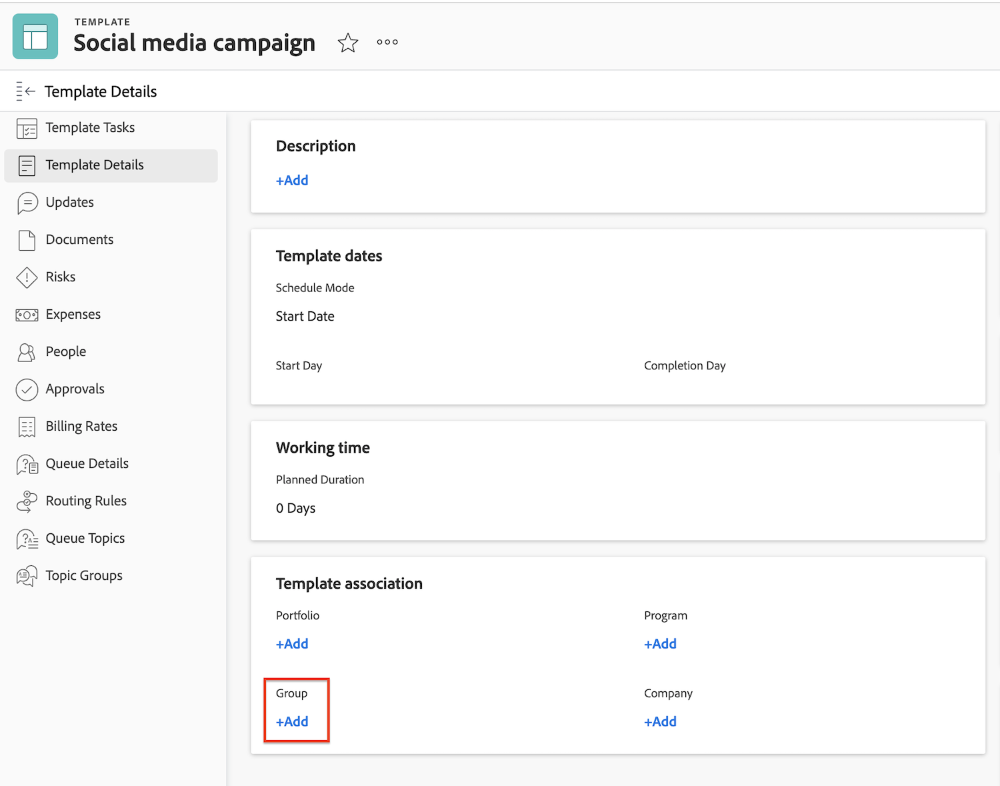

# Skapa ett projekt som är kopplat till Frame.io

Tack vare integreringen mellan Workfront och Frame.io kan du skapa projekt i Workfront som speglas i Frame.io, vilket ger en smidig gransknings- och godkännandeupplevelse.

När ett Workfront-projekt är anslutet till Frame.io kan du

* **Tilldela Frame.io-användare till uppgifter**: Frame.io-aktiverade användare meddelas via e-post när de tilldelas till en Workfront-uppgift och talar om att det finns arbete att slutföra.
* **Dela projektet med Frame.io-användare**: När ett projekt delas med Frame.io-aktiverade användare har de tillgång till projektet i både Workfront och Frame.io.
* **Dela kreativt material med Frame.io**: Projektsamordnare kan skicka instruktioner och material från Workfront direkt till den kreativa användaren i Frame.io med hjälp av en envägssynkroniseringsprojektmapp. [!BADGE Kommer snart]{type=Informative}
* **Spåra uppgiftsförloppet**: De som skapar en aktivitet kan skicka färdigt material och markera aktiviteter som slutförda - allt utan att behöva lämna Frame.io.

## Åtkomstkrav

+++ Expandera om du vill visa åtkomstkrav för funktionerna i den här artikeln. 

>[!IMPORTANT]
>
>Den här funktionen är bara tillgänglig för organisationer som har anslutit sig till [!DNL Adobe Admin Console].

Du måste ha följande:

<table style="table-layout:auto"> 
 <col> 
 <col> 
 <tbody> 
  <tr> 
   <td role="rowheader">Adobe Workfront</td> 
   <td> 
Alla
 </td> 
  </tr> 
  <tr> 
   <td role="rowheader">Adobe Workfront-licens</td> 
   <td> 
Standard
 </td> 
  </tr> 
  <tr> 
   <td role="rowheader">Konfigurationer på åtkomstnivå</td> 
   <td> 
Redigera åtkomst till projekt
 </td> 
  </tr> 
  <tr> 
   <td role="rowheader">Objektbehörigheter</td> 
   <td> 
När du skapar ett projekt får du automatiskt behörigheten Hantera för projektet.
 </td> 
  </tr> 
 </tbody> 
</table>

Mer information om informationen i den här tabellen finns i [Åtkomstkrav i Workfront-dokumentationen](/help/quicksilver/administration-and-setup/add-users/access-levels-and-object-permissions/access-level-requirements-in-documentation.md).

+++

## Förutsättningar

* Ställ in standardkontot för Frame.io i inställningsområdet för Workfront
* Aktivera Frame.io-användare i Workfront användarprofil

Mer information om kraven ovan finns i [Konfigurera  [!DNL Workfront] och [!DNL Frame.io] integreringen](/help/quicksilver/administration-and-setup/configure-integrations/configure-wf-and-frame.md).

## Skapa en ny projektmall

När du skapar en ny mall kan du ange informationen för alla uppgifter och för dina framtida projektinställningar. Den här informationen överförs sedan till alla projekt som du skapar från mallen.

Projekt i Frame.io organiseras av team som är anslutna till Workfront-grupper. Vi rekommenderar att du använder en projektmall för att skapa anslutna projekt eftersom du kan ange projektgruppen tidigare.

Om du väljer att skapa projektet från grunden, lägger Workfront automatiskt till standardprojektgruppen och spegelprojektet Frame.io skapas under det standardteamet i Frame.io.

>[!NOTE]
>
>När gruppen uppdateras efter att projektet har skapats ändras inte Frame.io-teamet.

### Skapa mallen och ange projektgruppen

{{step1-to-templates}}

1. Klicka på **Ny mall**.
1. Skriv ett namn på mallen och tryck sedan på **Retur** för att spara namnet.
1. Klicka på **Mallinformation** i den vänstra panelen.
1. I avsnittet **Mallassociation** måste du ange en grupp. Om du inte lägger till en grupp läggs standardprojektgruppen till och projektet i Frame.io skapas under motsvarande standardteam i Frame.io.

Fortsätt till nästa avsnitt.

### Lägga till uppgifter och tilldela Frame.io-aktiverade användare

1. Klicka på **Malluppgifter** i den vänstra panelen.
1. Klicka på **Börja lägga till malluppgifter** om du snabbt vill lägga till uppgifter i mallen. Du kan konfigurera ytterligare inställningar senare.

   eller

   Klicka på **Ny mallaktivitet** om du vill lägga till en aktivitet i taget och konfigurera ytterligare inställningar.
   
1. Lägg till ett aktivitetsnamn.
1. Tilldela användare eller team i området **Uppdrag**. Om du tilldelar en Frame.io-aktiverad användare, antingen individuellt eller i ett team, får de medarbetaråtkomst till Frame.io-projektet och meddelas via e-post om uppgiften i Frame.io-projektet. Från det mejlet kan de gå med i Frame.io-projektet och börja arbeta.
1. Upprepa steg 1 och 2 efter behov.

Fortsätt till nästa avsnitt.

### Konfigurera ytterligare mallinformation

Workfront har robusta projekthanteringsfunktioner. Vi rekommenderar att du använder artikeln [Redigera projektmallar](/help/quicksilver/manage-work/projects/create-and-manage-templates/edit-templates.md) för att konfigurera följande områden i mallen:

* Översikt
* Ekonomi
* Anpassad Forms
* Projektinställningar
* Aktivitetsinställningar
* Ärendeinställningar
* Åtkomst

### Skapa ett projekt från mallen

När du har skapat en mall kan du använda den för att skapa projekt.

{{step1-to-projects}}

1. Klicka på **Nytt projekt från mall**.
1. Använd sökrutan och börja skriva namnet på den mall du behöver.
1. Markera mallnamnet och klicka sedan på **Använd mall**.
   
1. Justera eventuella projektinställningar efter behov och klicka sedan på **Skapa projekt**.
1. Klicka på **Dokument** i den vänstra panelen.
1. Använd den enkelriktade synkroniseringsmappen för att automatiskt dela kreativt material med Frame.io. [!BADGE Kommer snart]{type=Informative}

   >[!NOTE]
   >
   >Den här funktionen är under utveckling. Om du vill dela information med användare i Frame.io överför du filerna till fliken Dokument. När projektstatus är Aktuell skickas dessa filer automatiskt till Frame.io.

1. Ändra projektet från **Planering** till **Aktuell** i projekthuvudet.

När projektet har skapats och kreatörerna har överfört färdiga resurser kan du tilldela resursen i Workfront ett arbetsflöde för granskning och godkännande. Mer information finns i [Skapa en begäran om dokumentgranskning eller godkännande](/help/quicksilver/review-and-approve-work/document-reviews-and-approvals/manage-document-approvals/create-a-document-approval.md). <!-- name may need to change -->

## Skapa ett nytt projekt från grunden

Du kan skapa ett nytt projekt från grunden efter behov.

>[!IMPORTANT]
>
>* Projekt i Frame.io organiseras av team som är anslutna till Workfront-grupper. Vi rekommenderar att du använder en projektmall för att skapa anslutna projekt eftersom du kan ange projektgruppen tidigare.
>
>
>* Om du väljer att skapa projektet från grunden, lägger Workfront automatiskt till standardprojektgruppen och spegelprojektet Frame.io skapas under det standardteamet i Frame.io.
>
>När gruppen uppdateras efter att projektet har skapats ändras inte Frame.io-teamet.

### Skapa projektet

{{step1-to-projects}}

1. Klicka på **Nytt projekt**.
1. Skriv ett namn för projektet och tryck sedan på **Retur** för att spara namnet.

Fortsätt till nästa avsnitt.

### Lägga till uppgifter och tilldela Frame.io-aktiverade användare

1. Klicka på **Åtgärder** i den vänstra panelen.
1. Klicka på **Börja lägga till uppgifter** om du snabbt vill lägga till uppgifter i projektet. Du kan konfigurera ytterligare inställningar senare.

   eller

   Klicka på **Ny aktivitet** om du vill lägga till en aktivitet i taget och konfigurera ytterligare inställningar.
   
1. Lägg till ett aktivitetsnamn.
1. Tilldela användare eller team i området **Uppdrag**. Om du tilldelar en Frame.io-aktiverad användare, antingen individuellt eller i ett team, får de medarbetaråtkomst till Frame.io-projektet och meddelas via e-post om uppgiften i Frame.io-projektet. Från det mejlet kan de gå med i Frame.io-projektet och börja arbeta.
1. Upprepa steg 1 och 2 efter behov.

Fortsätt till nästa avsnitt.

### Ladda upp kreativt material

1. Klicka på **Dokument** i den vänstra panelen.
1. Använd den enkelriktade synkroniseringsmappen för att automatiskt dela kreativt material med Frame.io. [!BADGE Kommer snart]{type=Informative}

   >[!NOTE]
   >
   >Den här funktionen är under utveckling. Om du vill dela information med användare i Frame.io överför du filerna till fliken Dokument. När projektets status är Aktuell skickas dessa filer automatiskt till Bildruta.io

Fortsätt till nästa avsnitt.

### Konfigurera ytterligare projektinformation

Workfront har robusta projekthanteringsfunktioner. Vi rekommenderar att du använder artikeln [Redigera projekt](/help/quicksilver/manage-work/projects/manage-projects/edit-projects.md) för att konfigurera följande områden i projektet:

* Översikt
* Ekonomi
* Anpassad Forms
* Projektinställningar
* Aktivitetsinställningar
* Ärendeinställningar
* Åtkomst

### Ställ in projektet till aktuellt

1. Ändra projektet från Planering till Aktuell i projektrubriken.
När projektet har skapats och kreatörerna har överfört färdiga resurser kan du tilldela resursen i Workfront ett arbetsflöde för granskning och godkännande.

När projektet har skapats och kreatörerna har överfört färdiga resurser kan du tilldela resursen i Workfront ett arbetsflöde för granskning och godkännande.

Mer information finns i [Skapa en begäran om dokumentgranskning eller godkännande](/help/quicksilver/review-and-approve-work/document-reviews-and-approvals/manage-document-approvals/create-a-document-approval.md). <!-- name may need to change -->
