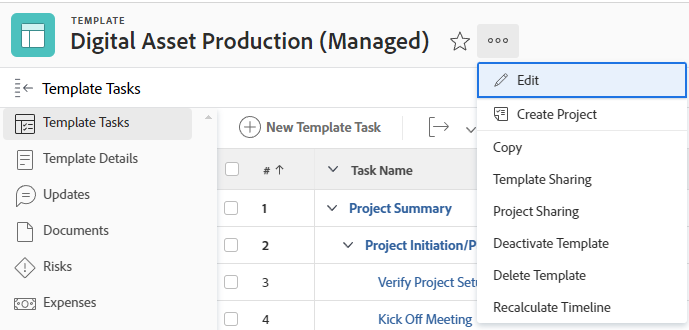

# Skapa ett projekt med en mall

<!-- Audited: 01/2024 -->

Du kan använda mallar som ett ramverk för att skapa projekt i Adobe Workfront. Om du har projekt som upprepas ofta kan du spara tid genom att använda mallar för den allmänna tidslinjen i det nya projektet.

Med mallar kan du hämta upprepningsbara processer, information och inställningar som är kopplade till dina projekt. Informationen som är kopplad till en mall överförs till projektet. Detta inkluderar uppgifter, uppdrag, varaktighet, dokument, ekonomisk information, risker och anpassade formulär.

>[!TIP]
>
>Workfront definierar det nya projektets grupp och status enligt följande:
>
>* Standardstatusen för ett nytt projekt som skapats från en mall motsvarar den status som definieras av Workfront-administratören i området Projektinställningar, eller av en gruppadministratör (eller Workfront-administratör) i området Projektinställningar för en grupp. Mer information om hur du konfigurerar projektinställningar finns i [Konfigurera systemomfattande projektinställningar](../../../administration-and-setup/set-up-workfront/configure-system-defaults/set-project-preferences.md) eller [Konfigurera projektinställningar för en grupp](../../../administration-and-setup/manage-groups/create-and-manage-groups/configure-project-preferences-group.md).
>
>* Det nya projektets grupp är mallgruppen. Om mallen inte är associerad med en grupp är projektgruppen hemgruppen för den användare som skapar projektet.
>
>* Statuserna som är tillgängliga för ett nytt projekt matchar statusvärdena för gruppen för projektet, som är antingen gruppen för mallen, eller hemgruppen för användaren som skapar projektet.

Du har följande alternativ för att skapa ett projekt från en mall:

* Skapa ett projekt från en mall i området Projekt
* Skapa ett projekt från en mall på mallnivå
* Koppla en mall till ett befintligt projekt

  Mer information finns i [Bifoga en mall till ett projekt](../../../manage-work/projects/create-and-manage-templates/attach-template-to-project.md).

* Skapa ett projekt från en mall i området Grupper

## Åtkomstkrav

<!--drafted for P&P:

<table style="table-layout:auto"> 
 <col> 
 <col> 
 <tbody> 
  <tr> 
   <td role="rowheader">Adobe Workfront plan*</td> 
   <td> 
Any 
 </td> 
  </tr> 
  <tr> 
   <td role="rowheader">Workfront license*</td> 
   <td> 
Current license: Standard 

   Or
   
Legacy license: Plan 

    </td> 
  </tr> 
  <tr> 
   <td role="rowheader">Access level configurations*</td> 
   <td> 
Edit access to Projects and to Templates
 
<b>NOTE</b>
   
   If you still don't have access, ask your Workfront administrator if they set additional restrictions in your access level. For information about access to projects, see <a href="../../../administration-and-setup/add-users/configure-and-grant-access/grant-access-projects.md" class="MCXref xref">Grant access to projects</a>. For information on how a Workfront administrator can change your access level, see <a href="../../../administration-and-setup/add-users/configure-and-grant-access/create-modify-access-levels.md" class="MCXref xref">Create or modify custom access levels</a>. 
 </td> 
  </tr> 
  <tr> 
   <td role="rowheader">Object permissions</td> 
   <td> 
View permissions to a template
 
When you create a project you automatically receive Manage permissions to the project 
 
 For information about project permissions, see <a href="../../../workfront-basics/grant-and-request-access-to-objects/share-a-project.md" class="MCXref xref">Share a project in Adobe Workfront</a>.
 
For information on requesting additional access, see <a href="../../../workfront-basics/grant-and-request-access-to-objects/request-access.md" class="MCXref xref">Request access to objects </a>.
 </td> 
  </tr> 
 </tbody> 
</table>
-->

Du måste ha följande åtkomst för att kunna utföra stegen i den här artikeln:

<table style="table-layout:auto"> 
 <col> 
 <col> 
 <tbody> 
  <tr> 
   <td role="rowheader">Adobe Workfront</td> 
   <td> 
Alla 
 </td> 
  </tr> 
  <tr> 
   <td role="rowheader">Workfront-licens</td> 
   <td> 
Nytt: Standard

        
eller

        
Aktuell: Planera 
 </td> 
  </tr> 
  <tr> 
   <td role="rowheader">Konfigurationer på åtkomstnivå</td> 
   <td> 
Redigera åtkomst till projekt och mallar
 </td> 
  </tr> 
  <tr> 
   <td role="rowheader">Objektbehörigheter</td> 
   <td> 
Visa behörigheter till en mall
 
När du skapar ett projekt får du automatiskt behörigheten Hantera för projektet.
</td> 
  </tr> 
 </tbody> 
</table>

Mer information om tabellen finns i [Åtkomstkrav i Workfront-dokumentation](/help/quicksilver/administration-and-setup/add-users/access-levels-and-object-permissions/access-level-requirements-in-documentation.md).

## Skapa ett projekt från en mall i området Projekt

Du kan skapa ett projekt från området Projekt på huvudmenyn eller från området Projekt i en portfölj eller ett program.

>[!NOTE]
>
>Systemet eller gruppadministratören kan ändra gränssnittet med hjälp av en layoutmall. I det här fallet kan vissa av namnen på de avsnitt och områden som avses i följande steg vara olika i din instans av Workfront.

1. Gör något av följande:

   * Klicka på **[!UICONTROL Main Menu]** icon  i det övre högra hörnet av Adobe Workfront, eller (om tillgängligt), klicka på **[!UICONTROL Main Menu]** icon  längst upp till vänster. Klicka **Projekt** och sedan expandera **Nytt projekt**.
   * Gå till en portfölj och expandera sedan **Nytt projekt**.

     >[!TIP]
     >
     >När du skapar ett projekt med hjälp av en mall från en portfölj uppdateras fältet Portfolio i det nya projektet till att visa den portfölj som du valde att skapa projektet från. Detta skriver över Portfolio-fältet i mallen, om det har angetts.

   * Gå till ett program och expandera **Nytt projekt**.

     >[!TIP]
     >
     >När du skapar ett projekt med hjälp av en mall från ett program uppdateras fältet Program för de nya projekten så att det program du valde att skapa projektet från visas. Fältet Portfolio i mallen uppdateras för att visa portföljen för det program du valde att skapa projektet från. Fälten Program och Portfolio i mallen skrivs över, om de har angetts.

   * Om du är gruppadministratör kan du även skapa ett projekt i avsnittet Projekt i en grupp som du hanterar. Mer information finns i [Skapa och ändra en grupps projekt](../../../administration-and-setup/manage-groups/work-with-group-objects/create-and-modify-a-groups-projects.md).

     >[!TIP]
     >
     >När du skapar ett projekt med en mall från en grupp, visas den grupp du skapar projektet från i fältet Grupp i det nya projektet endast när fältet Grupp i mallen inte har angetts. Om mallgruppsfältet anges är gruppfältet för det nya projektet mallfältet.

   <!--
   
(this, above, is hyperlinked to the classic version of this article; the Milestone View steps are similar to creating a project in Classic than to the way you do it in NWE)

   -->

   

1. Klicka på namnet på en mall i dialogrutan **Favoritmallar** lista.

   

   eller

   Gör följande:

   1. Välj **Nytt projekt från mall**.
   1. I **Sökmallar** börjar du skriva namnet på en mall och klickar på den när den visas i listan.
   1. Granska mallinformationen till höger.

      Mallinformationen innehåller följande:

      * Mallvaraktighet
      * Mallägare
      * Antalet uppgifter på den översta nivån, som innehåller namnen på de tre viktigaste uppgifterna
      * Antalet uppgifter i mallen
      * Namnen på de anpassade mallformulären

   1. (Valfritt) Håll markören över namnet på en mall i den vänstra rutan och klicka på knappen **Favoriter** **icon**  för att markera den som en favorit för framtida bruk.

      eller

      Expandera **Favoritmallar** och välj en mall i listrutan.

      >[!TIP]
      >
      >Du kan ha upp till 40 Workfront-objekt markerade som favoriter. Detta inkluderar mallar och andra objekt.

   1. Klicka **Använd mall** när du har valt en mall.

      

      >[!NOTE]
      >
      >Om du har använt vyn Milstolpe på projektlistan klickar du på namnet på en mall i **Nytt från mallavsnittet**.
      >
      >
      >
      >

   The **Nytt projekt** öppnas.

   

1. Om ett fält redan är ifyllt i mallen fylls fältet i automatiskt i **Nytt projekt** box. Du kan redigera de förifyllda värdena så att de bättre matchar ditt projekt. Mer information finns i [Redigera projekt](../../../manage-work/projects/manage-projects/edit-projects.md).
1. Klicka **Skapa projekt**.

   All information som definieras i mallen kopplas automatiskt till det nya projektet om du inte ändrade dem i det föregående steget.

## Skapa ett projekt från en mall i området Mallar

I stället för att börja i området Projekt kan du skapa ett projekt från en mall genom att börja med mallen.

{{step1-to-templates}}

1. Klicka på namnet på en mall som du vill använda.
1. Klicka på **Mer** meny och sedan klicka **Skapa projekt**.

   

   The **Nytt projekt** öppnas.

1. Ange ett namn för projektet, granska varje avsnitt och gör eventuella ändringar.

   

   Om ett fält redan är ifyllt i mallen fylls fältet i automatiskt i **Nytt projekt** box. Du kan redigera de förifyllda värdena så att de bättre matchar ditt projekt. Mer information finns i [Redigera projekt](../../../manage-work/projects/manage-projects/edit-projects.md).

1. Klicka **Skapa projekt**.

   All information som definieras i mallen kopplas automatiskt till det nya projektet om du inte ändrade dem i det föregående steget.
