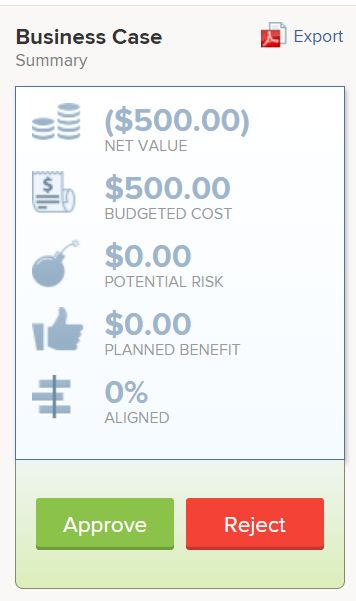

# Godkänn ett affärsärende

När du har slutfört och skickat in affärsärendet för en projektförfrågan måste affärsärendet godkännas. Detta beror på arbetsflödet i organisationen. Ett projekt kan börja utan att Business Case behöver godkännas, men Adobe Workfront-administratören och projektägarna tycker kanske inte att det är idealiskt. 

Mer information om hur du fyller i och skickar ett affärsärende finns i artikeln [Skapa ett affärsärende för ett projekt](../../../manage-work/projects/define-a-business-case/create-business-case.md).

## Åtkomstkrav

Du måste ha följande åtkomst för att kunna utföra stegen i den här artikeln:

<table style="table-layout:auto"> 
 <col> 
 <col> 
 <tbody> 
  <tr> 
   <td role="rowheader">Adobe Workfront-plan*</td> 
   <td> <p>Pro eller högre</p> </td> 
  </tr> 
  <tr> 
   <td role="rowheader">Adobe Workfront-licens*</td> 
   <td> <p>Plan </p> </td> 
  </tr> 
  <tr> 
   <td role="rowheader">Konfigurationer på åtkomstnivå*</td> 
   <td> <p>Redigera åtkomst till projekt</p> <p>Obs! Om du fortfarande inte har åtkomst frågar du Workfront-administratören om de anger ytterligare begränsningar för din åtkomstnivå. Information om hur en Workfront-administratör kan ändra åtkomstnivån finns i <a href="../../../administration-and-setup/add-users/configure-and-grant-access/create-modify-access-levels.md" class="MCXref xref">Skapa eller ändra anpassade åtkomstnivåer</a>.</p> </td> 
  </tr> 
  <tr> 
   <td role="rowheader">Objektbehörigheter</td> 
   <td> <p>Hantera behörigheter för ett projekt</p> <p>Mer information om hur du begär ytterligare åtkomst finns i <a href="../../../workfront-basics/grant-and-request-access-to-objects/request-access.md" class="MCXref xref">Begär åtkomst till objekt </a>.</p> </td> 
  </tr> 
 </tbody> 
</table>

&#42;Kontakta Workfront-administratören om du vill veta vilken plan, licenstyp eller åtkomst du har.

## Översikt över godkännande av affärsärende

Tänk på följande när du godkänner ett affärsärende för ett projekt:

* Du måste ha behörigheten Hantera för ett projekt för att kunna godkänna affärsärendet för det. 
* Du kommer inte att kunna se de projekt som väntar på att affärsärendet ska godkännas under dina godkännanden i Hem.
* Du måste manuellt gå till de enskilda projekt som behöver godkännas av ett affärsärende för att se att de väntar på godkännande. Det finns ingen meddelandefunktion i Workfront som varnar någon om att han eller hon måste godkänna ett projekts affärsfall.
* Du kan hitta projekt som väntar på godkännande av affärsärendet antingen genom att skapa en projektrapport eller genom att öppna portföljen som de är kopplade till. 

  Mer information om Portfolio finns i artikeln [Översikt över Portfolio i Adobe Workfront](../../../manage-work/portfolios/portfolios-overview/portfolio-overview.md).

## Godkänn affärsärendet genom att skapa en projektrapport

Du kan skapa en rapport för projekt för att se vilka projekt som behöver godkännas av deras affärsärende. 

Så här skapar du en rapport för projekt som väntar på godkännande av sina affärsärenden:

1. Skapa en rapport för projekt.

   Mer information om hur du skapar rapporter finns i artikeln [Skapa en anpassad rapport](../../../reports-and-dashboards/reports/creating-and-managing-reports/create-custom-report.md).

1. Välj **Visa** fliken för rapporten och klicka sedan på **Lägg till kolumn**.

1. Börja skriva &quot;Status&quot; i **Visa i den här kolumnen** och markera det här fältet när det visas i listan.

    I den här kolumnen visas projektens status.

1. Välj **Filter** fliken för rapporten och klicka sedan på **Lägg till en filterregel**.

1. Börja skriva &quot;Status&quot; i **Visa bara projekt där ...** och markera det när det visas i listan.
1. Välj **Jämn** för filtermodifieraren.
1. Börja skriva &quot;Requested&quot; i det tillgängliga fältet. 

   Detta garanterar att rapporten endast innehåller projekt som har statusen Begärd.

     

1. (Valfritt) Klicka på **Lägg till en annan filterregel**.

   Du kan lägga till ytterligare filter om du bara vill visa projekt där du är projektägare, projektsponsor eller Portfolio-ägare.

   Du kan till exempel använda följande filtersatser: 

   ```
   Project Sponsor ID Equals $$USER.ID
   ```

   för att visa projekt där du har utsetts till projektsponsorer

   ```
   Project Owner ID Equals $$USER.ID
   ```

   för att visa projekt där du har utsetts till projektägare

   ```
   Project Portfolio Owner ID Equals $$USER. ID
   ```

   för att visa var du har utsetts till Portfolio Manager. 

1. Klicka **Spara+stäng**.

   Observera att alla projekt i rapporten har statusen **Begärd**.

1. Klicka på namnet på ett projekt i rapporten för att öppna det.
1. Klicka **Affärsärende** till vänster.
1. Klicka **Godkänn** eller **Avvisa** i området Affärsärendesammanfattning för att godkänna eller avvisa affärsärendet.

   

   Projektstatusen ändras till **Godkänd** om affärsärendet har godkänts.

   Projektstatusen ändras till **Avvisad** om ärendet inte godkänns.

   >[!NOTE]
   >
   >Det finns inga meddelanden som informerar användaren som skickade in godkännandet av affärsärendet om hans/hennes projektförfrågan godkändes eller avvisades.

## Godkänn affärsärendet genom att gå till begärda projekt i en portfölj

Mer information om hur du granskar begärda projekt finns i artikeln [Granska begärda projekt](../../../manage-work/portfolios/create-and-manage-portfolios/review-requested-projects.md).
