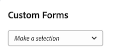

# Bifoga ett anpassat formulär till ett affärsärende

Anpassade Forms används för att samla in information som inte visas i befintliga Adobe Workfront-fält. 

Mer information om hur du skapar anpassade Forms finns i artikeln [Skapa eller redigera ett anpassat formulär](../../../administration-and-setup/customize-workfront/create-manage-custom-forms/create-or-edit-a-custom-form.md).

## Åtkomstkrav

Du måste ha följande åtkomst för att kunna utföra stegen i den här artikeln:

<table style="table-layout:auto"> 
 <col> 
 <col> 
 <tbody> 
  <tr> 
   <td role="rowheader">Adobe Workfront-plan*</td> 
   <td> 
Pro eller högre
 </td> 
  </tr> 
  <tr> 
   <td role="rowheader">Adobe Workfront-licens*</td> 
   <td> 
Plan 
 </td> 
  </tr> 
  <tr> 
   <td role="rowheader">Konfigurationer på åtkomstnivå*</td> 
   <td> 
Redigera åtkomst till projekt
 
Obs! Om du fortfarande inte har åtkomst frågar du Workfront-administratören om de anger ytterligare begränsningar för din åtkomstnivå. Information om hur en Workfront-administratör kan ändra åtkomstnivån finns i <a href="../../../administration-and-setup/add-users/configure-and-grant-access/create-modify-access-levels.md" class="MCXref xref">Skapa eller ändra anpassade åtkomstnivåer</a>.
 </td> 
  </tr> 
  <tr> 
   <td role="rowheader">Objektbehörigheter</td> 
   <td> 
Hantera behörigheter eller högre till projektet
 
Mer information om hur du begär ytterligare åtkomst finns i <a href="../../../workfront-basics/grant-and-request-access-to-objects/request-access.md" class="MCXref xref">Begär åtkomst till objekt </a>.
 </td> 
  </tr> 
 </tbody> 
</table>

&#42;Kontakta Workfront-administratören om du vill veta vilken plan, licenstyp eller åtkomst du har.

## Bifoga anpassad Forms till projekt

Du kan bifoga Custom Forms till ett projekt inom följande områden:

* När du redigerar ett projekt, i avsnittet Projektinformation.
* När du redigerar ett projekt, i rutan Redigera projekt.
* När du redigerar flera projekt samtidigt, från en lista med projekt.

   Mer information om hur du bifogar anpassade formulär till projekt när du redigerar ett eller flera projekt finns i artikeln [Redigera projekt](../../../manage-work/projects/manage-projects/edit-projects.md).

* När du skapar ett affärsärende för ett projekt, i affärsärendet enligt beskrivningen i den här artikeln.

Mer information om hur du bifogar anpassade formulär till objekt finns i [Lägga till ett anpassat formulär i ett objekt](../../../workfront-basics/work-with-custom-forms/add-a-custom-form-to-an-object.md).

## Bifoga anpassad Forms till affärsärendet

Om du vill lägga till ett anpassat alternativ från ett affärsärende måste Workfront-administratören välja det här alternativet i installationsprogrammet. Mer information om hur du aktiverar anpassade formulär finns i avsnittet [Konfigurera systemomfattande projektinställningar](../../../administration-and-setup/set-up-workfront/configure-system-defaults/set-project-preferences.md) i artikeln [Konfigurera systemomfattande projektinställningar](../../../administration-and-setup/set-up-workfront/configure-system-defaults/set-project-preferences.md).

Så här bifogar du ett anpassat formulär:

1. Gå till projektet som du vill bifoga formuläret till och klicka sedan på **Affärsärende** i den vänstra panelen.

   Affärsärendet visas.

1. I **Eget formulär** väljer du det anpassade formulär som du vill bifoga i listrutan.

   

1. (Valfritt) Välj **Redigera eget formulär**.\
   

1. (Valfritt) Ange information i fälten i det anpassade formuläret och klicka sedan på **Spara** .
