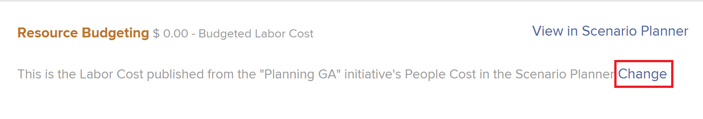
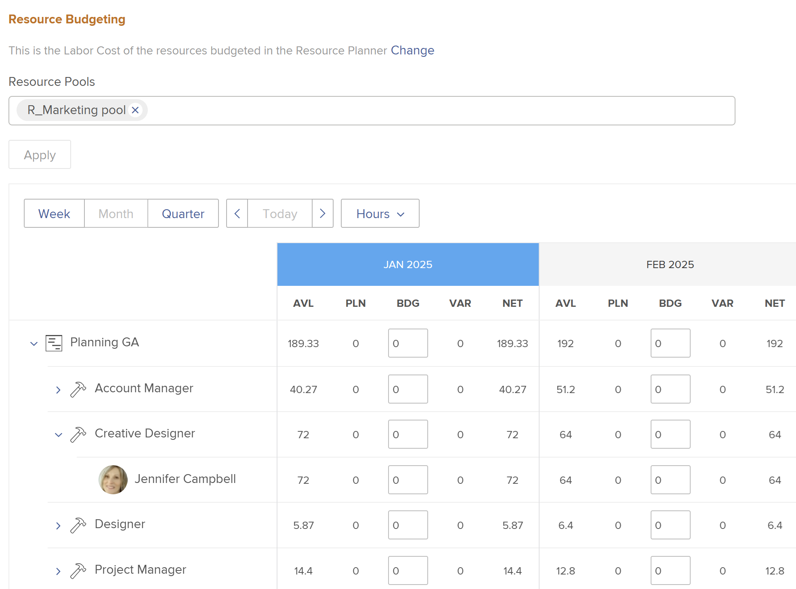

# Budgetresurser i affärsärendet med resursplaneraren

<!--Audited: 01/2025-->

Som en del av resursplaneringen kan du använda resursplaneraren på projektnivå för att budgetera de jobbroller som krävs för att slutföra arbetet i ett projekt när du skapar affärsplanen.

Mer information om hur du skapar ett affärsärende finns i [Skapa ett affärsärende för ett projekt](../../../manage-work/projects/define-a-business-case/create-business-case.md).

>[!TIP]
>
>Den information du anger i resursplaneraren på projektnivå visas också i resursplaneringsverktyget på systemnivå. Det motsatta är också sant. Mer information om resursplaneraren finns i [Översikt över resursplaneraren](../../../resource-mgmt/resource-planning/get-started-resource-planner.md).

Du kan också budgetera resurser i ett affärsfall med hjälp av Adobe Workfront Scenario Planner. Mer information finns i [Budgetresurser i affärsärendet med scenarioplaneraren](../../../manage-work/projects/define-a-business-case/budget-resources-in-business-case-use-scenario-planner.md).

## Åtkomstkrav

Du måste ha följande för att kunna utföra stegen i den här artikeln:

+++ Expandera om du vill visa åtkomstkrav för funktionerna i den här artikeln.

<table style="table-layout:auto"> 
 <col> 
 <col> 
 <tbody> 
  <tr> 
   <td role="rowheader">Adobe Workfront</td> 
   <td> 
Prime eller senare
 </td> 
  </tr> 
  <tr> 
   <td role="rowheader">Adobe Workfront-licens*</td> 
   <td> 
Nytt: Ljus eller högre

   
Aktuell: Granska eller senare

<b>VIKTIGT!</b>
 
   
Nytt: Du måste ha en standardlicens för att kunna ändra resursbudgeteringsinformationen. 
 
   
Aktuell: Du måste ha en planlicens för att kunna ändra resursbudgeteringsinformationen. 

   </td> 
  </tr> 
  <tr> 
   <td role="rowheader">Konfigurationer på åtkomstnivå</td> 
   <td> 
Redigera åtkomst till följande: 
 
    <ul> 
     <li> 
Projekt
 </li> 
     <li> 
Resurshantering
 </li> 
     <li> 
Finansiella data
 </li> 
    </ul> </td> 
  </tr> 
  <tr> 
   <td role="rowheader">Objektbehörigheter</td> 
   <td> 
Hantera behörigheter i projektet
 </td> 
  </tr> 
 </tbody> 
</table>

*Mer information finns i [Åtkomstkrav i Workfront-dokumentation](/help/quicksilver/administration-and-setup/add-users/access-levels-and-object-permissions/access-level-requirements-in-documentation.md).

+++

## Förutsättningar

Innan du börjar måste du göra följande:

* Uppfyll alla krav för resursplanering i Adobe Workfront. Mer information finns i [Översikt över resursplanering](../../../resource-mgmt/resource-planning/get-started-resource-planner.md).

* Associera resurspooler med projektet.

  <!--
  
(NOTE:(you must have tasks assigned to job roles and users on the project - this is optional because the users and their roles come from the pools))

  -->

  >[!NOTE]
  >
  >Du kan inte budgetera resurser som har tilldelats utleveranser i affärsärendet. Du kan budgetera dem i resursplaneraren på systemnivå. Mer information om resursplaneraren finns i [Översikt över resursplaneraren](../../../resource-mgmt/resource-planning/get-started-resource-planner.md).

* Även om detta inte är en förutsättning rekommenderar vi även att du anger Planerade timmar för aktiviteterna i projektet. Detta hjälper dig att förstå hur mycket arbete en uppgift kan behöva utföra, vilket hjälper dig att avgöra hur mycket tid resurserna ska budgeteras för att slutföra uppgiften. Mer information om hur du associerar uppgifter med planerade timmar finns i [Redigera uppgifter](../../../manage-work/tasks/manage-tasks/edit-tasks.md).

## Använd resurspooler för ett projekt och budgetresurser i affärsärendet

>[!IMPORTANT]
>
>Du kan budgetera dina resurser för en period på 15 år. Om du budgeterar resurser för ett projekt med en varaktighet på mer än 15 år kanske budgetinformationen inte är korrekt.

Så här använder du resurspooler och budgetprojektresurser i affärsärendet för ett projekt utan resurspool:

1. Gå till projektet som du vill budgetera resurser för.
1. Klicka på **Affärsfall** i den vänstra panelen.
1. (Villkorligt) Om ditt företag inte har någon licens för Workfront Scenario Planner klickar du på **Redigera resursbudgetering** i avsnittet **Resursbudgetering** och fortsätter sedan med steg 5.

   <!--
   
(NOTE: ensure it stays right - this is 5 instead of 6 because step 2 won't print for nwe)

   -->

1. (Valfritt och villkorligt) Gör något av följande om projektinformationen har publicerats från ett projekt i scenarioplaneraren:

   * Välj Resursplanering i fältet **Välj vilka timmar som ska användas för att beräkna den budgeterade arbetskostnaden för projektet** och klicka sedan på **Välj > Redigera resursbudgetering**.

     

   * Om scenarioplanen har valts för budgeteringsresurser för projektet klickar du på **Ändra** > **Redigera resursbudgetering**.

     

   Detta använder projektets budgeterade timmar för att beräkna den budgeterade arbetskostnaden för projektet.

   Scenarioplaneraren finns endast i den nya Adobe Workfront-upplevelsen och kräver ytterligare en licens. Mer information om Workfront Scenarioplan finns i [Översikt över scenarioplanen](../../../scenario-planner/scenario-planner-overview.md).

   >[!NOTE]
   >
   >Vi rekommenderar att du bestämmer dig för att använda resursplaneraren eller scenarioplaneraren när du börjar arbeta med ett projekt. Om du växlar mellan de båda delarna ofta under projektets löptid kan det leda till inkonsekvenser i budgeten för dina resurser.

1. Ange en eller flera **Resurspooler** i fältet **Välj resurspool**.

   Du får bara ange resurspooler som är ifyllda med aktiva användare.

   >[!TIP]
   >
   >Om projektet redan är associerat med resurspooler visas resursplaneraren som standard. Om du vill lägga till fler resurspooler i projektet redigerar du projektet. Mer information om hur du redigerar ett projekt finns i [Redigera projekt](../../../manage-work/projects/manage-projects/edit-projects.md).

1. Klicka på **Använd**.

   Resursplaneraren visas för det valda projektet.

   Som standard listas de första 20 jobbrollerna som är associerade med det här projektet i resursbudgetavsnittet i alfabetisk ordning. 

   Mer information om resursplaneraren finns i [Översikt över resursplaneraren](../../../resource-mgmt/resource-planning/get-started-resource-planner.md).

   

1. (Valfritt och villkorligt) Expandera jobbrollerna för att visa de användare som är associerade med dem.

   >[!NOTE]
   >
   >Aktiva användare visas endast under de jobbroller som är kopplade till dem om de uppfyller följande villkor:
   >
   >   
   >   
   >   * De tillhör en av projektets resurspooler.
   >   * De har tilldelats budgeterade timmar.
   >   * De är kopplade till en av projektets jobbroller.
   >   
   >

    

1. Klicka på **Idag** för att återgå till dagens tidsram.
1. (Valfritt) Klicka på **Vecka**, **Månad** eller **Kvartal** om du vill visa information för projektet i olika tidsramar.
1. (Valfritt) Klicka på listrutan **Timmar** och välj **Timmar**,**FTE** eller **Kostnad** för att ändra hur informationen visas i resursplaneraren. Timmar visas som standard.

1. (Valfritt) Klicka på **Exportera** om du vill exportera resursplaneraren till en Excel-fil.

   >[!NOTE]
   >
   >Du kan exportera data i upp till 12 tidsperioder i taget.

1. (Valfritt) Klicka på ikonen **Helskärm**  för att visa resursplaneraren i helskärmsläge.

1. Uppdatera fältet **BDG** (Budgeterade timmar) med värdena Timme, FTE eller Kostnad för användare, roller eller projektet genom att göra något av följande:

   * Uppskatta manuellt timtals-, FTE- eller kostnadsvärden för roller, användare eller projektet.

     eller

   * Klicka på ikonen **Alternativ** för projektet eller jobbrollerna och välj ett alternativ för att automatiskt budgetera timmarna för roller, användare eller projektet.

   Mer information om budgetering i projektvyn i resursplaneraren finns i [Budgetresurser i resursplaneraren med projekt- och rollvyerna](../../../resource-mgmt/resource-planning/budget-resources-project-role-views-resource-planner.md).

   >[!NOTE]
   >
   >Du kan budgetera timmar, heltidsanställda och kostnader för dina resurser för alla tidsramar som visas i området Resursbudgetering, oberoende av tidslinjen i projektet. Om du till exempel vill ange att dina resurser kanske inte är tillgängliga under tidslinjen för projektet (där de är kopplade till Planerade timmar), men de kan vara tillgängliga under en annan tid, kan du göra det genom att budgetera dem för tidsramar där Planerade timmar är noll, om det är när de blir tillgängliga för arbete.

1. (Valfritt) Om du vill veta om du kan flytta budgeterade timmar, FTE eller kostnader till en annan tidsram klickar du på ikonen **Alternativ** och sedan på **Justera budgeteringsdatum** .

   Mer information om hur du justerar budgeterade datum finns i [Justera budgeteringsdatum i Resursplanering](../../../resource-mgmt/resource-planning/adjust-budgeting-dates.md).

1. Klicka på **Spara**.

   Om du har en kostnad per timme som är associerad med dina jobbroller, beräknas projektets **budgeterade arbetskostnad** när du budgeterar resurserna i området Resursbudgetering. Budgeterad arbetskostnad visas i området Resursbudgetering i affärsärendet och i Översikt över affärsärenden.

   >[!TIP]
   >
   >Kostnaden visas i affärsärendet i projektets valuta.

   Den budgeteringsinformation som anges i affärsärendet visas också i resursplaneraren.

   När du kopierar ett projekt kan du även kopiera Budgeterade timmar till det nya projektet. Endast timmar som har budgeterats i resursplaneraren kopieras. Mer information finns i [Kopiera ett projekt](../manage-projects/copy-project.md).
