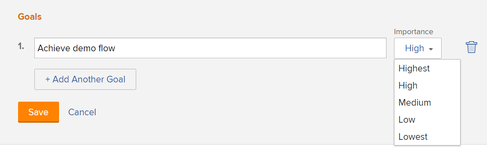

# Skapa mål för affärsärenden

<!-- Audited: 4/2025 -->

Som en del av att skapa ett affärsärende kan du skapa en uppsättning mål för att definiera målen för ett projekt. Dessa mål används för att förmedla syftet med att slutföra ett projekt till Portfolio Manager eller projektsponsorn.

<!--

(NOTE: below snippet: NWE only, not classic)

-->

>[!TIP]
>
>Du kan skapa strategiska mål för din organisation som inte är kopplade till ett projekts enskilda affärsärende. Du måste ha tillgång till Adobe Workfront-mål för att kunna skapa strategiska mål. Sedan kan du koppla dem till projekt utanför deras affärsärenden. Mer information om hur du skapar mål med hjälp av Workfront-mål finns i [Översikt över Adobe Workfront-mål](../../../workfront-goals/goal-management/wf-goals-overview.md).

Tänk på följande när du skapar affärsmål för dina projekt:

* Affärsmålen är projektspecifika. Du kan inte kopiera mål från ett projekt till ett annat eller sätta upp mål på systemnivå. De måste definieras för varje projekt.
* Adobe Workfront-administratören eller gruppadministratören måste aktivera projektets målavsnitt innan det visas i affärsärendet. Mer information om hur du aktiverar fält för affärsärenden för projekt finns i [Konfigurera projektinställningar för hela systemet](../../../administration-and-setup/set-up-workfront/configure-system-defaults/set-project-preferences.md).

* Mål är inte ett obligatoriskt avsnitt i projektets affärsärende.

  Ett projekt kan få poäng som ska prioriteras i Portfolio Optimizer, även om målavsnittet inte är definierat.

  Mer information om poängen i Portfolio Optimizer finns i [Använda ett styrkort i ett projekt och generera ett justeringsresultat](../../../manage-work/projects/define-a-business-case/apply-scorecard-to-project-to-generate-alignment-score.md).

* Du kan inte rapportera om mål för affärsärenden.

## Åtkomstkrav

+++ Expandera om du vill visa åtkomstkrav för funktionerna i den här artikeln.

<table style="table-layout:auto"> 
 <col> 
 </col> 
 <col> 
 </col> 
 <tbody> 
  <tr> 
   <td role="rowheader">Adobe Workfront</td> 
   <td> 
Aktuell: Prime eller senare

   
Äldre: Pro eller senare
  </td> 
  </tr> 
  <tr> 
   <td role="rowheader">Adobe Workfront-licens</td>
   <td> 
   
Aktuell: Standard
 
   
Äldre: Planera 
 
   </td> 
  </tr> 
  <tr> 
   <td role="rowheader">Konfigurationer på åtkomstnivå</td> 
   <td> 
Redigera åtkomst till projekt
 
Obs! Om du fortfarande inte har åtkomst frågar du Workfront-administratören om de anger ytterligare begränsningar för din åtkomstnivå. Mer information om hur en Workfront-administratör kan ändra åtkomstnivån finns i <a href="../../../administration-and-setup/add-users/configure-and-grant-access/create-modify-access-levels.md" class="MCXref xref">Skapa eller ändra anpassade åtkomstnivåer</a>.
 </td> 
  </tr> 
  <tr> 
   <td role="rowheader">Objektbehörigheter</td> 
   <td> 
Hantera behörigheter eller högre till projektet
 
Mer information om hur du begär ytterligare åtkomst finns i <a href="../../../workfront-basics/grant-and-request-access-to-objects/request-access.md" class="MCXref xref">Begär åtkomst till objekt </a>.
 </td> 
  </tr> 
 </tbody> 
</table>

Mer information om informationen i den här tabellen finns i [Åtkomstkrav i Workfront-dokumentationen](/help/quicksilver/administration-and-setup/add-users/access-levels-and-object-permissions/access-level-requirements-in-documentation.md).

+++

## Lägg till ett mål i ett projekts affärsfall

{{step1-to-projects}}

1. I projektlistan väljer du det projekt som du vill definiera affärsärendesmål för.
1. Klicka på **Affärsärende** i den vänstra panelen. Avsnittet **Affärsärende** visas.

   

1. Klicka på **Redigera mål** i avsnittet **Mål**.

1. Ange målbeskrivningen i det första fältet.

1. Välj prioritetsnivå (eller prioritet) för det här målet i listrutan **Prioritet**:

   * Högsta
   * Hög
   * Medium
   * Låg
   * Lägsta

     

     >[!NOTE]
     >
     >Du kan inte anpassa prioritetsnivåerna för mål.

1. (Valfritt) Om du vill lägga till ett annat mål klickar du på **Lägg till ett annat mål** och upprepar steg 5-6.

1. Klicka på **Spara**.
