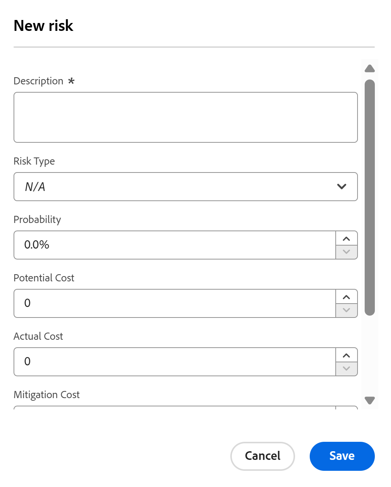
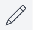

# Skapa och redigera risker i projekt

<!--Audited: 06/2025-->

<!--The highlighted information on this page refers to functionality not yet generally available. It is available only in the Preview environment for all customers. The same features will also be available in the Production environment for all customers after a week from the Preview release.    

For more information, see [Interface modernization](/help/quicksilver/product-announcements/product-releases/interface-modernization/interface-modernization.md). -->

Risker är tänkbara händelser eller faktorer som förhindrar att ett projekt slutförs i tid eller inom budgeten. Du kan registrera risker när du skapar ett affärsärende för ett projekt eller genom att använda fliken Risker.

Du kan bara skapa risker i projekt eller mallar. Du kan inte associera risker med uppgifter eller ärenden.

Risker kan kopplas till kostnad, men den faktiska riskkostnaden påverkar inte projektets faktiska kostnad.

>[!NOTE]
>
>I den här artikeln definieras riskerna som är kopplade till projektet när du definierar dem i projektets affärsmodell eller när du lägger till dem på fliken Risker i projektet.
>
>Information om fältet Risk som är tillgängligt när du redigerar ett projekt finns i [Redigera projekt](../../../manage-work/projects/manage-projects/edit-projects.md).

## Åtkomstkrav

+++ Expandera om du vill visa åtkomstkrav för funktionerna i den här artikeln. 

<table style="table-layout:auto"> 
 <col> 
 <col> 
 <tbody> 
  <tr> 
   <td role="rowheader">
Adobe Workfront package
</td> 
   <ul><li>Alla planer, för att lägga till risker i projektets riskområde
</li>
   <li>
Prime eller senare, för att lägga till risker i projektets affärsärende
</li></ul>
   </td> 
  </tr> 
  <tr> 
   <td role="rowheader">
Adobe Workfront-licens
</td> 
   <td> 
Standard 

   
Plan 
 </td> 
  </tr> 
  <tr> 
   <td role="rowheader">
Konfigurationer på åtkomstnivå
</td> 
   <td> 
Redigera åtkomst till projekt och finansiella data
 </td> 
  </tr> 
  <tr> 
   <td role="rowheader">
Objektbehörigheter
</td> 
   <td> 
 Hantera behörigheter som innehåller Hantera finansiering för det projekt som du vill skapa eller redigera risker för 
 </td> 
  </tr> 
 </tbody> 
</table>

Mer information finns i [Åtkomstkrav i Workfront-dokumentationen](/help/quicksilver/administration-and-setup/add-users/access-levels-and-object-permissions/access-level-requirements-in-documentation.md).

+++

## Skapa och redigera risker i affärsärendet

Du kan skapa risker som en del av planeringen av ett projekts affärsfall. Du kan redigera dem senare i affärsärendet, t.ex. när det sker ändringar av deras sannolikhet, reduceringsplan eller kostnad. Mer information om hur du skapar ett affärsärende finns i [Skapa ett affärsärende för ett projekt](../../../manage-work/projects/define-a-business-case/create-business-case.md).

Din Workfront-administratör eller gruppadministratör måste aktivera avsnittet **Risker** i ditt affärsärende i området Projektinställningar innan du kan visa det på projektnivå i avsnittet Affärsfall. Mer information om hur du anger projektinställningar finns i [Konfigurera systemomfattande projektinställningar](../../../administration-and-setup/set-up-workfront/configure-system-defaults/set-project-preferences.md).

Att skapa och redigera risker i affärsärendet är identiskt.

Så här skapar eller redigerar du en risk i ett affärsärende:

1. Gå till det projekt som du vill skapa risker för.
1. Klicka på **Affärsfall** i den vänstra panelen.
1. I avsnittet **Risker** klickar du på ikonen **Redigera**  .
1. Ange eller redigera följande information:

   * **Beskrivning:** Beskriv risken.

   * **Potentiell kostnad**: Ange den uppskattade kostnaden om risken ska inträffa.

   * **Sannolikhet**: Ange sannolikheten för att risken inträffar som ett procentvärde.

   * **Typ:** Välj vilken kategori risken tillhör.
   * **Åtgärdsplan**: Uppdatera beskrivningen av planen för att minska risken.

   * **Korrigeringskostnad**: Ange kostnaden för den reduceringsplan som du måste installera för att förhindra att risken uppstår.

   

1. (Valfritt) Klicka på **Lägg till ytterligare risk** om du vill lägga till fler risker.
1. Klicka på **Spara**.

## Skapa och redigera risker i området Risker

Förutom att skapa och redigera risker i affärsärendet kan du göra det i avsnittet **Risker** i ett projekt.

Du kan skapa och redigera risker i avsnittet Risker i ett projekt eller en mall. Att skapa risker för mallar är detsamma som att skapa risker för projekt.

1. Gå till det projekt som du vill skapa risker för.
1. Klicka på **Risker** i den vänstra panelen.

   

1. Klicka på **Lägg till fler risker** och skapa risker genom att redigera informationen.

   eller

   Klicka på **Ny risk** för att öppna rutan **Ny risk**.

   

1. (Villkorligt) Om du lägger till en risk i rutan **Ny risk** anger du följande information:

   * **Beskrivning**: Beskriv risken. Detta är ett obligatoriskt fält.
   * **Risktyp**: Ange vilken kategori risken tillhör.\
     Din Workfront-administratör definierar de risktyper som är tillgängliga i din miljö. Mer information om hur du definierar risktyper finns i artikeln [Redigera och skapa risktyper](../../../administration-and-setup/set-up-workfront/configure-system-defaults/edit-create-risk-types.md).

   * **Sannolikhet**: Ange sannolikheten för att risken inträffar som ett procentvärde.
   * **Potentiell kostnad**: Ange den uppskattade kostnaden om risken ska inträffa.
   * **Faktisk kostnad**: Ange den faktiska kostnaden för risken om risken inträffade.
   * **Korrigeringskostnad**: Ange kostnaden för den reduceringsplan som du måste installera för att förhindra att risken uppstår.
   * **Åtgärdsplan**: Uppdatera beskrivningen av planen för att minska risken.

1. Klicka på **Spara**.

1. (Valfritt) Välj en annan **status** för risken i listrutan **Status** när du använder vyn **Standard** för listan över risker.

   Som standard är **Status** för en risk **Identifierad**.

### Redigera risker i området Risker {#edit-risks-in-the-risks-area}

Du kan redigera risker under ett projekts livslängd eller när ändringar sker (t.ex. en ändring av sannolikhet, potentiell kostnad eller status).

Du kan redigera en risk i taget eller redigera flera risker samtidigt.

Så här redigerar du risker:

1. Gå till ett projekt där du vill redigera befintliga risker.
1. Klicka på **Risker** i den vänstra panelen.
1. Börja redigera fälten för de risker du ser i listan för att redigera en risk i taget.

   eller

   Markera en eller flera risker och klicka sedan på ikonen **Redigera**  för att redigera flera risker samtidigt.

   >[!NOTE]
   >
   >Du använder samma information för alla valda risker när du redigerar flera risker samtidigt. Den information som är associerad med varje risk innan dina ändringar skrivs över i en gruppredigering.

1. Om du har klickat på ikonen **Redigera** öppnas rutan **Redigera risk** eller **Redigera risker** .

   Uppdatera följande fält:

   * **Beskrivning**: Redigera beskrivningen av risken.
   * **Risktyp**: Uppdatera vilken kategori risken tillhör.
   * **Sannolikhet**: Ange sannolikheten för att risken inträffar som ett procentvärde.
   * **Potentiell kostnad**: Ange den uppskattade kostnaden om risken ska inträffa.
   * **Faktisk kostnad**: Ange den faktiska kostnaden för risken om risken inträffade.
   * **Korrigeringskostnad**: Ange kostnaden för den reduceringsplan som du måste installera för att förhindra att risken uppstår.
   * **Åtgärdsplan**: Uppdatera beskrivningen av planen för att minska risken.

1. Klicka på **Spara**.
1. (Valfritt) Redigera **status** för en risk i listrutan **Status** när du använder vyn **Standard** för listan över risker.

   >[!NOTE]
   >
   >Du kan inte redigera **status** för risker i dialogrutan **Redigera risk** . Det kan du bara göra i en textbunden redigering.
