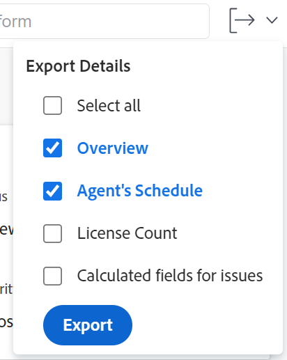
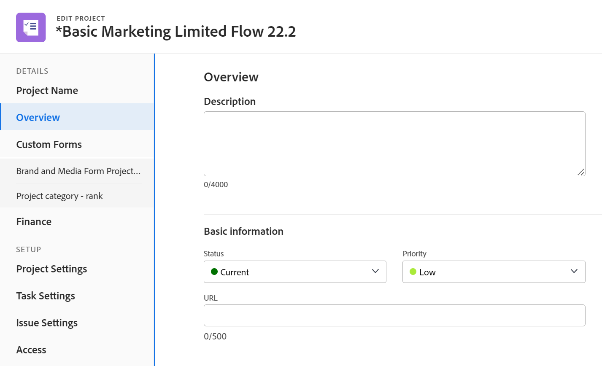
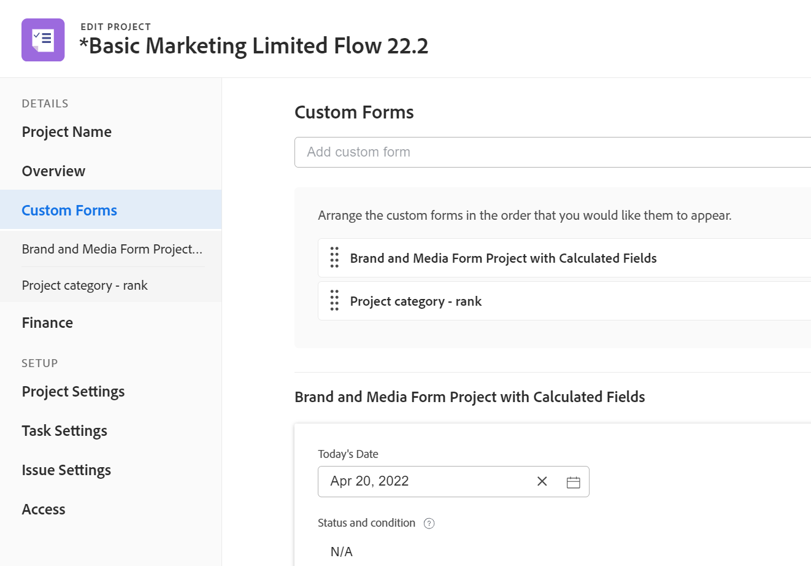
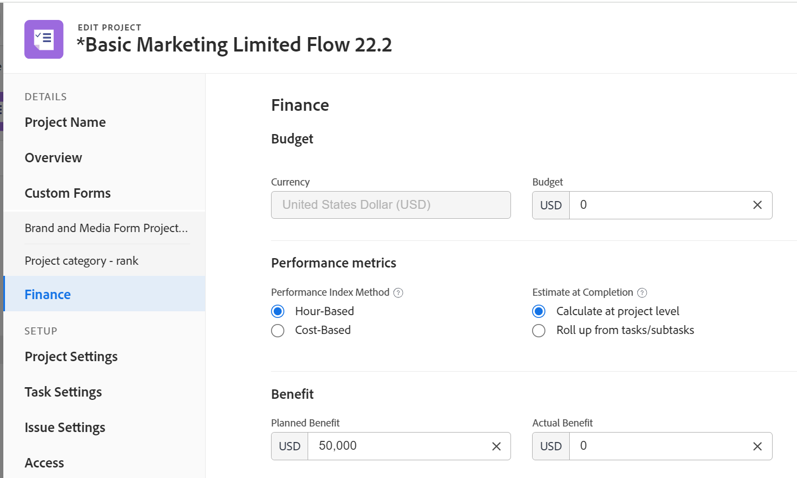
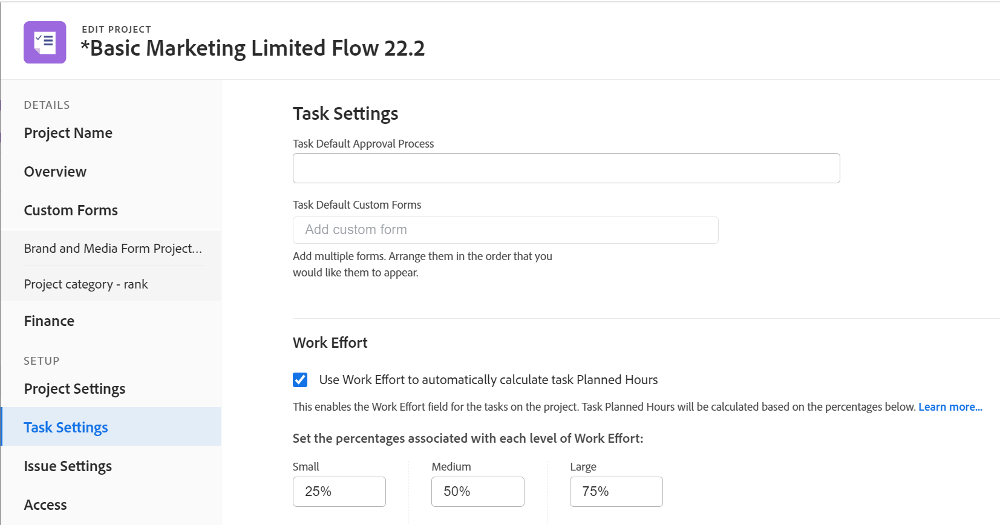
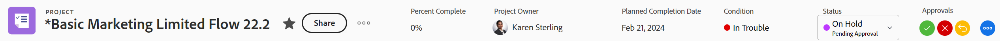

# Redigera projekt

<!--drafted for bulk editing projects: 
The highlighted information on this page refers to functionality not yet generally available. It is available only in the Preview environment. -->

<!--

***Linked to many articles,

The Resource Pools part also duplicates in the "Working with Resource Pools" article -

The Update Type section is also documented in Selecting the Project Update Type article

Keep the reference link to the other article that also documents the Update Type) 

(NOTE 2: information described here also exists in these articles:

** Project Overview area

**Manage project Finance area

If you need to update just one field, check to see if that field is also listed there and update in both places.)

-->

Du kan redigera ett projekt i Adobe Workfront så ofta det behövs. Vi rekommenderar att du redigerar projekt minimalt efter att statusen har ändrats till Aktuell för att undvika förvirring genom att skicka ut meddelanden om ändringarna till hela projektteamet. Det bästa är om du redigerar ett projekt när projektet har statusen Planering. Mer information om projektteamet finns i [Översikt över projektteamet](../../../manage-work/projects/planning-a-project/project-team-overview.md).

## Åtkomstkrav

<!--drafted - replace table at P&P:

<table style="table-layout:auto"> 
 <col> 
 <col> 
 <tbody> 
  <tr> 
   <td role="rowheader">Adobe Workfront plan*</td> 
   <td> 
Any
 </td> 
  </tr> 
  <tr> 
   <td role="rowheader">Adobe Workfront license*</td> 
   <td>
Current license: Standard 
 
   Or
   
Legacy license: Plan 
 </td> 
  </tr> 
  <tr> 
   <td role="rowheader">Access level configurations*</td> 
   <td> 
Edit access to Projects
 
If you still don't have access, ask your Workfront administrator if they set additional restrictions in your access level. For information about access to projects, see <a href="../../../administration-and-setup/add-users/configure-and-grant-access/grant-access-projects.md" class="MCXref xref">Grant access to projects</a>. For information on how a Workfront administrator can change your access level, see <a href="../../../administration-and-setup/add-users/configure-and-grant-access/create-modify-access-levels.md" class="MCXref xref">Create or modify custom access levels</a>. 
 </td> 
  </tr> 
  <tr> 
   <td role="rowheader">Object permissions</td> 
   <td> 
    <ul> 
     <li> 
Contribute permissions to a project to edit it in the Project Details area 
 </li> 
     <li> 
Manage permissions to a project to edit it in the Edit Project box
 </li> 
    </ul> 
 For information about project permissions, see <a href="../../../workfront-basics/grant-and-request-access-to-objects/share-a-project.md" class="MCXref xref">Share a project in Adobe Workfront</a>.
 
For information on requesting additional access, see <a href="../../../workfront-basics/grant-and-request-access-to-objects/request-access.md" class="MCXref xref">Request access to objects </a>.
 </td> 
  </tr> 
 </tbody> 
</table>
-->
Du måste ha följande åtkomst för att kunna utföra stegen i den här artikeln:

<table style="table-layout:auto"> 
 <col> 
 <col> 
 <tbody> 
  <tr> 
   <td role="rowheader">Adobe Workfront-plan*</td> 
   <td> 
Alla
 </td> 
  </tr> 
  <tr> 
   <td role="rowheader">Adobe Workfront-licens*</td> 
   <td> 
Plan 
 </td> 
  </tr> 
  <tr> 
   <td role="rowheader">Konfigurationer på åtkomstnivå*</td> 
   <td> 
Redigera åtkomst till projekt
 
Om du fortfarande inte har åtkomst frågar du Workfront-administratören om de anger ytterligare begränsningar för din åtkomstnivå. Mer information om åtkomst till projekt finns i <a href="../../../administration-and-setup/add-users/configure-and-grant-access/grant-access-projects.md" class="MCXref xref">Bevilja åtkomst till projekt</a>. Information om hur en Workfront-administratör kan ändra åtkomstnivån finns i <a href="../../../administration-and-setup/add-users/configure-and-grant-access/create-modify-access-levels.md" class="MCXref xref">Skapa eller ändra anpassade åtkomstnivåer</a>. 
 </td> 
  </tr> 
  <tr> 
   <td role="rowheader">Objektbehörigheter</td> 
   <td> 
    <ul> 
     <li> 
Contribute-behörigheter för ett projekt för att redigera det i området Projektinformation 
 </li> 
     <li> 
Hantera behörigheter för ett projekt för att redigera det i rutan Redigera projekt
 </li> 
    </ul> 
 Mer information om projektbehörigheter finns i <a href="../../../workfront-basics/grant-and-request-access-to-objects/share-a-project.md" class="MCXref xref">Dela ett projekt i Adobe Workfront</a>.
 
Mer information om hur du begär ytterligare åtkomst finns i <a href="../../../workfront-basics/grant-and-request-access-to-objects/request-access.md" class="MCXref xref">Begär åtkomst till objekt </a>.
 </td> 
  </tr> 
 </tbody> 
</table>

*Kontakta Workfront-administratören om du vill veta vilken plan, licenstyp eller åtkomst du har.

## Begränsningar för redigering av projekt

Det finns vissa begränsningar som kan hindra dig från att redigera projekt.

Tänk på följande när du redigerar projekt:

* Du kan inte redigera projekt som ingår i en godkännandeprocess, förutom loggningstiden.
* Du kan bara bifoga dokument eller mallar till ett projekt som har statusen Fullständigt, Dölj eller Väntar på godkännande om Workfront-administratören eller en gruppadministratör har aktiverat den här funktionen i området Projektinställningar. Mer information om hur du anger projektinställningar finns i [Konfigurera systemomfattande projektinställningar](../../../administration-and-setup/set-up-workfront/configure-system-defaults/set-project-preferences.md).
* Du kan bara redigera följande information i ett projekt med statusen Dead eller Complete:

   * Ändra befintliga utgifter.
   * Lägg till, ta bort eller redigera anpassade formulär.

## Redigera ett projekt

När du redigerar ett projekt kan du ändra information och inställningar för projektet samt uppgifter och problem i projektet.

Vissa inställningar som nämns i den här artikeln kan ändras från standardstatusen genom deras tillstånd i mallen som projektet skapades från. Mer information om hur du redigerar mallar finns i [Redigera projektmallar](../../../manage-work/projects/create-and-manage-templates/edit-templates.md).

1. Klicka på **Huvudmeny** icon  i det övre högra hörnet av Adobe Workfront och klicka sedan på **Projekt**.
1. (Valfritt) Klicka på **Projekt jag är på** eller **Projekt jag äger** i det övre högra hörnet för att visa projekt där du är ägare eller projekt där du är en del av projektteamet.

   

1. Klicka på namnet på det projekt som du vill redigera för att öppna projektsidan.

   >[!NOTE]
   >
   >Om du är gruppadministratör kan du visa och redigera gruppens projekt i gruppområdet samt i projektområdet. Mer information finns i [Skapa och ändra en grupps projekt](../../../administration-and-setup/manage-groups/work-with-group-objects/create-and-modify-a-groups-projects.md).

1. (Valfritt) Om du vill redigera begränsad information om ett projekt klickar du på **Projektinformation** i den vänstra panelen.

   

   >[!NOTE]
   >
   >Beroende på hur Workfront-administratören eller gruppadministratören ändrade din layoutmall kan det hända att fälten i området Projektinformation ordnas om eller inte visas. Mer information finns i [Anpassa detaljvyn med hjälp av en layoutmall](../../../administration-and-setup/customize-workfront/use-layout-templates/customize-details-view-layout-template.md).

   Så här redigerar du information i detaljavsnittet:

   1. (Valfritt) Klicka på **Komprimera alla** i det övre högra hörnet om du vill komprimera alla områden.
   1. (Valfritt och villkorligt) När ett område är komprimerat klickar du på **högerriktad pil**  bredvid varje område för att expandera området som du vill redigera.
   1. Mer information om hur du redigerar information på fliken Projektinformation finns i följande artiklar:

      * [Hantera information i projektöversiktsområdet](../../../manage-work/projects/manage-projects/understand-project-overview-area.md)
      * [Hantera information i projektfinansieringsdelen](../../../manage-work/projects/project-finances/manage-project-finance-area.md)
   1. (Valfritt) Om du vill bifoga ett anpassat formulär börjar du skriva namnet på ett formulär i dialogrutan **Lägg till anpassat formulär** och sedan markera den när den visas i listan och sedan klicka på **Spara ändringar**.
   1. (Valfritt) Klicka på **Exportera** icon  om du vill exportera översikten och information om anpassade formulär till en PDF-fil, och sedan klicka på **Exportera**. Välj bland följande:

      * Markera alla (visas bara när det finns minst ett anpassat formulär bifogat)
      * Översikt
      * Namnet på ett eller flera anpassade formulär

      PDF-filen hämtas till datorn.

      

      Mer information finns i [Exportera anpassade formulär och objektinformation](../../../workfront-basics/work-with-custom-forms/export-custom-forms-details.md).
   Om du vill ha information om de fält som visas i avsnittet Projektinformation fortsätter du redigera projektet i rutan Redigera projekt enligt beskrivningen nedan.
1. Om du vill redigera all information om projektet klickar du på **Mer** meny  bredvid namnet på projektet och klicka sedan på **Redigera**.

   eller

   Välj ett projekt i en lista och klicka sedan på **Redigera** icon  högst upp i listan.

   The **Redigera projekt** öppnas.

   >[!IMPORTANT]
   >
   >Du måste ha behörigheten Hantera för projektet för att kunna se alternativet Redigera.

   Alla projektfält är tillgängliga i rutan Redigera projekt och grupperas efter de områden som visas i den vänstra panelen.

   >[!NOTE]
   >
   >Beroende på hur Workfront-administratören eller gruppadministratören ändrade din layoutmall kan områdena i den vänstra panelen i rutan Redigera projekt eller fält som listas i dessa områden ordnas om eller inte visas. Mer information finns i [Anpassa detaljvyn med hjälp av en layoutmall](../../../administration-and-setup/customize-workfront/use-layout-templates/customize-details-view-layout-template.md).

1. (Villkorligt) Om du klickade på **Mer** -menyn och sedan **Redigera** kan du uppdatera informationen i följande områden i den vänstra panelen:

   * [Projektnamn](#project-name)
   * [Översikt](#overview)
   * [Anpassad Forms](#custom-forms)
   * [Ekonomi](#finance)
   * [Projektinställningar](#project-settings)
   * [Uppgiftsinställningar](#task-settings)
   * [Ärendeinställningar](#issue-settings)
   * [Åtkomst](#access)

   >[!NOTE]
   >
   >Beroende på hur din Workfront-administratör konfigurerar vår layoutmall för projektdelen Detaljer kan avsnitten och fälten i rutan Redigera projekt vara annorlunda i din miljö. Mer information finns i [Anpassa detaljvyn med hjälp av en layoutmall](../../../administration-and-setup/customize-workfront/use-layout-templates/customize-details-view-layout-template.md).

### Projektnamn {#project-name}

1. Börja redigera ditt projekt enligt beskrivningen ovan.
1. Klicka **Projektnamn** i den vänstra panelen.

   

1. Uppdatera namnet på projektet.

   Du kan inte redigera projektnamnet när du redigerar flera projekt samtidigt.

### Översikt {#overview}

1. Börja redigera ditt projekt enligt beskrivningen ovan.
1. Klicka **Översikt** i den vänstra panelen.

   

1. Uppdatera följande information om projektet:

   <table style="table-layout:auto"> 
    <col> 
    <col> 
    <tbody> 
     <tr> 
      <td role="rowheader"><strong>Beskrivning</strong> </td> 
      <td> 
Lägg till ytterligare information om projektet.
 </td> 
     </tr> 
     <tr> 
      <td role="rowheader"><strong>Status</strong> </td> 
      <td> 
Välj status för projektet. Du kan inte markera ett projekt som slutfört innan alla aktiviteter och utgåvor har slutförts. Mer information om projektstatus finns i <a href="../../../administration-and-setup/customize-workfront/creating-custom-status-and-priority-labels/project-statuses.md" class="MCXref xref">Öppna listan över status för systemprojekt</a>
 </td> 
     </tr> 
     <tr> 
      <td role="rowheader"><strong>Prioritet</strong> </td> 
      <td> 
 
Det här är bara en visuell flagga som gör att du kan prioritera dina projekt.
 
Beroende på vilka projektinställningar du har valt av Workfront-administratören kan prioritetsnamnen vara olika för dig. Mer information om redigeringsprioriteringar finns i <a href="../../../administration-and-setup/customize-workfront/creating-custom-status-and-priority-labels/create-customize-priorities.md" class="MCXref xref">Skapa och anpassa prioriteringar</a>
 
 </td> 
     </tr> 
     <tr> 
      <td role="rowheader"><strong>URL</strong> </td> 
      <td> 
Ange en webblänk som relaterar till information om det här projektet.
 </td> 
     </tr> 
     <tr> 
      <td role="rowheader"><strong>Villkorstyp</strong> </td> 
      <td> 
Välj mellan följande villkorstyper: 
        <ul> 
         <li><strong>Manuell:</strong> Projektägaren ställer in villkoret för projektet manuellt.</li> 
         <li><strong>Status:</strong> Workfront ställer automatiskt in villkoret baserat på aktiviteternas förloppsstatus på den kritiska sökvägen. Mer information om förloppsstatus finns i <a href="../../../manage-work/tasks/task-information/task-progress-status.md" class="MCXref xref">Översikt över status för åtgärdsförlopp</a>.</li> 
        </ul>
Din Workfront-administratör eller en gruppadministratör väljer standardinställningen för hur projektets villkor beräknas för systemet eller din grupp. Mer information om hur du anger standardinställningar för projekt finns i <a href="../../../administration-and-setup/set-up-workfront/configure-system-defaults/set-project-preferences.md" class="MCXref xref">Konfigurera systemomfattande projektinställningar</a>. 

 </td> 
     </tr> 
     <tr> 
      <td role="rowheader"><strong>Villkor</strong> </td> 
      <td> 
 
(Visas endast efter att du har valt <strong>Manuell</strong> för <strong>Villkorstyp</strong>): Välj ett villkor för att ange hur projektet ska gå. 
 
Mer information om hur projektvillkor kan ställas in automatiskt eller manuellt finns i <a href="../../../manage-work/projects/manage-projects/project-condition-and-condition-type.md" class="MCXref xref">Översikt över projektvillkor och villkorstyp</a>
 
 </td> 
     </tr> 
     <tr> 
      <td role="rowheader"><strong>Schemaläge</strong> </td> 
      <td> 
Ange om projektet är schemalagt från startdatumet eller från slutförandedatumet. Det här valet avgör planerade datum för aktiviteterna i projektet. 
        <ul> 
         <li><strong>Startdatum</strong>: Den första aktiviteten i projektet har som standard samma planerade startdatum som projektet. Information om schemalagt startdatum för aktiviteten finns i <a href="../../../manage-work/tasks/task-information/task-planned-start-date.md" class="MCXref xref">Översikt över aktivitetens planerade startdatum</a>. Projektets tidslinje beräknas från Startdatum och Slutförandedatum för projektet beräknas av systemet utifrån varaktigheten för alla uppgifter. </li> 
         <li><strong>Slutförandedatum</strong>: Den sista aktiviteten i projektet har samma Planerat slutförandedatum som projektet. Projektets tidslinje beräknas från Slutförandedatum och Startdatum för projektet beräknas av systemet, genom att tidsperioden för alla uppgifter subtraheras från Slutförandedatum för projektet. </li> 
        </ul>
Din Workfront-administratör eller en gruppadministratör väljer standardinställningen för schemaläge för datorn eller gruppen. Mer information om hur du anger standardinställningar för projekt finns i <a href="../../../administration-and-setup/set-up-workfront/configure-system-defaults/set-project-preferences.md" class="MCXref xref">Konfigurera systemomfattande projektinställningar</a>.

 </td> 
     </tr> 
     <tr> 
      <td role="rowheader"><strong>Planerat startdatum och starttid</strong> </td> 
      <td> 
 
Ange datumet när du väljer <strong>Schemalägg från startdatum</strong>.  
 
Detta är ett skrivskyddat fält när du väljer <strong>Schemalägg från slutförandedatum</strong>. 
 
 </td> 
     </tr> 
     <tr> 
      <td role="rowheader"><strong>Planerat slutförandedatum och tid</strong> </td> 
      <td> 
Ange datumet när du väljer <strong>Schemalägg från slutförandedatum</strong>. 
 
Detta är ett skrivskyddat fält när du väljer <strong>Schemalägg från startdatum</strong>. 
 </td> 
     </tr> 
     <tr> 
      <td role="rowheader"><strong>Portfolio</strong></td> 
      <td>Ange Portfolio som projektet tillhör. Du måste skapa en Portfolio innan den visas i listrutan. Endast aktiva portföljer kan associeras med ett projekt. Mer information om hur du skapar portföljer finns i <a href="../../../manage-work/portfolios/create-and-manage-portfolios/create-portfolios.md" class="MCXref xref">Skapa en portfölj </a>.</td> 
     </tr> 
     <tr> 
      <td role="rowheader"><strong>Program</strong></td> 
      <td> 
Om du har valt ett Portfolio för projektet anger du ett program för projektet. Vissa Portfolio har kanske inga program. Du måste skapa ett program innan det visas i den här listrutan. Endast aktiva program kan associeras med ett projekt. 
 
Mer information om hur du skapar program finns i <a href="../../../manage-work/portfolios/create-and-manage-programs/create-program.md" class="MCXref xref">Skapa ett program</a>.
 </td> 
     </tr> 
     <tr> 
      <td role="rowheader"><strong>Grupp</strong></td> 
      <td> 
 
Ange namnet på gruppen som är associerad med projektet. 
Detta är ett obligatoriskt fält. Du kan inte ha ett projekt som inte är associerat med en grupp. 
 
Du kan kontrollera att du markerar rätt grupp genom att hålla markören över den och klicka på informationsikonen  som visas bredvid den. Här visas ett verktygstips med information om gruppen, till exempel hierarkin för grupper ovanför och dess administratörer.
 Som standard kopplas en av följande grupper automatiskt till ett projekt när det skapas, såvida du inte anger en annan grupp:
 
        <ul> 
         <li> 
När projektet skapas från området Projekt är startgruppen för den som skapat projektet associerad med projektet. 
 
Detta gäller också när projektet skapas från avsnittet Projekt i en portfölj eller ett program.
 </li> 
         <li> 
När projektet skapas från en grupps huvudsida i inställningsområdet är den gruppen kopplad till projektet.
 </li> 
        </ul> 
 
  
 
Om projektet, eller dess uppgifter eller problem redan är kopplade till en godkännandeprocess på gruppnivå med anpassade statusvärden på gruppnivå, kan en ändring av gruppen skapa en konflikt mellan den föregående gruppens godkännandestatus och de som finns på systemnivån. Överväg att ta bort godkännandeprocesserna på gruppnivå för projektet eller dess uppgifter eller problem innan gruppen uppdateras. Mer information om hur du skapar godkännandeprocesser på gruppnivå finns i <a href="../../../administration-and-setup/manage-groups/work-with-group-objects/create-and-modify-groups-approval-processes.md" class="MCXref xref">Godkännandeprocesser på gruppnivå</a>. Mer information om hur du skapar en anpassad status på gruppnivå finns i <a href="../../../administration-and-setup/manage-groups/manage-group-statuses/create-or-edit-a-group-status.md" class="MCXref xref">Skapa eller redigera en gruppstatus</a>
 </td> 
     </tr> 
     <tr> 
      <td role="rowheader"><strong>Företag</strong> </td> 
      <td> 
Ange ett företag som är associerat med projektet. Du måste skapa ett företag innan du kan associera det med ett projekt. Endast aktiva företag kan associeras med ett projekt. Mer information om hur du skapar företag finns i <a href="../../../administration-and-setup/set-up-workfront/organizational-setup/create-and-edit-companies.md" class="MCXref xref">Skapa och redigera företag</a>.
 </td> 
     </tr> 
     <tr> 
      <td role="rowheader"><strong>Projektägare</strong> </td> 
      <td> 
Börja skriva namnet på en användare som ska lägga till dem i projektet och markera det sedan när det visas i listan. Användaren läggs till i projektteamet och får automatiskt behörigheten Hantera för projektet. Användaren som har angetts som projektägare måste vara en Workfront-aktiv användare.

      </td> 
     </tr> 
     <tr> 
      <td role="rowheader"><strong>Projektsponsorer</strong> </td> 
      <td> 
Börja skriva namnet på en användare som ska lägga till dem i projektet och markera det sedan när det visas i listan. Användaren läggs till i projektteamet och får automatiskt behörigheten Visa i projektet. Användaren som är utsedd som projektsponsor måste vara en Workfront-aktiv användare. 
 </td> 
     </tr> 
     <tr> 
      <td role="rowheader"><strong>Resurshanteraren</strong> </td> 
      <td> 
 Börja skriva namnen på användarna som ska lägga till dem i projektet och markera dem sedan när de visas i listan. Användarna läggs till i projektteamet och får automatiskt behörigheten Hantera för projektet och kan tilldela resurser till aktiviteter och ärenden i projektet. Användarna behåller behörigheten Hantera för projektet även när de tas bort från fältet Resurshanteraren. Du kan ange mer än en resurshanterare. 
 </td> 
     </tr> 
    </tbody> 
   </table>

   >[!TIP]
   >
   >   När du uppdaterar fälten Projektägare, Projektsponsor och Resurshanterare ska du lägga märke till avataren, användarens primära roll eller deras e-postadress för att skilja mellan användare med identiska namn. Användarna måste vara associerade med minst en jobbroll för att kunna visa den när du lägger till dem.

1. (Valfritt) Fortsätt redigera följande avsnitt, beroende på vilken information du vill ändra.

   eller

   Klicka **Spara**.

### Anpassad Forms {#custom-forms}

1. Börja redigera ditt projekt enligt beskrivningen ovan.
1. Klicka **Anpassad Forms** i den vänstra panelen.

   

1. Klicka på **Lägg till anpassat formulär** och välj ett formulär från listan som du vill bifoga till projektet.

   Du måste skapa anpassade formulär innan de kan väljas i det här fältet. Endast aktiva anpassade formulär visas i listan. Mer information om hur du skapar anpassade formulär finns i [Skapa eller redigera ett anpassat formulär](../../../administration-and-setup/customize-workfront/create-manage-custom-forms/create-or-edit-a-custom-form.md). Du kan lägga till upp till tio anpassade formulär i ett projekt.

1. (Villkorligt) Om du har kopplat ett anpassat formulär till projektet redigerar du alla fält i formuläret. Du måste ange alla obligatoriska fält innan du kan spara projektet.

   >[!NOTE]
   >
   >Beroende på hur din Workfront-administratör anger behörigheter för avsnitten i ditt anpassade formulär kan inte alla visa eller redigera samma fält i ett visst anpassat formulär. Behörigheterna att redigera fält i ett avsnitt i ett anpassat formulär beror på vilka behörigheter du har för själva projektet. Mer information om hur du anger behörigheter i avsnitt i ett anpassat formulär finns i [Skapa eller redigera ett anpassat formulär](../../../administration-and-setup/customize-workfront/create-manage-custom-forms/create-or-edit-a-custom-form.md). Mer information om hur du ställer in behörigheter för projekt finns i [Dela ett projekt i Adobe Workfront](../../../workfront-basics/grant-and-request-access-to-objects/share-a-project.md).

1. (Valfritt) Klicka på **X-ikon** till höger om namnet på ett anpassat formulär som du vill ta bort och klicka sedan på **Ta bort**.
1. (Valfritt) Fortsätt redigera följande avsnitt, beroende på vilken information du vill ändra

   eller

   Klicka **Spara**.

### Ekonomi {#finance}

1. Börja redigera ditt projekt enligt beskrivningen ovan.
1. Klicka **Ekonomi** i den vänstra panelen.

   

1. Uppdatera följande ekonomiska information för projektet:

   <table style="table-layout:auto"> 
    <col> 
    <col> 
    <tbody> 
     <tr data-mc-conditions=""> 
      <td role="rowheader"><strong>Valuta</strong> </td> 
      <td> 
 
Ange valutan för projektet, om den skiljer sig från standardvalutan i systemet. Du kan inte ändra valutan för ett projekt om det redan finns ekonomisk information om projektet. Det här fältet är inte synligt om du bara har standardvalutan i systemet. 
 
Mer information om valuta finns i <a href="../../../administration-and-setup/manage-workfront/exchange-rates/set-up-exchange-rates.md" class="MCXref xref">Ställ in valutakurser</a>. 
 
 </td> 
     </tr> 
     <tr> 
      <td role="rowheader"><strong>Budget</strong> </td> 
      <td> 
Ange en budget för projektet. 
 </td> 
     </tr> 
     <tr> 
      <td role="rowheader"><strong>Resultatindexmetod</strong> </td> 
      <td> 
Välj <b>Timbaserad</b>, eller <b>Kostnadsbaserad</b> för att ange om värdena för EV (Earned Value) för projektet (t.ex. Cost Performance Index eller Estimated Actual Cost) ska beräknas med hjälp av timmar eller kostnader. 
 
Mer information om prestandaindexmetoden finns i <a href="../../../manage-work/projects/project-finances/set-pim.md" class="MCXref xref">Ange PIM (Performance Index Method)</a>. 
 
Din Workfront-administratör eller en gruppadministratör väljer standardinställningen för prestandaindexmetod för systemet eller gruppen. Mer information om hur du anger standardinställningar för projekt finns i <a href="../../../administration-and-setup/set-up-workfront/configure-system-defaults/set-project-preferences.md" class="MCXref xref">Konfigurera systemomfattande projektinställningar</a>.
 </td> 
     </tr> 
     <tr> 
      <td role="rowheader"><strong>Uppskattning vid slutförande</strong> </td> 
      <td> 
 
Ange hur Workfront ska beräkna uppskattningen vid slutförande (EAC). 

      Välj bland följande alternativ: 
      <ul><li><b>Beräkna på projektnivå</b></li>
      <li><b>Samla in uppgifter/underuppgifter</b></li> </ul>
      
Mer information om hur Beräkningen vid slutförande beräknas finns i <a href="../../../manage-work/projects/project-finances/calculate-eac.md" class="MCXref xref">Beräkna uppskattning vid slutförande</a>.
 
Din Workfront- eller gruppadministratör väljer standardinställningen Beräkning vid slutförande för ditt system eller din grupp. Mer information om hur du anger standardinställningar för projekt finns i <a href="../../../administration-and-setup/set-up-workfront/configure-system-defaults/set-project-preferences.md" class="MCXref xref">Konfigurera systemomfattande projektinställningar</a>.
 
 </td> 
     </tr> 
     <tr> 
      <td role="rowheader"><strong>Planerad förmån</strong> </td> 
      <td> 
Uppskatta den planerade fördelen med projektet. Detta används i affärsscenariot för projektet och i Portfolio Optimizer. Mer information om en planerad förmån för ett projekt finns i <a href="../../../manage-work/projects/project-finances/project-planned-benefit.md" class="MCXref xref">Översikt över projektplanerad förmån</a>. Den planerade fördelen med ett projekt beaktas när ett projekts nettovärde beräknas. 
 
Mer information finns i <a href="../../../manage-work/portfolios/portfolio-optimizer/manage-projects-in-portfolio-optimizer.md" class="MCXref xref">Hantera projekt i Portfolio Optimizer</a> . 
 </td> 
     </tr> 
     <tr> 
      <td role="rowheader"><strong>Faktisk förmån</strong> </td> 
      <td> 
Uppskatta projektets faktiska nytta. Detta är ett valutabelopp som representerar den förmån som ditt företag eller din avdelning skulle få när projektet är klart. 
 </td> 
     </tr> 
      <tr> 
      <td role="rowheader"><strong>Fast kostnad</strong> </td> 
      <td> 
Ange fast kostnad för projektet. Detta skiljer sig från arbetskostnaden som kommer från timmarna i projektet och kostnaden som kommer från kostnaderna för projektet. Den fasta kostnaden för ett projekt tas med i beräkningen av ett projekts nettovärde och ingår i den budgeterade kostnaden. 
 </td> 
     </tr> 
     <tr> 
      <td role="rowheader"><strong>Fast intäkt</strong> </td> 
      <td> 
Ange fasta intäkter för projektet. 
 </td> 
     </tr> 
    </tbody> 
   </table>

1. (Valfritt) Fortsätt redigera följande avsnitt, beroende på vilken information du vill ändra.

   eller

   Klicka **Spara**.

### Projektinställningar {#project-settings}

1. Börja redigera ditt projekt enligt beskrivningen ovan.
1. Klicka **Projektinställningar** i den vänstra panelen.

   

1. Uppdatera följande information:

   <table style="table-layout:auto"> 
      <col> 
      <col> 
      <tbody> 
      <tr> 
      <td role="rowheader"><strong>Sökväg för milstolpe</strong> </td> 
       <td> 
Välj en milstolpe-sökväg för projektet. Endast aktiva milstolpesökvägar visas i listan.
 
Mer information om milstolpbanor finns i <a href="../../../administration-and-setup/customize-workfront/configure-approval-milestone-processes/create-milestone-path.md" class="MCXref xref">Skapa en milstolpbana</a>.
 </td> 
      </tr> 
      <tr> 
      <td role="rowheader"><strong>Slutförandeläge</strong> </td> 
      <td> 
Styr hur projektet markeras som fullständigt. Välj bland följande alternativ: 
       <ul> 
       <li>
<strong>Automatisk</strong>: Projektet är markerat som slutfört när alla uppgifter och ärenden är slutförda.

Projektets status ändras automatiskt till Slutför endast när projektstatusen är Aktuell när aktiviteterna har slutförts. 
</li> 
       <li><strong>Manuell</strong>: Du måste manuellt välja statusen Slutför för projektet när alla uppgifter och ärenden är slutförda.</li> 
       </ul>
 </td> 
       </tr> 
       <tr> 
       <td role="rowheader"><strong>Läge för slutförande av sammanfattning</strong></td> 
       <td> 
Styr hur de överordnade uppgifterna markeras som Slutfört. Välj bland följande alternativ: 
       <ul> 
       <li><strong>Automatisk</strong>: De överordnade aktiviteterna markeras som Slutfört och de uppdaterar automatiskt procentandelen slutförd, allt eftersom de underordnade aktiviteterna slutförs och procentandelen slutförd för de underordnade uppdateras. </li> 
       <li><strong>Manuell</strong>: Du måste uppdatera procentandelen slutförd och statusen för de överordnade uppgifterna manuellt, oberoende av vilka ändringar som görs för de underordnade uppgifterna.</li> 
       </ul>
 </td> 
       </tr> 
       <tr> 
       <td role="rowheader"><strong>Uppdateringstyp</strong></td> 
       <td> 
Styr när ändringarna som du gör på projekttidslinjen sparas i projektet eller de överordnade aktiviteterna. Följande ändringar av projektet utlöser till exempel en uppdatering av tidslinjen i projektet: 
       <ul> 
       <li>Uppdatera datum för uppgifter</li> 
       <li>Ändra föregående relationer för uppgifter</li> 
       <li>
Ändra överordnade och underordnade relationer genom att lägga till eller ta bort tilldelningar förutom att ändra aktivitetsbegränsningen eller varaktighetstypen.

När uppgifterna uppdateras uppdateras deras överordnade objekt (överordnade uppgifter eller projektet) vid den tidpunkt som anges av uppdateringstypen. 

Uppdatera sidan om de överordnade objekten inte uppdateras omedelbart efter ändringen när du väljer Uppdatera endast automatiskt och vid ändring eller Ändra endast

Välj bland följande alternativ: 

- <strong>Automatiskt och vid ändring</strong> (Standardinställning): Projektets tidslinje uppdateras varje gång en ändring inträffar i projektet eller i ett annat projekt som projektet är beroende av (Vid ändring). Projektets tidslinje uppdateras också varje natt (automatiskt).

Detta är den rekommenderade inställningen för det här fältet eftersom det ser till att projektet alltid är uppdaterat.

När du utför en åtgärd för en uppgift eller ett projekt som utlöser en omberäkning av tidslinjen, visas alla tillgängliga datum omedelbart så att du kan fortsätta arbeta. I projekt med mer än 100 uppgifter visas datum som kräver längre omberäkningar som ett frågetecken (mellan 1 och 5 sekunder, eller upp till en minut för stora projekt). Detta anger att omberäkningen ännu inte är klar och att datumen kan ändras.

- <strong>Ändra endast</strong>: Projektets tidslinje uppdateras varje gång en ändring inträffar i projektet eller i ett annat projekt som projektet är beroende av. Du kanske vill välja det här alternativet om ändringarna sällan inträffar i projektet eller i andra projekt som tidslinjen är beroende av.

- <strong>Endast automatiskt</strong>: Projektets tidslinje uppdateras varje natt. tidslinjen inte uppdateras omedelbart efter att ändringar har gjorts.

Du kan välja det här alternativet om det sker många ändringar varje dag i projektet eller i andra projekt som tidslinjen är beroende av. Tänk dock på att du valde den här inställningen eftersom projektet inte uppdateras samtidigt som ändringarna görs.

- <strong>Endast manuellt</strong>: Projektets tidslinje uppdateras bara när du väljer alternativet Beräkna om tidslinje. Mer information om hur du manuellt beräknar om projekttidslinjen finns i <a href="../../../manage-work/projects/manage-projects/recalculate-project-timeline.md" class="MCXref xref">Beräkna om projekttidslinjer</a>. 

Du kan välja det här alternativet om du gör många ändringar i projektet samtidigt och du vill att tidslinjen ska räknas om efter att alla ändringar har gjorts (i stället för efter varje enskild ändring).
</li> 
       </ul>
 </td> 
       </tr> 
       <tr> 
       <td role="rowheader"><strong>Schema</strong> </td> 
       <td> 
Välj ett schema för ditt projekt. Det ska vara samma schema som tilldelats de flesta personer som arbetar med projektet. Du måste skapa ett schema innan du kan tilldela det till ett projekt eller en användare. Om du inte har skapat anpassade scheman i ditt system väljs standardschemat.
 
Mer information om hur du skapar scheman finns i <a href="../../../administration-and-setup/set-up-workfront/configure-timesheets-schedules/create-schedules.md" class="MCXref xref">Skapa ett schema</a>. 
 </td> 
       </tr> 
       <tr> 
       <td role="rowheader"><strong>Användningstid av</strong> </td> 
       <td> 
Avgör om tidpunkten för den primära tilldelades för en uppgift justerar planerade aktivitetsdatum i projektet. 

Din Workfront-administratör eller en gruppadministratör väljer standardinställningen för den här inställningen för ditt system eller din grupp. Mer information om hur du anger standardinställningar för projekt finns i <a href="../../../administration-and-setup/set-up-workfront/configure-system-defaults/set-project-preferences.md" class="MCXref xref">Konfigurera systemomfattande projektinställningar</a>. 

Välj bland följande alternativ: - <strong>Överväg användarens ledig tid i aktivitetsvaraktigheter</strong>: När du väljer det här alternativet justeras de planerade datumen för uppgifterna enligt tiden för den primära tilldelaren för uppgiften, om tiden för inaktivitet inträffar under aktivitetens varaktighet. 

Om en aktivitet med villkoret Så snart som möjligt är schemalagd att starta den 1 juni och slutföras den 3 juni, och den primära tilldelaren har 2 juni markerat som Tid off, när detta val är aktiverat, är de planerade aktivitetsdatumen 1-4 juni. Beroende på uppgiftsbegränsningen finns följande scenarier: 
 
       <ul> 
       <li>För uppgiftsbegränsningar som gäller planering från ett startdatum (så snart som möjligt, tidigaste tillgängliga tid, Start tidigast, inte senare än, Måste börja på) ändras inte det planerade startdatumet, men det planerade slutförandedatumet ändras inte.</li> 
       <li>För aktivitetsbegränsningar som gäller planering från ett slutförandedatum (så sent som möjligt, senaste tillgängliga tid, Slutför inte tidigare än, Slutför inte senare än, Måste avslutas den) ändras inte det planerade slutförandedatumet, men det planerade startdatumet ändras inte.</li> 
       <li>För uppgifter med en begränsning på fasta datum ändras varken det planerade startdatumet eller slutförandedatumet. </li> 
       </ul>
Aktivitetens varaktighet ändras inte när du väljer den här inställningen. Endast planerade datum ändras beroende på aktivitetsbegränsning. Mer information om aktivitetsbegränsning finns i <a href="../../../manage-work/tasks/task-constraints/task-constraint-overview.md" class="MCXref xref">Översikt över uppgiftsbegränsning</a>. 

- <strong>Ignorera användartid för aktivitetsvaraktighet</strong>: När du väljer det här alternativet förblir de planerade datumen för aktiviteterna i projektet som de ursprungligen var planerade, även om aktivitetens primära uppdragsgivare har en ledig tid under aktivitetens varaktighet. 

Tänk på följande när du väljer alternativ för den här inställningen:
 
       <ul> 
       <li>
Standardalternativet för den här inställningen för ett nytt projekt är samma som projektinställningen på systemnivå. 

Mer information om projektinställningarna på systemnivå finns i <a href="../../../administration-and-setup/set-up-workfront/configure-system-defaults/set-project-preferences.md" class="MCXref xref">Konfigurera systemomfattande projektinställningar</a>. 
</li> 
       <li>När du kopplar en mall till ett befintligt projekt uppdateras inställningen för projektet så att den matchar mallen. </li> 
       <li>
Workfront avgör vilka planerade aktivitetsdatum som ska justeras enligt aktivitetsbegränsningsvärdet för uppgiften. Beroende på vad det är kan antingen planerad start eller planerad slutförandetid, eller både och, påverkas, eller till och med förbli desamma. Om en aktivitet till exempel har en begränsning med fasta datum, justeras inte datumen när den primära tilldelade har en ledig tid, även om <strong>Överväg användarens ledig tid i aktivitetsvaraktigheter</strong> är markerat. 
</li> 
       </ul></td> 
      </tr> 
      <tr> 
       <td role="rowheader"><strong>Resursutjämningsläge</strong> </td> 
       <td> 
 
Välj bland följande alternativ:
 
- <strong>Manuell</strong>: måste du manuellt jämna ut dina resurser (det här är standardinställningen)
 
- <strong>Automatisk</strong>: Workfront nivåindelning av era resurser.
 
Mer information om resursnivåer finns i <a href="../../../manage-work/gantt-chart/use-the-gantt-chart/level-resources-in-gantt.md" class="MCXref xref">Nivåresurser i Gantt-schemat </a>.
 
 </td> 
      </tr> 
      <tr> 
       <td role="rowheader"><strong>risk</strong> </td> 
       <td> 
 
Definiera risknivån för ditt projekt. Risken är bara en indikator på hur riskfylld ett projekt kan vara. Du kan prioritera genomförandet av dina projekt baserat på risknivån.
 
 
Välj bland följande risknivåer:
 
- Mycket låg
 
- Låg
 
- Medel
 
- Hög
 
- Mycket hög
 
De risknivåer du anger här kan inte anpassas.
 
Dessa är inte relaterade till de potentiella risker som kan uppstå under ett projekts livslängd och som du bör registrera på fliken Risker i projektet eller i affärsfallet. Information om potentiella projektrisker finns i <a href="../../../administration-and-setup/set-up-workfront/configure-system-defaults/edit-create-risk-types.md" class="MCXref xref">Redigera och skapa risktyper</a>. 
 
 
 </td> 
      </tr> 
      <tr> 
       <td role="rowheader"><strong>Resurspooler</strong> </td> 
       <td> 
 
Ange de resurspooler som är associerade med projektet. Resurspooler är samlingar med användare som behövs samtidigt för att slutföra ett projekt och som möjliggör projektbudgetering i resursplaneraren. Mer information om resurspooler finns i <a href="../../../resource-mgmt/resource-planning/resource-pools/work-with-resource-pools.md" class="MCXref xref"> Översikt över resurspooler </a>. 
 
När du redigerar flera projekt samtidigt visas endast de resurspooler som är gemensamma för alla markerade projekt i det här fältet. Om de valda projekten inte har några delade resurspooler är det här fältet tomt. Resurspoolerna som du anger här skriver över projektets enskilda resurspooler.
 
 </td> 
      </tr> 
      <tr> 
       <td role="rowheader"> <strong>Tillåt faktureringstariffer på företagsnivå att åsidosätta faktureringstariffer på projektnivå</strong></td> 
       <td>Välj det här alternativet om du vill tillåta faktureringstariffer på företagsnivå att åsidosätta tidigare rollfrekvenser för jobb, såvida inte dessa priser markeras som fakturerade. Om du aktiverar det här alternativet åsidosätts tidigare rollfrekvenser för jobb såvida de inte markerats som fakturerade.  Mer information finns i <a href="../../../manage-work/projects/project-finances/override-project-level-with-company-level-billing-rates.md" class="MCXref xref">Åsidosätt faktureringstariffer på projektnivå med faktureringstariffer på företagsnivå</a>.</td> 
      </tr> 
      <tr> 
       <td role="rowheader"><strong>Kräv tid för godkännande av det här projektet</strong></td> 
       <td> 
 Välj det här alternativet om du vill att projektägaren ska godkänna den tid som är inloggad i projektet. Om du använder Faktureringsposter och väljer det här alternativet visas endast de godkända timmarna i projektet som tillgängliga fakturerbara timmar för Faktureringsposterna. Godkännandetiden för projektet är oberoende av godkännande av tidrapporter. 
 
Mer information om hur du behöver tid för att godkänna ett projekt finns i <a href="../../../manage-work/projects/manage-projects/require-time-approval-for-projects.md" class="MCXref xref">Kräv tid för godkännande av ett projekt</a>.
 </td> 
      </tr> 
      <tr> 
       <td role="rowheader"><strong>Timtyper för filter</strong> och <strong>Timtyper</strong></td> 
       <td> 
 
Välj bland följande alternativ:
 
       <ul> 
       <li> 
Välj <strong>Nej</strong> för att göra alla projektspecifika timtyper tillgängliga i projektet. (Det här är standardvalet)
 
eller
 </li> 
       <li>Välj <strong>Ja</strong> Om du bara vill göra en delmängd av de projektspecifika timtyperna tillgängliga i projektet väljer du de timtyper du vill göra tillgängliga. (Håll ned Skift om du vill markera flera timtyper.)</li> 
       
Om du väljer det här alternativet blir endast de timtyper som du väljer tillgängliga när du loggar timmar i projektet (eller om uppgifter och problem i projektet). Du måste välja minst en timtyp; Om du väljer det här alternativet och inte väljer några timtyper, blir alla timtyper tillgängliga i projektet.
 </ul>

   
Samma timtypval måste göras på den enskilda användarnivån för att användaren ska kunna se dessa timtypalternativ i projektet. Mer information om hur du definierar timtyper på användarnivå finns i <a href="../../../timesheets/create-and-manage-timesheets/log-time.md" class="MCXref xref">Loggtid</a>. 
 
 </td> 
      </tr> 
      <tr data-mc-conditions=""> 
       <td role="rowheader"><strong>Påminnelsemeddelande</strong> </td> 
       <td> 
 
Välj det påminnelsemeddelande som ska associeras med projektet. Du måste konfigurera påminnelsemeddelanden för att projekt för det här fältet ska visas när du redigerar ett projekt. Mer information om hur du konfigurerar påminnelsemeddelanden finns i <a href="../../../administration-and-setup/manage-workfront/emails/set-up-reminder-notifications.md"><a href="../../../administration-and-setup/manage-workfront/emails/set-up-reminder-notifications.md" class="MCXref xref">Ställ in påminnelsemeddelanden</a> .</a>
 
 </td> 
      </tr> 
      <tr data-mc-conditions=""> 
       <td role="rowheader"><strong>Godkännandeprocess</strong></td> 
       <td> 
Välj den godkännandeprocess som du vill associera med projektet. Workfront-administratören måste definiera godkännandeprocesser på systemnivå innan du kan koppla dem till projekt. En användare med administrativ åtkomst till godkännandeprocesser kan också skapa gruppspecifika godkännandeprocesser. Mer information om hur du skapar godkännandeprocesser finns i <a href="../../../administration-and-setup/customize-workfront/configure-approval-milestone-processes/create-approval-processes.md" class="MCXref xref">Skapa en godkännandeprocess för arbetsobjekt</a>.
 
Tänk på följande när du lägger till godkännandeprocesser: 
 
       <ul> 
       <li>Endast aktiva godkännandeprocesser visas i listan. </li> 
       <li> 
Systemomfattande och gruppspecifika godkännandeprocesser visas i listan. En godkännandeprocess som är associerad med en annan grupp än den som projektet har visas inte i listan.
 
Om gruppen som är kopplad till projektet ändras blir den gruppspecifika godkännandeprocessen en godkännandeprocess för enstaka användning. Mer information om hur ändringar i projektgruppen eller i godkännandeprocessen påverkar godkännandeinställningarna finns i <a href="../../../administration-and-setup/customize-workfront/configure-approval-milestone-processes/how-changes-affect-group-approvals.md" class="MCXref xref">Hur ändringar i gruppering och godkännandeprocess påverkar tilldelade godkännandeprocesser</a>. 
 </li>

   <!--(NOTE: this bullet stays here although the sections it might appear in are QS only, so we can use the snippet for both Qs and classic)-->

   
Vid gruppredigeringsprojekt finns följande scenarier:

   <ul> 
   <li> 
När du väljer projekt från samma grupp visas både godkännandeprocesser på system- och gruppnivå i det här fältet.
 </li> 
   <li> 
När du väljer projekt från olika grupper visas endast godkännandeprocesser på systemnivå i det här fältet.
 </li> 
   <li> 
När något av projekten har en enda godkännandeprocess, ersätts den av den process på system- eller gruppnivå som du väljer. 
 </li> 
   </ul> 
      </ul> </td> 
      </tr> 
      <tr> 
      </tr> 
      </tbody> 
      </table>

1. (Valfritt) Fortsätt redigera följande avsnitt, beroende på vilken information du vill ändra.

   eller

   Klicka **Spara**.

### Uppgiftsinställningar {#task-settings}

Du kan definiera standardvärden som ska kopplas till alla nya uppgifter när du lägger till dem i projektet.

Mer information om hur dessa inställningar påverkar skapandet av nya uppgifter finns i avsnittet [Som standard när uppgifter läggs till i ett projekt](../../../manage-work/tasks/create-tasks/create-tasks-overview.md#understa) i artikeln [Skapa uppgiftsöversikt](../../../manage-work/tasks/create-tasks/create-tasks-overview.md).

1. Börja redigera ditt projekt enligt beskrivningen ovan.
1. Klicka **Uppgiftsinställningar** i den vänstra panelen.

   

1. I **Standardprocess för godkännande av uppgift** markerar du den process för godkännande av uppgift som du vill koppla till alla nya uppgifter när du lägger till dem i projektet.

   Workfront-administratören (eller en användare med administrativ åtkomst till godkännandeprocesser) måste skapa en godkännandeprocess på systemnivå för en uppgift innan du kan associera den med ett projekt. Endast aktiva godkännandeprocesser visas i listan. Mer information om hur du skapar godkännandeprocesser finns i [Skapa en godkännandeprocess för arbetsobjekt](../../../administration-and-setup/customize-workfront/configure-approval-milestone-processes/create-approval-processes.md). Mer information om hur ändringar i projektgruppen eller ändringar i godkännandeprocessen påverkar godkännandeinställningarna finns i [Hur ändringar i gruppering och godkännandeprocess påverkar tilldelade godkännandeprocesser](../../../administration-and-setup/customize-workfront/configure-approval-milestone-processes/how-changes-affect-group-approvals.md).

   Vid gruppredigeringsprojekt finns följande scenarier:

   * När du väljer flera projekt från samma grupp visas både systemnivå och gruppspecifik godkännandeprocess för uppgifter i det här fältet.
   * När du väljer flera projekt från olika grupper visas endast åtgärdsgodkännandeprocesser på systemnivå i det här fältet.

1. I **Standardinställd Forms för aktivitet** markerar du det eller de anpassade formulär som du vill koppla till alla nya uppgifter när du lägger till dem i projektet. Du måste skapa anpassade formulär innan de kan väljas i det här fältet. Endast aktiva anpassade formulär visas i listan. Mer information om hur du skapar anpassade formulär finns i [Skapa eller redigera ett anpassat formulär](../../../administration-and-setup/customize-workfront/create-manage-custom-forms/create-or-edit-a-custom-form.md). Du kan associera upp till tio anpassade formulär med en uppgift.
1. (Valfritt) Välj **Använd Arbetsinsats för att automatiskt beräkna aktivitetsplanerade timmar** om du vill aktivera hantering av uppgiftsinsats genom att använda Arbetsinsats i stället för Planerade timmar.

   

1. (Villkorligt och valfritt) Om du valde Använd arbetsinsats för att automatiskt beräkna planerade timmar för en uppgift klickar du på listrutan för varje nivå av arbetsinsats och väljer en procentsats för varje nivå. Följande procentvärden är standardvärden:

   | Storlek | Procent |
   |---|---|
   | Liten | 25% |
   | Medel | 50% |
   | Stor | 75% |

   >[!TIP]
   >
   >När projektets uppdateringstyp är inställd på Automatisk och du väljer den här inställningen, uppdateras aktivitetens planerade timmar enligt procentvärdet för aktivitetens varaktighet och arbetsinsats, om de är inställda på noll. Mer information om hur du använder Arbetsinsats för att planera arbete för en uppgift finns i [Översikt över arbetsinsats](../../../manage-work/tasks/task-information/work-effort.md).

1. (Valfritt) Fortsätt redigera följande avsnitt, beroende på vilken information du vill ändra.

   eller

   Klicka **Spara**.

### Ärendeinställningar {#issue-settings}

1. Börja redigera ditt projekt enligt beskrivningen ovan.
1. Klicka **Ärendeinställningar** i den vänstra panelen.

   

1. (Valfritt) Avmarkera **Tillåt användare att lägga till interna utgåvor** alternativ. Det är markerat som standard.

   När du avmarkerar det här alternativet kan användare inte lägga till fel i projektet eller uppgifterna i avsnittet Problem.

   >[!TIP]
   >
   >Avmarkera det här alternativet om du vill tvinga användare att fylla i de nya fälten eller de anpassade formulär som är kopplade till nya problem. Genom att låta användare ange interna problem kan de kringgå fälten Nytt problem och anpassade formulär när de skapar problem. Mer information om hur du anger fält och anpassade formulär för nya problem finns i [Skapa en begärandekö](../../../manage-work/requests/create-and-manage-request-queues/create-request-queue.md).

   När du avmarkerar det här alternativet kan användare med behörighet att lägga till problem i projektet eller uppgifterna göra det på följande sätt:

   * Klicka på Nytt problem högst upp i listan med problem i avsnittet Problem i projektet eller i aktiviteterna.
   * När projektet har konfigurerats som en begärandekö kan de ange en ny begäran i området Begäranden.

   >[!NOTE]
   >
   >När du redigerar flera projekt samtidigt aktiveras den här inställningen om minst ett projekt har det aktiverat och det inaktiveras om det är inaktiverat för alla markerade projekt.

   <!--drafted for bulk edit projects: the statement above needs to be corrected when the new UI for bulk edit projects is updated; not sure if we'll need to describe this at all or we can cover this in  a "Considerations" mini section inside the Editing in bulk section below- ??? -->

1. (Valfritt) Fortsätt redigera följande avsnitt, beroende på vilken information du vill ändra.

   eller

   Klicka **Spara**.

### Åtkomst {#access}

1. Börja redigera ditt projekt enligt beskrivningen ovan.
1. Klicka **Åtkomst** i den vänstra panelen.

   

1. Ange följande **Åtkomst** Information om projektet:

   <table style="table-layout:auto"> 
    <col> 
    <col> 
    <tbody> 
     <tr data-mc-conditions=""> 
      <td role="rowheader"><strong>När någon tilldelas till en uppgift</strong></td> 
      <td>
Välj från <strong>Visa</strong>, <strong>Contribute,</strong> eller <strong>Hantera</strong> behörighet till en uppgift. Användaren som tilldelats en uppgift får automatiskt den här åtkomsten till uppgiften.
</td> 
     </tr> 
     <tr data-mc-conditions=""> 
      <td role="rowheader"><strong>Ge även åtkomst till projektet</strong></td> 
      <td>
Välj från <strong>Visa</strong>, <strong>Contribute</strong>, eller <strong>Hantera</strong> tillgång till projektet. Användaren som tilldelats en uppgift får automatiskt tillgång till projektet. 
</td> 
     </tr> 
     <tr data-mc-conditions=""> 
      <td role="rowheader"><strong>När någon har tilldelats ett problem</strong></td> 
      <td>
Välj från <strong>Visa</strong>, <strong>Contribute,</strong> eller <strong>Hantera</strong> tillgång till en utgåva. Användaren som tilldelats en utgåva får automatiskt den här åtkomsten till utgåvan. Mer information finns i <a href="../../../workfront-basics/grant-and-request-access-to-objects/share-an-issue.md" class="MCXref xref">Dela ett ärende </a>. 
</td> 
     </tr> 
     <tr data-mc-conditions=""> 
      <td role="rowheader"><strong>Ge även åtkomst till projektet</strong></td> 
      <td>
Välj från <strong>Visa</strong>, <strong>Contribute</strong>, eller <strong>Hantera</strong> tillgång till projektet. Användaren som tilldelats en utgåva får automatiskt tillgång till projektet. 
</td> 
     </tr> 
     <tr data-mc-conditions=""> 
      <td role="rowheader"><strong>När någon skickar en begäran: Ge dem åtkomst</strong></td> 
      <td>
Välj från <strong>Visa</strong>, <strong>Contribute</strong>, eller <strong>Hantera</strong> behörighet till begäran. När projektet också är en begärandekö och en användare skickar en begäran till projektet, får de åtkomst till den begäran de skickade. Mer information om hur du konfigurerar ett projekt som en frågekö finns i <a href="../../../manage-work/requests/create-and-manage-request-queues/create-request-queue.md" class="MCXref xref">Skapa en begärandekö</a>. 
</td> 
     </tr> 
     <tr data-mc-conditions=""> 
      <td role="rowheader"><strong>Personer från samma företag ärver samma behörigheter för alla begäranden</strong></td> 
      <td>
Markera det här fältet om du vill att personer från samma företag ska ha samma åtkomst till alla förfrågningar i projektet, oavsett om de har skickat dem eller inte. 
</td> 
     </tr> 
     <tr> 
      <td role="rowheader"><strong>När någon får åtkomst till det här projektet: Ge dem åtkomst till ...</strong></td> 
      <td>
Välj de åtkomstalternativ som du vill att användarna ska ha i projektet, om projektet delas med dem. Välj de specifika alternativen för deras åtkomst om de är angivna som <strong>Tittare</strong>, <strong>Medarbetare</strong>, eller <strong>Chefer</strong> när du delar projektet med dem. 

The <strong>Ta bort</strong> i <strong>Hantera</strong> behörighetsnivån avgör om användare kan ta bort själva projektet. Användare med <strong>Hantera</strong> åtkomst till projektet kan ta bort aktiviteter och problem i projektet oavsett om det här alternativet är markerat eller inte, om de har <strong>Hantera</strong> behörigheter för uppgifter och problem. 
</td> 
     </tr> 
    </tbody> 
   </table>

1. Klicka **Spara**.

## Redigera ett projekt i projekthuvudet (begränsat)

Du kan redigera en begränsad mängd information i projekthuvudet.

Systemadministratören eller gruppadministratören kan anpassa fälten i projekthuvudet.

Följande fält inkluderas som standard i projekthuvudet.

* Projektnamn
* Projektägare
* Planerat slutförandedatum och tid

   >[!NOTE]
   >
   >Du kan bara redigera det här fältet när projektet har schemalagts från Slutförandedatum. När projektet är schemalagt från startdatum beräknar Workfront det planerade slutförandedatumet och den planerade tidpunkten baserat på aktiviteternas varaktighet.

* Villkor

   >[!NOTE]
   >
   >Du kan bara redigera det här fältet när projektets villkorstyp är Manuell. När villkorstypen är inställd på Förloppsstatus beräknas villkoret i Workfront baserat på förloppet för uppgifterna. Mer information finns i [Översikt över projektvillkor och villkorstyp](../../../manage-work/projects/manage-projects/project-condition-and-condition-type.md).

* Status
* Fatta godkännandebeslut om du har angett som godkännare i en aktuell godkännandeprocess

## Redigera flera projekt samtidigt

Du kan redigera flera projekt samtidigt och uppdatera all information om dem samtidigt.

Så här redigerar du flera projekt samtidigt:

1. Klicka på **Huvudmeny** icon  i det övre högra hörnet av Adobe Workfront.

1. Klicka **Projekt**.
1. Markera flera projekt i listan.
1. Klicka **Redigera**.

   The **Redigera projekt** öppnas.

   

1. Ange information om alla markerade projekt i följande avsnitt:

   * **Översikt**

      Mer information finns i [Översikt](#overview) i den här artikeln.

   * **Ekonomi**

      Mer information finns i [Ekonomi](#finance) i den här artikeln.

   * **Portfolio**

      Mer information finns i avsnittet Projektassociation i [Översikt](#overview) i den här artikeln.

   * **Inställningar**

      Mer information finns i [Projektinställningar](#project-settings) i den här artikeln.

   * **Åtkomst**

      Mer information finns i [Åtkomst](#access) i den här artikeln.

   * **Anpassad Forms**

      Mer information finns i steg 7 nedan.

      <!--   
     
(NOTE:&nbsp;make sure this stays accurate)
   
     -->

   * **Uppgifter**

      Mer information finns i [Uppgiftsinställningar](#task-settings) i den här artikeln.

   * **Problem**

      Mer information finns i   [Ärendeinställningar](#issue-settings) i den här artikeln.

   * **Kommentar**

      Mer information finns i steg 9 nedan.

      <!--   
     
(NOTE: ensure this step stays accurate)
   
     -->
   >[!NOTE]
   >
   >Informationen som du ändrar i alla markerade projekt åsidosätter den befintliga informationen i enskilda projekt, förutom **Resurshanteraren** fält. Om du lägger till en ny resurshanterare i en gruppredigering läggs den hanteraren till i alla markerade projekt. Om andra resurshanterare är kopplade till de valda projekten, finns de kvar i projekten förutom det som lagts till via massredigering.

1. (Valfritt) Välj något av följande alternativ i området Inställningar:

   * **Omberäkna kostnader och intäkter**: Välj det här alternativet om du vill beräkna om kostnader och intäkter för alla valda projekt.
   * **Beräkna om tidslinjer**: Välj det här alternativet om du vill beräkna om tidslinjerna för alla markerade projekt.
   * **Beräkna om styrkort**: Välj det här alternativet om du vill beräkna om styrkortsvärdena för alla markerade projekt.

   

1. Klicka **Anpassad Forms** om du vill redigera anpassade formulär som är kopplade till alla markerade projekt.

   Om de markerade projekten inte har några vanliga anpassade formulär visas inga formulär i det här avsnittet.

   Du kan bara redigera fält i formulären som är kopplade till alla markerade projekt och som du har behörighet att redigera.

1. (Valfritt) I delen Anpassad Forms väljer du **Beräkna om anpassade uttryck** för att se till att alla beräknade anpassade fält i den anpassade Forms som är kopplade till de valda projekten är aktuella.

   >[!IMPORTANT]
   >
   >Vi rekommenderar att du inte markerar mer än 500 projekt samtidigt när du beräknar om anpassade uttryck.

1. (Valfritt) Klicka på **Kommentar** markerar du sedan rutan Publicera en uppdatering för varje projekt och anger en kommentar som du vill visa i projektets uppdateringsström i det tillgängliga fältet. Gör sedan något av följande:

   * Klicka på **Folk** icon  för att tagga en användare som får meddelanden om din kommentar.
   * Klicka på **Lås** icon  för att begränsa dina kommentarer till personer inom företaget.

   Den här kommentaren är synlig för alla som har åtkomst till projektet och tillgång till vyn Anteckningar.

1. Klicka **Spara ändringar**.

   Alla ändringar du har gjort visas nu för alla markerade projekt.