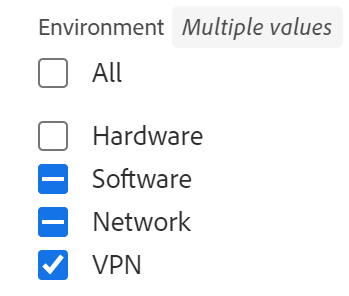

# Redigera projekt

<!--Audited: 07/2024-->

<!--The highlighted information on this page refers to functionality not yet generally available. It is available only in the Preview environment for all customers. After the monthly releases to Production, the same features are also available in the Production environment for customers who enabled fast releases.    

For information about fast releases, see [Enable or disable fast releases for your organization](/help/quicksilver/administration-and-setup/set-up-workfront/configure-system-defaults/enable-fast-release-process.md). -->

<!--

***Linked to many articles,

The Resource Pools part also duplicates in the "Working with Resource Pools" article 

The Update Type section is also documented in Selecting the Project Update Type article

Keep the reference link to the other article that also documents the Update Type) 

(NOTE 2: information described here also exists in these articles:

** Project Overview area

**Manage project Finance area

If you need to update just one field, check to see if that field is also listed there and update in both places.)

-->

Du kan redigera ett projekt i Adobe Workfront så ofta det behövs. Vi rekommenderar att du redigerar projekt minimalt efter att statusen har ändrats till Aktuell för att undvika förvirring genom att skicka ut meddelanden om ändringarna till hela projektteamet.

Det bästa är om du redigerar ett projekt när projektet har statusen Planering. Mer information om projektteamet finns i [Översikt över projektteamet](../../../manage-work/projects/planning-a-project/project-team-overview.md).

## Åtkomstkrav

+++ Expandera om du vill visa åtkomstkrav för funktionerna i den här artikeln.

<table style="table-layout:auto"> 
 <col> 
 <col> 
 <tbody> 
  <tr> 
   <td role="rowheader">Adobe Workfront package</td> 
   <td> 
Alla
 </td> 
  </tr> 
  <tr> 
   <td role="rowheader">Adobe Workfront-licens</td> 
   <td>
Standard
 
   
Plan
 </td> 
  </tr> 
  <tr> 
   <td role="rowheader">Konfigurationer på åtkomstnivå</td> 
   <td> 
Redigera åtkomst till projekt
 </td> 
  </tr> 
  <tr> 
   <td role="rowheader">Objektbehörigheter</td> 
   <td> 
     
Hantera behörigheter för ett projekt
 
     </td> 
  </tr> 
 </tbody> 
</table>

*Mer information om informationen i den här tabellen finns i [Åtkomstkraven i Workfront-dokumentationen](/help/quicksilver/administration-and-setup/add-users/access-levels-and-object-permissions/access-level-requirements-in-documentation.md).

+++

<!--Old:

<table style="table-layout:auto"> 
 <col> 
 <col> 
 <tbody> 
  <tr> 
   <td role="rowheader">Adobe Workfront plan</td> 
   <td> 
Any
 </td> 
  </tr> 
  <tr> 
   <td role="rowheader">Adobe Workfront license*</td> 
   <td>
New: Standard 
 
   Or
   
Current: Plan 
 </td> 
  </tr> 
  <tr> 
   <td role="rowheader">Access level configurations</td> 
   <td> 
Edit access to Projects
 </td> 
  </tr> 
  <tr> 
   <td role="rowheader">Object permissions</td> 
   <td> 
     
Manage permissions to a project 
 
     </td> 
  </tr> 
 </tbody> 
</table>

*For more detail about the information in this table, see [Access requirements in Workfront documentation](/help/quicksilver/administration-and-setup/add-users/access-levels-and-object-permissions/access-level-requirements-in-documentation.md).-->

## Begränsningar för redigering av projekt

Det finns vissa begränsningar som kan hindra dig från att redigera projekt.

Tänk på följande när du redigerar projekt:

* Du kan inte redigera projekt som ingår i en godkännandeprocess, förutom loggningstiden och statusändringen.
* Du kan bara bifoga dokument eller mallar till ett projekt som har statusen Fullständigt, Dölj eller Väntar på godkännande om Workfront-administratören eller en gruppadministratör har aktiverat den här funktionen i området Projektinställningar. Mer information om hur du anger projektinställningar finns i [Konfigurera systemomfattande projektinställningar](../../../administration-and-setup/set-up-workfront/configure-system-defaults/set-project-preferences.md).
* Du kan bara redigera följande information i ett projekt med statusen Dead eller Complete:

   * Ändra befintliga utgifter.
   * Lägg till, ta bort eller redigera anpassade formulär.

## Redigera ett projekt

Genom att redigera ett projekt kan du ändra information och inställningar för projektet samt uppgifter och problem i projektet.

Vissa inställningar som nämns i den här artikeln kan ändras från standardstatusen genom deras tillstånd i mallen som projektet skapades från.

Mer information om hur du redigerar mallar finns i [Redigera projektmallar](../../../manage-work/projects/create-and-manage-templates/edit-templates.md).

Mer information om hur du skapar ett projekt från en mall finns i [Skapa ett projekt med en mall](/help/quicksilver/manage-work/projects/create-projects/create-project-from-template.md).

{{step1-to-projects}}

1. (Valfritt) Klicka på **Projekt jag är på** eller **Projekt jag äger** i det övre högra hörnet för att visa projekt där du är ägare eller projekt där du är en del av projektteamet.

   

   >[!NOTE]
   >
   >Om du är gruppadministratör kan du visa och redigera gruppens projekt i gruppområdet samt i projektområdet. Mer information finns i [Skapa och ändra en grupps projekt](../../../administration-and-setup/manage-groups/work-with-group-objects/create-and-modify-a-groups-projects.md).

1. Klicka på namnet på det projekt som du vill redigera för att öppna projektsidan.

1. (Valfritt) Om du vill redigera begränsad information om ett projekt klickar du på **Projektinformation** i den vänstra panelen. Om du vill redigera all information om projektet går du vidare till steg 5. <!--accurate?!-->

   

   >[!NOTE]
   >
   >Beroende på hur Workfront-administratören eller gruppadministratören ändrade din layoutmall kan det hända att fälten i området Projektinformation ordnas om eller inte visas. Mer information finns i [Anpassa detaljvyn med hjälp av en layoutmall](../../../administration-and-setup/customize-workfront/use-layout-templates/customize-details-view-layout-template.md).

   Så här redigerar du information i detaljavsnittet:

   1. (Valfritt) Klicka på ikonen **Komprimera alla**  i det övre högra hörnet om du vill komprimera alla områden.
   1. (Valfritt och villkorligt) När ett område är komprimerat klickar du på **högerpilen**  bredvid varje område för att expandera det område som du vill redigera.
   1. Mer information om hur du redigerar information på fliken Projektinformation finns i följande artiklar:

      * [Hantera information i projektöversiktsområdet](../../../manage-work/projects/manage-projects/understand-project-overview-area.md)
      * [Hantera information i projektfinansieringsdelen](../../../manage-work/projects/project-finances/manage-project-finance-area.md)

   1. (Valfritt) Om du vill bifoga ett anpassat formulär börjar du skriva namnet på ett formulär i fältet **Lägg till anpassat formulär** och markerar det när det visas i listan. Klicka sedan på **Spara ändringar**.
   1. (Valfritt) Klicka på ikonen **Exportera**  om du vill exportera översiktsinformation och anpassad formulärinformation till en PDF-fil. Klicka sedan på **Exportera**. Välj bland följande:

      * Markera alla (visas bara när det finns minst ett anpassat formulär bifogat)
      * Översikt
      * Namnet på ett eller flera anpassade formulär

      PDF-filen hämtas till din dator.

      

      Mer information finns i [Exportera anpassade formulär och objektinformation](../../../workfront-basics/work-with-custom-forms/export-custom-forms-details.md).

   Om du vill ha information om de fält som visas i avsnittet Projektinformation fortsätter du redigera projektet i rutan Redigera projekt enligt beskrivningen nedan.
1. Om du vill redigera all information om projektet klickar du på menyn **Mer**  bredvid namnet på projektet och sedan på **Redigera**.

   eller

   Välj ett eller flera projekt i en lista med projekt och klicka sedan på ikonen **Redigera**  längst upp i listan.

   Mer information om att redigera flera projekt samtidigt finns i avsnittet [Redigera projekt i grupp](#edit-projects-in-bulk) i den här artikeln.

   Rutan **Redigera projekt** öppnas.

   >[!IMPORTANT]
   >
   >Du måste ha behörigheten Hantera för projektet för att kunna se alternativet Redigera.

   Alla projektfält är tillgängliga i rutan Redigera projekt och grupperas efter de områden som visas i den vänstra panelen.

   >[!NOTE]
   >
   >Beroende på hur Workfront-administratören eller gruppadministratören ändrade din layoutmall kan områdena i den vänstra panelen i rutan Redigera projekt eller fält som listas i dessa områden ordnas om eller inte visas. Mer information finns i [Anpassa detaljvyn med hjälp av en layoutmall](../../../administration-and-setup/customize-workfront/use-layout-templates/customize-details-view-layout-template.md).

1. (Villkorligt) Om du klickade på menyn **Mer** och sedan **Redigera** uppdaterar du information i något av följande områden som visas i den vänstra panelen:

   * [Projektnamn](#project-name)
   * [Översikt](#overview)
   * [Anpassad Forms](#custom-forms)
   * [Ekonomi](#finance)
   * [Projektinställningar](#project-settings)
   * [Aktivitetsinställningar](#task-settings)
   * [Utgivningsinställningar](#issue-settings)
   * [Åtkomst](#access)
   * [Kommentar](#comment)

   >[!NOTE]
   >
   >Beroende på hur din Workfront-administratör konfigurerar vår layoutmall för projektdelen Detaljer kan avsnitten och fälten i rutan Redigera projekt vara annorlunda i din miljö. Mer information finns i [Anpassa detaljvyn med hjälp av en layoutmall](../../../administration-and-setup/customize-workfront/use-layout-templates/customize-details-view-layout-template.md).

### Projektnamn {#project-name}

1. Börja redigera ditt projekt enligt beskrivningen ovan.
1. Klicka på **Projektnamn** i den vänstra panelen.

   

1. Uppdatera namnet på projektet.

   Du kan inte redigera projektnamnet när du redigerar flera projekt samtidigt.

### Översikt {#overview}

1. Börja redigera ditt projekt enligt beskrivningen ovan.
1. Klicka på **Översikt** i den vänstra panelen.

   

1. Uppdatera följande information om projektet:

   <table style="table-layout:auto"> 
      <col> 
      <col> 
      <tbody> 
      <tr> 
         <td role="rowheader"><strong>Beskrivning</strong> </td> 
         <td> 
Lägg till ytterligare information om projektet.
 </td> 
      </tr> 
      <tr> 
         <td role="rowheader"><strong>Status</strong> </td> 
         <td> 
Välj status för projektet. Du kan inte markera ett projekt som slutfört innan alla aktiviteter och utgåvor har slutförts. Mer information om projektstatus finns i <a href="../../../administration-and-setup/customize-workfront/creating-custom-status-and-priority-labels/project-statuses.md" class="MCXref xref">Åtkomst till listan över systemprojektstatus</a>
 </td> 
      </tr> 
      <tr> 
         <td role="rowheader"><strong>Prioritet</strong> </td> 
         <td> 
 
Det här är bara en visuell flagga som gör att du kan prioritera dina projekt.
 
Beroende på vilka projektinställningar du har valt av Workfront-administratören kan prioritetsnamnen vara olika för dig. Mer information om redigeringsprioriteringar finns i <a href="../../../administration-and-setup/customize-workfront/creating-custom-status-and-priority-labels/create-customize-priorities.md" class="MCXref xref">Skapa och anpassa prioriteringar</a>
 
 </td> 
      </tr> 
      <tr> 
         <td role="rowheader"><strong>URL</strong> </td> 
         <td> 
Ange en webblänk som relaterar till information om det här projektet.
 </td> 
      </tr> 
      <tr> 
         <td role="rowheader"><strong>Villkorstyp</strong> </td> 
         <td> 
Välj mellan följande villkorstyper: 
         <ul> 
         <li><strong>Manuell:</strong> Projektägaren ställer in villkoret för projektet manuellt.</li> 
         <li><strong>Förloppsstatus:</strong> Workfront ställer automatiskt in villkoret baserat på förloppsstatusen för aktiviteter på den kritiska sökvägen. Mer information om förloppsstatus finns i <a href="../../../manage-work/tasks/task-information/task-progress-status.md" class="MCXref xref">Översikt över status för åtgärdsförlopp</a>.</li> 
         </ul>
Workfront-administratören eller en gruppadministratör väljer standardvärdet för hur projektvillkoret beräknas för ditt system  eller din grupp. Mer information om hur du anger standardinställningar för projekt finns i <a href="../../../administration-and-setup/set-up-workfront/configure-system-defaults/set-project-preferences.md" class="MCXref xref">Konfigurera systemomfattande projektinställningar</a>. 

 </td> 
      </tr> 
      <tr> 
         <td role="rowheader"><strong>Villkor</strong> </td> 
         <td> 
 
(Visas endast när du har valt <strong>Manuell</strong> för <strong>Villkorstyp</strong>): Välj ett villkor som anger hur projektet ska gå. 
 
Mer information om hur projektvillkor kan ställas in automatiskt eller manuellt finns i <a href="../../../manage-work/projects/manage-projects/project-condition-and-condition-type.md" class="MCXref xref">Översikt över projektvillkor och villkorstyp</a>
 
 </td> 
      </tr> 
      <tr> 
         <td role="rowheader"><strong>Schemaläge</strong> </td> 
         <td> 
Ange om projektet är schemalagt från startdatumet eller från slutförandedatumet. Det här valet avgör planerade datum för aktiviteterna i projektet. 
         <ul> 
         <li><strong>Startdatum</strong>: Den första aktiviteten i projektet har samma planerade startdatum som projektet som standard. Information om startdatum för den planerade aktiviteten finns i <a href="../../../manage-work/tasks/task-information/task-planned-start-date.md" class="MCXref xref">Översikt över startdatum för den planerade aktiviteten</a>. Projektets tidslinje beräknas från Startdatum och Slutförandedatum för projektet beräknas av systemet utifrån varaktigheten för alla uppgifter. </li> 
         <li><strong>Slutförandedatum</strong>: Den sista aktiviteten i projektet har samma Planerat slutförandedatum som projektet. Projektets tidslinje beräknas från Slutförandedatum och Startdatum för projektet beräknas av systemet, genom att tidsperioden för alla uppgifter subtraheras från Slutförandedatum för projektet. </li> 
         </ul>
Workfront-administratören eller en gruppadministratör väljer standardinställningen för schemaläge för ditt system eller din grupp. Mer information om hur du anger standardinställningar för projekt finns i <a href="../../../administration-and-setup/set-up-workfront/configure-system-defaults/set-project-preferences.md" class="MCXref xref">Konfigurera systemomfattande projektinställningar</a>.

 </td> 
      </tr> 
      <tr> 
         <td role="rowheader"><strong>Planerat startdatum och starttid</strong> </td> 
         <td> 
 
Ange datumet när du väljer <strong>Schemalägg från startdatum</strong>.  
 
Det här är ett skrivskyddat fält när du väljer <strong>Schema från slutförandedatum</strong>. 
 
 </td> 
      </tr> 
      <tr> 
         <td role="rowheader"><strong>Planerat slutförandedatum och tid</strong> </td> 
         <td> 
Ange datumet när du väljer <strong>Schema från slutförandedatum</strong>. 
 
Det här är ett skrivskyddat fält när du väljer <strong>Schemalägg från startdatum</strong>. 
 </td> 
      </tr> 
      <tr> 
         <td role="rowheader"><strong>Portfolio</strong></td> 
         <td>Ange en Portfolio som projektet tillhör. Du måste skapa en Portfolio innan den visas i listrutan. Endast aktiva portföljer kan associeras med ett projekt. Mer information om hur du skapar portföljer finns i <a href="../../../manage-work/portfolios/create-and-manage-portfolios/create-portfolios.md" class="MCXref xref">Skapa en portfölj </a>.
         
<b>ANMÄRKNING</b>

         
Du måste ha behörigheten Hantera för portföljen för att kunna lägga till eller ta bort den i projektet.

      </td> 
      </tr> 
      <tr> 
         <td role="rowheader"><strong>Program</strong></td> 
         <td> 
Om du har valt en Portfolio för projektet anger du ett program för projektet. Vissa portföljer kanske inte har program. Du måste skapa ett program innan det visas i den här listrutan. Endast aktiva program kan associeras med ett projekt. 
 
Mer information om hur du skapar program finns i <a href="../../../manage-work/portfolios/create-and-manage-programs/create-program.md" class="MCXref xref">Skapa ett program</a>.
 
      
<b>ANMÄRKNING</b>

         
Du måste ha behörigheten Hantera för programmet för att kunna lägga till eller ta bort det i projektet.
   
      </td> 
      </tr> 
      <tr> 
         <td role="rowheader"><strong>Grupp</strong></td> 
         <td> 
 
Ange namnet på gruppen som är associerad med projektet. 
Detta är ett obligatoriskt fält. Du kan inte ha ett projekt som inte är associerat med en grupp. 
 
Du kan kontrollera att du markerar rätt grupp genom att hålla markören över den och klicka på informationsikonen  som visas bredvid den. Här visas ett verktygstips med information om gruppen, till exempel hierarkin för grupper ovanför och dess administratörer.
 Som standard kopplas en av följande grupper automatiskt till ett projekt när det skapas, såvida du inte anger en annan grupp:
 
         <ul> 
         <li> 
När projektet skapas från projektområdet är startgruppen för den som har skapat projektet associerad med projektet. 
 
Detta gäller också när projektet skapas från avsnittet Projekt i en portfölj eller ett program.
 </li> 
         <li> 
När projektet skapas från en grupps huvudsida i inställningsområdet är den gruppen kopplad till projektet.
 </li> 
         </ul> 
 
  
 
         
<b>ANTECKNINGAR</b>

         <ul>
         <li>
Om projektet, eller dess uppgifter eller problem är kopplade till en anpassad status på gruppnivå, kan en ändring av projektgruppen göra att projektets status, uppgifter eller utgåvor ändras så att de matchar den nya gruppen.
</li>
         <li>
Om projektet, eller dess uppgifter eller problem redan är kopplade till en godkännandeprocess på gruppnivå med anpassade statusvärden på gruppnivå, kan en ändring av gruppen skapa en konflikt mellan den föregående gruppens godkännandestatus och de som finns på systemnivån.

         
Överväg att ta bort godkännandeprocesserna på gruppnivå för projektet eller dess uppgifter eller problem innan gruppen uppdateras.

         
Mer information om hur du skapar godkännandeprocesser på gruppnivå finns i <a href="../../../administration-and-setup/manage-groups/work-with-group-objects/create-and-modify-groups-approval-processes.md" class="MCXref xref">Godkännandeprocesser på gruppnivå</a>.

         
Mer information om hur du skapar en anpassad status på gruppnivå finns i <a href="../../../administration-and-setup/manage-groups/manage-group-statuses/create-or-edit-a-group-status.md" class="MCXref xref">Skapa eller redigera en gruppstatus</a>
</li></ul> </td> 
      </tr> 
      <tr> 
         <td role="rowheader"><strong>Företag</strong> </td> 
         <td> 
Ange ett företag som är associerat med projektet. Du måste skapa ett företag innan du kan associera det med ett projekt. Endast aktiva företag kan associeras med ett projekt. Mer information om hur du skapar företag finns i <a href="../../../administration-and-setup/set-up-workfront/organizational-setup/create-and-edit-companies.md" class="MCXref xref">Skapa och redigera företag</a>.
 </td> 
      </tr> 
      <tr> 
         <td role="rowheader"><strong>Projektägare</strong> </td> 
         <td> 
Börja skriva namnet på en användare som ska lägga till dem i projektet och markera det sedan när det visas i listan. Användaren läggs till i projektteamet och får automatiskt behörigheten Hantera för projektet. Användaren som har angetts som projektägare måste vara en Workfront-aktiv användare.

         </td> 
      </tr> 
      <tr> 
         <td role="rowheader"><strong>Projektsponsor</strong> </td> 
         <td> 
Börja skriva namnet på en användare som ska lägga till dem i projektet och markera det sedan när det visas i listan. Användaren läggs till i projektteamet och får automatiskt behörigheten Visa i projektet. Användaren som är utsedd som projektsponsor måste vara en Workfront-aktiv användare. 
 </td> 
      </tr> 
      <tr> 
         <td role="rowheader"><strong>Resurshanteraren</strong> </td> 
         <td> 
 Börja skriva namnen på användarna som ska lägga till dem i projektet och markera dem sedan när de visas i listan. Användarna läggs till i projektteamet och får automatiskt behörigheten Hantera för projektet och kan tilldela resurser till aktiviteter och ärenden i projektet. Användarna behåller behörigheten Hantera för projektet även när de tas bort från fältet Resurshanteraren. Du kan ange mer än en resurshanterare. 
 </td> 
      </tr>

   <tr> 
         <td role="rowheader"><strong>Originator för konverterat ärende</strong> </td> 
         <td> 
 Som standard fylls det här fältet i automatiskt med namnet på den användare som skapade problemet som projektet konverterades från. Du kan uppdatera det här namnet med vilket annat användarnamn som helst i Workfront.  
 </td> 
      </tr>

   </tbody> 
      </table>

   >[!TIP]
   >
   >När du uppdaterar fälten Projektägare, Projektsponsor och Resurshanterare ska du lägga märke till avataren, användarens primära roll eller deras e-postadress för att skilja mellan användare med identiska namn.
   >
   >Användarna måste vara associerade med minst en jobbroll för att kunna visa den när du lägger till dem.
   >
   >Du måste ha inställningen Visa kontaktinformation aktiverad på din åtkomstnivå för att användare ska kunna visa användarnas e-postmeddelanden. Mer information finns i [Bevilja åtkomst för användare](../../../administration-and-setup/add-users/configure-and-grant-access/grant-access-other-users.md).

1. (Valfritt) Fortsätt redigera följande avsnitt, beroende på vilken information du vill ändra

   eller

   Klicka på **Spara**.

### Anpassad Forms {#custom-forms}

Beroende på din åtkomstnivå och din behörighet för projektet finns följande scenarier:

* Om du inte har behörighet att redigera anpassade formulär i projektet kan du inte redigera fälten i de kopplade anpassade formulären. Du kan bara visa fälten i de anpassade formulären som är kopplade till projektet.
* Om du har Visa (och inte Redigera) åtkomst till ett avsnitt i ett anpassat formulär, kan du inte redigera fälten i det avsnittet.
* Om du inte har tillgång till ett avsnitt i något av de anpassade formulär som är kopplade till projektet visas inte avsnittet i rutan Redigera projekt.

När du väljer flera projekt som ska redigeras samtidigt finns följande scenarier:

* Om du inte har behörigheten Redigera anpassat formulär i minst ett av de markerade projekten kan du inte redigera fälten i de kopplade anpassade formulären. Du kan bara visa fälten i bifogade anpassade formulär
* Om du har Visa (och inte Redigera) åtkomst till ett avsnitt i ett anpassat formulär, kan du inte redigera fälten i det avsnittet. Du kan bara visa fälten i det avsnittet.
* Om du inte har tillgång till ett avsnitt i ett av de anpassade formulären som är kopplat till minst ett av projekten, visas inte avsnittet i rutan Redigera projekt.
* Om du har obligatoriska fält i något av de anpassade formulären som är kopplade till alla projekt, och du väljer ett fält utan att redigera det, måste du ignorera ändringarna i det fältet eller lägga till information innan du kan spara de markerade projekten. Om du inte markerar ett obligatoriskt fält alls kan du spara de projekt du har markerat, även om det obligatoriska fältet är tomt.

Mer information om åtkomst till anpassade formulär finns i följande artiklar:

* [Dela ett eget formulär](../../../administration-and-setup/customize-workfront/create-manage-custom-forms/share-access-to-a-custom-form.md)
* [Ordna och förhandsgranska ett formulär](/help/quicksilver/administration-and-setup/customize-workfront/create-manage-custom-forms/form-designer/design-a-form/organize-a-form.md)

Så här redigerar du information i anpassade formulär när du redigerar ett projekt:

1. Börja redigera ditt projekt enligt beskrivningen ovan.
1. Klicka på **Egen Forms** i den vänstra panelen.

   

1. Klicka på rutan **Lägg till anpassat formulär** och välj ett formulär från listan som du vill bifoga till projektet. Som standard visas de första 40 formulären i alfabetisk ordning. Om du inte ser formuläret i listan börjar du skriva dess namn och markerar det när det visas i listan.

   >[!NOTE]
   >
   >Du måste skapa anpassade formulär innan de kan väljas i det här fältet. Endast aktiva anpassade formulär visas i listan. Mer information om hur du skapar anpassade formulär finns i [Skapa ett anpassat formulär](/help/quicksilver/administration-and-setup/customize-workfront/create-manage-custom-forms/form-designer/design-a-form/design-a-form.md). Du kan lägga till upp till tio anpassade formulär i ett projekt.

1. (Villkorligt) Om du har kopplat ett anpassat formulär till projektet redigerar du alla fält i formuläret. Du måste ange alla obligatoriska fält innan du kan spara projektet.
1. (Valfritt) Klicka på ikonen **X** till höger om namnet på ett anpassat formulär för att ta bort det. Klicka sedan på **Ta bort**.
1. (Valfritt) Fortsätt redigera följande avsnitt, beroende på vilken information du vill ändra

   eller

   Klicka på **Spara**.

### Ekonomi {#finance}

Beroende på din åtkomstnivå och din behörighet för projektet finns följande scenarier:

* Om du har behörigheten Visa åtkomst till finansiella data och Visa finansiella behörigheter för projektet kan du bara visa fälten i avsnittet Ekonomi. Du kan inte redigera fälten i det här avsnittet.
* Om du har behörigheterna Redigera åtkomst till finansiella data och Hantera finanser för projektet kan du uppdatera fälten i det här avsnittet.

När du markerar flera projekt som ska redigeras samtidigt och i stället väljs följande scenarier:

* Om du väljer minst ett projekt där du har behörigheten Visa ekonomi (i stället för Hantera ekonomi), kan du bara visa fälten i det här avsnittet för alla markerade projekt. Du kan inte redigera fälten i finansavsnittet satsvis.
* Om du väljer minst ett projekt utan ekonomisk behörighet visas inte det här avsnittet alls.

Så här redigerar du fält i finanssektorn:

1. Börja redigera ditt projekt enligt beskrivningen ovan.
1. Klicka på **Ekonomi** i den vänstra panelen.

   

1. Uppdatera följande ekonomiska information för projektet:

   <table style="table-layout:auto"> 
    <col> 
    <col> 
    <tbody> 
     <tr data-mc-conditions=""> 
      <td role="rowheader"><strong>Valuta</strong> </td> 
      <td> 
 
Ange valutan för projektet, om den skiljer sig från standardvalutan i systemet. Du kan inte ändra valutan för ett projekt om det redan finns ekonomisk information om projektet. Det här fältet är inte synligt om du bara har standardvalutan i systemet. 
 
Mer information om valutor finns i <a href="../../../administration-and-setup/manage-workfront/exchange-rates/set-up-exchange-rates.md" class="MCXref xref">Konfigurera valutakurser</a>. 
 
 </td> 
     </tr> 
     <tr> 
      <td role="rowheader"><strong>Budget</strong> </td> 
      <td> Ange en budget för projektet. </td> 
     </tr> 
     <tr> 
      <td role="rowheader"><strong>Resultatindexmetod</strong> </td> 
      <td> 
Välj <b>Timbaserad</b> eller <b>Kostnadsbaserad</b> om du vill ange om projektets intjänade värdemätvärden (till exempel kostnadsprestandaindex eller beräknad faktisk kostnad) ska beräknas med timmar eller kostnader. 
 
Mer information om prestandaindexmetoden finns i <a href="../../../manage-work/projects/project-finances/set-pim.md" class="MCXref xref">Ange prestandaindexmetod (PIM)</a>. 
 
Workfront-administratören eller en gruppadministratör väljer standardinställningen för prestandaindexmetod för ditt system eller din grupp. Mer information om hur du anger standardinställningar för projekt finns i <a href="../../../administration-and-setup/set-up-workfront/configure-system-defaults/set-project-preferences.md" class="MCXref xref">Konfigurera systemomfattande projektinställningar</a>.
 </td> 
     </tr> 
     <tr> 
      <td role="rowheader"><strong>Uppskattning vid slutförande</strong> </td> 
      <td> 
 
Ange hur Workfront ska beräkna uppskattningen vid slutförande. 

      Välj bland följande alternativ: 
      <ul><li><b>Beräkna på projektnivå</b></li>
      <li><b>Samla in uppgifter/underuppgifter</b></li> </ul>
      
Mer information om hur uppskattningen vid slutförande beräknas finns i <a href="../../../manage-work/projects/project-finances/calculate-eac.md" class="MCXref xref">Beräkna beräkning vid slutförande (EAC)</a>.
 
Din Workfront- eller gruppadministratör väljer standardinställningen Beräkning vid slutförande för ditt system eller din grupp. Mer information om hur du anger standardinställningar för projekt finns i <a href="../../../administration-and-setup/set-up-workfront/configure-system-defaults/set-project-preferences.md" class="MCXref xref">Konfigurera systemomfattande projektinställningar</a>.
 
 </td> 
     </tr> 
     <tr> 
      <td role="rowheader"><strong>Planerad förmån</strong> </td> 
      <td> 
Uppskatta den planerade fördelen med projektet. Detta används i affärsscenariot för projektet och i Portfolio Optimizer. Mer information om en planerad förmån för ett projekt finns i <a href="../../../manage-work/projects/project-finances/project-planned-benefit.md" class="MCXref xref">Översikt över projektplanerad förmån</a>. Den planerade fördelen med ett projekt beaktas när ett projekts nettovärde beräknas. 
 
Mer information finns i <a href="../../../manage-work/portfolios/portfolio-optimizer/manage-projects-in-portfolio-optimizer.md" class="MCXref xref">Hantera projekt i Portfolio Optimizer: artikelindex</a> . 
 </td> 
     </tr> 
     <tr> 
      <td role="rowheader"><strong>Faktisk förmån</strong> </td> 
      <td> 
Uppskatta projektets faktiska nytta. Detta är ett valutabelopp som representerar den förmån som ditt företag eller din avdelning skulle få när projektet är klart. 
 </td> 
     </tr> 
      <tr> 
      <td role="rowheader"><strong>Fast kostnad</strong> </td> 
      <td> 
Ange fast kostnad för projektet. Detta skiljer sig från arbetskostnaden som kommer från timmarna i projektet och kostnaden som kommer från kostnaderna för projektet. Den fasta kostnaden för ett projekt tas med i beräkningen av ett projekts nettovärde och ingår i den budgeterade kostnaden. 
 </td> 
     </tr> 
     <tr> 
      <td role="rowheader"><strong>Fast intäkt</strong> </td> 
      <td> 
Ange fasta intäkter för projektet. 
 </td> 
     </tr> 
    </tbody> 
   </table>

1. (Valfritt) Fortsätt redigera följande avsnitt, beroende på vilken information du vill ändra.

   eller

   Klicka på **Spara**.

### Projektinställningar {#project-settings}

1. Börja redigera ditt projekt enligt beskrivningen ovan.
1. Klicka på **Projektinställningar** i den vänstra panelen.

   

1. Uppdatera följande information:

   <table style="table-layout:auto"> 
      <col> 
      <col> 
      <tbody> 
      <tr> 
      <td role="rowheader"><strong>Milstolpesökväg</strong> </td> 
       <td> 
Välj en milstolpe-sökväg för projektet. Endast aktiva milstolpesökvägar visas i listan.
 
Mer information om milstolpbanor finns i <a href="../../../administration-and-setup/customize-workfront/configure-approval-milestone-processes/create-milestone-path.md" class="MCXref xref">Skapa en milstolpsbana</a>.
 </td> 
      </tr> 
      <tr> 
      <td role="rowheader"><strong>Slutförandeläge</strong> </td> 
      <td> 
Styr hur projektet markeras som fullständigt. Välj bland följande alternativ: 
       <ul> 
       <li>
<strong>Automatiskt</strong>: Projektet markeras som slutfört när alla aktiviteter och utgåvor har slutförts.

Projektets status ändras automatiskt till Slutför endast när projektstatusen är Aktuell när aktiviteterna har slutförts. 
</li> 
       <li><strong>Manuell</strong>: Du måste manuellt välja statusen Fullständig för projektet när alla aktiviteter och utgåvor har slutförts.</li> 
       </ul>
 </td> 
       </tr> 
       <tr> 
       <td role="rowheader"><strong>Läge för slutförande av sammanfattning</strong></td> 
       <td> 
Styr hur de överordnade uppgifterna markeras som Slutfört. Välj bland följande alternativ: 
       <ul> 
       <li><strong>Automatisk</strong>: De överordnade aktiviteterna är markerade som Slutförd och de uppdaterar automatiskt sin procentandel färdigt, allt eftersom de underordnade aktiviteterna slutförs och procentandelen slutfört av de underordnade uppdateras. </li> 
       <li><strong>Manuell</strong>: Du måste uppdatera procentandelen slutförd och statusen för de överordnade aktiviteterna manuellt, oberoende av vilka ändringar som görs för de underordnade aktiviteterna. Detta gör att du kan markera en överordnad uppgift som har slutförts även när underuppgifterna är ofullständiga. </li> 
       </ul>
 </td> 
       </tr> 
       <tr> 
       <td role="rowheader"><strong>Uppdateringstyp</strong></td> 
       <td> 
Styr när ändringarna som du gör på projekttidslinjen sparas i projektet eller de överordnade aktiviteterna. Följande ändringar av projektet utlöser till exempel en uppdatering av tidslinjen i projektet: 
       <ul> 
       <li>Uppdatera datum för uppgifter</li> 
       <li>Ändra föregående relationer för uppgifter</li> 
       <li>
Ändra överordnade och underordnade relationer genom att lägga till eller ta bort tilldelningar förutom att ändra uppgiftens begränsning eller varaktighet.

När uppgifterna uppdateras uppdateras deras överordnade objekt (överordnade uppgifter eller projektet) vid den tidpunkt som anges av uppdateringstypen. 

Uppdatera sidan om de överordnade objekten inte uppdateras omedelbart efter ändringen när du väljer Uppdatera endast automatiskt och vid ändring eller Ändra endast

Välj bland följande alternativ: 

- <strong>Automatisk och vid ändring</strong> (standardinställning): Projektets tidslinje uppdateras varje gång en ändring inträffar i projektet eller i ett annat projekt som projektet är beroende av (Vid ändring). Projektets tidslinje uppdateras också varje natt (automatiskt).

Detta är den rekommenderade inställningen för det här fältet eftersom det ser till att projektet alltid är uppdaterat.

När du utför en åtgärd för en uppgift eller ett projekt som utlöser en omberäkning av tidslinjen, visas alla tillgängliga datum omedelbart så att du kan fortsätta arbeta. I projekt med mer än 100 uppgifter visas datum som kräver längre omberäkningar som ett frågetecken (mellan 1 och 5 sekunder, eller upp till en minut för stora projekt). Detta anger att omberäkningen ännu inte är klar och att datumen kan ändras.

- <strong>Ändra endast</strong>: Projektets tidslinje uppdateras varje gång en ändring inträffar i projektet eller i ett annat projekt som projektet är beroende av. Du kanske vill välja det här alternativet om ändringarna sällan inträffar i projektet eller i andra projekt som tidslinjen är beroende av.

- <strong>Endast automatiskt</strong>: Projektets tidslinje uppdateras varje natt. Tidslinjen uppdateras inte omedelbart efter att ändringar har gjorts.

Du kan välja det här alternativet om det sker många ändringar varje dag i projektet eller i andra projekt som tidslinjen är beroende av. Tänk dock på att du valde den här inställningen eftersom projektet inte uppdateras samtidigt som ändringarna görs.

- <strong>Endast manuell</strong>: Projektets tidslinje uppdateras bara när du väljer alternativet för att beräkna om tidslinje. Mer information om hur du manuellt beräknar om projekttidslinjen finns i <a href="../../../manage-work/projects/manage-projects/recalculate-project-timeline.md" class="MCXref xref">Beräkna om projekttidslinjer</a>. 

Du kan välja det här alternativet om du gör många ändringar i projektet samtidigt och du vill att tidslinjen ska räknas om efter att alla ändringar har gjorts (i stället för efter varje enskild ändring).
</li> 
       </ul>
 </td> 
       </tr> 
       <tr> 
       <td role="rowheader"><strong>Schema</strong> </td> 
       <td> 
Välj ett schema för ditt projekt. Det ska vara samma schema som tilldelats de flesta personer som arbetar med projektet. Du måste skapa ett schema innan du kan tilldela det till ett projekt eller en användare. Om du inte har skapat anpassade scheman i ditt system väljs standardschemat.
 
Mer information om hur du skapar scheman finns i <a href="../../../administration-and-setup/set-up-workfront/configure-timesheets-schedules/create-schedules.md" class="MCXref xref">Skapa ett schema</a>. 
 </td> 
       </tr> 
       <tr> 
       <td role="rowheader"><strong>Användartid av</strong> </td> 
       <td> 
Avgör om tidpunkten för den primära tilldelades för en uppgift justerar planerade aktivitetsdatum i projektet. 

Workfront-administratören eller en gruppadministratör väljer standardinställningen för det här systemet  eller din grupp. Mer information om hur du anger standardinställningar för projekt finns i <a href="../../../administration-and-setup/set-up-workfront/configure-system-defaults/set-project-preferences.md" class="MCXref xref">Konfigurera systemomfattande projektinställningar</a>. 

Välj bland följande alternativ: - <strong>Behandla användarens tid i aktivitetsvaraktigheter</strong>: När du väljer det här alternativet justeras de planerade datumen för aktiviteterna enligt tidpunkten för aktivitetens primära tilldelare, om tidpunkten för inaktivitet inträffar under aktivitetens varaktighet. 

Om en aktivitet med villkoret Så snart som möjligt är schemalagd att starta den 1 juni och slutföras den 3 juni, och den primära tilldelaren har 2 juni markerat som Tid off, när detta val är aktiverat, är de planerade aktivitetsdatumen 1-4 juni. Beroende på uppgiftsbegränsningen finns följande scenarier: 
 
       <ul> 
       <li>För uppgiftsbegränsningar som gäller planering från ett startdatum (så snart som möjligt, tidigaste tillgängliga tid, Start tidigast, inte senare än, Måste börja på) ändras inte det planerade startdatumet, men det planerade slutförandedatumet ändras inte.</li> 
       <li>För aktivitetsbegränsningar som gäller planering från ett slutförandedatum (så sent som möjligt, senaste tillgängliga tid, Slutför inte tidigare än, Slutför inte senare än, Måste avslutas den) ändras inte det planerade slutförandedatumet, men det planerade startdatumet ändras inte.</li> 
       <li>För uppgifter med en begränsning på fasta datum ändras varken det planerade startdatumet eller slutförandedatumet. </li> 
       </ul>
Aktivitetens varaktighet ändras inte när du väljer den här inställningen. Endast planerade datum ändras beroende på aktivitetsbegränsning. Mer information om uppgiftsbegränsning finns i <a href="../../../manage-work/tasks/task-constraints/task-constraint-overview.md" class="MCXref xref">Översikt över uppgiftsbegränsning</a>. 

- <strong>Ignorera användartid för aktivitetsvaraktigheter</strong>: När du väljer det här alternativet förblir de planerade datumen för aktiviteterna i projektet som de ursprungligen var planerade, även om aktivitetens primära tilldelare har en ledig tid under aktivitetens varaktighet. 

Tänk på följande när du väljer alternativ för den här inställningen:
 
       <ul> 
       <li>
Standardalternativet för den här inställningen för ett nytt projekt är samma som projektinställningen på systemnivå. 

Mer information om projektinställningarna på systemnivå finns i <a href="../../../administration-and-setup/set-up-workfront/configure-system-defaults/set-project-preferences.md" class="MCXref xref">Konfigurera systemomfattande projektinställningar</a>. 
</li> 
       <li>När du kopplar en mall till ett befintligt projekt uppdateras inställningen för projektet så att den matchar mallen. </li> 
       <li>
Workfront avgör vilka planerade aktivitetsdatum som ska justeras enligt aktivitetsbegränsningsvärdet för uppgiften. Beroende på vad det är kan antingen planerad start eller planerad slutförandetid, eller både och, påverkas, eller till och med förbli desamma. Om en aktivitet till exempel har en begränsning med fasta datum justeras inte datumen när den primära tilldelaren har en ledig tid, även när <strong>Överväg användarens tid med aktivitetsvaraktighet</strong> har valts. 
</li> 
       </ul></td> 
      </tr> 
      <tr> 
       <td role="rowheader"><strong>Resursutjämningsläge</strong> </td> 
       <td> 
 
Välj bland följande alternativ:
 
- <strong>Manuell</strong>: du måste justera dina resurser manuellt (det här är standardinställningen)
 
- <strong>Automatisk</strong>: Workfront nivåindelar dina resurser.
 
Mer information om resursutjämning finns i <a href="../../../manage-work/gantt-chart/use-the-gantt-chart/level-resources-in-gantt.md" class="MCXref xref">Nivåresurser i Gantt-schemat </a>.
 
 </td> 
      </tr> 
      <tr> 
       <td role="rowheader"><strong>Risk</strong> </td> 
       <td> 
 
Definiera risknivån för ditt projekt. Risken är bara en indikator på hur riskfylld ett projekt kan vara. Du kan prioritera genomförandet av dina projekt baserat på risknivån.
 
 
Välj bland följande risknivåer:
 
- Mycket låg
 
- Låg
 
- MEDIUM
 
- Hög
 
- Mycket hög
 
De risknivåer du anger här kan inte anpassas.
 
Dessa är inte relaterade till de potentiella risker som kan uppstå under ett projekts livslängd och som du bör registrera på fliken Risker i projektet eller i affärsfallet. Mer information om potentiella projektrisker finns i <a href="../../../administration-and-setup/set-up-workfront/configure-system-defaults/edit-create-risk-types.md" class="MCXref xref">Redigera och skapa risktyper</a>. 
 
 
 </td> 
      </tr> 
      <tr> 
       <td role="rowheader"><strong>Resurspooler</strong> </td> 
       <td> 
 
Ange de resurspooler som är associerade med projektet. Resurspooler är samlingar med användare som behövs samtidigt för att slutföra ett projekt och som möjliggör projektbudgetering i resursplaneraren. Mer information om resurspooler finns i <a href="../../../resource-mgmt/resource-planning/resource-pools/work-with-resource-pools.md" class="MCXref xref"> Översikt över resurspooler </a>. 
 
När du redigerar flera projekt samtidigt visas endast de resurspooler som är gemensamma för alla markerade projekt i det här fältet. Om de valda projekten inte har några delade resurspooler kommer det här fältet att vara tomt. Resurspoolerna som du anger här skriver över projektets enskilda resurspooler.
 
 </td> 
      </tr> 
      <tr> 
       <td role="rowheader"> <strong>Tillåt faktureringstariffer på företagsnivå att åsidosätta faktureringstariffer på projektnivå</strong></td> 
       <td>Välj det här alternativet om du vill tillåta faktureringstariffer på företagsnivå att åsidosätta tidigare rollfrekvenser för jobb, såvida inte dessa priser markeras som fakturerade. Om du aktiverar det här alternativet åsidosätts tidigare rollfrekvenser för jobb såvida de inte markerats som fakturerade.  Mer information finns i <a href="../../../manage-work/projects/project-finances/override-project-level-with-company-level-billing-rates.md" class="MCXref xref">Åsidosätt faktureringstariffer på projektnivå med faktureringstariffer på företagsnivå</a>.</td> 
      </tr> 
      <tr> 
       <td role="rowheader"><strong>Kräv tid för godkännande av det här projektet</strong></td> 
       <td> 
 Välj det här alternativet om du vill att projektägaren ska godkänna den tid som är inloggad i projektet. Om du använder Faktureringsposter och väljer det här alternativet visas endast de godkända timmarna i projektet som tillgängliga fakturerbara timmar för Faktureringsposterna. Godkännandetiden för projektet är oberoende av godkännande av tidrapporter. 
 
Mer information om hur du behöver tid för att godkänna ett projekt finns i <a href="../../../manage-work/projects/manage-projects/require-time-approval-for-projects.md" class="MCXref xref">Kräv tid för att godkännas för ett projekt</a>.
 </td> 
      </tr> 
      <tr> 
       <td role="rowheader"><strong>Filtertimtyper</strong> och <strong>timtyper</strong></td> 
       <td> 
 
Välj bland följande alternativ:
 
       <ul> 
       <li> 
Välj <strong>Nej</strong> om du vill göra alla projektspecifika timtyper tillgängliga i projektet. (Det här är standardvalet)
 
eller
 </li> 
       <li>Välj <strong>Ja</strong> om du bara vill göra en delmängd av de projektspecifika timtyperna tillgängliga i projektet. Välj sedan de timtyper som du vill göra tillgängliga i fältet <b>Timtyper</b>.</li> 
       
<b>TIPS</b>

       
Fältet <b>Timtyper</b> kan inte redigeras när du väljer <b>Nej</b>.
 
       
Om du väljer det här alternativet blir endast de timtyper som du väljer tillgängliga när du loggar timmar i projektet (eller om uppgifter och problem i projektet). Du måste välja minst en timtyp. Om du väljer det här alternativet och inte väljer någon timtyp, blir alla timtyper tillgängliga i projektet.
 </ul>

   
Samma timtypval måste göras på den enskilda användarnivån för att användaren ska kunna se dessa timtypalternativ i projektet. Mer information om hur du definierar timtyper på användarnivå finns i <a href="../../../timesheets/create-and-manage-timesheets/log-time.md" class="MCXref xref">Loggtid</a>. 
 
 </td> 
      </tr> 
      <tr data-mc-conditions=""> 
       <td role="rowheader"><strong>Påminnelsemeddelande</strong> </td> 
       <td> 
 
Välj det påminnelsemeddelande som ska associeras med projektet. Du måste konfigurera påminnelsemeddelanden för att projekt för det här fältet ska visas när du redigerar ett projekt. Mer information om hur du konfigurerar påminnelsemeddelanden finns i <a href="../../../administration-and-setup/manage-workfront/emails/set-up-reminder-notifications.md"><a href="../../../administration-and-setup/manage-workfront/emails/set-up-reminder-notifications.md" class="MCXref xref">Konfigurera påminnelsemeddelanden</a> .</a>
 
 </td> 
      </tr> 
      <tr data-mc-conditions=""> 
       <td role="rowheader"><strong>Godkännandeprocess</strong></td> 
       <td> 
Välj den godkännandeprocess som du vill associera med projektet. Workfront-administratören måste definiera godkännandeprocesser på systemnivå innan du kan koppla dem till projekt. En användare med administrativ åtkomst till godkännandeprocesser kan också skapa gruppspecifika godkännandeprocesser. Mer information om hur du skapar godkännandeprocesser finns i <a href="../../../administration-and-setup/customize-workfront/configure-approval-milestone-processes/create-approval-processes.md" class="MCXref xref">Skapa en godkännandeprocess för arbetsobjekt</a>.
 
Tänk på följande när du lägger till godkännandeprocesser: 
 
       <ul> 
       <li>Endast aktiva godkännandeprocesser visas i listan. </li> 
       <li> 
Systemomfattande och gruppspecifika godkännandeprocesser visas i listan. En godkännandeprocess som är associerad med en annan grupp än den som projektet har visas inte i listan.
 
Om gruppen som är kopplad till projektet ändras blir den gruppspecifika godkännandeprocessen en godkännandeprocess för enstaka användning. Mer information om hur ändringar i projektgruppen eller ändringar i godkännandeprocessen påverkar godkännandeinställningarna finns i <a href="../../../administration-and-setup/customize-workfront/configure-approval-milestone-processes/how-changes-affect-group-approvals.md" class="MCXref xref">Hur ändringar i grupp- och godkännandeprocessen påverkar tilldelade godkännandeprocesser</a>. 
 </li> <!--(NOTE: this bullet stays here although the sections it might appear in are QS only, so we can use the snippet for both Qs and classic)-->
       
Vid gruppredigeringsprojekt finns följande scenarier:
 
       <ul> 
       <li> 
När du väljer projekt från samma grupp visas både godkännandeprocesser på system- och gruppnivå i det här fältet.
 </li> 
       <li> 
När du väljer projekt från olika grupper visas endast godkännandeprocesser på systemnivå i det här fältet.
 </li> 
       <li> 
När något av projekten har en enda godkännandeprocess, ersätts den av den process på system- eller gruppnivå som du väljer. 
 </li> 
      </ul> </td> 
      </tr> 
      <tr> 
      </tr> 
      </tbody> 
      </table>

1. (Valfritt) Fortsätt redigera följande avsnitt, beroende på vilken information du vill ändra.

   eller

   Klicka på **Spara**.

### Uppgiftsinställningar {#task-settings}

Du kan definiera standardvärden som ska kopplas till alla nya uppgifter när du lägger till dem i projektet.

Mer information om hur de här inställningarna påverkar hur du skapar nya uppgifter finns i avsnittet [Standardvärden för uppgifter när du lägger till uppgifter i ett projekt](../../../manage-work/tasks/create-tasks/create-tasks-overview.md#understa) i artikeln [Översikt över Skapa uppgifter](../../../manage-work/tasks/create-tasks/create-tasks-overview.md).

1. Börja redigera ditt projekt enligt beskrivningen ovan.
1. Klicka på **Aktivitetsinställningar** i den vänstra panelen.

   

1. I rutan **Standardprocess för godkännande av aktivitet** väljer du den process för godkännande av uppgift som du vill associera med alla nya uppgifter när du lägger till dem i projektet.

   Workfront-administratören (eller en användare med administrativ åtkomst till godkännandeprocesser) måste skapa en process på system- eller gruppnivå för en åtgärd innan du kan associera den med ett projekt. Endast aktiva godkännandeprocesser visas i listan. Mer information om hur du skapar godkännandeprocesser finns i [Skapa en godkännandeprocess för arbetsobjekt](../../../administration-and-setup/customize-workfront/configure-approval-milestone-processes/create-approval-processes.md). Mer information om hur ändringar i projektgruppen eller ändringar i godkännandeprocessen påverkar godkännandeinställningarna finns i [Hur ändringar i grupp- och godkännandeprocessen påverkar tilldelade godkännandeprocesser](../../../administration-and-setup/customize-workfront/configure-approval-milestone-processes/how-changes-affect-group-approvals.md).

   Vid gruppredigeringsprojekt finns följande scenarier:

   * När du väljer flera projekt från samma grupp visas både systemnivå och gruppspecifik process för godkännande av uppgifter i det här fältet.
   * När du väljer flera projekt från olika grupper visas endast åtgärdsgodkännandeprocesser på systemnivå i det här fältet.

1. I rutan **Standardinställd anpassad Forms** väljer du det eller de anpassade formulär som du vill associera med alla nya uppgifter när du lägger till dem i projektet. Du måste skapa anpassade formulär innan de kan väljas i det här fältet. Endast aktiva anpassade formulär visas i listan. Mer information om hur du skapar anpassade formulär finns i [Skapa ett anpassat formulär](/help/quicksilver/administration-and-setup/customize-workfront/create-manage-custom-forms/form-designer/design-a-form/design-a-form.md). Du kan associera upp till tio anpassade formulär med en uppgift.
1. (Valfritt) Välj **Använd arbetsinsats för att automatiskt beräkna timmar för planerad aktivitet** om du vill aktivera hantering av aktivitetsinsats genom att använda Arbetsinsats i stället för Planerade timmar.

   

1. (Villkorligt och valfritt) Om du valde Använd arbetsinsats för att automatiskt beräkna planerade timmar för en uppgift klickar du på listrutan för varje nivå av arbetsinsats och väljer en procentsats för varje nivå. Följande procentvärden är standardvärden:

   | Storlek | Procent |
   |---|---|
   | Liten | 25 % |
   | Medium | 50 % |
   | Stor | 75 % |

   >[!TIP]
   >
   >När projektets uppdateringstyp är inställd på Automatisk och du väljer den här inställningen, uppdateras aktivitetens planerade timmar enligt procentvärdet för aktivitetens varaktighet och arbetsinsats, om de är inställda på noll. Mer information om hur du använder Arbetsinsats för att planera arbete för en uppgift finns i [Översikt över Arbetsinsats](../../../manage-work/tasks/task-information/work-effort.md).

1. (Valfritt) Fortsätt redigera följande avsnitt, beroende på vilken information du vill ändra.

   eller

   Klicka på **Spara**.

### Ärendeinställningar {#issue-settings}

1. Börja redigera ditt projekt enligt beskrivningen ovan.
1. Klicka på **Utfallsinställningar** i den vänstra panelen.

   

1. (Valfritt) Avmarkera alternativet **Tillåt användare att lägga till infogade utgåvor**. Det är markerat som standard.

   När du avmarkerar det här alternativet kan användare inte lägga till fel i projektet eller uppgifterna i avsnittet Problem.

   >[!TIP]
   >
   >Avmarkera det här alternativet om du vill tvinga användare att fylla i de nya fälten eller de anpassade formulär som är kopplade till nya problem. Genom att låta användare ange interna problem kan de kringgå fälten Nytt problem och anpassade formulär när de skapar problem. Mer information om hur du ställer in fält och anpassade formulär för nya problem finns i [Skapa en frågekö](../../../manage-work/requests/create-and-manage-request-queues/create-request-queue.md).

   När du avmarkerar det här alternativet kan användare med behörighet att lägga till problem i projektet eller uppgifterna göra det på följande sätt:

   * Klicka på Nytt problem högst upp i listan med problem i avsnittet Problem i projektet eller i aktiviteterna.
   * När projektet har konfigurerats som en begärandekö kan de ange en ny begäran i området Begäranden.

   >[!NOTE]
   >
   >När du redigerar flera projekt samtidigt aktiveras den här inställningen om minst ett projekt har det aktiverat och det inaktiveras om det är inaktiverat för alla markerade projekt.

   <!--drafted for bulk edit projects: the statement above needs to be corrected when the new UI for bulk edit projects is updated; not sure if we'll need to describe this at all or we can cover this in  a "Considerations" mini section inside the Editing in bulk section below- ??? -->

1. (Valfritt) Fortsätt redigera följande avsnitt, beroende på vilken information du vill ändra.

   eller

   Klicka på **Spara**.

### Åtkomst {#access}

Du kan definiera vilka behörigheter användare ska ha för projektet, samt uppgifter och problem i projektet när de interagerar med någon av dessa objekttyper.

>[!IMPORTANT]
>
>Genom att ändra behörigheterna för projektet, uppgifterna och problemen när du redigerar projektet, fastställs hur behörigheterna ska beviljas när användare interagerar med de här objekttyperna efter att åtkomsten har ändrats.
>
>Om du ändrar den här konfigurationen ändras inte användarnas behörigheter till de här objekttyperna retroaktivt, till objekt som användarna redan har tilldelats eller inkluderats i.

1. Börja redigera ditt projekt enligt beskrivningen ovan.
1. Klicka på **Åtkomst** i den vänstra panelen.

   

1. Ange följande **Access**-information för projektet:

   <table style="table-layout:auto"> 
    <col> 
    <col> 
    <tbody> 
     <tr data-mc-conditions=""> 
      <td role="rowheader"><strong>När någon tilldelas till en uppgift</strong></td> 
      <td>
Välj från <strong>Visa</strong>, <strong>Contribute,</strong> eller <strong>Hantera</strong> åtkomst till en uppgift. Användaren som tilldelats en uppgift får automatiskt den här åtkomsten till uppgiften.
</td> 
     </tr> 
     <tr data-mc-conditions=""> 
      <td role="rowheader"><strong>Ge även åtkomst till projektet</strong></td> 
      <td>
Välj från <strong>Visa</strong>, <strong>Contribute</strong> eller <strong>Hantera</strong> åtkomst till projektet. Användaren som tilldelats en uppgift får automatiskt tillgång till projektet. 
</td> 
     </tr> 
     <tr data-mc-conditions=""> 
      <td role="rowheader"><strong>När någon har tilldelats ett problem</strong></td> 
      <td>
Välj från <strong>Visa</strong>, <strong>Contribute,</strong> eller <strong>Hantera</strong> åtkomst till ett problem. Användaren som tilldelats en utgåva får automatiskt den här åtkomsten till utgåvan. Mer information finns i <a href="../../../workfront-basics/grant-and-request-access-to-objects/share-an-issue.md" class="MCXref xref">Dela ett problem </a>. 
</td> 
     </tr> 
     <tr data-mc-conditions=""> 
      <td role="rowheader"><strong>Ge även åtkomst till projektet</strong></td> 
      <td>
Välj från <strong>Visa</strong>, <strong>Contribute</strong> eller <strong>Hantera</strong> åtkomst till projektet. Användaren som tilldelats en utgåva får automatiskt även den här åtkomsten till projektet. 
</td> 
     </tr> 
     <tr data-mc-conditions=""> 
      <td role="rowheader"><strong>När någon skickar en begäran: Ge dem åtkomst</strong></td> 
      <td>
Välj mellan <strong>Visa</strong>, <strong>Contribute</strong> eller <strong>Hantera</strong> åtkomst till begäran. När projektet också är en begärandekö och en användare skickar en begäran till projektet, får de åtkomst till den begäran de skickade. Mer information om hur du konfigurerar ett projekt som en begärandekö finns i <a href="../../../manage-work/requests/create-and-manage-request-queues/create-request-queue.md" class="MCXref xref">Skapa en begärandekö</a>. 
</td> 
     </tr> 
     <tr data-mc-conditions=""> 
      <td role="rowheader"><strong>Personer från samma företag ärver samma behörigheter för alla begäranden.</strong></td> 
      <td>
Markera det här fältet om du vill att personer från samma företag ska ha samma åtkomst till alla förfrågningar i projektet, oavsett om de har skickat dem eller inte. 
</td> 
     </tr> 
     <tr> 
      <td role="rowheader"><strong>När någon får åtkomst till det här projektet: Ange standardåtkomst för ...</strong></td> 
      <td>
Välj de åtkomstalternativ som du vill att användarna ska ha i projektet, om projektet delas med dem. Välj de specifika alternativen för deras åtkomst om de är angivna som <strong>visningsprogram</strong>, <strong>Medarbetare</strong> eller <strong>Chefer</strong> när de delar projektet med dem. 

Åtkomsten <strong>Ta bort</strong> i behörighetsnivån <strong>Hantera</strong> avgör om användare kan ta bort själva projektet. Användare med <strong>Hantera</strong>-åtkomst till projektet kan ta bort aktiviteter och problem i projektet, oavsett om det här alternativet är markerat eller inte, om de har <strong>Hantera</strong>-behörighet till aktiviteter och ärenden. 
</td> 
     </tr> 
    </tbody> 
   </table>

1. Klicka på **Spara**.

### Kommentar

1. Börja redigera ditt projekt enligt beskrivningen ovan.
1. Klicka på **Kommentar** i den vänstra panelen.

   

1. Lägg till en kommentar i det tillgängliga utrymmet. Workfront lägger till kommentaren under Uppdateringar i projektet. Mer information om hur du uppdaterar arbete finns i [Uppdatera arbete](/help/quicksilver/workfront-basics/updating-work-items-and-viewing-updates/update-work.md).
1. Klicka på **Spara**.

## Redigera ett projekt i projekthuvudet (begränsat)

Du kan redigera en begränsad mängd information i projekthuvudet.

Systemadministratören eller gruppadministratören kan anpassa fälten som visas i projekthuvudet.

Följande fält inkluderas som standard i projekthuvudet.

* Projektnamn
* Procent färdigt
* Projektägare
* Planerat slutförandedatum och tid

  >[!NOTE]
  >
  >Du kan bara redigera det här fältet när projektet har schemalagts från Slutförandedatum. När projektet är schemalagt från startdatum beräknar Workfront det planerade slutförandedatumet och den planerade tidpunkten baserat på aktiviteternas varaktighet.

* Villkor

  >[!NOTE]
  >
  >Du kan bara redigera det här fältet när projektets villkorstyp är Manuell. När villkorstypen är inställd på Förloppsstatus beräknas villkoret i Workfront baserat på förloppet för uppgifterna. Mer information finns i [Översikt över projektvillkor och villkorstyp](../../../manage-work/projects/manage-projects/project-condition-and-condition-type.md).

* Status
* Fatta godkännandebeslut om du har angett som godkännare i en aktuell godkännandeprocess

## Redigera flera projekt samtidigt

Du kan redigera flera projekt samtidigt och uppdatera information för alla markerade projekt samtidigt.

Tänk på följande när du redigerar flera projekt samtidigt:

* Informationen som du ändrar i alla markerade projekt skriver över befintlig information om enskilda projekt, förutom i fältet Resurshanterare.

  Om du lägger till en ny resurshanterare när du redigerar flera projekt samtidigt läggs den hanteraren till i alla markerade projekt. Om andra resurshanterare är kopplade till de valda projekten finns de kvar i projekten förutom det som lagts till via massredigering.

* När du väljer projekt som har olika värden för samma fält visas indikatorn &quot;Flera värden&quot; i rutan Redigera projekt. Fält som är kryssrutor, alternativknappar och växlar har en &quot;Multiple values&quot;-indikator bredvid sig.

  

* Förutom indikatorn för flera värden visas fält med flera alternativ på något av följande sätt om de valda alternativen är olika i minst ett av de markerade projekten:

   * Kryssrutefält har en rad i stället för en kryssruta för alternativet som är markerat för vissa men inte för alla markerade projekt.

     

   * Växla mellan fälten för olika typer visas nedtonade, med alternativet aktiverat i mitten för vissa men inte för alla markerade projekt.

  

   * Fält av alternativknappstyp som har vissa alternativ markerade men inte alla, visar alla alternativknappar som tomma.

     

* När du uppdaterar ett alternativ i ett fält med flera alternativ (t.ex. ett fält som visas som en uppsättning med växlar eller kryssrutor) måste alla andra alternativ matcha de markerade projekten.

  >[!IMPORTANT]
  >
  >Du kan till exempel ha ett kryssrutefält med tre kryssrutor (alternativ1, alternativ 2 och alternativ 3) och alternativ 1 är avmarkerat för alla projekt, och alternativ 2 och 3 är markerade för vissa och inte markerade för andra projekt som du har valt. Om du vill markera Alternativ 1 för alla projekt måste du också matcha alternativ 2 och 3 för alla markerade projekt innan du kan spara ändringarna, så du måste antingen markera dem eller avmarkera dem så att de matchar alla markerade projekt. Om du inte ändrar något av alternativen kan du spara fältet som det är och projekten behåller sin aktuella markering för alla alternativ.

* När du väljer flera projekt som tillhör olika grupper är statusvärdena som visas i statusfältet på systemnivå och inte gruppnivå.

Så här redigerar du flera projekt samtidigt:

{{step1-to-projects}}

1. Markera flera projekt i listan.
1. Klicka på ikonen **Redigera**  högst upp i listan.
Dialogrutan **Redigera projekt** öppnas.

   

Beroende på hur Workfront-administratören eller gruppadministratören ändrade din layoutmall kan områdena i den vänstra panelen i rutan Redigera projekt eller fält som listas i dessa områden ordnas om eller inte visas. Mer information finns i [Anpassa detaljvyn med hjälp av en layoutmall](../../../administration-and-setup/customize-workfront/use-layout-templates/customize-details-view-layout-template.md).

1. Klicka på **Översikt** om du vill redigera allmän information om de markerade projekten.  Mer information om hur du redigerar området Översikt finns i avsnittet [Översikt](#overview) i den här artikeln.

   >[!TIP]
   >
   >Fält som du redigerar visas med en ljuslila bakgrund.

1. Klicka på **Anpassad Forms** om du vill redigera, lägga till eller ersätta anpassade formulär som är kopplade till de markerade projekten.

   De anpassade formulär som är kopplade till alla markerade projekt visas i underavsnittet **Anpassade formulär** i området **Anpassade Forms**.

   

   >[!TIP]
   >
   >   Namnen på de formulär som är gemensamma för alla markerade projekt visas i den vänstra panelen i rutan Redigera projekt.

1. Börja skriva namnet på ett anpassat formulär i fältet **Lägg till anpassat formulär**.

   

   De anpassade formulär som redan är kopplade till de valda projekten visas i underavsnittet **Bifogade formulär** i fältet **Lägg till anpassat formulär**.

   Ytterligare anpassade formulär som kan associeras med projekt men som inte är kopplade till något av de markerade projekten visas i **Forms för att lägga till** i **Lägg till anpassat formulär**.

1. Klicka för att välja ytterligare anpassade formulär i **Lägg till anpassat formulär** eller **Forms för att lägga till** underavsnitt när det visas i listan.

   När ett anpassat formulär redan är kopplat till vissa av de markerade projekten visas en indikation bredvid formulärets namn om hur många projekt som redan har formuläret bifogat, när ett formulär läggs till.

1. (Valfritt) Klicka på ikonen **x** till höger om namnet på ett anpassat formulär och klicka sedan på **Ta bort** för att ta bort det från alla markerade projekt.

   >[!CAUTION]
   >
   >Om du tar bort anpassade formulär försvinner all befintlig information om anpassade fält i formulären. Detta kan inte återställas.

   Mer information om hur du redigerar anpassade formulär finns i avsnittet [Anpassad Forms](#custom-forms) i den här artikeln.

1. Klicka på **Ekonomi** om du vill redigera ekonomisk information för alla valda projekt.
Mer information om hur du redigerar finanssektorn finns i avsnittet [Ekonomi](#finance) i den här artikeln.
1. Klicka på **Projektinställningar** om du vill redigera inställningarna för alla markerade projekt.
Mer information om hur du redigerar området Projektinställningar finns i avsnittet [Projektinställningar](#project-settings) i den här artikeln.
1. Klicka på **Aktivitetsinställningar** om du vill redigera aktivitetsinställningarna för alla markerade projekt.
Mer information om hur du redigerar området Aktivitetsinställningar finns i avsnittet [Aktivitetsinställningar](#task-settings) i den här artikeln.
1. Klicka på **Utfallsinställningar** om du vill redigera utgivningsinställningarna för alla markerade projekt.
Mer information om hur du redigerar området för probleminställningar finns i avsnittet [Ärendeinställningar](#issue-settings) i den här artikeln.
1. Klicka på **Åtkomst** om du vill redigera åtkomstinställningarna för alla markerade projekt.
Mer information om hur du redigerar åtkomstområdet finns i avsnittet [Åtkomst](#access) i den här artikeln.
1. Klicka på **Kommentar** och lägg sedan till en kommentar i det angivna utrymmet. Workfront lägger till kommentaren i området **Uppdateringar** i varje projekt. Mer information om hur du uppdaterar arbete finns i [Uppdatera arbete](/help/quicksilver/workfront-basics/updating-work-items-and-viewing-updates/update-work.md).
1. (Valfritt) Om du vill ta bort någon av informationen som du har lagt till i rutan Redigera projekt håller du pekaren över ett redigerat fält och klickar sedan på ikonen **x** till det övre högra hörnet av fältet.

   

1. (Valfritt) Klicka på **Avbryt** längst ned på sidan **Redigera projekt** för att ta bort alla ändringar som gjorts i alla projekt.
1. Klicka på **Spara**.

<!-- Old information for how to bulk edit in classic/ before project bulk edit redesign: 

### Edit projects in bulk in the Production environment

To edit projects in bulk:

1. Click the **Main Menu** icon  in the upper-right corner of Adobe Workfront.

1. Click **Projects**.  
1. Select several projects in the list.
1. Click **Edit**.

   The **Edit Projects** dialog box opens.

   

1. Specify the information on all selected projects in the following sections:

   * **Overview**

     For information, see the [Overview](#overview) section in this article.
   
   * **Finance**

     For information, see the [Finance](#finance) section in this article.
   
   * **Portfolio**

     For information, see the "Project association" section in the [Overview](#overview) section in this article.
   
   * **Settings**

     For information, see the [Project Settings](#project-settings) section in this article.
   
   * **Access**

     For information, see the [Access](#access) section in this article.
   
   * **Custom Forms**

     For information, continue with step 7 below.

     <!--   
     
(NOTE: make sure this stays accurate)
   
     

   * **Tasks**

     For information, see the [Task Settings](#task-settings) section in this article.
   
   * **Issues**

     For information, see the   [Issue Settings](#issue-settings) section in this article.
   
   * **Comment**

     For information, continue with step 9 below.

     <!--   
     
(NOTE: ensure this step stays accurate)
   
     

1. (Optional) In the Settings area, select any of the following options:

   * **Recalculate Costs and Revenues**: Select this option to recalculate Costs and Revenues on all projects selected.
   * **Recalculate Timelines**: Select this option to recalculate the Timelines of all projects selected.
   * **Recalculate Scorecards**: Select this option to recalculate the Scorecard values for all projects selected.

   

1. Click **Custom Forms** to edit the custom forms attached to all the projects selected.

   If the projects selected do not have any common custom forms, no forms are listed in this section.

   You can edit only the fields on the forms that are attached to all projects selected and which you have permissions to edit. 

1. (Optional) In the Custom Forms section, select the **Recalculate Custom Expressions** option to ensure that all Calculated Custom Fields that are on the Custom Forms attached to the projects selected are up to date.

   >[!IMPORTANT]
   >
   >We recommend not to select more than 500 projects at a time when you recalculate custom expressions.

1. (Optional) Click **Comment**, then select the Post an update to each project box and specify a comment that you want to display in the updates stream of the project in the available field and do one of the following:

   * Click the **People** icon  to tag a user who will be notified about your comment.
   * Click the **Lock** icon  to restrict your comment only to people within your company.

   This comment is visible for everyone with View access to the project and with access to view Notes.

1. Click **Save Changes**.

   All changes you made are now visible on all the selected projects.

-->
