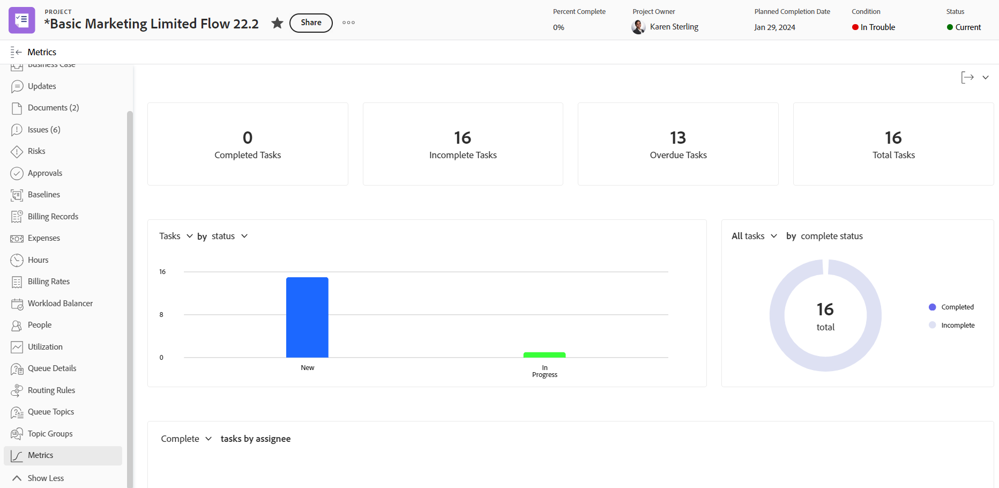

# Förstå projektstatistik

Projektstatistik ger en allmän bild i diagramformat om hur ett projekt fungerar.

## Åtkomstkrav

+++ Expandera om du vill visa åtkomstkrav för funktionerna i den här artikeln. 

<table style="table-layout:auto"> 
 <col> 
 <col> 
 <tbody> 
  <tr> 
   <td role="rowheader">Adobe Workfront package</td> 
   <td> 
Alla
 </td> 
  </tr> 
  <tr> 
   <td role="rowheader">Adobe Workfront-licens</td> 
   <td> 
Ljus eller högre

   
Granska eller högre
 </td> 
  </tr> 
  <tr> 
   <td role="rowheader">Konfigurationer på åtkomstnivå</td> 
   <td> 
Visa åtkomst till projekt
  </td> 
  </tr> 
  <tr> 
   <td role="rowheader">Objektbehörigheter</td> 
   <td> 
Visa behörigheter för ett projekt
 </td> 
  </tr> 
 </tbody> 
</table>

*Mer information finns i [Åtkomstkrav i Workfront-dokumentation](/help/quicksilver/administration-and-setup/add-users/access-levels-and-object-permissions/access-level-requirements-in-documentation.md).

+++

<!--Old:

<table style="table-layout:auto"> 
 <col> 
 <col> 
 <tbody> 
  <tr> 
   <td role="rowheader">Workfront plan</td> 
   <td> 
Any
 </td> 
  </tr> 
  <tr> 
   <td role="rowheader">Workfront license*</td> 
   <td> 
New: Light or higher 

   
Current: Review or higher 
 </td> 
  </tr> 
  <tr> 
   <td role="rowheader">Access level configuration</td> 
   <td> 
View access to Projects
  </td> 
  </tr> 
  <tr> 
   <td role="rowheader">Object permissions</td> 
   <td> 
View permissions to a project
 </td> 
  </tr> 
 </tbody> 
</table>-->

## Förutsättningar

Om du vill komma åt området Metrisk från den vänstra panelen i ett projekt måste du:

* Låt alternativet Metrisk på den vänstra panelen vara aktiverat under Projekt i layoutmallen.

  Information om hur en Workfront-administratör eller gruppadministratör kan anpassa den vänstra panelen med en layoutmall finns i [Anpassa den vänstra panelen med en layoutmall](../../../administration-and-setup/customize-workfront/use-layout-templates/customize-left-panel.md).

## Översikt över projektmätningsområdet

Projektstatistik ger en visualisering av vad som händer i ett projekt, så att du snabbt kan bedöma projektets behov och status.

I området Metrisk kan du se den övergripande statusen för ett projekt, samt:

* Var arbetet är aktivt eller har fastnat
* Vem har öppna arbetsobjekt tilldelade till sig
* Information om aktiviteter eller problem som är försenade eller nära det planerade slutförandedatumet

Du kan även fördjupa dig i varje diagram för att närmare titta på uppgifter eller problem i en viss kategori.

Om du vill veta mer om hur du tittar på de här uppgifterna eller problemen kan du läsa [Visa måttinformation](#view-metrics-details).

<!--this was deprecated: 
>[!TIP]
>
>To see metrics at a higher level for a group of projects within a program, portfolio, etc., navigate to the Enhanced analytics area.  
>To learn more about Enhanced analytics, see [Enhanced analytics overview](../../../enhanced-analytics/enhanced-analytics-overview.md).-->

## KPI:er för projekt

KPI:er (Key Performance Indicator) visas längst upp i mätområdet.

Dessa nyckeltal är indelade i följande kategorier:

| Slutförda uppgifter | **Slutförda uppgifter** visar antalet uppgifter med statusen Slutfört. Det här numret innehåller även uppgifter som har en anpassad status som är lika med Fullständig. |
|---|---|
| Ofullständiga uppgifter | **Oavslutade aktiviteter** visar antalet aktiviteter som inte har statusen Slutfört eller Stängt eller som har en status som är lika med Fullständigt. |
| Försenade uppgifter | **Försenade aktiviteter** visar antalet aktiviteter som ligger efter det planerade slutförandedatumet och som inte har statusen Slutfört eller Stängt eller en status som är lika med Fullständigt eller Stängt. |
| Totalt antal uppgifter | **Totalt antal aktiviteter** visar totalt antal aktiviteter i projektet. |

>[!TIP]
>
>Om du vill visa en lista över arbetsobjekt för en viss KPI klickar du på den KPI:n. I den listan kan du klicka på en specifik arbetsuppgift för att visa mer information på en ny flik.\
>\
>Mer information finns i [Visa måttinformation](#view-metrics-details).

## Aktivitets- eller utgivningsstapeldiagram

I stapeldiagrammet som visas under projektets KPI:er kan du se status eller prioritet för arbetsobjekten i projektet. Aktivitetsvyn är markerad som standard.

När du har valt status i det här diagrammet kan du visa alla statusvärden för uppgifter eller ärenden i ett projekt. Varje status grupperas i en stapel i diagrammet. Alla standardstatusvärden och anpassade statusvärden visas i det här diagrammet.

När prioritet har valts i det här diagrammet kan du visa alla prioriteter för uppgifter eller problem i ett projekt.

>[!TIP]
>
>Om du vill visa en lista med arbetsobjekt med en viss status eller prioritet klickar du på en stapel i diagrammet. I den listan kan du klicka på en specifik arbetsuppgift för att visa mer information på en ny flik.\
>\
>Mer information finns i [Visa måttinformation](#view-metrics-details).

## Ringdiagram

Med dondiagrammet under projektets nyckeltal kan du se förhållandet mellan slutförda arbetsuppgifter och ofullständiga arbetsuppgifter i ett projekt.

I listrutan ovanför diagrammet kan du välja:

| Alla uppgifter | Om du väljer **aktiviteter** visas det totala antalet aktiviteter i projektet samt förhållandet mellan slutförda och ofullständiga aktiviteter. |
|---|---|
| Alla problem | Om du väljer **utgåvor** visas det totala antalet utgåvor i projektet samt förhållandet mellan slutförda och ofullständiga utgåvor. |

>[!TIP]
>
>Om du vill visa en lista över arbetsobjekt som är slutförda eller ofullständiga klickar du på det avsnittet i donationsdiagrammet. I den listan kan du klicka på en specifik arbetsuppgift för att visa mer information på en ny flik.\
>\
>Mer information finns i [Visa måttinformation](#view-metrics-details).

## Tilldelningsstapeldiagram

I det tilldelade stapeldiagrammet visas antalet uppgifter som tilldelats varje person i projektet. Numret varierar beroende på vilken kategori du väljer i listrutan.

Du kan välja att titta på uppgiftstilldelningar för ett projekt i följande kategorier:

| Complete | Om du väljer **Slutför** visas antalet uppgifter som tilldelats varje användare som har slutförts. |
|---|---|
| Ofullständig | Om du väljer **Ofullständig** visas antalet uppgifter som tilldelats varje användare som inte har slutförts än. |
| Kommande | Om du väljer **Kommande** visas antalet uppgifter som tilldelats varje användare som ännu inte har nått det planerade startdatumet. |
| Försenad | Om du väljer **Försenad** visas antalet uppgifter som tilldelats varje användare som har passerat det planerade slutförandedatumet och som ännu inte har slutförts. |

>[!TIP]
>
>Om du vill visa en lista över arbetsobjekt i den valda kategorin som tilldelats en viss användare klickar du på fältet bredvid användarens namn i diagrammet. I den listan kan du klicka på en specifik arbetsuppgift för att visa mer information på en ny flik.\
>\
>Mer information finns i [Visa måttinformation](#view-metrics-details).

## Visa måttinformation {#view-metrics-details}

Du kan interagera med diagrammen i området Metrisk om du vill titta närmare på olika aspekter av ett diagram eller närmare titta på uppgifter och problem i ett diagram.

1. Gå till det projekt du vill se mätvärden för.
1. Klicka på **Metrisk** i den vänstra panelen.\
   Diagrammen i området Metrisk visar information för uppgifter som standard.\
   

1. (Villkorligt) Om en nedrullningsbar pil visas i ett diagram klickar du på ikonen **Nedrullningsbar pil**  i diagrammet och väljer önskat alternativ på menyn.\
   Information om alternativen som visas på menyerna i varje diagram finns i relevant avsnitt ovan.

1. (Valfritt) Gör så här om du vill titta närmare på uppgifter eller problem med mätvärden på sidan:

   1. Klicka på elementet - t.ex. uppgifter som tilldelats en viss användare, problem med hög prioritet eller alla försenade uppgifter - som du vill visa information för.

      En lista med uppgifter eller problem visas.

      

   1. Använd pilarna längst ned i listan för att hitta uppgiften eller problemet som du vill titta på.

      eller

      Välj ett specifikt nummer om du vill visa uppgifter eller problem på en viss sida.

      

   1. Välj en uppgift eller ett problem om du vill visa mer information.

      Uppgiften eller problemet öppnas på en ny flik.

1. (Valfritt) Om du vill exportera kontrollpanelen för projektmått till en PNG-fil klickar du på ikonen **Exportera**  och väljer sedan **Exportera som PNG** i listrutan.

   >[!TIP]
   >
   >När du exporterar kontrollpanelen innehåller den exporterade filen endast det som för närvarande visas i visningsrutan. Om du vill inkludera vissa saker i den exporterade filen kan du behöva rulla uppåt eller nedåt på sidan eller justera webbläsarens zoominställningar.
