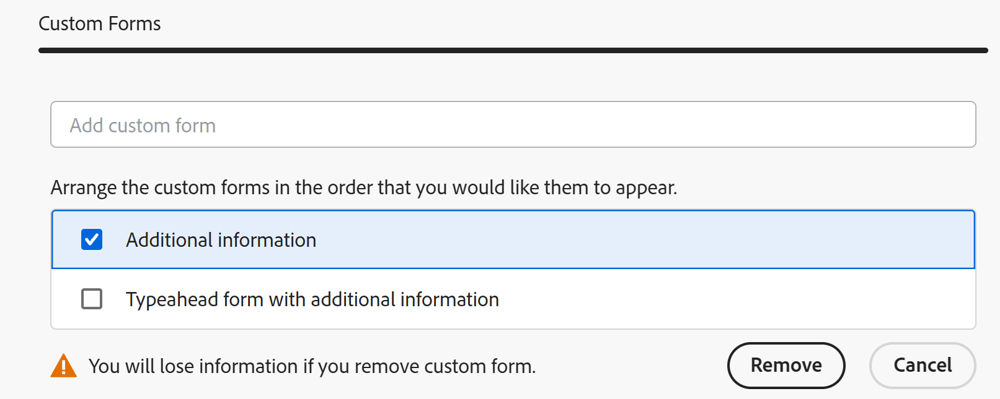

# Spara ett projekt som en mall

<!--Audited: 6/2025-->

<!--

(NOTE: Keep this the way it is in the Managing Projects area because the functionality in the UI is "Save as template" at the project level, so users see that in the UI; there is another article that this links to which is more in depth (step-by-step). This functionality needs to stay in both projects AND templates areas.)

-->

Den markerade informationen på den här sidan avser funktioner som ännu inte är allmänt tillgängliga. Det är bara tillgängligt i förhandsvisningsmiljön för alla kunder. Samma funktioner kommer också att vara tillgängliga i produktionsmiljön för alla kunder efter en vecka från förhandsversionen.

Mer information finns i [Modernisering av gränssnitt](/help/quicksilver/product-announcements/product-releases/interface-modernization/interface-modernization.md).

Om du bestämmer dig för att ett projekt ska inträffa igen någon gång i framtiden kan du skapa en mall från det befintliga projektet. Sedan kan du använda mallen igen för att skapa framtida projekt som kan innehålla liknande information eller som kan dela samma tidslinje eller tilldelningar med det befintliga projektet.

## Åtkomstkrav

+++ Expandera om du vill visa åtkomstkrav för funktionerna i den här artikeln.

<table style="table-layout:auto"> 
 <col> 
 <col> 
 <tbody> 
  <tr> 
   <td role="rowheader">Adobe Workfront</td> 
   <td> 
Alla 
 </td> 
  </tr> 
  <tr> 
   <td role="rowheader">Adobe Workfront-licens*</td> 
   <td> 
Nytt: Standard 

   eller 
   
Aktuell: Planera 
 
   </td> 
  </tr> 
  <tr> 
   <td role="rowheader">Konfigurationer på åtkomstnivå</td> 
   <td> 
Redigera åtkomst till mallar
 /td&gt; 
  </tr> 
  <tr> 
   <td role="rowheader">Objektbehörigheter</td> 
   <td> 
Visa eller högre behörigheter i ett projekt 
 
Du får behörigheten Hantera för mallen när du har sparat projektet som en mall
 </td> 
  </tr> 
 </tbody> 
</table>

*Mer information finns i [Åtkomstkrav i Workfront-dokumentation](/help/quicksilver/administration-and-setup/add-users/access-levels-and-object-permissions/access-level-requirements-in-documentation.md).

+++

## Spara ett projekt som en mall

Att spara ett projekt som en mall skiljer sig åt i produktions- och förhandsvisningsmiljöerna.

### Spara ett projekt som en mall i produktionsmiljön

1. Gå till det projekt som du vill spara som en mall.
1. Klicka på **Mer**-menyn  och sedan på **Spara som mall**.
1. Ange följande information för mallen:

   <table style="table-layout:auto"> 
    <col> 
    <col> 
    <tbody> 
     <tr> 
      <td role="rowheader">Namn</td> 
      <td>Ange ett namn för mallen.</td> 
     </tr> 
     <tr> 
      <td role="rowheader">Beskrivning</td> 
      <td>Ange en beskrivning för mallen.</td> 
     </tr> 
     <tr> 
      <td role="rowheader">Är aktiv</td> 
      <td> 
Välj bland följande alternativ:
 
       <ul> 
        <li> 
<strong>Ja</strong>: Andra användare kan hitta mallen och bifoga den till projekt.
 </li> 
        <li><strong>Nej</strong>: Andra användare kan inte hitta mallen och kan inte bifoga den till projekt.</li> 
       </ul> </td> 
     </tr> 
     <tr> 
      <td role="rowheader">Anpassad Forms</td> 
      <td>Använd listrutan för att välja anpassade formulär som ska bifogas mallen. Om några anpassade formulär redan har associerats med projektet visas alla datafält från dessa anpassade formulär. Du kan inkludera upp till 10 anpassade formulär i en enda mall.</td> 
     </tr> 
    </tbody> 
   </table>

1. Klicka på **Hantera Forms** om du vill ta bort eller ordna om formulären. Mer information om hur du tar bort och ändrar ordning på anpassade formulär i mallen finns i [Anpassade formulär](../../../administration-and-setup/customize-workfront/create-manage-custom-forms/create-and-manage-custom-forms.md).

   

1. Klicka på **Nästa steg.**
1. I avsnittet **Alternativ** markerar du kryssrutan bredvid all information som du vill ta bort från mallen.

   

1. Klicka på **Nästa steg.**
1. I avsnittet **Uteslut** väljer du de uppgifter du vill utesluta från projektet.

   

1. Klicka på **Slutför och spara mall.**

   Mallen visas nu i listan med tillgängliga mallar och kan antingen bifogas till ett befintligt projekt eller användas för att skapa ett nytt.

### Spara ett projekt som en mall i förhandsgranskningsmiljön

1. Gå till det projekt som du vill spara som en mall.
1. Klicka på **Mer**-menyn  och sedan på **Spara som mall**.
1. I avsnittet **Spara som mall** anger du följande information för mallen:

   <table style="table-layout:auto"> 
    <col> 
    <col> 
    <tbody> 
     <tr> 
      <td role="rowheader">Mallnamn</td> 
      <td>Ange ett namn för mallen.</td> 
     </tr> 
     <tr> 
      <td role="rowheader">Beskrivning</td> 
      <td>Ange en beskrivning för mallen.</td> 
     </tr> 
     <tr> 
      <td role="rowheader">Är aktiv</td> 
      <td> 
Välj bland följande alternativ:
 
       <ul> 
        <li> 
<strong>Ja</strong>: Andra användare kan hitta mallen och bifoga den till projekt.
 </li> 
        <li><strong>Nej</strong>: Andra användare kan inte hitta mallen och kan inte bifoga den till projekt.</li> 
       </ul> </td> 
     </tr> 
     <tr> 
      <td role="rowheader">Anpassad Forms</td> 
      <td>Använd listrutan för att välja anpassade formulär som ska bifogas mallen. Om några anpassade formulär redan har associerats med projektet visas alla datafält från dessa anpassade formulär. Du kan inkludera upp till 10 anpassade formulär i en enda mall.</td> 
     </tr> 
    </tbody> 
   </table>

1. Klicka på **Egen Forms** i den vänstra panelen för att ta bort eller ändra ordningen på formulären.

   Om du vill ändra ordningen på formulären drar och släpper du dem i rätt ordning.
Om du vill ta bort ett formulär markerar du det och klickar sedan på **Ta bort**. Klicka på **Avbryt** om du vill ta bort de markerade formulären.

   

1. Uppdatera information i de bifogade anpassade formulären, om det behövs. Informationen överförs till mallen.

1. Klicka på **Alternativ** i det vänstra panelavsnittet och markera sedan kryssrutan bredvid eventuell information som du vill överföra till mallen. Avmarkerade objekt överförs inte till mallen. Alla alternativ är som standard avmarkerade.

   

1. Klicka på **Uteslut** i den vänstra panelen och välj sedan de uppgifter som du vill utesluta från projektet. Alla åtgärder avmarkeras som standard.

   

1. Klicka på **Slutför och spara mall.**

   Mallen visas nu i listan med tillgängliga mallar och kan antingen bifogas till ett befintligt projekt eller användas för att skapa ett nytt.

