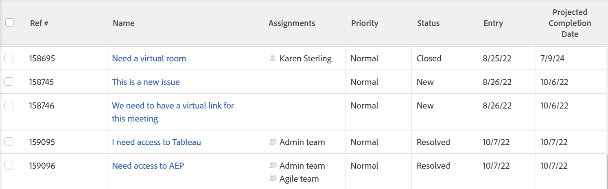

# Översikt över planerat slutförandedatum för projekt, uppgifter och ärenden

<!-- Audited: 1/2024 -->

Det planerade slutförandedatumet är en beräknad realtidsindikator för när projektet, aktiviteten eller utgåvan ska slutföras. När projektet, aktiviteten eller utgåvan har markerats som Slutförd ändras det planerade slutförandedatumet till datumet för det faktiska slutförandedatumet.

I följande avsnitt beskrivs hur det planerade slutförandedatumet bestäms för projekt, uppgifter och problem, och hur du hittar det.

## Åtkomstkrav

Du måste ha följande åtkomst för att kunna utföra stegen i den här artikeln:

<table style="table-layout:auto"> 
 <col> 
 <col> 
 <tbody> 
  <tr> 
   <td role="rowheader">Adobe Workfront</td> 
   <td> 
Alla
 </td> 
  </tr> 
  <tr> 
   <td role="rowheader">Adobe Workfront-licens</td> 
   <td> 
   
Nytt: 
   <ul><li>
Medarbetare eller senare för att visa det planerade slutförandedatumet i en rapport
</li> <li>
En standardlicens för att skapa en rapport
</li> </ul>

Aktuell: 
   <ul><li>
Granska eller senare om du vill visa det planerade slutförandedatumet i en rapport
</li> 
   <li>
En planlicens för att skapa en rapport
 </li></ul>
      </td> 
  </tr> 
  <tr> 
   <td role="rowheader">Konfigurationer på åtkomstnivå*</td> 
   <td> 
Visa eller ge högre åtkomst till projekt
 
Du måste ha behörighet att redigera rapporter, instrumentpaneler och kalendrar för att skapa en rapport
 
Du måste ha behörighet att redigera filter, vyer och grupperingar för att kunna skapa en rapport eller ändra en listvy
  </td> 
  </tr> 
  <tr> 
   <td role="rowheader">Objektbehörigheter</td> 
   <td> 
Visa eller högre behörigheter i ett projekt
 </td> 
  </tr> 
 </tbody> 
</table>

Mer information om tabellen finns i [Åtkomstkrav i Workfront-dokumentation](/help/quicksilver/administration-and-setup/add-users/access-levels-and-object-permissions/access-level-requirements-in-documentation.md).

## Hur Adobe Workfront fastställer det planerade slutförandedatumet

Det planerade slutförandedatumet är ett beräkningsfält och kan inte ändras manuellt.

Vilka kriterier som används för att bestämma det planerade slutförandedatumet varierar beroende på vilket objekt du visar:

* **Projekt:** Det planerade slutförandedatumet för projekt motsvarar det planerade slutförandedatumet för den senaste aktiviteten i projektet.

  Ett högre procentvärde för slutförande flyttar till exempel det planerade slutförandedatumet för aktiviteten närmare den aktuella dagen. Om aktivitetens status är Nytt och aktiviteten Planerat slutförandedatum är nära eller har passerat, flyttas det planerade slutförandedatumet in i framtiden.

* **Uppgifter:** Det planerade slutförandedatumet för uppgifter fastställs utifrån följande kriterier:

   * **Förloppsuppdateringar för uppgiften som utförs av den som tilldelats uppgiften:** Förloppsuppdateringar inkluderar ändringar i procent slutfört och ändringar av aktivitetsstatus.
   * **Bekräftelsedatum:** Om den tilldelade aktiviteten anger ett implementeringsdatum ändras det planerade slutförandedatumet så att det matchar implementeringsdatumet.

     Mer information om implementeringsdatum finns i artikeln [Genomför datumöversikt](../../../manage-work/projects/updating-work-in-a-project/overview-of-commit-dates.md).

   * **Föregående:** Om det inte blir några förseningar för föregående aktiviteter ska det planerade slutförandedatumet matcha det planerade slutförandedatumet. När fördröjningar inträffar visar de beroende aktiviteterna ett planerat slutförandedatum som är större än det planerade slutförandedatumet.

     Mer information om planerat slutförandedatum för uppgifter finns i [Översikt över aktivitetens planerade slutförandedatum](../../../manage-work/tasks/task-information/task-planned-completion-date.md).

  >[!IMPORTANT]
  >
  >När en uppgifts föregångare har ett faktiskt slutförandedatum får de beroende aktiviteterna ett planerat slutförandedatum enligt följande scenario:
  >
  >
  >Om projektet har uppgift A, Aktivitet B och Aktivitet C, och Aktivitet B är efterföljare till Aktivitet A, Aktivitet C är efterföljare till Aktivitet B och ett Faktiskt slutförandedatum läggs till i Aktivitet A, beräknas det planerade slutförandedatumet automatiskt om för Aktivitet B (under förutsättning att **Uppdateringstyp** av projektet är inställt på Automatisk och Vid ändring), men det kommer inte att beräknas om för Aktivitet C. För närvarande beräknar Workfront det planerade slutförandedatumet för aktiviteter som ligger en nivå upp eller ned från den uppdaterade aktiviteten, av prestandaskäl. 

* **Problem:** Utgåvan av planerat slutförandedatum är inledningsvis inställd på att matcha det planerade slutförandedatumet för utleverans.

  Om den som har tilldelats utgåvan anger ett datum för implementeringen ändras både det planerade slutförandedatumet och det planerade slutförandedatumet så att de matchar implementeringsdatumet.

  Mer information om implementeringsdatum finns i artikeln [Genomför datumöversikt](../../../manage-work/projects/updating-work-in-a-project/overview-of-commit-dates.md).

## Visa planerat slutförandedatum

Du kan visa projektens, aktivitetens och problemens beräknade slutförandedatum i rapporter. Du kan visa det planerade slutförandedatumet för projekt och uppgifter i andra områden av Workfront.

### Visa planerat slutförandedatum för ett projekt {#view-the-projected-completion-date-of-a-project}

1. Gå till det projekt där du vill visa det planerade slutförandedatumet.
1. Klicka **Projektinformation** till vänster.
1. Leta reda på **Planerat slutförandedatum** fältet i **Ökning** > **Projektdatum** -avsnitt.

### Visa planerat slutförandedatum för en uppgift {#view-the-projected-completion-date-of-a-task}

1. Gå till den uppgift där du vill visa det planerade slutförandedatumet.
1. Klicka **Uppgiftsinformation** till vänster.
1. Leta reda på **Planerat slutförandedatum** fältet i **Ökning** > **Datum och begränsning för uppgift** -avsnitt.

### Visa planerat slutförandedatum för ett problem {#view-the-projected-completion-date-of-an-issue}

Du kan bara visa det planerade slutförandedatumet för utgåvor i en problemrapport eller listvy. Att skapa en listvy påminner om att skapa vyn i en rapport.

Så här skapar du en problemrapport som innehåller det planerade slutförandedatumet:

1. Skapa en problemrapport enligt beskrivningen i artikeln [Skapa en anpassad rapport](../../../reports-and-dashboards/reports/creating-and-managing-reports/create-custom-report.md).
1. Välj **Kolumner (vy)** -fliken.
1. Klicka **Lägg till kolumn** och börja skriva **Planerat slutförandedatum** i **Visa i den här kolumnen:** fält.

1. Markera den när den visas i listan, under **Problem** -objekt. 
1. Klicka **Spara + Stäng**.

   The **Planerat slutförandedatum** kolumnen i rapporten fylls i. 

   
