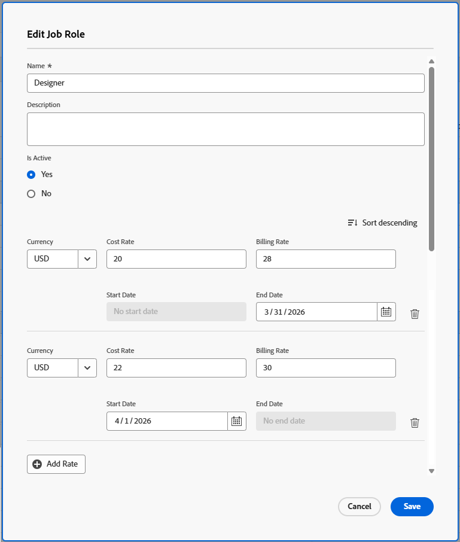

# Översikt över fakturering och intäkt

<!-- Audited: 1/2024 -->

{{highlighted-preview}}

Som projektledare kan du använda faktureringstariffer för att få intäkter från dina projekt.

I den här artikeln beskrivs hur du spårar intäkter för projekt. Intäkterna beräknas på olika sätt i utnyttjanderapporten. Mer information om intäktsberäkningar i användningsrapporten finns i [Visa information om resursutnyttjande](../../../resource-mgmt/resource-utilization/view-utilization-information.md).

## Översikt över faktureringspriser

Tänk på följande när du arbetar med faktureringstaxor:

* Du behöver en plan- eller standardlicens med Redigera åtkomst till finansiella data (specifika faktureringstaxor) för att kunna hantera faktureringstaxor.
Mer information om att bevilja åtkomst till finansiella data finns i [Bevilja åtkomst till ekonomiska data](../../../administration-and-setup/add-users/configure-and-grant-access/grant-access-financial.md).

* Faktureringstariffer är intäkter per arbetsenhet som är kopplad till jobbroller eller användare.

  Om du multiplicerar hastigheten med timmarna du lagt ned på arbetet genereras intäkter för dina projekt.

* När du har fastställt dina faktureringstariffer kan du sedan spåra intäkterna genom att skapa faktureringsposter som registrerar vad som har och inte har fakturerats.

  >[!TIP]
  >
  >När du markerar en faktureringspost som Fakturerad kan den aldrig redigeras. Detta är viktigt när priset varierar och du vill låsa intäkt- och utgiftsinformationen för projektet. Om du lägger till den i en faktureringspost och markerar den som Fakturerad, uppdateras den inte när tarifferna uppdateras i ditt system.

  Mer information om hur du skapar faktureringsposter finns i artikeln [Skapa faktureringsposter](../../../manage-work/projects/project-finances/create-billing-records.md).

* Du kan skapa faktureringstaxor för användare, jobbroller eller så kan du ha en engångsavgift för ett projekt eller en uppgift.

>[!IMPORTANT]
>
>Kurserna som beräknar intäkten tillhör användaren som loggar tiden eller deras jobbroller.

### Faktureringstaxor för kreditkort

{{ultimate-package}}

När du har tillgång till att redigera tariffkort kan du definiera tariffkort med flera faktureringspriser per roll, baserat på attribut som plats och grupp eller byrå. Attribut kan konfigureras upp till fem nivåer.

Ett tariffkort måste kopplas till ett projekt för att dess priser ska kunna användas. När en hastighet är låst på tariffkortet kan den inte åsidosättas på projektnivå.

Kurskortssatser är en del av hierarkin för att fastställa frekvenser baserat på uppgiftens intäktstyp.

Mer information om hur du skapar tariffkort finns i [Hantera tariffkort](/help/quicksilver/administration-and-setup/manage-enterprise-operations/manage-rate-cards.md).

Mer information om tariffhierarkin finns i [Översikt över intäkt- och kostnadshierarkin](/help/quicksilver/manage-work/projects/project-finances/overview-revenue-cost-hierarchy.md).

### Faktureringstaxor för användare {#user-billing-rates}

När du skapar en användare kan du som användaradministratör associera dem med datumeffektiva faktureringstariffer genom att ange värden för fälten Fakturering per timme och datumen för tarifferna.

Mer information om hur du skapar användare finns i artikeln [Lägg till användare](../../../administration-and-setup/add-users/create-and-manage-users/add-users.md).

### Faktureringshastigheter för jobbroll {#job-role-billing-rates}

När du skapar en jobbroll som Adobe Workfront-administratör kan du associera den med datumeffektiva faktureringstariffer genom att ange tariffvärden och datum.

Du kan definiera värdet för faktureringssatsen för en jobbroll med hjälp av basvalutan i ditt Workfront-system eller med en annan valuta. Ytterligare valutor måste också definieras i systemets växelkurser.

Mer information om hur du skapar jobbroller finns i artikeln [Skapa och hantera jobbroller](../../../administration-and-setup/set-up-workfront/organizational-setup/create-manage-job-roles.md).

### Fasta faktureringspriser för projekt eller uppgifter {#fixed-billing-rates-for-projects-or-tasks}

Utöver timtaxor för användare och jobbroller kan du även ha följande fasta faktureringstariffer:

* Fast belopp för fast timintäktstyp
* Fast belopp för intäktstyp med fast intäkt

Mer information om hur de fasta faktureringstarifferna används för att beräkna intäkter finns i [Översikt över intäktstyper för aktiviteter](#overview-of-task-revenue-types).

### Åsidosätt faktureringstariffer - Ultimate-paket för arbetsflöde

>[!IMPORTANT]
>
>Du kan åsidosätta faktureringstariffer som är kopplade till jobbroller eller användare på projektnivå. Du kan inte åsidosätta fasta satser.

På projektnivå kan du

* Åsidosätt en faktureringsfrekvens för en jobbroll (med attribut som plats, grupp eller byrå).
* Åsidosätt en faktureringstaxa för en viss användare i det projektet.

Åsidosättningar av faktureringsfrekvens är inte generiska. Du åsidosätter till exempel inte&quot;Designer&quot; som en roll. I stället skulle du åsidosätta&quot;Designer - New York - Agency X&quot; för den relevanta giltighetsperioden. Åsidosättningar respekterar faktureringshierarkin, så de används alltid i prioritetsordning.

### Åsidosätt faktureringstariffer - alla andra paket

>[!IMPORTANT]
>
>Du kan åsidosätta faktureringstariffer som är kopplade till jobbroller. Du kan inte åsidosätta användarfaktureringstaxor eller fasta taxor.

Du kan åsidosätta faktureringstaxor för jobbroller för:

* Ett specifikt företag

  Mer information om hur du skapar faktureringstariffer för jobbroller för ett företag finns i [Skapa och redigera företag](../../../administration-and-setup/set-up-workfront/organizational-setup/create-and-edit-companies.md).

* Ett specifikt projekt

  Mer information om hur du skapar faktureringstariffer för jobbroller för ett projekt finns i artikeln [Översikt över åsidosättande av faktureringstariffer och beräkning av intäkter för ett projekt](/help/quicksilver/manage-work/projects/project-finances/override-role-billing-rates-and-calculate-project-revenue.md).

## Spåra intäktsbelopp

Workfront kan automatiskt spåra planerade intäkter när uppgifter skapas baserat på aktiviteternas planerade timmar.

Den kan också automatiskt spåra faktiska intäkter när faktiska timmar är inloggade på uppgifter, ärenden och projektet.

I följande tabell visas vilka typer av intäkter som är associerade med uppgifter, utgåvor och projekt.

<table style="table-layout:auto"> 
 <col> 
 <col> 
 <tbody> 
  <tr> 
   <td role="rowheader">Planerad intäkt</td> 
   <td> 
För uppgifter är detta den intäkt som är kopplad till de planerade timmarna för uppgifter. Planerade timmar från alla uppgifter räknas upp till planerade timmar för projektet för att bidra till beräkningen av projektets planerade timmar. 
 
Mer information om planerade timmar i Workfront finns i <a href="../../../manage-work/tasks/task-information/planned-hours.md" class="MCXref xref">Översikt över planerade timmar</a>. 
 <ul><li>
Workfront beräknar planerad intäkt för uppgifter med den här formeln:

   
<code>Task Planned Revenue = Planned Hours * Billing hourly rate</code>
 
<strong>Obs!</strong>  Timpriset för fakturering i formeln tar hänsyn till datumeffektiva ändringar av tariffen.
 </li><li>
Workfront beräknar planerade intäkter för projekt med följande formel:
 
<code>Project Planned Revenue = SUM (All tasks Planned Revenue) + Fixed Revenue</code>

   
<b>ANMÄRKNING</b>

Projektets planerade inkomster som visas i området Projektinformation och i projektrapporter skiljer sig från den planerade intäkten som visas i användningsrapporten. 
</li></ul> 
Den planerade intäkten i området Projektinformation återspeglar uppgiftsintäkten som är kopplad till aktiviteten Planerade timmar samt projektets fasta intäkt. Planerad intäkt i användningsrapporten visar planerad intäkt som bara är associerad med de planerade timmarna från aktivitetstilldelningarna i projektet. 
 
     
Example: </b>"> 
      
Om projektet har 1 uppgift med 10 timmar, som tilldelats en konsult med en timtaxa på 20 USD och projektet har en fast intäkt på 100 USD, visar användningsrapporten 200 USD för planerad intäkt (den planerade intäkten som är associerad med timmarna för uppgiften). I avsnittet Projektinformation visas $300 (den planerade intäkten från aktiviteten och den fasta intäkten för projektet). 
 
     
 
 
Uppgiftsplanerad intäkt beräknas med hjälp av timtaxan för fakturering för användare eller jobbroller som är tilldelade till aktiviteterna. Inkomsttypen för aktiviteterna påverkar vilken tariff (användare eller roll) som används för att beräkna planerad intäkt. Mer information finns i följande avsnitt i den här artikeln:
 
    <ul> 
     <li> 
<a href="#overview-of-task-revenue-types" class="MCXref xref">Översikt över aktivitetsintäktstyper</a> 
 </li> 
     <li> 
<a href="#revenue-calculations-for-tasks-based-on-user-and-role-assignments" class="MCXref xref">Intäktsberäkningar för aktiviteter baserade på användar- och rolltilldelningar</a> 
 </li> 
    </ul> 
Information om beräkningar av planerade intäkter i användningsrapporten finns i <a href="../../../resource-mgmt/resource-utilization/view-utilization-information.md" class="MCXref xref">Visa information om resursutnyttjande</a>. 
 </td> 
  </tr> 
  <tr> 
   <td role="rowheader">Faktisk intäkt*</td> 
   <td> 
Inkomsterna som är kopplade till de faktiska timmarna för uppgifter, utgåvor och projekt. 
 
I allmänhet beräknas Faktiska intäkter i Workfront enligt följande formel:
 
<code>Actual Revenue = Actual Hours * Billing rate</code> 
 
<strong>Obs!</strong>  Timpriset för fakturering i formeln tar hänsyn till datumeffektiva ändringar av tariffen.
 
Information om faktiska intäktsberäkningar i användningsrapporten finns i <a href="../../../resource-mgmt/resource-utilization/view-utilization-information.md" class="MCXref xref">Visa information om resursutnyttjande</a>. 
 
<b>TIPS</b>

Du kan inte visa Faktisk intäkt på utleveransnivå, men intäkterna som är kopplade till Faktiska timmar i problemen bidrar till projektets faktiska intäkt. 
 </td>
</tr> 
 </tbody> 
</table>

*För faktiska timmar avser användarens priser alltid den användare som loggar timmarna eller antalet jobbroller. Mer information om när Workfront använder hastigheterna för användaren och när de använder hastigheterna för sina jobbroller finns i avsnittet [Intäktsberäkningar](#revenue-calculations) i den här artikeln.

Om en uppgift med Inkomsttyp för användartimme till exempel planeras ta 2 timmar och användaren som är tilldelad till den har en timkostnad på 30 USD per timme, är aktivitetens planerade intäkt 60 USD. När uppgiften är slutförd och användaren bara loggar 1,5 timmar som den faktiska tid som har ägnats åt att slutföra uppgiften, är det faktiska intäktsbeloppet 45 dollar. Om en annan användare som inte är tilldelad till uppgiften loggar tiden beräknas den faktiska intäkten utifrån användarens faktureringstariffer.

Du kan registrera intäkter på följande sätt:

* Genom att definiera intäktstypen för dina uppgifter och associera användare eller roller som tilldelats till arbetsobjekt med faktureringstariffer. Detta beräknar intäkten med beloppet för planerade eller faktiska timmar för arbetsposterna. Du kan ange ett tak till det högsta belopp som debiteras för timtaxor, eller inte.\
  Mer information om hur du anger intäktstyp för en uppgift finns i artikeln [Redigera uppgifter](../../../manage-work/tasks/manage-tasks/edit-tasks.md).

* Genom att fakturera en fast intäktsnivå för aktiviteter eller projekt.\
  Om du har uppgifter med Fast intäkt läggs beloppet för Fast intäkt till som planerad intäkt för en aktivitet eller ett projekt, och den planerade intäkten för en aktivitet blir tillgänglig att läggas till i en faktureringspost som fast intäkt.
* Genom att ställa in en fast faktureringsnivå för fasta intäkter för ett projekt och sedan ställa in timtaxor för aktiviteterna i projektet. Workfront lägger till timtaxorna för uppgifterna i projektets schablonbelopp.\
  En mekaniker som använder Workfront kan till exempel ange en kostnad för delar som fasta intäkter för projektet och sedan fakturera timvis för den tid som går åt till att reparera en bil. Fast intäkt för projekt eller uppgifter realiseras sedan när de har slutförts.

Du kan också markera dina uppgifter som&quot;Inte fakturerbar&quot;, och då är det ingen planerad eller faktisk intäkt som är associerad med dem.

## Översikt över intäktstyper för uppgifter {#overview-of-task-revenue-types}

Som standard anges Intäktstyp för alla nya uppgifter i enlighet med de inställningar för aktivitet och problem som du har angett av Workfront- eller gruppadministratören.

Mer information om hur du definierar inställningar för åtgärder och problem för din Workfront-instans finns i artikeln [Konfigurera systemomfattande uppgifter och inställningar för problem](../../../administration-and-setup/set-up-workfront/configure-system-defaults/set-task-issue-preferences.md).

Projektägaren kan ändra intäktstypen för uppgifter och Fast intäkt för projekt.

Mer information om hur du ställer in fasta intäkter för ett projekt finns i artikeln [Redigera projekt](../../../manage-work/projects/manage-projects/edit-projects.md).
Mer information om hur du anger intäktstyp för en uppgift finns i artikeln [Redigera uppgifter](../../../manage-work/tasks/manage-tasks/edit-tasks.md).

>[!NOTE]
>
>Du måste ha Workflow Ultimate-paketet för att få intäktstypen User and Role Timly tillgänglig.

Du kan använda följande intäktstyper för dina aktiviteter eller projekt:

<table border="1" cellspacing="15"> 
 <col> 
 <col> 
 <thead> 
  <tr> 
   <th> 
<strong>Intäktstyp</strong> 
 </th> 
   <th> 
<strong>Beskrivning</strong> 
 </th> 
  </tr> 
 </thead> 
 <tbody> 
  <tr> 
   <td> 
Fast intäkt
 </td> 
   <td> 
Den här typen kan användas med projekt och uppgifter. 
 
När du kopplar en mall till ett projekt läggs den fasta intäkten från mallen till projektets fasta intäkt. Mer information finns i <a href="../../../manage-work/projects/create-and-manage-templates/attach-template-to-project-overview.md" class="MCXref xref">Översikt över hur du bifogar en mall till ett projekt</a>. 
 
För uppgifter beräknas alltid aktivitetens intäkt, oavsett aktivitetstilldelningar, med det fasta belopp som har angetts för uppgiften. 
 
Fasta intäkter från underordnade uppgifter summeras till intäkten för den överordnade aktiviteten och sedan till intäkterna för projektet. Om ett fast belopp definieras för den överordnade aktiviteten och/eller projektet läggs beloppet till i den planerade intäkten som samlas in från underordnade aktiviteter.
 
Beloppet för fasta intäkter för uppgifter kan inkluderas i en faktureringspost i projektet.
 </td> 
  </tr> 
  <tr> 
   <td> 
Användare per timme
 </td> 
   <td> 
Den här typen kan bara användas för uppgifter. 
 
Den faktureringsfrekvens som du anger för en viss användare multiplicerad med antalet planerade timmar för den uppgiften blir uppgiftens planerade intäktsbelopp. Den faktureringsfrekvens som du anger för en viss användare multiplicerad med det antal timmar som användaren loggar mot uppgiften är uppgiftens faktiska intäktsbelopp.  Om du till exempel skapar en användare och anger $20 för fältet Fakturering per timme, och användaren skickar 5 timmar för en aktivitet på tidrapporten, blir aktivitetens faktiska faktureringsbelopp $100.

   
En användarprofil kan innehålla flera faktureringspriser med giltighetsdatum. Den första användarens faktureringstaxa på 20 USD upphör 30 april 2023 och den andra användarens faktureringstaxa på 25 USD börjar 1 maj 2023. Om användaren skickar in två timmar den 28 april och tre timmar den 2 maj för en uppgift, är aktivitetens faktiska faktureringsbelopp 40 USD + 75 = 115 USD.

   
<b>TIPS</b>

Det här är standardintäktstypen när du skapar en uppgift.
 </td>
</tr> 
  <tr> 
   <td> 
Roll timvis
 </td> 
   <td> 
Den här typen kan bara användas för uppgifter.
 
Den här typen liknar Användare per timme, men använder jobbrollfrekvenser i stället för användarfrekvenser.
 
<strong>Obs!</strong> En jobbroll kan också ha flera faktureringstariffer med giltighetsdatum.
</td> 
  </tr> 
  <tr> 
   <td> 
Användare och roll varje timme
 </td> 
   <td> 
Den här typen kan bara användas för uppgifter.
 
Den här typen undersöker både användar- och rollinformation för att avgöra lämplig hastighet.
</td> 
  </tr>
  <tr> 
   <td> 
Användare per timme med ändpunkt
 </td> 
   <td> 
Den här typen kan bara användas för uppgifter.
 
Aktiviteter faktureras varje timme som användaren anger, men de har ett maxbelopp som du kan ange.  Om faktureringssatsen för en användare till exempel är $25, men värdet för Avtalsbelopp för aktiviteten är $20, och användaren loggar en timme, är Faktisk intäkt för aktiviteten $20. 
 </td> 
  </tr> 
  <tr> 
   <td> 
Roll timvis med ändpunkt
 </td> 
   <td> 
Den här typen kan bara användas för uppgifter.
 
Den här typen liknar Användare per timme med Ände men använder jobbrollfrekvenser i stället för användarfrekvenser. 
 </td> 
  </tr> 
  <tr> 
   <td> 
Användare och roll varje timme med ändpunkt
 </td> 
   <td> 
Den här typen kan bara användas för uppgifter.
 
Aktiviteter faktureras varje timme som i användar- och rolltimmen, men de har ett maxbelopp som du kan ange.
</td> 
  </tr>
  <tr> 
   <td> 
Användarens timma plus fast
 </td> 
   <td> 
Den här typen kan bara användas för uppgifter. 
 
Aktiviteter faktureras varje timme som användaren använder per timme, men har ett fast belopp som du kan lägga till i användarpriset. Det fasta belopp som har angetts för aktiviteten kan inkluderas i faktureringsposter för projektet. Det fasta beloppet multipliceras inte med timmarna för aktiviteten. Endast användarens faktureringstaxa gör det. 
 </td> 
  </tr> 
  <tr> 
   <td> 
Roll timvis plus fast
 </td> 
   <td> 
Den här typen kan bara användas för uppgifter. 
 
Aktiviteter faktureras timvis som i rolltimmen, men har ett ytterligare fast belopp som du kan lägga till i rollfrekvensen. Det fasta belopp som har angetts för aktiviteten kan inkluderas i faktureringsposter för projektet. Det fasta beloppet multipliceras inte med timmarna för aktiviteten. Endast faktureringssatsen för jobbrollen gör det. 
 </td> 
  </tr> 
  <tr> 
   <td> 
Användare och roll per timme plus fast
 </td> 
   <td> 
Den här typen kan bara användas för uppgifter.
 
Aktiviteter faktureras varje timme som i användar- och rolltimmen, men har ett ytterligare fast belopp som du kan lägga till i tariffen. Det fasta belopp som har angetts för aktiviteten kan inkluderas i faktureringsposter för projektet. Det fasta beloppet multipliceras inte med timmarna för aktiviteten.
</td> 
  </tr>
  <tr> 
   <td> 
Fast en timme
 </td> 
   <td> 
Den här typen kan bara användas för uppgifter.
 
Det tak eller fasta belopp som du anger för uppgiften multiplicerat med antalet timmar som anges för uppgiften (oavsett användare eller deras jobbroller) är faktureringsbeloppet.
 </td> 
  </tr> 
  <tr> 
   <td> 
Ej fakturerbar
 </td> 
   <td> 
Den här typen kan bara användas för uppgifter.
 
Denna intäktstyp påverkar inte intäkterna. 
 
Om ett överordnat objekt har den här inställningen kommer underordnade uppgifter med en faktureringstyp fortfarande att gälla som vanligt.
 
När en användare utan åtkomst till ekonomiska data eller en användare utan ekonomisk behörighet för en mall skapar ett projekt från den mallen, är det här standardintäktstypen för aktiviteterna i projektet.
 
Mer information om åtkomst till finansiella data finns i artikeln <a href="../../../administration-and-setup/add-users/configure-and-grant-access/grant-access-financial.md" class="MCXref xref">Bevilja åtkomst till ekonomiska data</a>. Mer information om objektbehörigheter finns i artikeln <a href="../../../workfront-basics/grant-and-request-access-to-objects/sharing-permissions-on-objects-overview.md" class="MCXref xref">Översikt över objektdelningsbehörigheter</a>. Mer information om hur du skapar projekt från mallar finns i artikeln <a href="../../../manage-work/projects/create-projects/create-project-from-template.md" class="MCXref xref">Skapa ett projekt med en mall</a>. 
 </td> 
  </tr> 
 </tbody> 
</table>

## Översikt över intäkt för överordnade uppgifter

Om du ändrar en fristående uppgift med faktureringsinformation för den till en överordnad aktivitet, behåller den nya överordnade aktiviteten all faktureringsinformation som tidigare använts, tillsammans med de timmar som tidigare använts. Faktureringsinformation som kommer från timmar som loggats till de underordnade uppgifterna kommer att samlas in som Faktisk intäkt till den nya överordnade uppgiften.

Den planerade intäkten från de underordnade aktiviteterna sammanställs också med den överordnade aktiviteten.

## Översikt över intäkt för utleveranser

Ärenden har inga belopp för Planerad eller Faktisk intäkt, men de kan ha Faktisk kostnad.

Om du loggar timmar för en utgåva och använder en timtyp som är markerad som &quot;Räkna som intäkt&quot;, beräknar Workfront ett verkligt kostnadsbelopp enligt hastigheten för den användare som loggar in på tiden. Det här numret läggs till projektets faktiska kostnad. Timmarna kan också inkluderas i en faktureringspost.

Mer information om spårningskostnader finns i artikeln [Spåra kostnader](../../../manage-work/projects/project-finances/track-costs.md).

Mer information om timtyper finns i artikeln [Hantera timtyper](../../../administration-and-setup/set-up-workfront/configure-timesheets-schedules/hour-types.md).

## Intäktsberäkningar

* [Intäktsberäkningar för uppgifter som baseras på användar- och rolltilldelningar](#revenue-calculations-for-tasks-based-on-user-and-role-assignments)
* [Intäktsberäkningar för projekt](#revenue-calculations-for-projects)

### Intäktsberäkningar för uppgifter som baseras på användar- och rolltilldelningar {#revenue-calculations-for-tasks-based-on-user-and-role-assignments}

Tänk på följande när du beräknar intäkter för en aktivitet:

* Om en användare eller en jobbroll visar ett belopp på $0,00, läser Workfront det som ett giltigt belopp och multiplicerar beloppet med antalet timmar i aktiviteten för att beräkna intäkten. Om du inte vill visa någon intäkt för dina aktiviteter kontrollerar du att fältet för faktureringssatsen för användaren eller jobbrollen är tomt.
* När faktureringstariffer för jobbroller gäller, använder Workfront åsidosättningsfrekvensen på projektnivå i stället för faktureringstakten för den rollen som definieras på systemnivå varje gång det finns en åsidosättningsfrekvens för projektet.
* Om användaren eller jobbrollen har flera faktureringstariffer med giltighetsdatum är uppgiftsintäkten summan av intäkterna för varje tidsperiod som användaren har loggat tid. Planerad intäkt baseras på planerade timmar för tidsperioderna.
* Om det finns flera tilldelningar för uppgifterna gäller scenarierna nedan för varje tilldelad.

Systemet använder en hierarki för att avgöra vilken nivå som används i intäktsberäkningar baserat på uppgiftstilldelningar.

Om din Workfront-administratör har aktiverat inställningen **Tilldela jobbroller till timposter manuellt** i Inställningar för tidrapporter och timmar, och inloggningstiden för användaren i projektet väljer en annan roll att associera med den här tiden, beräknas alltid aktivitetens eller projektets faktiska inkomster baserat på den roll som är associerad med timposten. Mer information om hur du aktiverar loggningstid för en viss jobbroll finns i artikeln [Konfigurera tidrapport och timinställningar](../../../administration-and-setup/set-up-workfront/configure-timesheets-schedules/timesheet-and-hour-preferences.md).

För intäktstypen Användare och Roll per timme kan en jobbroll för fakturering definieras både på projektnivå och på tilldelningsnivå. Om den har definierats på projektnivå för en viss användare sprids rollen automatiskt till alla användarens tilldelningar under den datumgiltighetsperiod som du har tillämpat den för. Du kan fortfarande åsidosätta den här hastigheten på tilldelningsnivån om det behövs. En användares primära jobbroll är till exempel Designer, men du ställer in rollen Jobb för fakturering av ett projekt som Senior Designer för augusti-månaden. Alla uppgifter som de tilldelas i augusti kommer automatiskt att använda faktureringstariffen för Senior Designer.

För en viss uppgift kan du dock åsidosätta rollen bara för den tilldelningen, så att den återspeglar arbetet som faktureras. På så sätt kan systemet hantera både projektövergripande konsekvens och flexibilitet på uppdragsnivå. Mer information finns i [Översikt över intäkt- och kostnadshierarkin](/help/quicksilver/manage-work/projects/project-finances/overview-revenue-cost-hierarchy.md) och [Skapa avancerade tilldelningar](/help/quicksilver/manage-work/tasks/assign-tasks/create-advanced-assignments.md).

Följande scenarier används för att beräkna aktivitetsinkomster baserat på intäktstyp och aktivitetstilldelningens typ:

* **Aktivitetens intäktstyp är Användare per timme**

  <table style="table-layout:auto"> 
   <col> 
   <col> 
   <col> 
   <col> 
   <tbody> 
    <tr> 
     <td role="rowheader">Fakturering per timtariff</td> 
     <td>Ingen tilldelning</td> 
     <td>Användartilldelning</td> 
     <td>Tilldelning av jobbroll</td> 
    </tr> 
    <tr> 
     <td role="rowheader">Fakturering per timma för planerad intäkt</td> 
     <td>$0,00</td> 
     <td> Om en användare har en faktureringstaxa i sin profil används den taxan för att beräkna planerad intäkt. I annat fall används systemets faktureringsfrekvens för den primära jobbrollen.  
<b>Obs!</b> Användaren kan tilldelas till aktiviteten med en av sina sekundära jobbroller, men hastigheten för den primära jobbrollen används här i stället.

Om användarens roll har ändrats under tilldelningen används de korrekta satserna när projektets ekonomi beräknas om.
</td> 
     <td>Systemfaktureringssatsen för den jobbroll som tilldelats uppgiften används för att beräkna planerad intäkt. Faktureringspriserna kan åsidosättas på projektnivå.</td> 
    </tr> 
    <tr> 
     <td role="rowheader">Fakturering per timtariff för faktisk intäkt</td> 
     <td>Om användaren som loggar timmarna har en faktureringsfrekvens i sin profil används den taxan.
      I annat fall används faktureringsfrekvensen för den primära jobbrollen. Om det inte finns någon faktureringstaxa som är associerad med användaren eller dennes primära roll är den faktiska intäkten 0,00 USD.  
<b>ANMÄRKNING</b>

  Endast de frekvenser som är associerade med användaren som loggar tiden tas med i beräkningen, även när en annan användare tilldelas till uppgiften.
</td>

  <td>Om användaren som loggar timmarna har en faktureringsfrekvens i sin profil används den taxan.  I annat fall används faktureringsfrekvensen för den primära jobbrollen. Om det inte finns någon faktureringstaxa som är associerad med användaren eller dennes primära roll är den faktiska intäkten 0,00 USD.  
<b>ANMÄRKNING</b>

  Endast de frekvenser som är associerade med användaren som loggar tiden tas med i beräkningen, även när en annan användare tilldelas till uppgiften.
</td>

  <td>Om användaren som loggar timmarna har en faktureringsfrekvens i sin profil används den taxan. I annat fall används faktureringsfrekvensen för deras primära jobbroll. 
<b>ANMÄRKNING</b>

  Om användarens loggningstid inte har någon associerad faktureringsfrekvens, och de inte har någon jobbroll eller någon faktureringsfrekvens för sin jobbroll, används avgiften från den jobbroll som är associerad med uppgiften. Om det inte finns någon faktureringstaxa för den här rollen är intäkterna 0,00 USD.
</td>
  </tr> 
   </tbody> 
  </table>

* **Aktivitetens intäktstyp är roll per timme**

  <table style="table-layout:auto"> 
   <col> 
   <col> 
   <col> 
   <col> 
   <tbody> 
    <tr> 
     <td role="rowheader">Fakturering per timtariff</td> 
     <td>Ingen tilldelning</td> 
     <td>Användartilldelning</td> 
     <td>Tilldelning av jobbroll</td> 
    </tr> 
    <tr> 
     <td role="rowheader">Fakturering per timma för planerad intäkt</td> 
     <td>$0,00</td> 
     <td>
Workfront tittar på den jobbroll som användaren utför för uppgiften att beräkna den planerade intäkten.  Om användaren inte är associerad med någon roll för aktiviteten är Intäkten $0,00.
 
<strong>Obs!</strong> Om användarens roll har ändrats under tilldelningen används rätt belopp när projektets ekonomi beräknas om.
 </td> 
     <td>Faktureringsfrekvensen för den jobbroll som tilldelats uppgiften används för att beräkna planerad intäkt. Faktureringspriserna kan åsidosättas på projektnivå.</td> 
    </tr> 
    <tr> 
     <td role="rowheader">Fakturering per timtariff för faktisk intäkt</td> 
     <td>Workfront använder faktureringsfrekvensen för den primära jobbrollen för användaren som loggar tiden.  Om användaren som loggar tiden inte har någon jobbroll associerad med dem, eller om den primära jobbrollen inte har någon faktureringsfrekvens, är den faktiska intäkten 0,00 USD. </td> 
     <td> Om användaren som loggar tiden är tilldelad uppgiften, används faktureringssatsen för den jobbroll som är associerad med användaren för uppgiften för att beräkna den faktiska intäkten.  I annat fall används faktureringsfrekvensen för den primära jobbrollen. Om användaren inte har någon primär jobbroll eller om deras primära jobbroll inte har någon faktureringsfrekvens, är Faktisk intäkt $0,00. </td> 
     <td>Om en av jobbrollerna för användaren som loggar tiden är tilldelad uppgiften, används den jobbrollfrekvensen. Om den jobbroll som är tilldelad uppgiften inte är associerad med användaren som loggar tiden, används faktureringssatsen för användarens primära roll för att beräkna den faktiska intäkten. Om användaren inte har någon jobbroll eller om ingen hastighet är associerad med den primära jobbrollen, används den jobbroll som tilldelats uppgiften. </td> 
    </tr> 
   </tbody> 
  </table>

* **Aktivitetens intäktstyp är Användare och roll per timme**

| Fakturering per timtariff | Ingen tilldelning | Användartilldelning | Tilldelning av jobbroll |
| --- | --- | --- | --- |
| Fakturering per timma för planerad intäkt | $0,00 | När en användare tilldelas letar systemet efter priset i en angiven order, med början med en bevarad faktureringsfrekvens. Därefter har du en låst rabattnivå, en manuellt angiven avgift för tilldelningen, Jobbrollen för fakturering av tilldelningen, åsidosättning av användarfaktureringsfrekvens på projektnivå, jobbrollen för fakturering på projektnivå, användarsystemets hastighet och användarens primära rollfrekvens för jobb. 
 Mer information finns i [Översikt över intäkt- och kostnadshierarkin](/help/quicksilver/manage-work/projects/project-finances/overview-revenue-cost-hierarchy.md). | När en jobbroll har tilldelats letar systemet först efter en bevarad faktureringsfrekvens och sedan en låst tariffhastighet för jobbrollen för tilldelningen. Därefter söker programmet efter en jobbrollfrekvens som har lagts till manuellt i tilldelningen. Om den hastigheten inte hittas söker programmet efter en jobbrollhastighet på projektnivå, först från ett priskort och sedan från systemhastigheten. 
 Mer information finns i [Översikt över intäkt- och kostnadshierarkin](/help/quicksilver/manage-work/projects/project-finances/overview-revenue-cost-hierarchy.md). |
| Fakturering per timtariff för faktisk intäkt | Endast de frekvenser som är associerade med användaren som loggar tiden tas med i beräkningen, även när en annan användare tilldelas till uppgiften. 
 Systemet letar efter tariffen i en angiven order, med början med en bevarad faktureringsfrekvens. Därefter har du en fast avgift, åsidosatt faktureringsfrekvens för projektet, jobbrollen för fakturering, systemnivån för ägarens användarprofil och faktureringsfrekvensen för ägarens primära jobbroll. 
 Mer information finns i [Översikt över intäkt- och kostnadshierarkin](/help/quicksilver/manage-work/projects/project-finances/overview-revenue-cost-hierarchy.md). | När en användare tilldelas letar systemet efter priset i en angiven order, med början med en bevarad faktureringsfrekvens. Därefter har du en låst rabattnivå, en manuellt angiven avgift för tilldelningen, Jobbrollen för fakturering av tilldelningen, åsidosättning av användarfaktureringsfrekvens på projektnivå, jobbrollen för fakturering på projektnivå, användarsystemets hastighet och användarens primära rollfrekvens för jobb. 
 Mer information finns i [Översikt över intäkt- och kostnadshierarkin](/help/quicksilver/manage-work/projects/project-finances/overview-revenue-cost-hierarchy.md). | När en jobbroll har tilldelats letar systemet först efter en bevarad faktureringsfrekvens och sedan en låst tariffhastighet för jobbrollen för tilldelningen. Därefter söker programmet efter en jobbrollfrekvens som har lagts till manuellt i tilldelningen. Om den hastigheten inte hittas söker programmet efter en jobbrollhastighet på projektnivå, först från ett priskort och sedan från systemhastigheten. Mer information finns i [Översikt över intäkt- och kostnadshierarkin](/help/quicksilver/manage-work/projects/project-finances/overview-revenue-cost-hierarchy.md). |

### Intäktsberäkningar för projekt

Du kan spåra följande intäktstyper för projekt:

* Planerad intäkt för ett projekt beräknas enligt följande formel:

  `Project Planned Revenue = SUM(Task Planned Revenue)+ Fixed Revenue`

  Information om hur den planerade omsättningen beräknas finns i avsnittet [Intäktsberäkningar för uppgifter som baseras på användar- och rolltilldelningar](#revenue-calculations-for-tasks-based-on-user-and-role-assignments) i den här artikeln.

* Faktisk intäkt för ett projekt beräknas med följande formel:

  `Project Actual Revenue = SUM (Task Actual Revenue) + (Hours logged for the project x User Billing per Hour Rate) + SUM (Hours logged for the issues x User Billing per Hour rate)`

Information om hur aktiviteten Faktisk intäkt beräknas finns i avsnittet [Intäktsberäkningar för uppgifter som baseras på användar- och rolltilldelningar](#revenue-calculations-for-tasks-based-on-user-and-role-assignments) i den här artikeln.

För den faktiska intäkt som är associerad med de timmar som är loggade direkt till projektet eller problemen, använder Workfront faktureringshastigheten för den användare som loggar tiden i projektet. Om användaren inte har någon faktureringstakt kopplad till sin profil använder Workfront faktureringstakten för sin primära roll. Om båda tarifferna är noll är den faktiska intäkt som är associerad med de timmar som är loggade i projektet eller utställningarna noll.
