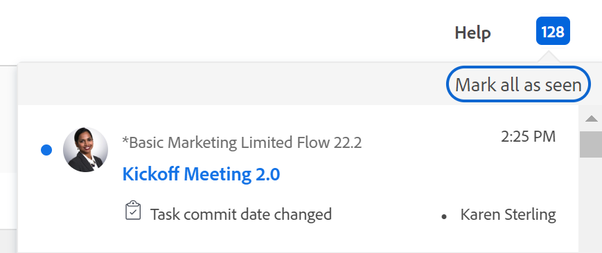

# Genomför datumöversikt

Den markerade informationen är bara tillgänglig i förhandsvisningsmiljön. <!--and in the Production environment for customers who have opted for the fast release process. For information about fast releases, see [Enable or disable fast releases for your organization](/help/quicksilver/administration-and-setup/set-up-workfront/configure-system-defaults/enable-fast-release-process.md). For information about the current release schedule, see [First Quarter 2024 release overview](/help/quicksilver/product-announcements/product-releases/24-q2-release-activity/24-q2-release-overview.md).-->

Bekräftelsedatum är det datum då en användare som har tilldelats en aktivitet eller ett problem förbinder sig att slutföra uppgiften eller problemet. Detta skiljer sig från det planerade slutförandedatumet, eftersom det är en mer realistisk uppskattning av det slutförandedatum som bara anges av den användare som ansvarar för arbetet. Information om det planerade slutförandedatumet finns i [Översikt över aktivitetens planerade slutförandedatum](../../../manage-work/tasks/task-information/task-planned-completion-date.md).

## Genomför datumöversikt

Tänk på följande när du arbetar med implementeringsdatum:

* Endast aktiviteter och ärenden har ett implementeringsdatum.
* Bekräftelsedatum anges inte automatiskt av Adobe Workfront.\
  När du skapar en uppgift eller ett problem finns det inget tilldelat implementeringsdatum för uppgiften eller utgåvan.
* Om du är tilldelad en uppgift eller ett ärende kan du ange implementeringsdatum genom att göra något av följande:

   * Låt Workfront ställa in Genomför-datum så att det matchar det befintliga planerade slutförandedatumet för uppgiften eller problemet genom att klicka på Arbeta på den, Starta utgåva eller Starta uppgift för uppgiften eller problemet. Mer information om hur du ersätter knappen Arbeta med knappen Start finns i  [Ersätta knappen Work On It (Arbeta på) med en Start-knapp](../../../people-teams-and-groups/create-and-manage-teams/work-on-it-button-to-start-button.md).
   * Ställ in Genomför datum manuellt enligt när du tror att uppgiften eller utgåvan kan slutföras. Detta är din uppskattning och ditt åtagande, som tilldelad, till projektledaren att du kommer att ha uppgiften eller problemet slutfört ett visst datum.

>[!NOTE]
>
>Du måste vara aktivitetsägare för en aktivitet för att kunna ändra implementeringsdatumet. Följande användare kan inte ändra implementeringsdatumet för en uppgift:
>
>* Projektägare
>* Projektsponsorer
>* Resurshanteraren
>* Systemadministratör
>* Annan tilldelad person för uppgiften
>* Alla andra användare som har behörighet till uppgiften.
>
>Mer information om aktivitetsägaren finns i avsnittet [Redigera uppgifter](../../../manage-work/tasks/manage-tasks/edit-tasks.md#assignments) i artikeln [Redigera uppgifter](../../../manage-work/tasks/manage-tasks/edit-tasks.md).

## Meddelanden och uppdateringar som utlöses av ändring av implementeringsdatumet {#notifications-and-updates-triggered-by-changing-the-commit-date}

När en tilldelad uppgift eller utleverans väljer ett implementeringsdatum som skiljer sig från det planerade slutförandedatumet som angetts av projektägaren, finns det ett antal meddelanden och uppdateringar som varnar projektägaren och andra användare om den här ändringen.

>[!NOTE]
>
>Ändringar som görs i implementeringsdatumet ändrar inte automatiskt planerade datum, och ändringar som görs i planerade datum ändrar inte automatiskt implementeringsdatumet.

Om du ställer in implementeringsdatumet för en aktivitet eller ett problem utlöses följande ändringar:

* Bekräftelsedatumet fylls i i uppdateringsströmmen för uppgiften eller utgåvan.

  

  Ändringen av implementeringsdatumet visas i uppdateringsområdet för aktiviteten eller problemet när Workfront-administratören aktiverar den här uppdateringen i uppdateringsfeeds under Konfigurera. Mer information finns i [Systemspårade uppdateringar](../../../administration-and-setup/set-up-workfront/system-tracked-update-feeds/system-tracked-update-feeds.md).

* Aktivitetens eller utställningens beräknade slutförandedatum anges till samma datum eftersom aktiviteten nu har en mer korrekt indikation på när den troligen kommer att slutföras.

  Mer information om det planerade slutförandedatumet finns i [Översikt över planerat slutförandedatum för projekt, uppgifter och ärenden](../../../manage-work/projects/planning-a-project/project-projected-completion-date.md).

  

* Om projektägaren använder den gamla kommentarsfunktionen får de ett meddelande på fliken Uppdateringar om huruvida den här ändringen påverkar projektets tidslinje och de får möjlighet att uppdatera det planerade slutförandedatumet för aktiviteten i samma område.

  Den här funktionen stöds inte i den nya kommenteringsfunktionen. Mer information finns i [Ny kommentarsfunktion](/help/quicksilver/product-announcements/betas/new-commenting-experience-beta/unified-commenting-experience.md).

  >[!TIP]
  >
  >  Projektägaren har inte möjlighet att uppdatera ett ärende med planerat slutförandedatum, eftersom utgivningsdatum inte påverkar projektets tidslinje.

  Om en projektägare inte vill godkänna ändringen rekommenderar vi att han/hon kommenterar tillbaka till användaren och föreslår ett nytt datum för att be honom/henne att ändra datumet för implementeringen till det ursprungliga planerade datumet eller välja ett nytt datum. Om en projektägare accepterar ändringen kan de manuellt justera det planerade slutförandedatumet så att det matchar det implementeringsdatum som erbjuds av användaren som är tilldelad objektet. De kan också klicka **Ange planerat datum till: &lt; datum >** i uppdateringsområdet som automatiskt ställer in det planerade slutförandedatumet så att det matchar det nya implementeringsdatumet.

  Du måste ha åtkomst för att kunna hantera uppgiften och projektet för att acceptera ändringen.

  >[!NOTE]
  >
  >Om du vill se hur tidslinjen i projektet påverkas genom att acceptera att ändra aktivitetens planerade slutförandedatum klickar du på **Projektets tidslinje**. Då öppnas uppgiftslistan där du kan utvärdera datumändringar och projekttidslinjen.
  >
  >
  >  >
  >

* Projektägaren meddelas i området Meddelanden om att ett datum för aktivitetens implementering har ändrats.

  

  <!--
  
(NOTE: the tip below is actually wrong and the updates feeds should not control this setting, but at this time it does, according to this issue in Hub: https://hub.workfront.com/issue/61e1aa5e0002a186fdd0a73a10db0fc3/updates?email-source=comm

  -->

  >[!TIP]
  >
  >Meddelandet om att implementeringsdatumet har ändrats skickas endast till projektägaren när Workfront-administratören aktiverar visningen av implementeringsdatumet i området Uppdateringsfeeds i installationsprogrammet. Mer information finns i [Systemspårade uppdateringar](../../../administration-and-setup/set-up-workfront/system-tracked-update-feeds/system-tracked-update-feeds.md).

Mer information om de ytterligare funktioner som är tillgängliga när du uppdaterar en arbetsuppgift finns i  [Uppdatera arbete](../../../workfront-basics/updating-work-items-and-viewing-updates/update-work.md).

Information om hur du uppdaterar implementeringsdatum för uppgifter och problem finns i [Uppdatera implementeringsdatum för aktiviteter och ärenden](../../../manage-work/projects/updating-work-in-a-project/update-commit-date-on-tasks-and-issues.md).

<!--

<h2>Update Commit Dates on tasks and issues</h2>

(NOTE: moved to its own article) 

Updating the Commit Date is identical for tasks and issues.

<ol>
<li value="1"> 
Go to a task or issue that you are assigned to as the <strong>Task Owner</strong>.
 
For more information about finding out who the Task Owner for an issue or task is, see the section <a href="../../../manage-work/tasks/manage-tasks/edit-tasks.md#assignments" class="MCXref xref">Edit tasks</a> in the article <a href="../../../manage-work/tasks/manage-tasks/edit-tasks.md" class="MCXref xref">Edit tasks</a>.
 </li>
<li value="2"> 
Click Work on it in the task or issue header
 
Or
 
Click <strong>Start Task</strong> or <strong>Start Issue</strong> if the Work on it button has been customized in your environment to indicate that you are now working on the work item. 
 
At this time, the Commit Date and the Planned Completion Date of the task or issue are the same.
 </li>
<li value="3"> 
(Optional) If you clicked Start Task or Start Issue, click <strong>Undo</strong> in the lower-left corner of the screen. The Commit Date is removed. 
 
For information about replacing the Work On It button with a Start button, see <a href="../../../people-teams-and-groups/create-and-manage-teams/work-on-it-button-to-start-button.md" class="MCXref xref">Replace the Work On It button with a Start button</a>.
 <note type="tip">
The option to undo your selection to start your work is not available when you click
Work on it.
</note> </li>
<li value="4"> 
 Expand the <strong>This will be done by</strong> date picker, and select a new Commit Date.

Click <strong>Updates</strong> in the left panel, then click the <strong>Start a new update</strong>><strong>Commit Date</strong>

Or

Click <strong>Task Details</strong> or <strong>Issue Details</strong> in the left panel, then double click <strong>Commit Date</strong> and select a new date from calendar. 

The Commit Date and the Planned Completion date are no longer the same.

Instead, the Commit Date and the Projected Completion Date of the task or issue become the same.

The changes are saved automatically.

The Project Owner is notified that you have suggested a new Commit Date for the task or issue and can, at this time, update the Planned Completion Date of the task or issue to match the Commit Date you suggested. For information about the notifications and updates that are triggered by this change, see the section <a href="#notifications-and-updates-triggered-by-changing-the-commit-date" class="MCXref xref">Notifications and updates triggered by changing the Commit Date</a> in this article.

 </li>
</ol>

-->
