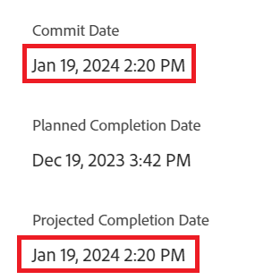
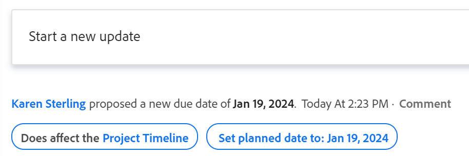

# Uppdatera implementeringsdatum för aktiviteter och ärenden

<!--Audited: 07/2024-->

<!--The highlighted information on this page refers to functionality not yet generally available. It is available only in the Preview environment for all customers, or in the Production environment for customers who enabled fast releases.

For information about fast releases, see [Enable or disable fast releases for your organization](/help/quicksilver/administration-and-setup/set-up-workfront/configure-system-defaults/enable-fast-release-process.md).

For information about the current release, see [Third Quarter 2024 release overview](/help/quicksilver/product-announcements/product-releases/24-q3-release-activity/24-q3-release-overview.md).-->

Du kan uppdatera implementeringsdatumet för en uppgift eller ett ärende som du har tilldelats manuellt. Mer information om implementeringsdatum i Adobe Workfront finns i [Genomför datumöversikt](../../../manage-work/projects/updating-work-in-a-project/overview-of-commit-dates.md).

## Åtkomstkrav

<!--Audited: 01/2024-->

+++ Expandera om du vill visa åtkomstkrav för funktionerna i den här artikeln. 

<table style="table-layout:auto"> 
 <col> 
 <col> 
 <tbody> 
  <tr> 
   <td role="rowheader">Adobe Workfront package</td> 
   <td> 
Alla
 </td> 
  </tr> 
  <tr> 
   <td role="rowheader">Adobe Workfront-licens</td> 
   <td> 
   <ul>
   <li>
Standard för uppgifter
 </li>
   <li>
Medarbetare eller högre för problem
</li>
   </ul>
   
eller

<ul>
   <li>
Arbeta eller högre för uppgifter
</li> 
   <li>
Begär eller högre för problem
</li>
</ul>

</td> 
  </tr> 
  <tr> 
   <td role="rowheader">Konfigurationer på åtkomstnivå</td> 
   <td> 
Redigera åtkomst till uppgifter och ärenden
 </td> 
  </tr> 
  <tr> 
   <td role="rowheader">Objektbehörigheter</td> 
   <td> 
Hantera behörigheter för aktiviteten eller problemet

   
 Du måste ha tilldelats uppgiften eller utgåvan för att kunna uppdatera implementeringsdatumet 

    </td> 
  </tr> 
 </tbody> 
</table>

Mer information finns i [Åtkomstkrav i Workfront-dokumentation](/help/quicksilver/administration-and-setup/add-users/access-levels-and-object-permissions/access-level-requirements-in-documentation.md).

+++

<!--Old:
<table style="table-layout:auto"> 
 <col> 
 <col> 
 <tbody> 
  <tr> 
   <td role="rowheader">Adobe Workfront plan</td> 
   <td> 
Any
 </td> 
  </tr> 
  <tr> 
   <td role="rowheader">Adobe Workfront license*</td> 
   <td> 
   New:
   <ul>
   <li>
Standard for tasks
 </li>
   <li>
Contributor or higher for issues
</li>
   </ul>
   Current:
<ul>
   <li>
Work or higher for tasks
</li> 
   <li>
Request or higher for issues
</li>
</ul>

   </td> 
  </tr> 
  <tr> 
   <td role="rowheader">Access level configurations</td> 
   <td> 
Edit access to Tasks and Issues
 </td> 
  </tr> 
  <tr> 
   <td role="rowheader">Object permissions</td> 
   <td> 
Manage permissions on the task or issue

   
 You must be assigned to the task or issue to update the commit date 

    </td> 
  </tr> 
 </tbody> 
</table>-->

## Förutsättningar

Innan du kan redigera implementeringsdatumet för en uppgift eller utgåva måste du tilldelas den uppgift eller utgåva vars implementeringsdatum du måste uppdatera.

## Uppdatera implementeringsdatum för aktiviteter och ärenden

Du kan uppdatera implementeringsdatumet för en uppgift eller ett problem i följande områden i Workfront:

* Avsnittet Information om en uppgift eller ett problem
* Aktivitets- eller utgivningsrubriken

  Din Workfront- eller gruppadministratör måste lägga till implementeringsdatumet i uppgifts- eller utgivningsrubriken i layoutmallen för att kunna visa det från uppgifts- eller utgivningssidan.
Mer information finns i [Anpassa objektrubriker med hjälp av en layoutmall](/help/quicksilver/administration-and-setup/customize-workfront/use-layout-templates/customize-object-headers.md).

Uppdateringen av implementeringsdatumet är identisk för uppgifter och utgåvor.

>[!NOTE]
>
>Du kan be din system- eller gruppadministratör att lägga till fältet Genomför datum på panelen Sammanfattning för att göra det enklare att uppdatera det i olika områden av Workfront.
>
>Mer information finns i följande artiklar:
>
>* [Sammanfattningsöversikt](/help/quicksilver/workfront-basics/the-new-workfront-experience/summary-overview.md)
>* [Anpassa panelen Sammanfattning med en layoutmall](/help/quicksilver/administration-and-setup/customize-workfront/use-layout-templates/customize-home-summary-layout-template.md).

1. Gå till en aktivitet eller ett problem som du har tilldelats som **ägare**.

   Mer information om hur du tar reda på vem som är aktivitetsägare för ett problem eller en uppgift finns i avsnittet [Redigera uppgifter](../../../manage-work/tasks/manage-tasks/edit-tasks.md#assignments) i artikeln [Redigera uppgifter](../../../manage-work/tasks/manage-tasks/edit-tasks.md).

1. (Villkorligt och valfritt) Om Workfront- eller gruppadministratören har lagt till implementeringsdatumet i huvud för aktiviteten eller utgåvan klickar du på fältet **Bekräftelsedatum** i huvudet och väljer sedan ett datum i kalendern. Om implementeringsdatumet inte finns i huvudet fortsätter du med följande steg.

   

1. Klicka på **Uppgiftsinformation** eller **Ärendeinformation** i den vänstra panelen.
1. Klicka på **Översikt** för att expandera den.
1. Uppdatera fältet **Verkställ datum**.

   

1. Klicka på **Spara ändringar**.

   När du har gjort den här ändringen händer följande:

   * Bekräftelsedatumet och det planerade slutförandedatumet för aktiviteten eller utgåvan är inte längre desamma.

     Istället ändras datumet för implementering och det beräknade slutförandedatumet för aktiviteten eller utgåvan.

     

   * Projektägaren meddelas i ett meddelande från Workfront i appen om att du har föreslagit ett nytt implementeringsdatum för uppgiften eller utgåvan.
   * Projektägaren meddelas i uppdateringsavsnittet att du har föreslagit ett nytt implementeringsdatum och de kan för närvarande uppdatera det planerade slutförandedatumet för aktiviteten eller utgåvan så att det matchar det implementeringsdatum du föreslog.

     

     <!---->

     Mer information om de meddelanden och uppdateringar som utlöses av den här ändringen finns i avsnittet&quot;Meddelanden och uppdateringar som utlöses av ändring av implementeringsdatumet&quot; i artikeln [Bekräfta datumöversikt](/help/quicksilver/manage-work/projects/updating-work-in-a-project/overview-of-commit-dates.md).

<!--at the Production update stream when removing legacy - replace the last bullet with: The Project Owner is notified in the Systems Activity and the All tabs of the Updates section that you have suggested a new Commit Date. They can then update the Planned Completion Date accordingly by editing the task or the issue.-->
